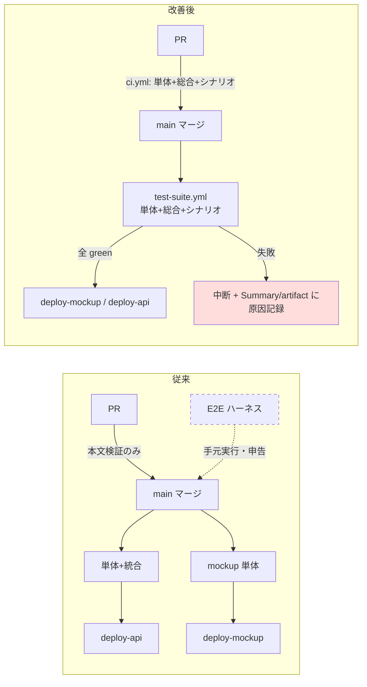

# 方法論評価レポート: CI/CD 品質ゲートの監査と改善（2026-07-22）

- **作成ロール:** 方法論エデュケーター
- **協議ロール:** コードレビュアー・システム監査官（変更差分の独立レビュー = SP-8 / CLAUDE.md 原則9）
- **契機:** オペレーター指示 2026-07-22「deploy 過程への自動テスト導入（単体・総合・シナリオ）+ 現状監査」

## 評価期間・対象

- **期間:** 2026-07-17（バッチ1 = CI/CD 初期構築）〜 2026-07-22
- **対象プロジェクト:** akebono-office（本リポジトリ）

## 有効性評価

| # | 評価項目 | 判定 | 根拠 |
|---|---------|------|------|
| 1 | デプロイ要件（GHA + Repository secrets + PowerShell 完結 + 手順書） | **有効** | `deploy.yml` / `scripts/setup-deploy-secrets.ps1` / `deploy-guide.md` で充足済み。secrets は再実行で上書き（冪等）、TOKEN_ENCRYPTION_KEY は初回のみ生成（記録系保護）と原則2/7 に整合 |
| 2 | テスト自動化のデプロイゲート実効性 | **要改善 → 対応済** | 単体・統合はゲート化済みだったが、シナリオテスト（E2E ハーネス）が CI 外に置かれ「E2E 全スイート green」が**人の申告**でしか担保されなかった |
| 3 | 検出タイミング（左シフト） | **要改善 → 対応済** | テスト実行が main への push（= デプロイ時）に限られ、PR 段階の機械検証がゼロ。SP-8 は「レビュー」の左シフトを定義するが「機械検証」の左シフトが実装されていなかった |
| 4 | 失敗時の説明可能性 | **要改善 → 対応済** | 失敗はジョブの赤表示のみで「何がどうだめだったか」の構造化された記録がなく、原因特定にログ全文の読解が必要だった |

## 検出された課題

| # | 課題 | 発生頻度 | 影響度 | 根本原因（なぜ方法論がこれを防げなかったか） |
|---|------|---------|--------|---------|
| 1 | シナリオテスト（E2E）が CI 未組込。mockup は API との結合検証なしでデプロイされ、api も E2E green は申告ベース | 常時（構造的） | 高 | implementation-status の検証欄が「E2E 全スイート green」を要求する一方、**その実行主体を定義していない**。ロール（コーディングエージェント）の自己申告と CI の機械検証の境界が方法論上曖昧だった |
| 1b | **課題1の実害を本監査で実測**: E2E 全スイートを実走したところ `batch6d-e2e.cjs` が main 上で失敗（F-20-1 の AKEBONO ハブ化で h1 が「AKEBONO 業務」に変わり、見出し `AKEBONO` の部分一致が 2 要素にヒットする strict mode 違反 + 要件定義中バナー等の期待要素が既に存在しない）。直近バッチ（§34）の検証欄にも E2E 実行の記載がなく、**UI 改変にスイートが追随しないドリフトが無検知で蓄積**していた | 実測 1 件 | 高 | シナリオテストが CI ゲートでないため「スイートが現行 UI で通るか」を誰も機械的に確認しない。課題1 の根本原因と同一 |
| 2 | PR 時にテストが走らない（pr-checks.yml は PR 本文の形式検証のみ） | 常時（構造的） | 高 | SP-8 がレビュー（人格ロール）の左シフトのみを定義し、**機械検証（テストスイート）の左シフト**をタッチポイントとして持たない |
| 3 | テスト失敗時の構造化ログ不在 | 失敗時のみ | 中 | レビュー基準・実装基準がアプリのエラーコード付与（AKO-*）は要求するが、**パイプライン自体の説明可能性**への要求が存在しなかった |
| 4 | deploy-mockup 内へのテスト埋め込み（テストとデプロイの責務混在） | 常時（軽微） | 低 | 初期構築時の最小構成が漸増し、テスト定義が deploy.yml に閉じたまま再利用不能だった（原則3 の適用漏れ） |

## 実施した修正（本 PR）

| # | 対象 | 内容 |
|---|------|------|
| 1 | `.github/workflows/test-suite.yml`（新設） | 単体（mockup-test / api-test）・総合（api-test: 実 PostgreSQL 統合 + 型 + build）・シナリオ（e2e-scenario: 既存ハーネス全スイート）を workflow_call の再利用ワークフロー化 |
| 2 | `.github/workflows/deploy.yml` | `tests`（test-suite 呼出）→ `deploy-mockup` / `deploy-api` を `needs: tests` でゲート。テスト失敗 = デプロイ中断。deploy-mockup 内の重複テストは除去（原則3） |
| 3 | `.github/workflows/ci.yml`（新設） | PR で同一スイートを実行（マージ前の左シフト検証。定義は test-suite.yml と共有 = 二重管理なし） |
| 4 | 失敗時ログ | 各テストジョブが GITHUB_STEP_SUMMARY へ「検査別の結果表」を出力 + `::error::` で失敗ステップを明示 + E2E はスタックログを artifact `e2e-logs` に保存（ハーネスへ `E2E_LOG_EXPORT` 追加。ローカル挙動不変） |
| 5 | `e2e/batch6d-e2e.cjs` | 課題 1b で実測されたドリフトを修正（F-20-1 後の画面へ追随: h1「AKEBONO 業務」・要望ボックス・管理者ツール・空入力のボタン無効化検証）。修正後に全スイート実走で green（70 チェック）を確認 |
| 6 | ドキュメント | deploy-guide.md §2 / production-architecture.md §7 / mockup/README.md / e2e/README.md / implementation-status.md §35 を同時更新（原則5） |

## 改善提案（方法論へのフィードバック。オペレーター承認待ち）

| # | 対象ドキュメント | 改善内容 | 優先度 | 波及範囲 |
|---|----------------|---------|--------|---------|
| 1 | `.ai-native/methodology/common/core-principles.md`（SP-8） | インクリメンタルレビューの前段に「**機械検証ゲート**（CI のテストスイート green）」を明記する。ロールレビューは機械検証通過後に開始する（レビュアーの時間を機械で検出可能な問題に使わない） | 高 | coding-agent / code-reviewer / system-auditor の各ロール定義、CLAUDE.md Push 前チェック |
| 2 | `.ai-native/methodology/roles/coding-agent.md` | 完了報告の検証欄に「検証の実行主体（CI / 手元）」の記載を必須化する。「green」の申告には CI 実行へのリンクまたは再現コマンドを添える | 中 | implementation-status の検証欄の書式 |
| 3 | `.ai-native/methodology/common/review-standards.md` | レビュー観点に「パイプライン・運用系の変更は**失敗時の説明可能性**（何がどう失敗したかが構造化ログに残るか）を確認する」を追加 | 中 | code-reviewer / system-auditor |

> 提案 1〜3 は方法論ドキュメントの変更を伴うため、IMPROVEMENT_PROCESS ステップ3 に従いオペレーター承認後に適用する（エデュケーターは独断で方法論を変更しない）。本 PR では方法論本体は変更していない。

## 承認

- **オペレーター承認:** 未承認（本レポートの改善提案 1〜3 について、PR レビュー時の判断を依頼）
