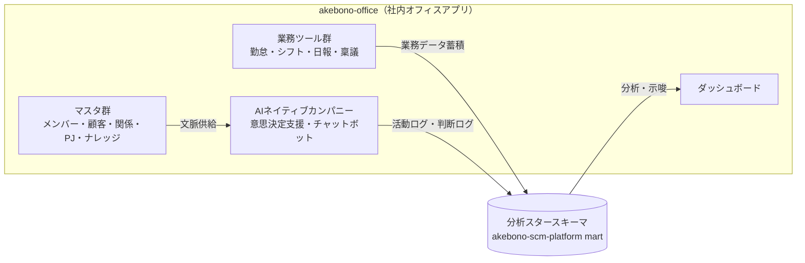

# Phase 0: 現状把握と目標設定

- **作成日:** 2026-07-15
- **作成ロール:** 壁打ちナビゲーター
- **スコープ分類:** Medium（モックアップ先行。Phase 0-2 は圧縮して記録し、Phase 3 以降を本体とする）

## 1. 会社・事業の現状

TSUNAGUBA は以下の 3 事業を営む会社である（社員数十名規模。取締役 / 正社員 / 契約社員 / アルバイト / 外注が混在）。

1. **業務コンサルティング** — 顧客企業の業務改善・変革支援
2. **システムコンサルティング** — システム企画・要件定義支援
3. **システム開発・運用** — 受託開発と自社提供システムの運用（akebono-scm-platform / undeux-sales-suite / tokutake-ai-platform 等を顧客へ提供中）

## 2. 現状の業務環境

- 勤怠・稟議・日報・シフト・顧客管理などの社内業務が、個別ツール・スプレッドシート・口頭運用に分散している
- 顧客・顧客担当者・顧客間関係・プロジェクトの情報が一元管理されておらず、AI による文脈供給・分析の基盤がない
- 提供システムの稼働状況を社内で一覧できる場がない
- 関連リポジトリに再利用可能な資産が既に存在する:

| リポジトリ | 活用する資産 |
|---|---|
| akebono-scm-platform | 分析スタースキーマ（`mart`）設計、モックアップ実装規範（高密度業務UI・決定的モックデータ） |
| akebono-ai-manager | 顧客関係管理（有向エッジ+関係種別）、エスカレーション機構（シグナル検知→管理者へ暗黙共有→アクション実行→ナレッジ還流）、日報自動化 |
| undeux-sales-suite | 意思決定オントロジー・ビュー（①意味②関係③制約→選択肢→AI推奨）、売上ダッシュボード、Nuxt 4 SPA 構成 |
| tokutake-ai-platform | AIチャットUI（SSE + ブロックレンダリング）、CSS変数デザイントークン、PII 多層匿名化 |

## 3. 理想像

- 社内業務が 1 つのアプリで完結し、**手動ステップ・分散管理を排除**する
- 蓄積データは akebono-scm-platform のスタースキーマ規約に沿って設計し、**分析での利活用を前提**とする
- AI（AIネイティブカンパニー・チャットボット・意思決定支援）が顧客・関係・ナレッジの文脈を参照し、メンバーを補助しつつ**管理者への暗黙の情報共有・エスカレーション・アクション実行**を担う
- 画面コントロール・処理は**再利用可能な components / composables** に集約し、将来の他業種・他社導入時はマスタ・カスタム項目・機能トグルの設定で適応できる

## 4. 直近の目標（本フェーズ群のゴール）

1. **全機能を体感できるモックアップ**を構築する。全ページの全機能が操作に対して何かしらの反応を返し、「何をどう実現しようとしているか」を体感できること
2. 要件・仕様・設計をドキュメントとして残す（本 `.ai-native/outputs/` 配下）
3. 自社適用を最初の例とし、使い込んだ後にカスタマイズ要素を整理して他社展開する

## 5. ドメインコンテキスト

`.ai-native/domain-context/` は現状空。本フェーズ群では第 1 章の事業内容と、参照リポジトリ調査・日本の労務/稟議/シフト運用の Web 調査結果（Phase 3 要件に反映済み）をドメインコンテキストとして用いた。

## ゲート判定（Phase 0）

| 条件 | 判定 |
|---|---|
| 業界・事業が明確 | ✅ 第1章 |
| 現状業務フローを説明できる | ✅ 第2章（分散運用の現状） |
| 理想像が描けている | ✅ 第3章 |
| 直近目標が明確 | ✅ 第4章 |
| ドメインコンテキスト読込 | ✅ 第5章（代替ソースで充足） |

**判定: PASS（AI 判定。オペレーター最終承認は PR レビューにて）**
