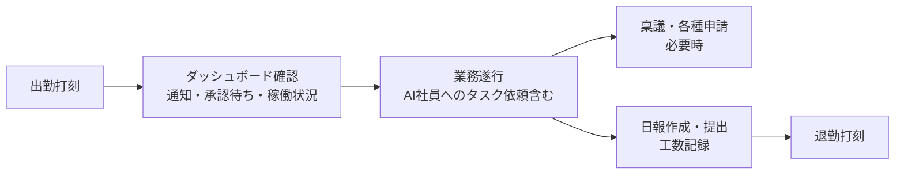
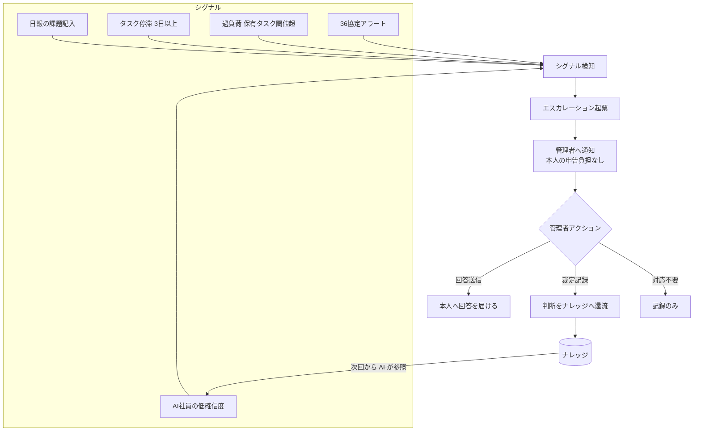
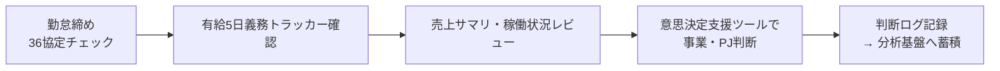
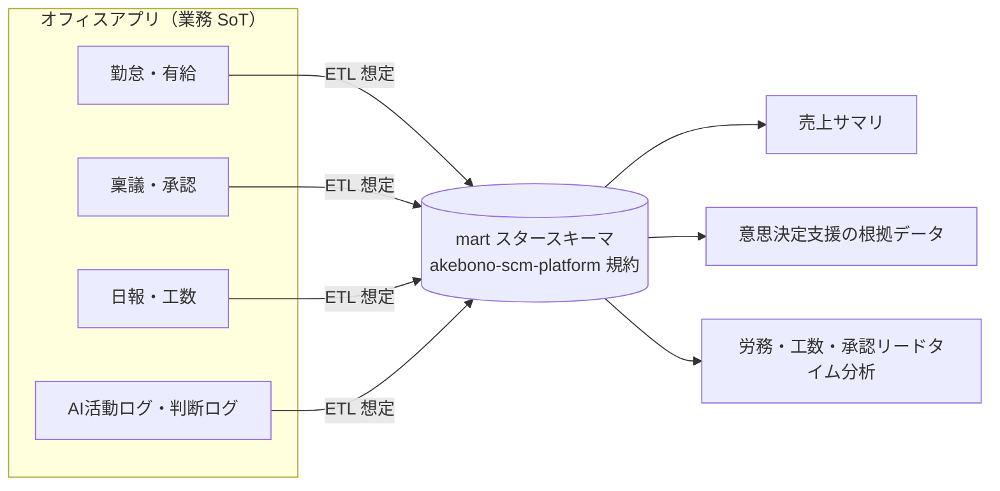

# Phase 2: 業務フロー

- **作成日:** 2026-07-15
- **作成ロール:** 壁打ちナビゲーター

## 1 日の業務フロー（メンバー視点）

```mermaid
flowchart LR
    A[出勤打刻] --> B[ダッシュボード確認<br/>通知・承認待ち・稼働状況]
    B --> C[業務遂行<br/>AI社員へのタスク依頼含む]
    C --> D[稟議・各種申請<br/>必要時]
    C --> E[日報作成・提出<br/>工数記録]
    E --> F[退勤打刻]
```

## 暗黙の情報共有フロー（ai-manager 踏襲の中核フロー）

```mermaid
flowchart TD
    S1[シグナル検知] --> E1[エスカレーション起票]
    subgraph シグナル
        A1[日報の課題記入]
        A2[タスク停滞 3日以上]
        A3[過負荷 保有タスク閾値超]
        A4[AI社員の低確信度]
        A5[36協定アラート]
    end
    A1 & A2 & A3 & A4 & A5 --> S1
    E1 --> N1[管理者へ通知<br/>本人の申告負担なし]
    N1 --> AC{管理者アクション}
    AC -->|回答送信| M1[本人へ回答を届ける]
    AC -->|裁定記録| M2[判断をナレッジへ還流]
    AC -->|対応不要| M3[記録のみ]
    M2 --> K[(ナレッジ)]
    K -->|次回から AI が参照| A4
```

## 月次の業務フロー（管理者視点）

```mermaid
flowchart LR
    A[勤怠締め<br/>36協定チェック] --> B[有給5日義務トラッカー確認]
    B --> C[売上サマリ・稼働状況レビュー]
    C --> D[意思決定支援ツールで<br/>事業・PJ判断]
    D --> E[判断ログ記録<br/>→ 分析基盤へ蓄積]
```

## データ蓄積フロー（スタースキーマ利活用）

```mermaid
flowchart LR
    subgraph アプリ内SoT["オフィスアプリ（業務 SoT）"]
        T1[勤怠・有給]
        T2[稟議・承認]
        T3[日報・工数]
        T4[AI活動ログ・判断ログ]
    end
    T1 & T2 & T3 & T4 -->|ETL 想定| M[(mart スタースキーマ<br/>akebono-scm-platform 規約)]
    M --> B1[売上サマリ]
    M --> B2[意思決定支援の根拠データ]
    M --> B3[労務・工数・承認リードタイム分析]
```
