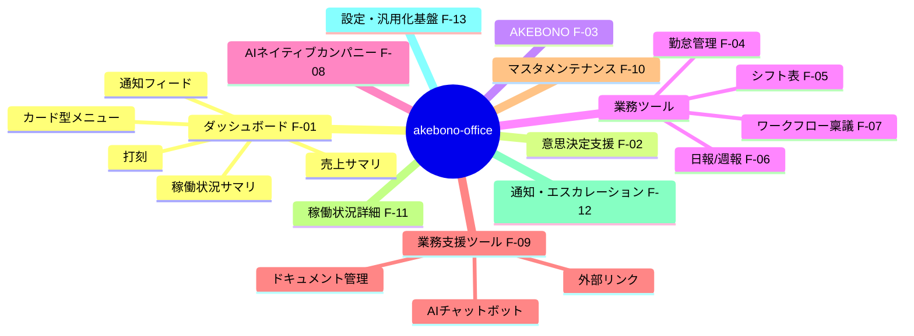

# Phase 3: 機能要件定義

- **作成日:** 2026-07-15
- **作成ロール:** 壁打ちナビゲーター（コーディングエージェント協議済み）
- **対象:** akebono-office 社内オフィスアプリ（第 1 適用 = TSUNAGUBA 自社。将来他社展開前提）
- **本フェーズ群の実装形態:** モックアップ（全ページの全機能が操作に反応すること。永続化はブラウザ内で代替）

## 0. 要件の全体構成

F-12（通知・エスカレーションセンター）と F-13（設定・汎用化基盤）はオペレーター要件に加えた**提案機能**。F-12 は akebono-ai-manager の中核思想（暗黙の情報共有→アクション実行）の踏襲先、F-13 は「任意で設定できる汎用的な要素を多く持つ」方針の実現手段である。

---

## F-01 ダッシュボード（`/`）

| ID | 機能 | 入力 | 処理 | 出力 |
|---|---|---|---|---|
| F-01-1 | 売上サマリ | 年度選択 | モック売上データ集計（月次推移・前年比・顧客別/事業別内訳） | KPI カード + チャート。クリックで意思決定支援へ |
| F-01-2 | 提供システム稼働状況サマリ | クリック | システム別状態の最悪値ロールアップ | 状態バッジ一覧 → クリックで F-11 詳細へ |
| F-01-3 | 打刻 | 出勤/休憩開始/休憩終了/退勤ボタン | 打刻記録（時刻・ソース）、状態機械（未出勤→勤務中→休憩中→退勤済） | 現在状態・本日のタイムライン・勤怠へのリンク |
| F-01-4 | カード型メニュー | クリック | 6 カテゴリ（意思決定支援 / AKEBONO / 業務ツール / AIネイティブカンパニー / 業務支援ツール / マスタメンテナンス） | 各機能へ遷移。バッジ（承認待ち件数等）表示 |
| F-01-5 | 通知フィード | クリック・既読化 | 未読通知・エスカレーション・承認待ちの横断表示 | F-12 へ遷移 |
| F-01-6 | モバイルサマリ | — | モバイル幅ではカード型サマリ + 打刻 + 通知に再構成 | 簡易操作画面 |

## F-02 意思決定支援ツール（`/decision`）

undeux-sales-suite の意思決定オントロジー・ビュー（①意味 ②関係 ③制約 → 選択肢昇格 → AI 推奨）をコンサル業の事業/プロジェクト判断に適用する。

| ID | 機能 | 入力 | 処理 | 出力 |
|---|---|---|---|---|
| F-02-1 | 判断テーマ一覧 | テーマ選択 | 事業・プロジェクトの判断テーマ（モック 3 件以上） | テーマカード一覧 |
| F-02-2 | オントロジー 3 次元ビュー | テーマ | ①意味（属性・KPI）②関係（顧客/PJ/メンバーへのリンク: マスタ実データ参照）③制約（予算・契約・稼働。✗ の打ち手はグレーアウト+取消線） | 制約を通った打ち手のみ選択肢 A/B/C に昇格。AI 推奨 ★ 表示 |
| F-02-3 | シナリオ比較 | パラメータスライダー（単価・稼働率等） | 決定的な簡易予測モデルで即時再計算 | 予測 KPI・比較チャート |
| F-02-4 | 判断の記録 | 選択肢を選び「判断を記録」 | 意思決定ログ生成（テーマ・選択・根拠・判断者・日時） | 判断履歴一覧。分析基盤へ蓄積対象 |

## F-03 AKEBONO（`/akebono`）

要件定義中のためカードメニュー + プレースホルダのみ。

| ID | 機能 | 出力 |
|---|---|---|
| F-03-1 | プレースホルダページ | 「要件定義中」バナー・構想ロードマップ表示 |
| F-03-2 | 要望ボックス | 要望を投稿すると受付リストに反映（操作反応の担保） |

## F-04 勤怠管理（`/attendance`）

| ID | 機能 | 入力 | 処理 | 出力 |
|---|---|---|---|---|
| F-04-1 | 日次ビュー | 日付 | 打刻（F-01-3 と同一データ）から日次集計。6 バケット分解（所定内/法定内残業/法定外残業/60h超残業/深夜/法定休日） | タイムライン + 集計表 |
| F-04-2 | 週次ビュー | 週 | 週 40h 判定含む集計 | 週間グリッド |
| F-04-3 | 月次ビュー | 月・メンバー | 月次カレンダー + 集計、締め状態 | カレンダー + サマリー |
| F-04-4 | 36 協定アラート | — | 月 45h 接近（80% で警告）/ 単月 100h / 2〜6 ヶ月平均 80h（全組み合わせ）/ 年 6 回上限 の判定 | アラートバッジ・通知連携（F-12） |
| F-04-5 | 有給管理 | 申請（全日/半日） | 付与ルール（通常/比例付与テーブル。週 30h 判定が先）、残数 = 付与 − 消化（時効 2 年・最大 40 日）、年 5 日取得義務トラッカー | 残数・取得履歴・義務充足状況。申請は承認フローへ |
| F-04-6 | 打刻修正申請 | 対象日・修正値・理由（必須） | 承認後に反映。修正前値・修正者・承認者を履歴保全 | 修正履歴 |
| F-04-7 | 勤怠ルール設定 | 管理者 | 所定労働時間・休憩・フレックス（コア/フレキシブル）・締め日・法定休日曜日・雇用区分別ルール | 設定値が集計に反映 |

- 対象: 取締役以外の全メンバー（安衛法 66 条の 8 の 3 準拠 = 管理監督者含む把握。外注は対象外で「稼働報告」のみ）
- 雇用区分（メンバーマスタ）とルールセットの紐付けは設定可能（汎用化 F-13）

## F-05 シフト表（`/shift`）

| ID | 機能 | 入力 | 処理 | 出力 |
|---|---|---|---|---|
| F-05-1 | 募集期間管理 | 期間・希望締切 | 状態遷移: draft → open → closed → adjusting → published | 期間一覧 |
| F-05-2 | 希望提出（スタッフ） | 日別の出勤可/NG/どちらでも + 時間帯 | 締切まで編集可 | 提出状況。モバイル最適化 |
| F-05-3 | 調整（管理者） | 週別グリッド（縦=スタッフ、横=日） | 必要人数 vs 割当の過不足表示。バリデーション: 休憩不足（6h超45分/8h超1h）・18 歳未満深夜・週 40h 超・有給/希望との衝突 | 割当グリッド + 警告 |
| F-05-4 | 確定・公開 | 公開操作 | 確定通知（F-12 連携）。確定後変更は本人合意ステップ必須 | 本人別確定シフト（モバイルはカード型） |

## F-06 日報/週報（`/reports`）

| ID | 機能 | 入力 | 処理 | 出力 |
|---|---|---|---|---|
| F-06-1 | 日報作成 | プロジェクト別エントリ（作業内容・工数 0.25h 刻み・進捗）+ 所感・課題・明日の予定 | 下書き→提出。工数合計と勤怠実労働の乖離チェック | 日報。乖離時は警告 |
| F-06-2 | 週報作成 | 今週の目標達成・主要業務・課題・来週予定 | 日報からのプリフィル | 週報 |
| F-06-3 | 提出状況一覧（管理者） | 期間 | メンバー×日のマトリクス。未提出リマインド送信 | 提出状況・リマインド通知 |
| F-06-4 | コメント/リアクション | コメント・絵文字リアクション | 双方向フィードバック | コメントスレッド |
| F-06-5 | AI社員の日次報告 | —（F-08 から自動） | AI社員の日次活動報告を同じタイムラインに掲載 | 「AIネイティブカンパニーの報告場所」の実現 |
| F-06-6 | 課題エスカレーション | 課題欄への記入 | 暗黙にエスカレーション起票（F-12） | 管理者へ通知 |

## F-07 ワークフロー・稟議（`/workflow`）

| ID | 機能 | 入力 | 処理 | 出力 |
|---|---|---|---|---|
| F-07-1 | 申請作成 | 区分（購買/契約/経費/採用/出張/その他）・件名・金額・内容・添付（モック） | 決裁番号自動採番。職務権限マトリクス（区分×金額）で承認経路を自動決定 | 申請（draft→submitted） |
| F-07-2 | 承認操作 | 承認/却下/差戻し（却下・差戻しはコメント必須）/取下げ | ステータス遷移: submitted → in_review(step 1..n) → approved / rejected / remanded / withdrawn。差戻し→修正→再申請 | 承認ログ（監査証跡） |
| F-07-3 | 代理承認 | 代理設定（本人・代理者・期間） | 不在時に代理者が承認可。代理履歴記録 | 代理承認ログ |
| F-07-4 | 申請一覧 | タブ（自分の申請/承認待ち/全件） | フィルタ・検索 | 一覧 + 詳細ドロワー |
| F-07-5 | 承認経路設定（管理者） | 区分×金額帯×経路（直列/合議） | 職務権限マトリクスの編集（汎用化 F-13 の一部） | 経路プレビュー |

## F-08 AIネイティブカンパニー（`/ai-company`）

| ID | 機能 | 入力 | 処理 | 出力 |
|---|---|---|---|---|
| F-08-1 | 3D オフィス空間 | — | アイソメトリック表現のオフィスに AI社員を配置。状態（実行中/待機/承認待ち）をアニメーション表示 | クリックで AI社員詳細 |
| F-08-2 | ロール設定（`/ai-company/roles`） | ロール名・責務・システムプロンプト・権限・モデル層 | ロールの自由な作成・編集・無効化 | ロール一覧。AI社員に割当 |
| F-08-3 | タスク依頼 | AI社員選択 + 依頼内容 | AI がタスク分解（モック応答）→ 依頼者承認 → 実行 → 完了報告。状態: proposed → approved → in_progress → done/blocked | タスクボード（カンバン） |
| F-08-4 | 活動ログ | — | AI の活動を時系列記録（種別・対象・トークン/コストのモック値） | 活動ログビュー |
| F-08-5 | 日次活動報告 | —（日次バッチ想定） | 活動ログから日次報告生成 → F-06-5 のタイムラインへ掲載 | 日次報告 |
| F-08-6 | エスカレーション | AI の確信度低・停滞 | F-12 へ起票（ai-manager 踏襲: low_confidence / member_anomaly 相当） | 管理者通知 |

## F-09 業務支援ツール（`/support`）

| ID | 機能 | 入力 | 処理 | 出力 |
|---|---|---|---|---|
| F-09-1 | ツールハブ | クリック | **内部アプリと設定可能な外部リンクをカード型メニューで混在表示**。外部リンクは F-13 で追加・編集・並べ替え | サポート管理表（外部リンク）等 + 内部アプリ |
| F-09-2 | AIチャットボット（`/support/chatbot`） | 自然文質問 | シナリオベースのモック応答（キーワードルーティング）。勤怠残・有給・規程・顧客情報・稼働状況をマスタ/業務データから引用し、出典バッジ表示。ストリーミング風表示 | 会話 UI・サジェスト質問 |
| F-09-3 | ドキュメント管理（`/support/documents`） | フォルダ/タグ/検索、アップロード（モック） | フォルダツリー + 一覧 + プレビュー。タグ付け・検索 | ドキュメントライブラリ |

## F-10 マスタメンテナンス（`/masters`）

共通仕様: 一覧（検索・フィルタ・ソート）→ 詳細ドロワー → 追加/編集/無効化（物理削除しない）。**全マスタにカスタム項目（F-13-1）適用可**。モバイルではカード型表示。

| ID | マスタ | 主要項目 |
|---|---|---|
| F-10-1 | メンバー管理 | 氏名・雇用区分（取締役/社員/契約社員/アルバイト/外注）・部門・役職・入社日・週所定日数/時間（有給比例付与に連動）・ロール（admin/member）・打刻対象フラグ |
| F-10-2 | 業界マスタ | 業界名（直交軸。複合値を作らない）・表示順・有効 |
| F-10-3 | 自社マスタ | 顧客(会社)とほぼ同一項目（会社名・業界(複数+主)・規模・所在地・事業内容）+ 会計年度開始月等の自社固有設定 |
| F-10-4 | 顧客(会社)マスタ | 会社名・業界（多対多 + 主業界 1 件）・エイリアス（表記ゆれ照合）・規模・担当メンバー・状態 |
| F-10-5 | 顧客(人)マスタ | 氏名・所属会社・部署役職・キーパーソン度・連絡先・メモ |
| F-10-6 | 顧客関係マスタ | **会社間の有向エッジ**（From→To + 関係種別マスタ: 納品先/受託先/販売チャネル/競合/資本関係…追加可能）+ **人どうしの関係**（上司部下/意思決定ライン/紹介者）。関係グラフ可視化 |
| F-10-7 | プロジェクトマスタ | PJ 名・顧客・種別（業務コンサル/システムコンサル/受託開発/運用/自社）・状態・優先度・担当・期間・予算・説明/目的（AI 文脈供給用） |
| F-10-8 | ナレッジ | **5 ドメイン**（業界/顧客(会社)/顧客(人)/顧客関係/プロジェクト）に紐付く記事。タイトル・本文・タグ・出典（手動/エスカレーション裁定の還流）・検索 |

## F-11 提供システム稼働状況（`/status`, `/status/:id`）

| ID | 機能 | 処理 | 出力 |
|---|---|---|---|
| F-11-1 | 全体サマリ | コンポーネント状態（operational/degraded/partial_outage/major_outage/maintenance）の最悪値ロールアップ | 全体バナー + システム一覧 |
| F-11-2 | システム詳細 | 90 日稼働率バー（日別色分け）+ uptime% + インシデント履歴 | 詳細ページ |
| F-11-3 | インシデント管理 | ライフサイクル: investigating → identified → monitoring → resolved。影響度 minor/major/critical。更新はタイムスタンプ付きフィード | インシデント登録・更新（管理者操作に反応） |

## F-12 通知・エスカレーションセンター（`/inbox`）【提案機能】

akebono-ai-manager の「暗黙の情報共有 → エスカレーション → アクション実行 → ナレッジ還流」を踏襲する。

| ID | 機能 | 処理 |
|---|---|---|
| F-12-1 | 通知一覧 | 種別（承認依頼/コメント/リマインド/AI報告/システム）・既読管理・アクションへのジャンプ |
| F-12-2 | エスカレーション起票 | シグナル: 日報の課題記入（F-06-6）/ タスク停滞 3 日 / 過負荷（保有タスク 7 件以上）/ AI 低確信度（F-08-6）/ 36 協定アラート（F-04-4）。クールダウンで重複抑止 |
| F-12-3 | 管理者アクション | 「回答送信 / 裁定記録 / 対応不要」の 3 択。裁定はナレッジ（F-10-8）へ還流し出典を記録 |
| F-12-4 | 対応履歴 | 起票→解決の一覧・還流率の表示 |

## F-13 設定・汎用化基盤（`/settings`）【提案機能・他社展開の中核】

| ID | 機能 | 処理 |
|---|---|---|
| F-13-1 | カスタム項目設定 | エンティティ（メンバー/顧客会社/顧客人/プロジェクト等）ごとに任意項目を定義（text/number/date/select/multiselect/boolean）→ 各マスタのフォーム・詳細に自動反映 |
| F-13-2 | 汎用区分マスタ | 選択肢群（部門・役職・PJ 種別・関係種別・稟議区分…）をコード種別単位で管理。各画面のセレクトはここを参照 |
| F-13-3 | 外部リンク設定 | 業務支援ツール（F-09-1）に表示する外部アプリリンクの追加・編集・並べ替え・アイコン |
| F-13-4 | 機能トグル | 機能単位の有効/無効（他社導入時のカスタマイズを想定） |
| F-13-5 | 勤怠・承認・エスカレーションルール | F-04-7 / F-07-5 / F-12-2 の設定の集約導線 |
| F-13-6 | 監査ログ | マスタ変更・承認・設定変更の操作履歴一覧 |

---

## 横断要件

| ID | 要件 |
|---|---|
| X-1 | **全ページ・全機能が操作に反応する**（保存・状態遷移・通知・トースト等）。「押しても何も起きない」UI を作らない |
| X-2 | 状態変更はブラウザ内ストア（インメモリ + localStorage 永続化）。「デモデータをリセット」機能を設定に用意 |
| X-3 | デモ用ユーザー切替（管理者/社員/アルバイト）で権限別の見え方を体感できる |
| X-4 | 蓄積対象データはスタースキーマ規約（phase5/data-design.md）に写像可能な構造で持つ |
| X-5 | アイコンは lucide（lucide-vue-next）に統一。絵文字をアイコン代わりに使わない |
| X-6 | PC 最適化を基本に、モバイルでは打刻・シフト確認・日報・通知・サマリ閲覧を最適化（レスポンシブ / カード型変換 / 下部ナビ） |

## ゲート判定（Phase 3）

- 実現する機能が一覧化されている: ✅（F-01〜F-13 + 横断 X-1〜X-6）
- 各機能の入出力が定義されている: ✅
- 非機能要件: ✅（non-functional-requirements.md）
- データ機密度の特定: ✅（non-functional-requirements.md 第 3 章）

**判定: PASS（AI 判定。オペレーター最終承認は PR レビューにて）**
