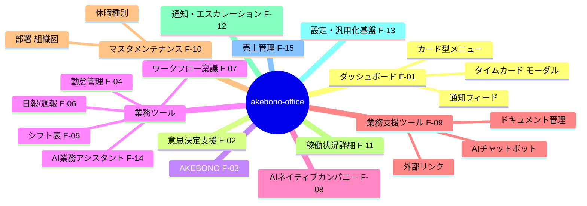

# Phase 3: 機能要件定義

- **作成日:** 2026-07-15
- **作成ロール:** 壁打ちナビゲーター（コーディングエージェント協議済み）
- **対象:** akebono-office 社内オフィスアプリ（第 1 適用 = TSUNAGUBA 自社。将来他社展開前提）
- **本フェーズ群の実装形態:** モックアップ（全ページの全機能が操作に反応すること。永続化はブラウザ内で代替）

## 0. 要件の全体構成

F-12（通知・エスカレーションセンター）と F-13（設定・汎用化基盤）はオペレーター要件に加えた**提案機能**。F-12 は akebono-ai-manager の中核思想（暗黙の情報共有→アクション実行）の踏襲先、F-13 は「任意で設定できる汎用的な要素を多く持つ」方針の実現手段である。

---

## F-01 ダッシュボード（`/`）

ダッシュボードには**カード型メニューと通知のみ**を配置する（2026-07-16 オペレーター指示）。売上サマリは 売上管理（F-15）、稼働状況サマリは 提供システム稼働状況（F-11）の独立ページへ移設し、打刻はヘッダーの「タイムカード」モーダルに集約する。

| ID | 機能 | 入力 | 処理 | 出力 |
|---|---|---|---|---|
| F-01-1 | カード型メニュー | クリック・カテゴリチップ | カテゴリ（既定: 意思決定支援 / AKEBONO / 業務ツール / AIネイティブカンパニー / 経営・状況 / 業務支援 / 管理）。全遷移先を網羅。**カテゴリはカスタマイズ可（F-13-8 = バッチ7h）**: チップで選択したカテゴリのみ表示（「すべて」あり・選択は sessionStorage 記憶）。未割当メニューは自動的に「その他」へ | 各機能へ遷移。バッジ（承認待ち件数等）表示 |
| F-01-2 | 通知フィード | クリック・既読化 | 未読通知・エスカレーション・承認待ちの横断表示（直近 5 件） | F-12 へ遷移 |
| F-01-3 | タイムカード（ヘッダー） | ヘッダー「タイムカード」ボタン → モーダルで打刻 | 打刻記録（時刻・ソース）、状態機械（未出勤→勤務中→休憩中→退勤済）。どの画面からでも打刻可能 | 現在状態・本日の打刻・勤怠管理（`/attendance?tab=daily`）へのリンク |

> **改訂メモ:** 旧 F-01-1（売上サマリ）は F-15 売上管理へ、旧 F-01-2（稼働状況サマリ）は F-11 へ、旧 F-01-3（打刻）は F-01-3（ヘッダーモーダル）へ移行。
>
> **全ページ共通のナビゲーション（バッチ7h・オペレーター指示 2026-07-19 #10 ②③）:** レイアウトヘッダーが
> 導線マップ（`mockup/app/utils/nav-map.ts` = SoT）から「親ページへ戻る」リンク（構造上の親・モバイルでも常時表示）と
> 「関連」ドロップダウン（そのページに関係するマスタ・設定・関連機能。権限 canPath / 管理者限定でフィルタ）を
> 全ページ共通で描画する。ページ個別のアドホックな戻るリンクは廃止（原則3）。
> 入力と参照の分離方針は screen-design §5.2 を参照（参照 = 基本ビュー・入力 = 明示アクション）。

## F-02 意思決定支援ツール（`/decision`）

undeux-sales-suite の意思決定オントロジー・ビュー（①意味 ②関係 ③制約 → 選択肢昇格 → AI 推奨）をコンサル業の事業/プロジェクト判断に適用する。

| ID | 機能 | 入力 | 処理 | 出力 |
|---|---|---|---|---|
| F-02-1 | 判断テーマ一覧 | テーマ選択 | 事業・プロジェクトの判断テーマ（モック 3 件以上） | テーマカード一覧 |
| F-02-2 | オントロジー 3 次元ビュー | テーマ | ①意味（属性・KPI）②関係（顧客/PJ/メンバーへのリンク: マスタ実データ参照）③制約（予算・契約・稼働。✗ の打ち手はグレーアウト+取消線） | 制約を通った打ち手のみ選択肢 A/B/C に昇格。AI 推奨 ★ 表示 |
| F-02-3 | シナリオ比較 | パラメータスライダー（単価・稼働率等） | 決定的な簡易予測モデルで即時再計算 | 予測 KPI・比較チャート |
| F-02-4 | 判断の記録 | 選択肢を選び「判断を記録」 | 意思決定ログ生成（テーマ・選択・根拠・判断者・日時） | 判断履歴一覧。分析基盤へ蓄積対象 |

## F-03 AKEBONO（`/akebono`）

要件定義中のためカードメニュー + プレースホルダのみ。

| ID | 機能 | 出力 |
|---|---|---|
| F-03-1 | プレースホルダページ | 「要件定義中」バナー・構想ロードマップ表示（静的表示 = フロントの責務） |
| F-03-2 | 要望ボックス | 要望を投稿すると受付リストに反映（操作反応の担保）。バッチ6d で API 化（`akebono_wishes` = 記録系・追記のみ。全員参照可 = 社内 C2） |

## F-04 勤怠管理（`/attendance`）

| ID | 機能 | 入力 | 処理 | 出力 |
|---|---|---|---|---|
| F-04-1 | 日次ビュー | 日付 | 打刻（F-01-3 と同一データ）から日次集計。6 バケット分解（所定内/法定内残業/法定外残業/60h超残業/深夜/法定休日） | タイムライン + 集計表 |
| F-04-2 | 週次ビュー | 週 | 週 40h 判定含む集計 | 週間グリッド |
| F-04-3 | 月次ビュー | 月・メンバー | 月次カレンダー + 集計、締め状態 | カレンダー + サマリー |
| F-04-4 | 36 協定アラート | — | 月 45h 接近（80% で警告）/ 単月 100h / 2〜6 ヶ月平均 80h（全組み合わせ）/ 年 6 回上限 の判定 | アラートバッジ・通知連携（F-12） |
| F-04-5 | 休暇管理（本人） | 申請（休暇種別・全日/半日） | 有給: 付与ルール（通常/比例付与テーブル。週 30h 判定が先）、残数 = 付与 − 消化（時効 2 年・最大 40 日）、年 5 日取得義務トラッカー。特別休暇（F-10-10）: 種別別残数・使用期限 | 残数・取得履歴・義務充足状況。申請は承認フローへ（種別別残数チェック） |
| F-04-6 | 打刻修正申請 | 対象日・修正値・理由（必須） | 承認後に反映。修正前値・修正者・承認者を履歴保全 | 修正履歴 |
| F-04-7 | 勤怠ルール設定 | 管理者 | 所定労働時間・休憩・フレックス（コア/フレキシブル）・締め日・法定休日曜日・選択可能な雇用区分・**既定にする雇用区分（区分ごとに 1 ルールのみ・保存時排他）** | 設定値が集計に反映 |
| F-04-8 | タイムカード（管理者/人事） | 開閉可能なフィルター: 日付（期間）・部署・氏名（autocomplete） | 全メンバーの打刻を有効打刻ベースで集計（期間上限あり・行クリックで日次詳細へ） | テーブル（日付・名前・出勤時間・退勤時間・労働時間） |
| F-04-9 | 休暇管理（管理者/人事） | 表示モード切替・付与操作 | **一覧**（名前・有給日=付与・取得日・残日・設定日=直近付与日。メンバー×休暇種別）と**明細**（取得日付・名前・休暇種別）。**個別付与**・**一括付与**（対象: 全員/雇用区分/部署。同日同種別はスキップ=冪等）。付与は権限者（管理者/人事ロール）のみ。使用期限は休暇種別マスタ（F-10-10）から自動算出 | 残数一覧・取得明細・付与実行 |

- 対象: 取締役以外の全メンバー（安衛法 66 条の 8 の 3 準拠 = 管理監督者含む把握。外注は対象外で「稼働報告」のみ）
- 勤務体系の適用は ①メンバーの個別指定（メンバーマスタで選択） → ②雇用区分の既定ルール の順で解決する（同一雇用区分に固定/フレックス/時短が混在するケースに対応）

## F-05 シフト表（`/shift`）

| ID | 機能 | 入力 | 処理 | 出力 |
|---|---|---|---|---|
| F-05-1 | 募集期間管理 | 期間・希望締切 | 状態遷移: draft → open → closed → adjusting → published | 期間一覧 |
| F-05-2 | 希望提出（スタッフ） | 日別の出勤可/NG/どちらでも + 時間帯 | 締切まで編集可 | 提出状況。モバイル最適化 |
| F-05-3 | 調整（管理者） | 週別グリッド（縦=スタッフ、横=日） | 必要人数 vs 割当の過不足表示。バリデーション: 休憩不足（6h超45分/8h超1h）・18 歳未満深夜・週 40h 超・有給/希望との衝突 | 割当グリッド + 警告 |
| F-05-4 | 確定・公開 | 公開操作 | 確定通知（F-12 連携）。確定後変更は本人合意ステップ必須 | 本人別確定シフト（モバイルはカード型） |

## F-06 日報/週報（`/reports`）

| ID | 機能 | 入力 | 処理 | 出力 |
|---|---|---|---|---|
| F-06-1 | 日報作成 | 業務テーマ（自由入力。旧: 選択式プロジェクト → 2026-07-17 オペレーター指示で変更）別エントリ（作業内容・工数 0.25h 刻み・進捗。**PC はテーマ/作業内容/工数/進捗を 1 行表示**）+ 所感・課題・明日の予定。日付ナビは上段 ←/今日/→・下段 日付直接選択 | 下書き→提出。工数合計と勤怠実労働の乖離チェック。旧データ（projectId）は表示・編集時にプロジェクト名のテーマへフォールバック | 日報。乖離時は警告 |
| F-06-2 | 週報作成 | 今週の目標達成・主要業務・課題・来週予定 | 日報からのプリフィル | 週報 |
| F-06-3 | 提出状況一覧（チームタブ） | 期間 | メンバー×日のマトリクス。**バッチ7h（オペレーター指示 2026-07-19 #10 ①）で全員へ公開**: 表示メンバーは「表示メンバー設定（configs `teamVisibleMemberIds`・管理者が歯車から設定・空 = 全員・自分は常に表示）∩ 日報参照権限（F-16-6）」。一般メンバーには他人の下書きの存在・内容を見せない（提出済み/未のみ。API scope=team も提出済みのみ返す）。未提出リマインド送信・下書き表示・工数乖離は管理者（乖離は HR 含む）のみ | 提出状況・リマインド通知（管理者） |
| F-06-4 | コメント/リアクション | コメント・絵文字リアクション | 双方向フィードバック | コメントスレッド |
| F-06-5 | AI社員の日次報告 | —（F-08 から自動） | AI社員の日次活動報告を同じタイムラインに掲載 | 「AIネイティブカンパニーの報告場所」の実現 |
| F-06-6 | 課題エスカレーション | 課題欄への記入 | 暗黙にエスカレーション起票（F-12） | 管理者へ通知 |
| F-06-7 | AI アシスト入力（オプション） | AI業務アシスタント（F-14）で蓄積した材料（タスク計画の結果・ぽいぽいポスト・ヒアリング回答・カレンダー予定） | 蓄積データから AI が日報ドラフトを生成 →**本人が確認・修正してから提出**（提出済みは上書きしない）。入力方式は設定で 通常フォーム/AI アシスト/両方 を選択（F-13-7）。**既定は通常フォームが主・AI アシストは補助（バッチ7c）。ドラフト材料には独立メニューのぽいぽいポスト（F-06b-1）も合流し、LLM にはチャットボットと同じ参照範囲の社内データ文脈を供給**。**材料の入力 UI は F-14 へ移設**（日報側は材料サマリ + 生成 + 確認・修正） | 日報ドラフト（entries=予定・完了タスクから工数・PJ 推定 / 所感・課題・明日=結果・回答から抽出。生成根拠を明示） |
| F-06-8 | Google カレンダー連携（モック） | ユーザー自身の画面上 OAuth 同意フローで連携（アカウント単位・いつでも解除可） | 予定を本アプリへ同期（Google 発予定の SoT は Google・べき等 upsert）。本アプリで登録したタスクは Google へ反映可能（アプリ発の SoT は本アプリ）。**同期対象カレンダーは選択制（既定 = マイカレンダーのみ。共有・サブカレンダーも選択可 = バッチ7b・オペレーター指示 2026-07-19 #3）** | 日ごとのタスク見える化・双方向反映・同期カレンダー選択モーダル |
| F-06-9 | 全員の日報（2026-07-17 オペレーター指示追加） | 対象月 | 全メンバー・AI 社員の**提出済み**日報の月次一覧（下書きは本人以外に見せない）。全メンバーが参照可 | 日付・名前・サマリー・工数の一覧（PC = 行 / モバイル = カード）→ 押下で詳細表示 |
| F-06-10 | 週次 AI インサイト（バッチ7g → **バッチ7j・オペレーター指示 2026-07-19 #9/#12**） | 対象週（週ナビゲーション）+「生成/再生成」 | **該当週に登録された全データを決定的に集計**し、Vertex AI が洞察を生成（LLM 無効環境は決定的ヒューリスティック = モックと同一関数）。**バッチ7j: ①一度生成したら DB に保管し、再生成されるまで保存済みの結果を表示**（weekly_insights = 導出キャッシュ・upsert）②**集計・評価は「前日（asOf = min(週末, 前日)）まで・経過営業日基準」**（日報は前日分までが正常な運用 = 当日を未提出として悲観評価しない）③**全体共通（company）とログインユーザー向け個別（personal = ロール・役職・所属部署に最適化）を分けて提供**。全体は保管データを閲覧者ごとに配信時マスク（売上 = sales 権限・メンバー別工数/課題 = F-16-6）し、洞察本文は個人名・売上に言及しない形で生成（全員が共有する保管物のため。個人への言及・売上文脈は個別側が担う） | 週報タブ「AI インサイト」: あなた向けインサイト（サマリー・注目ポイント・推奨アクション)+ 集計サマリーカード + グラフ + エグゼクティブサマリー（全体）+ SWOT + リスク + 推奨アクション + 課題明細。生成日時・生成者表示 |

## F-06b ぽいぽいポスト・議事録（`/poipoi`・`/minutes`。バッチ7c/7e。旧称「ぽいぽいメモ」= バッチ7e で改称）

| ID | 機能 | 入力 | 処理 | 出力 |
|---|---|---|---|---|
| F-06b-1 | ぽいぽいポスト（独立メニュー） | 本文（+ 任意でプロジェクト・顧客・業務種別） | AI業務アシスタントから独立。**本人 + 管理者が参照（C3 + 管理者閲覧 = バッチ7e）**: 管理者へのフィードバック・チーム全体の改善に活用するため、管理者は全メンバーのポストの**オリジナル内容（本文・取込原本）を閲覧できる**（取消・AI 参照スコープは本人のみのまま）。日報ドラフトの材料 + AI（チャットボット・業務アシスタント）の参照対象。**AI の参照範囲は既定「すべて」（他メンバーの投稿も投稿者名付きで参照 = バッチ7g・指示 #8。F-16-5 の ai-scope 設定で「自分のみ」へ制限可）** | **一覧が基本ビュー（バッチ7h: 入力・ファイル取込はヘッダーの「投げ込む/登録する」ボタン → モーダル。議事録も同型）**・全メンバーのポスト（管理者） |
| F-06b-2 | 議事録の登録 | タイトル・本文（+ 任意で同上） | 全員参照（C2）。AI の参照対象（検索インデックス = 全員）。**一覧は登録日時・投稿者・冒頭のサマリー表示、押下で詳細モーダル = 全文表示（バッチ7e）** | 議事録一覧（サマリー）・詳細モーダル・登録フォーム |
| F-06b-3 | ドキュメント取込 | .md/.txt/.pdf/.docx（10MB。旧 .doc は変換案内）+ 任意でプロジェクト・顧客・業務種別 | **選択で即アップロードせず、ステージ表示 → 取込ボタン押下で実行（バッチ7d）**。テキスト抽出 → ノート化 + 原本保全（note_files）。AI 用にインデックス/ベクター化して保管。紐付けセレクトの選択は取込にも適用 | 取込結果 |
| F-06b-4 | 業務種別マスタ | 名称・表示順 | `/masters/work-categories`（管理者）。ぽいぽいポスト・議事録の任意分類 | マスタ CRUD |
| F-06b-5 | ノートの取消・復元（バッチ7d） | 対象ノート | 取消 = 論理削除（`active=false` + 監査ログ）。復元 = 取消の取消（原則 9.5 の対称性）。どちらも poipoi = 本人のみ / minutes = 登録者 or 管理者。冪等（状態不一致は警告 no-op）。取消で一覧・日報材料・AI 参照対象から即時除外（検索インデックス再生成）、取消済みの表示・原本参照は復元権限者のみ。**本アプリ共通原則「操作の取消可能性」（CLAUDE.md 原則 9.5）の適用例** | 取消/復元結果・取消済み一覧 |
| F-06b-6 | AI 文脈の混入防止（バッチ7d） | —（チャットボット・AI業務アシスタントの内部処理） | 検索インデックスにノートの紐付け（顧客・プロジェクト）を保持し、質問文中で特定の顧客/プロジェクトに言及がある場合、**別の顧客/プロジェクトに紐付いたノートを AI 文脈から除外**（無紐付けノートは従来通り対象） | — |
| F-06b-7 | マークダウン対応（バッチ7e） | フリー入力の文章（ぽいぽいポスト・議事録の本文、日報の所感/課題/明日の予定、週報の 4 欄） | 安全なサブセットのマークダウンとして描画（見出し・箇条書き・番号リスト・引用・コードブロック・強調・リンク。**v-html 不使用 = VNode 直接生成で XSS が構造的に成立しない**。リンクは http(s) のみ）。入力側は textarea のまま + プレビュートグル | マークダウン描画・入力プレビュー |

## F-07 ワークフロー・稟議（`/workflow`）

| ID | 機能 | 入力 | 処理 | 出力 |
|---|---|---|---|---|
| F-07-1 | 申請作成 | 区分（購買/契約/経費/採用/出張/その他）・件名・金額・内容・添付（モック） | 決裁番号自動採番。職務権限マトリクス（区分×金額）で承認経路を自動決定 | 申請（draft→submitted） |
| F-07-2 | 承認操作 | 承認/却下/差戻し（却下・差戻しはコメント必須）/取下げ | ステータス遷移: submitted → in_review(step 1..n) → approved / rejected / remanded / withdrawn。差戻し→修正→再申請 | 承認ログ（監査証跡） |
| F-07-3 | 代理承認 | 代理設定（本人・代理者・期間） | 不在時に代理者が承認可。代理履歴記録 | 代理承認ログ |
| F-07-4 | 申請一覧 | タブ（自分の申請/承認待ち/全件） | フィルタ・検索 | 一覧 + 詳細ドロワー |
| F-07-5 | 承認経路設定（管理者） | 区分×金額帯×経路（直列/合議） | 職務権限マトリクスの編集（汎用化 F-13 の一部） | 経路プレビュー |

## F-08 AIネイティブカンパニー（`/ai-company`）

| ID | 機能 | 入力 | 処理 | 出力 |
|---|---|---|---|---|
| F-08-1 | 3D オフィス空間 | — | アイソメトリック表現のオフィスに AI社員を配置。状態（実行中/待機/承認待ち）をアニメーション表示 | クリックで AI社員詳細 |
| F-08-2 | ロール設定（`/ai-company/roles`） | ロール名・責務・システムプロンプト・権限・モデル層 | ロールの自由な作成・編集・無効化 | ロール一覧。AI社員に割当 |
| F-08-2b | AI 社員の管理（`/ai-company/employees`。バッチ7f） | 名前・ロール | **AI 社員の増員（追加）・減員（無効化 = 論理削除）・復元・ロール変更**（管理者 = 汎用マスタ）。席は自動割当。減員しても過去のタスク・活動ログは保全され、復元でいつでも戻せる（原則 9.5） | AI 社員一覧・追加/編集モーダル |
| F-08-3 | タスク依頼 | AI社員選択 + 依頼内容（フリーテキスト）+ **添付（.md/.txt/.pdf/.docx/.pptx/.jpg/.png。10MB×5 件 = バッチ7f）** | AI がタスク分解（本実装 = Vertex AI 構造化出力・失敗時は共有ヒューリスティック）→ 依頼者承認 → 実行 → 完了報告。状態: proposed → approved → in_progress → done/blocked（バッチ6a で API 化・FOR UPDATE 状態機械）。**AI 社員間の依頼・連携（バッチ7b・オペレーター指示 2026-07-19 #3）: `delegate` 権限を持つロール（マネージャー）の AI 社員へ依頼すると、承認と同時に他の AI 社員へ分担を連携（子タスク化・役割適合で自動割当）。人間の承認は 1 回のみで、完了は統合報告・ブロックはマネージャー経由でエスカレーション** | タスクボード（カンバン・分担元/分担先の連携表示）・マネージャーバッジ |
| F-08-3b | タスクの実遂行（バッチ7f・**バッチ7i で全自動化**） | **承認のみ（バッチ7i・オペレーター指示 2026-07-19 #11: 「進める」の連打を廃止）** | **承認 = ユーザーの意思表示を起点に、全ステップを AI（Vertex AI）が自動で遂行し切る**（完了・依頼者への質問・中止まで fire-and-forget で連続実行。回答・ブロック解除・手動「再開」でも自動再開）。各ステップは**遂行前に Google 検索グラウンディングで Web 調査**（自 DB・依頼文だけで解決しようとせずインターネットから情報収集。調査メモ + 出典 URL を材料に加え、成果物に「参考」として出典を明記）→ 成果物（マークダウン）を生成・保存（材料 = 依頼文 + 添付の抽出テキスト/画像（マルチモーダル）+ 確認済み Q&A + Web 調査メモ + 前ステップの成果。LLM 無効環境は決定的ヒューリスティックの実施記録へ縮退 = 原則4・Web 調査は API モードのみ）。全ステップ完了で**統合報告**を生成し依頼者へ通知。連携タスクは分担先の統合報告をマネージャーが集約 | ステップ成果物・統合報告（タスク詳細モーダルでマークダウン表示）・タスクボードの「自動実行中」表示 + フォールバックの「再開」 |
| F-08-3c | 依頼者への確認（バッチ7f・**バッチ7i で限定**） | —（AI の判定） | **依頼者への質問は「自社・顧客のドメイン情報がどうしても必要な場合」「重要な意思決定・承認が必要な場合」のみに限定**（バッチ7i。一般的な知識・調査で解決できることは Web 調査で自力遂行する）。質問時はブロック（通知 + タスクボードに「回答待ち」表示）し、依頼者（または管理者）の回答（フリーテキスト + 添付可）で**実行が自動再開**する。回答待ちの間は「再開」不可（AKO-AIC-014）。再質問はタスクあたり 3 回まで | 質問と回答のスレッド・回答フォーム |
| F-08-4 | 活動ログ | — | AI の活動を時系列記録（種別・対象・トークン/コストのモック値） | 活動ログビュー |
| F-08-5 | 日次活動報告 | —（日次バッチ想定） | 活動ログから日次報告生成 → F-06-5 のタイムラインへ掲載 | 日次報告 |
| F-08-6 | エスカレーション | AI の確信度低・停滞 | F-12 へ起票（ai-manager 踏襲: low_confidence / member_anomaly 相当） | 管理者通知 |

## F-09 業務支援ツール（`/support`）

| ID | 機能 | 入力 | 処理 | 出力 |
|---|---|---|---|---|
| F-09-1 | ツールハブ | クリック | **内部アプリと設定可能な外部リンクをカード型メニューで混在表示**。外部リンクは F-13 で追加・編集・並べ替え | サポート管理表（外部リンク）等 + 内部アプリ |
| F-09-2 | AIチャットボット（`/support/chatbot`） | 自然文質問 | 本実装（API モード）は Vertex AI 一次応答: **DB の全移行済みドメイン（勤怠・有給・日報・ワークフロー・シフト・意思決定・タスク計画・カレンダー・エスカレーション・メンバー/部署・顧客・プロジェクト・ナレッジ）をサーバーで文脈化**し、**参照範囲は権限（F-16）に従う**（機能 deny のドメインは文脈化しない・マスタは表示項目 deny を反映。2026-07-17 オペレーター指示）。本人スコープ（C3）維持・他人の日報は提出済みのみ。LLM 無効/失敗時はキーワードルーティングの決定的応答へ縮退。出典バッジ・ストリーミング風表示。**AI 検索最適化（バッチ7a・オペレーター指示 2026-07-18 #3）: マスタ・ナレッジ・関係性を更新時に AI が探索・解釈しやすい形へ自動フラット化（search_docs = 派生・SoT 不変）し、字句バイグラム + ベクター埋め込み（Vertex）のハイブリッド検索で曖昧・解釈型の質問へ回答。会社名は法人格・空白除去の名寄せで照合** | 会話 UI・サジェスト質問・セッション履歴 |
| F-09-3 | ドキュメント管理（`/support/documents`） | フォルダ/タグ/検索、アップロード（モック） | フォルダツリー + 一覧 + プレビュー。タグ付け・検索 | ドキュメントライブラリ |

## F-10 マスタメンテナンス（`/masters`）

共通仕様: 一覧（検索・フィルタ・ソート）→ 詳細ドロワー → 追加/編集/無効化（物理削除しない ※関係エッジ（F-10-6）を除く）。**全マスタにカスタム項目（F-13-1）適用可**。モバイルではカード型表示。
**バッチ7h:** ハブ（`/masters`）のカードメニューはカテゴリチップで絞り込み可（F-13-8 でカスタマイズ。既定 = 組織・権限 / 勤怠・休暇 / 会社・顧客 / 業務・ナレッジ）。会社間関係・人間関係の追加フォームは一覧下の同居をやめ、他マスタと同じ「追加」ボタン → ドロワーに統一（入力と参照の分離 = 指示 #10 ④）。

| ID | マスタ | 主要項目 |
|---|---|---|
| F-10-1 | メンバー管理 | 氏名・雇用区分（取締役/社員/契約社員/アルバイト/外注）・**勤務体系（勤怠ルールの個別指定。未指定なら雇用区分の既定を適用）**・**部署（部署マスタ F-10-9 参照。所属の SoT）**・役職・入社日・週所定日数/時間（有給比例付与に連動）・ロール（admin=管理者/hr=人事/member=一般）・打刻対象フラグ |
| F-10-2 | 業界マスタ | 業界名（直交軸。複合値を作らない）・表示順・有効 |
| F-10-3 | 自社マスタ | 顧客(会社)とほぼ同一項目（会社名・業界(複数+主)・規模・所在地・事業内容）+ 会計年度開始月等の自社固有設定 |
| F-10-4 | 顧客(会社)マスタ | 会社名・業界（多対多 + 主業界 1 件）・エイリアス（表記ゆれ照合）・規模・担当メンバー・状態 |
| F-10-5 | 顧客(人)マスタ | 氏名・所属会社・部署役職・キーパーソン度・連絡先・メモ |
| F-10-6 | 顧客関係マスタ | **会社間の有向エッジ**（From→To + 関係種別マスタ: 納品先/受託先/販売チャネル/競合/資本関係…追加可能）+ **人どうしの関係**（上司部下/意思決定ライン/紹介者）。関係グラフ可視化。※関係エッジの削除は物理削除（設計判断: data-design.md §1.1 参照） |
| F-10-7 | プロジェクトマスタ | PJ 名・顧客・種別（業務コンサル/システムコンサル/受託開発/運用/自社）・状態・優先度・担当・期間・予算・説明/目的（AI 文脈供給用） |
| F-10-8 | ナレッジ | **5 ドメイン**（業界/顧客(会社)/顧客(人)/顧客関係/プロジェクト）に紐付く記事。タイトル・本文・タグ・出典（手動/エスカレーション裁定の還流）・検索。**ドキュメント取込（バッチ7a・オペレーター指示 2026-07-18 #3）: .md/.txt/.pdf/.docx のアップロードでも蓄積できる（テキスト抽出 → 記事化・原本保全・AI の回答へ自動反映）** |
| F-10-9 | 部署マスタ・組織図 | 部署名・**親部署（階層構造）**・責任者・説明・表示順。**組織図ビュー**（階層ツリー + 所属メンバー + 責任者バッジ）と一覧ビューの切替。部署詳細から**メンバーの配属**（他部署からの異動）が可能（所属の SoT は Member.departmentId）。循環参照の防止・所属者/子部署が残る部署は無効化不可 |
| F-10-10 | 休暇種別マスタ | 休暇名（有給休暇/夏季休暇/結婚特休/慶弔休暇…会社ごとに追加可能）・**付与方式**（periodic=周期自動付与 / manual=権限者が任意タイミングで付与）・**使用期限**（付与からの月数。空欄=期限なし）・説明・表示順。法定有給はシード固定（編集・無効化不可）。付与の実行は F-04-9 |
| F-10-11 | 祝日マスタ | 内閣府「国民の祝日」CSV の公式取込（再取込可 = 冪等）+ 手動追加・削除。**翌営業日計算**（F-14 の計画対象日・F-06-7 の明日の予定）と対象日の祝日名表示に反映。営業曜日・祝日の扱いは勤怠ルール（勤務体系）ごとに設定でき、外注等の週末稼働に対応（オペレーター指示 2026-07-18 #4） |

## F-11 提供システム稼働状況（`/status`, `/status/:id`）

| ID | 機能 | 処理 | 出力 |
|---|---|---|---|
| F-11-1 | 全体サマリ | コンポーネント状態（operational/degraded/partial_outage/major_outage/maintenance）の最悪値ロールアップ | 全体バナー + システム一覧 |
| F-11-2 | システム詳細 | 90 日稼働率バー（日別色分け）+ uptime%（API モードはインシデントから shared/domain/uptime で日次導出 = バッチ6c）+ インシデント履歴 | 詳細ページ |
| F-11-3 | インシデント管理 | ライフサイクル: investigating → identified → monitoring → resolved（正順のみ・API は FOR UPDATE で直列化）。影響度 minor/major/critical。更新はタイムスタンプ付きフィード（updates 追記のみ = 記録系） | インシデント登録・更新（管理者のみ。登録/更新で管理者へ通知） |
| F-11-4 | uptime 日次集計（バッチ6c 追加） | SoT = インシデント → uptime_daily へ導出（窓内 DELETE→INSERT = 冪等）。トリガ = 登録/更新時 + Cloud Scheduler 日次（/jobs/uptime-rollup）+ 管理者の手動再計算 | 90 日稼働率・日別バーの元データ |

## F-12 通知・エスカレーションセンター（`/inbox`）【提案機能】

akebono-ai-manager の「暗黙の情報共有 → エスカレーション → アクション実行 → ナレッジ還流」を踏襲する。

| ID | 機能 | 処理 |
|---|---|---|
| F-12-1 | 通知一覧 | 種別（承認依頼/コメント/リマインド/AI報告/システム）・既読管理・アクションへのジャンプ |
| F-12-2 | エスカレーション起票 | シグナル: 日報の課題記入（F-06-6。AI アシスト経由の提出でも同様に発火）/ タスク停滞 3 日 / 過負荷（保有タスク 7 件以上）/ AI 低確信度（F-08-6）/ 36 協定アラート（F-04-4）。クールダウンで重複抑止 |
| F-12-3 | 管理者アクション | 「回答送信 / 裁定記録 / 対応不要」の 3 択。裁定はナレッジ（F-10-8）へ還流し出典を記録 |
| F-12-4 | 対応履歴 | 起票→解決の一覧・還流率の表示 |

## F-13 設定・汎用化基盤（`/settings`）【提案機能・他社展開の中核】

| ID | 機能 | 処理 |
|---|---|---|
| F-13-1 | カスタム項目設定 | エンティティ（メンバー/顧客会社/顧客人/プロジェクト等）ごとに任意項目を定義（text/number/date/select/multiselect/boolean）→ 各マスタのフォーム・詳細に自動反映 |
| F-13-2 | 汎用区分マスタ | 選択肢群（部門・役職・PJ 種別・関係種別・稟議区分…）をコード種別単位で管理。各画面のセレクトはここを参照 |
| F-13-3 | 外部リンク設定 | 業務支援ツール（F-09-1）に表示する外部アプリリンクの追加・編集・並べ替え・アイコン |
| F-13-4 | 機能トグル | 機能単位の有効/無効（他社導入時のカスタマイズを想定） |
| F-13-5 | 勤怠・承認・エスカレーションルール | F-04-7 / F-07-5 / F-12-2 の設定の集約導線 |
| F-13-6 | 監査ログ | マスタ変更・承認・設定変更の操作履歴一覧 |
| F-13-8 | メニューカテゴリ（バッチ7h・オペレーター指示 2026-07-19 #10 ⑤） | ダッシュボード / マスタハブのカードメニューのカテゴリを自由に設定（追加・削除・名称変更・並び替え・メニュー割当 = 論理名で検索する複数選択）。SoT = configs `menu-categories-<area>`（未設定 = 既定構成 = 下位互換）。未割当メニューは「その他」へ自動表示（メニューが消えない）。**取消フロー（原則 9.5）= 「既定に戻す」+ 再編集で上書き可** |
| F-13-7 | 日報の入力方式 | 日報の入力方式を「通常フォーム入力のみ / AI アシスト入力のみ / 両方（メンバーが切替可能）」から選択（F-06-7 のオプション設定。日報画面へ即時反映） |

## F-14 AI業務アシスタント（`/ai-assistant`）

日報の AI アシスト（F-06-7）の材料入力側を独立させた業務アシスタント。「前日に計画 → AI と磨く → 当日に振り返る → 日報へ自動反映」のサイクルを回し、蓄積データは管理者のインサイト源になる。

| ID | 機能 | 入力 | 処理 | 出力 |
|---|---|---|---|---|
| F-14-1 | カレンダー連携・タスク見える化 | Google カレンダー連携（F-06-8 と共通の擬似 OAuth）・手動タスク追加 | 計画対象日の予定を同期し「予定からの計画候補」として提示 | 予定リスト（未計画のもの） |
| F-14-2 | 翌日タスクの計画登録 | タスク名・**目的**・**達成条件**・**段取り/計画**（予定からワンタップ計画化 or 手動追加） | 前日の終わりに翌日分を登録。計画中（planned）は編集・削除可 | タスク計画 |
| F-14-3 | AI レビューコメント | 「AI コメントをもらう」 | AI が計画を診断（目的の具体性・達成条件の検証可能性・段取りの分解）→ コメント提示 → **本人が計画を修正 → 再取得可**（モックは決定的ヒューリスティック。本実装は LLM） | 改善コメント（良い点 + 助言） |
| F-14-4 | 当日の振り返り | 結果（必須）・所感 | 当日の終わりに記録すると status=done で確定（**記録後は編集不可 = 記録系**）。日報ドラフト（F-06-7）へ自動反映可能になる | 結果・所感の記録 |
| F-14-5 | 日報への自動反映 | —（F-06-7 のドラフト生成時） | 完了タスクの結果→エントリ/進捗、所感→所感欄、ネガティブ結果→課題欄、翌営業日の計画→明日の予定欄へ反映 | 日報ドラフト |
| F-14-6 | 管理者インサイト | —（管理者のみ表示） | 直近 7 日のメンバー別 計画数・結果記録数・完了率・振り返り記入率を集計。**蓄積データは経営インサイトの元ネタ**（mart 写像は data-design 参照） | インサイトテーブル |

## F-15 売上管理（`/sales`）

旧 F-01-1（ダッシュボードの売上サマリ）を独立ページ化（2026-07-16 オペレーター指示）。

| ID | 機能 | 入力 | 処理 | 出力 |
|---|---|---|---|---|
| F-15-1 | 売上サマリ | 年度選択 | 月次売上データ集計（月次推移・前年比・粗利率・顧客別/事業種別内訳。API モードは sales_monthly が SoT・会計年度計算は shared/domain/fiscal をフロント/API 共有） | KPI カード + チャート。意思決定支援（F-02）への導線 |
| F-15-2 | 月次実績の登録/取込（バッチ6b 追加） | 対象月・顧客(会社)・事業種別・売上・原価 | 管理者のみ。冪等キー = month × company × projectType の月次 upsert（同一キーは上書き。一括取込は API `rows` 最大 500 件） | 実績登録モーダル → サマリへ即時反映 |
| F-15-3 | mart ETL（バッチ6b 追加） | —（管理者の手動実行 or Cloud Scheduler 日次） | sales_monthly → `fact_sales`（app_office 内の mart 互換テーブル = オペレーター判断 2026-07-18）への一方向 ETL。冪等キー UNIQUE(tenant_key, source_txn_id)・実行監査 = mart_load_runs | ETL 実行結果（runId・件数）・実行履歴 API |

---

## F-16 権限制御（オペレーター指示 2026-07-17 追加）

| ID | 機能 | 入力 | 処理 | 出力 |
|---|---|---|---|---|
| F-16-1 | 権限ルール管理 | レイヤ（ロール/役職/個人）・対象・リソース（機能 or マスタ項目）・項目キー・効果（許可/拒否） | 権限ルールの CRUD（管理者のみ・監査ログ記録・論理削除） | `/masters/permissions` の**2 モード**。①ルール一覧: 項目キーは物理名の手入力ではなく論理名（例: 役職・メールアドレス）の複数選択オートコンプリートで指定し、複数選択時は 1 項目 1 ルールで一括作成（同一ルールはスキップ）。一覧も論理名表示（オペレーター指示 2026-07-19） ②**権限表: 行 = 機能 + マスタ項目（論理名）× 列 = レイヤ内の対象（ロール/役職/個人 = 個人は列を選択）のマトリクスで、セルクリックで 未設定 → 拒否 → 許可 → 未設定 を循環（同 #2）。両モードは同じ PermissionRule を読み書きし完全に相互運用** |
| F-16-2 | 機能単位の利用制御 | ルール + 利用者（ロール・役職・個人） | 個人 > 役職 > ロール の優先で解決（同一レイヤは拒否優先・未設定は許可）。既存のロールガードは緩められない「制限レイヤ」 | メニュー/ページ非表示 + API 403（AKO-PRM-001） |
| F-16-3 | 表示項目レベルの制御 | ルール（リソース = マスタエンティティ + 項目キー） | マスタ応答から対象フィールドを除去（API モード） | 対象者の画面から当該項目が非表示 |
| F-16-5 | AI 参照範囲（バッチ7g） | レイヤ・対象・データ区分（ぽいぽいポスト / 勤怠 / タスク計画）・範囲（すべて / 自分の登録データのみ） | **AI（チャットボット・AI業務アシスタント）が各データを参照する範囲を、既存のレイヤ（ロール/役職/個人）ごとに設定**（`PermissionRule` の擬似フィールド `ai-scope`。allow = すべて / deny = 自分のみ。解決順・deny 優先は機能ルールと同一）。既定: ぽいぽいポスト = すべて（他メンバーの投稿も参照 = 指示 #8）・勤怠・タスク計画 = 自分のみ（C3 安全側）。機能自体の deny が最優先 | ルール一覧・権限表の「AI 参照範囲」セクション |
| F-16-6 | 日報の参照対象（バッチ7h・オペレーター指示 2026-07-19 #10 ①） | レイヤ・対象・参照対象メンバー・効果（参照可 / 参照不可） | **誰の日報を参照できるかをレイヤ（ロール/役職/個人）ごとに設定**（`PermissionRule` の擬似フィールド `member:<対象メンバー id>`・resource='reports'。deny = 参照不可。未設定 = 参照可 = 下位互換）。**自分の日報は常に参照可**。適用範囲: チームマトリクス・全員の日報・詳細表示・API の日報一覧（scope=all/team）・チャットボットの他人日報文脈・週次インサイト集計。権限表マトリクスは対象がメンバー × 対象者の 2 次元になるため対象外（ルール一覧のみ = 設計判断） | ルール一覧の擬似リソース「日報の参照対象」（対象メンバーを論理名で複数選択 = 1 名 1 ルール） |
| F-16-4 | 運用デフォルト（バッチ7f） | —（migration 0025 / モックシード） | **未設定環境へ運用に即した初期ルールを投入**: 一般（member）= 売上管理・意思決定支援・マスタ・設定 deny / 人事（hr）= 売上管理・意思決定支援 deny / 管理者 = 全 allow。既に有効なルールがある環境には投入しない（冪等・状態保護）。マスタ/設定の deny は管理 UI の非表示のみ（参照 API はデータ面 = 対象外）。個別例外は権限設定の member/title レイヤ allow で上書き | 権限表に初期状態が表示される |

## F-17 アカウント（ヘッダー・`/profile`。オペレーター指示 2026-07-17 追加）

| ID | 機能 | 入力 | 処理 | 出力 |
|---|---|---|---|---|
| F-17-1 | ログアウト | ヘッダーのアカウントメニュー | Firebase signOut + /v1/me キャッシュ破棄（API モード。モックは擬似ログインのため対象外） | ログイン画面へ遷移 |
| F-17-2 | プロフィール画像 | 画像ファイル選択 | クライアントで 256px 正方形へ縮小 → data URI 化 → 本人のみ更新可（PUT /v1/me/profile・監査ログ）。空で削除 | ヘッダー等のアバターに表示（未設定はイニシャル） |
| F-17-3 | パスワード変更 | 現在・新規パスワード | Firebase 再認証 → updatePassword（メール/パスワード認証のみ。Google SSO は Google 側管理の旨を表示） | 変更完了・以後は新パスワードでログイン |
| F-17-4 | アカウントメニュー | — | API モード: プロフィール + ログアウト（**デモユーザー切替は表示しない** = モックの名残の除去）/ モックモード: プロフィール + デモ切替（X-3） | ヘッダーのドロップダウン |

## 横断要件

| ID | 要件 |
|---|---|
| X-1 | **全ページ・全機能が操作に反応する**（保存・状態遷移・通知・トースト等）。「押しても何も起きない」UI を作らない |
| X-2 | 状態変更はブラウザ内ストア（インメモリ + localStorage 永続化）。「デモデータをリセット」機能を設定に用意 |
| X-3 | デモ用ユーザー切替（管理者/社員/アルバイト）で権限別の見え方を体感できる |
| X-4 | 蓄積対象データはスタースキーマ規約（phase5/data-design.md）に写像可能な構造で持つ |
| X-5 | アイコンは lucide（lucide-vue-next）に統一。絵文字をアイコン代わりに使わない |
| X-6 | PC 最適化を基本に、モバイルでは打刻・シフト確認・日報・通知・サマリ閲覧を最適化（レスポンシブ / カード型変換 / 下部ナビ） |

## ゲート判定（Phase 3）

- 実現する機能が一覧化されている: ✅（F-01〜F-13 + 横断 X-1〜X-6）
- 各機能の入出力が定義されている: ✅
- 非機能要件: ✅（non-functional-requirements.md）
- データ機密度の特定: ✅（non-functional-requirements.md 第 3 章）

**判定: PASS（AI 判定。オペレーター最終承認は PR レビューにて）**
