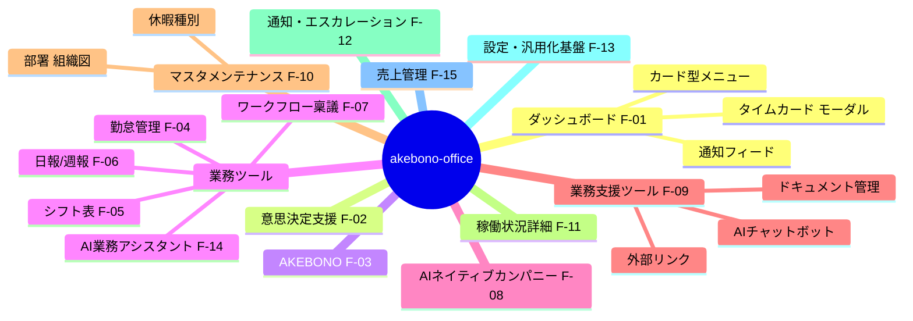

# Phase 3: 機能要件定義

- **作成日:** 2026-07-15
- **作成ロール:** 壁打ちナビゲーター（コーディングエージェント協議済み）
- **対象:** akebono-office 社内オフィスアプリ（第 1 適用 = TSUNAGUBA 自社。将来他社展開前提）
- **本フェーズ群の実装形態:** モックアップ（全ページの全機能が操作に反応すること。永続化はブラウザ内で代替）

## 0. 要件の全体構成

```mermaid
mindmap
  root((akebono-office))
    ダッシュボード F-01
      カード型メニュー
      通知フィード
      タイムカード モーダル
    意思決定支援 F-02
    AKEBONO F-03
    業務ツール
      勤怠管理 F-04
      シフト表 F-05
      日報/週報 F-06
      ワークフロー稟議 F-07
      AI業務アシスタント F-14
    AIネイティブカンパニー F-08
    業務支援ツール F-09
      AIチャットボット
      ドキュメント管理
      外部リンク
    マスタメンテナンス F-10
      部署 組織図
      休暇種別
    稼働状況詳細 F-11
    通知・エスカレーション F-12
    設定・汎用化基盤 F-13
    売上管理 F-15
```

F-12（通知・エスカレーションセンター）と F-13（設定・汎用化基盤）はオペレーター要件に加えた**提案機能**。F-12 は akebono-ai-manager の中核思想（暗黙の情報共有→アクション実行）の踏襲先、F-13 は「任意で設定できる汎用的な要素を多く持つ」方針の実現手段である。

---

## F-01 ダッシュボード（`/`）

ダッシュボードには**カード型メニューと通知のみ**を配置する（2026-07-16 オペレーター指示）。売上サマリは 売上管理（F-15）、稼働状況サマリは 提供システム稼働状況（F-11）の独立ページへ移設し、打刻はヘッダーの「タイムカード」モーダルに集約する。

| ID | 機能 | 入力 | 処理 | 出力 |
|---|---|---|---|---|
| F-01-1 | カード型メニュー | クリック・カテゴリチップ | カテゴリ（既定: 意思決定支援 / AKEBONO / 業務ツール / AIネイティブカンパニー / 経営・状況 / 業務支援 / 管理）。全遷移先を網羅。**カテゴリはカスタマイズ可（F-13-8 = バッチ7h）**: チップで選択したカテゴリのみ表示（「すべて」あり・選択は sessionStorage 記憶）。未割当メニューは自動的に「その他」へ | 各機能へ遷移。バッジ（承認待ち件数等）表示 |
| F-01-2 | 通知フィード | クリック・既読化・カテゴリタブ（設定可） | 未読通知・エスカレーション・承認待ちの横断表示（直近 8 件）。**タブでカテゴリ分け（2026-07-22 / 2026-08-12 拡張）: すべて（常時）+ エスカレーション（kind=escalation）/ 承認依頼（kind=approval のうち下記リンク基準以外）/ 稟議（リンク先 `/workflow`）/ 日報（`/reports`）/ 顧客活動（`/customer-log`）/ 議事録（`/minutes`）。表示するカテゴリタブは「レイアウト → 通知タブ」で設定（ユーザー > 全社 > 既定。F-13-9）** | F-12 へ遷移 |
| F-01-3 | タイムカード（ヘッダー / ダッシュボード） | ヘッダー「タイムカード」ボタン → モーダルで打刻。**ダッシュボードの「レイアウト」ボタン左にも同一挙動の「タイムカード」ボタンを配置（2026-08-12・`/attendance` 権限保持時のみ）** | 打刻記録（時刻・ソース）、状態機械（未出勤→勤務中→休憩中→退勤済）。どの画面からでも打刻可能。ダッシュボード版はページローカルの同一モーダル（WidgetsPunchClock flat） | 現在状態・本日の打刻・勤怠管理（`/attendance?tab=daily`）へのリンク |
| F-01-4 | 表示・配置カスタマイズ（レイアウト。オペレーター指示 2026-08-03 / 2026-08-12 拡張 / **2026-08-18 分離**） | ヘッダー「レイアウト」ボタン → モーダル。タブで**「レイアウト（通知の配置）」/「セクション設定」**/**「アプリヘッダー」（ヘッダーのクイックアクセス設定。従来ヘッダーの「表示」ボタンから移設。**候補に「通知」ベルを含む = 2026-08-18**）/「通知タブ」（通知欄・/inbox のカテゴリタブ設定）**を切替 | **レイアウト（2026-08-18 で通知の配置に特化）**: 通知欄の位置を**「上」「右」「下」「非表示」**の 4 択から選択（プレビュー付き。セクション構成は変更しない）。**セクション設定（2026-08-18 でテンプレートを統合）**: サブモード**「テンプレート」**（`default` 標準 / `operations` 現場オペレーション / `sales` 営業・顧客 / `executive` 経営 / `focus` 集中ミニマル / `notify-first` 通知ファースト の 6 種から選択・プレビュー付き。**適用時は通知の配置を変更しない = 分離**）と**「自由設定」**（セクションの追加・削除・改名・並び替え・カード割当を手動編集し保存。**お気に入りとして名前を付けて保存・呼び出し・削除できる〔ユーザー個人・上限 10 件〕**）。**3 階層（ユーザー設定 > テナント設定 > デフォルト）で解決（F-13-9）**。カード定義は共通（F-01-1 と同一の MENU_CARDS.dashboard）で配置のみが変わる。**割当可能カード = 基本メニュー + 外部リンク（F-13-3）+ AKEBONO 業態アプリ（#24）**。未割当カード + 外部リンクは「その他」へ集約（消えない）。**取消フロー（原則 9.5）= 「設定を解除」で下位層へ戻る** | レイアウト適用・プレビュー・セクション編集・お気に入り |
| F-01-5 | AKEBONO 業務（業態別）セクション（2026-07-28 / カテゴリ配置対応 2026-08-03 #24） | クリックで各業態の業務へ入場（`/akebono?seg=<id>`） | active な各業態を業態アプリカードとして表示（`useAkebonoAppCards`。id=`akebono-seg:<segmentId>`）。**メニューカテゴリ（セクション）へ割り当てた業態は該当セクションに表示され、専用「AKEBONO 業務（業態別）」セクションは未割当業態のみを表示（二重表示防止）**。全業態が割当済みなら専用セクションは出さない。AKEBONO 非表示（focus 等）時は業態カードを通常メニューへ混ぜ未割当は「その他」へ。機能トグル OFF・権限なし・業態 0 件のときはどこにも出さない | 業態の業務ハブへ入場 |

> **改訂メモ:** 旧 F-01-1（売上サマリ）は F-15 売上管理へ、旧 F-01-2（稼働状況サマリ）は F-11 へ、旧 F-01-3（打刻）は F-01-3（ヘッダーモーダル）へ移行。
>
> **全ページ共通のナビゲーション（バッチ7h・オペレーター指示 2026-07-19 #10 ②③）:** レイアウトヘッダーが
> 導線マップ（`mockup/app/utils/nav-map.ts` = SoT）から「親ページへ戻る」リンク（構造上の親・モバイルでも常時表示）と
> 「関連」ドロップダウン（そのページに関係するマスタ・設定・関連機能。権限 canPath / 管理者限定でフィルタ）を
> 全ページ共通で描画する。ページ個別のアドホックな戻るリンクは廃止（原則3）。
> 入力と参照の分離方針は screen-design §5.2 を参照（参照 = 基本ビュー・入力 = 明示アクション）。

## F-02 意思決定支援ツール（`/decision`）

undeux-sales-suite の意思決定オントロジー・ビュー（①意味 ②関係 ③制約 → 選択肢昇格 → AI 推奨）をコンサル業の事業/プロジェクト判断に適用する。

| ID | 機能 | 入力 | 処理 | 出力 |
|---|---|---|---|---|
| F-02-1 | 判断テーマ一覧 | テーマ選択 | 事業・プロジェクトの判断テーマ（モック 3 件以上） | テーマカード一覧 |
| F-02-2 | オントロジー 3 次元ビュー | テーマ | ①意味（属性・KPI）②関係（顧客/PJ/メンバーへのリンク: マスタ実データ参照）③制約（予算・契約・稼働。✗ の打ち手はグレーアウト+取消線） | 制約を通った打ち手のみ選択肢 A/B/C に昇格。AI 推奨 ★ 表示 |
| F-02-3 | シナリオ比較 | パラメータスライダー（単価・稼働率等） | 決定的な簡易予測モデルで即時再計算 | 予測 KPI・比較チャート |
| F-02-4 | 判断の記録 | 選択肢を選び「判断を記録」 | 意思決定ログ生成（テーマ・選択・根拠・判断者・日時） | 判断履歴一覧。分析基盤へ蓄積対象 |

## F-03 AKEBONO（`/akebono`）

要件定義中のためカードメニュー + プレースホルダのみ。

| ID | 機能 | 出力 |
|---|---|---|
| F-03-1 | プレースホルダページ | 「要件定義中」バナー・構想ロードマップ表示（静的表示 = フロントの責務） |
| F-03-2 | 要望ボックス | 要望を投稿すると受付リストに反映（操作反応の担保）。バッチ6d で API 化（`akebono_wishes` = 記録系・追記のみ。全員参照可 = 社内 C2） |

## F-04 勤怠管理（`/attendance`）

| ID | 機能 | 入力 | 処理 | 出力 |
|---|---|---|---|---|
| F-04-1 | 日次ビュー | 日付 | 打刻（F-01-3 と同一データ）から日次集計。6 バケット分解（所定内/法定内残業/法定外残業/60h超残業/深夜/法定休日） | タイムライン + 集計表 |
| F-04-2 | 週次ビュー | 週 | 週 40h 判定含む集計 | 週間グリッド |
| F-04-3 | 月次ビュー | 月・メンバー | 月次カレンダー + 集計、締め状態 | カレンダー + サマリー |
| F-04-4 | 36 協定アラート | — | 月 45h 接近（80% で警告）/ 単月 100h / 2〜6 ヶ月平均 80h（全組み合わせ）/ 年 6 回上限 の判定 | アラートバッジ・通知連携（F-12） |
| F-04-5 | 休暇管理（本人） | 申請（休暇種別・全日/半日） | 有給: 付与ルール（通常/比例付与テーブル。週 30h 判定が先）、残数 = 付与 − 消化（時効 2 年・最大 40 日）、年 5 日取得義務トラッカー。特別休暇（F-10-10）: 種別別残数・使用期限 | 残数・取得履歴・義務充足状況。申請は承認フローへ（種別別残数チェック） |
| F-04-6 | 打刻修正申請 | 対象日・修正値・理由（必須） | 承認後に反映。修正前値・修正者・承認者を履歴保全。**承認は経路設定（F-04-12）に従い多段化可（未設定は管理者単段）**。直行/直帰（F-04-11）承認済み日の出勤/退勤打刻登録もこの申請で行う | 修正履歴 |
| F-04-7 | 勤怠ルール設定 | 管理者 | 所定労働時間・休憩・フレックス（コア/フレキシブル）・締め日・法定休日曜日・選択可能な雇用区分・**既定にする雇用区分（区分ごとに 1 ルールのみ・保存時排他）** | 設定値が集計に反映 |
| F-04-8 | 全員のタイムカード（旧称: タイムカード。オペレーター指示 2026-07-22 で改称） | 開閉可能なフィルター: 日付（期間）・部署・氏名（autocomplete） | 全メンバーの打刻を有効打刻ベースで集計（期間上限あり・行クリックで日次詳細へ = 他メンバーの日次詳細は管理者のみ）。**参照可否は権限表（F-16。attendance / timecard-all。既定 = 管理者/人事のみ = 従来ロールガードと同値）で管理** | テーブル（日付・名前・出勤時間・退勤時間・労働時間） |
| F-04-9 | 休暇管理（管理者/人事） | 表示モード切替・付与操作 | **一覧**（名前・有給日=付与・取得日・残日・設定日=直近付与日。メンバー×休暇種別）と**明細**（取得日付・名前・休暇種別）。**個別付与**・**一括付与**（対象: 全員/雇用区分/部署。同日同種別はスキップ=冪等）。付与は権限者（管理者/人事ロール）のみ。使用期限は休暇種別マスタ（F-10-10）から自動算出 | 残数一覧・取得明細・付与実行 |
| F-04-10 | タイムカード（本人・独立メニュー `/timecard`。オペレーター指示 2026-07-22 で F-04-8 から切り出し） | 期間フィルター（上限 62 日） | **ログインユーザー本人のタイムカードのみ**を表示（打刻ウィジェット + 期間内の出退勤・休憩・労働時間の日別一覧・合計）。勤怠管理と同階層のメニューカード・ナビ項目 | 打刻カード + 本人の出退勤テーブル |
| F-04-11 | 直行/直帰の申請（オペレーター指示 2026-07-30） | 対象日・種別（直行/直帰/直行直帰）・理由（必須） | 承認経路（F-04-12。未設定は管理者単段）で承認。**承認された日は、その打刻種別（直行=出勤/直帰=退勤）の打刻修正（F-04-6）を申請できる**（承認前は AKO-ATT-005 で不可）。取下げは申請者本人のみ（原則9.5） | 申請（pending/in_review→approved/rejected/withdrawn）・申請タブで承認 |
| F-04-12 | 勤怠承認経路の設定（管理者。オペレーター指示 2026-07-30） | 区分（直行/直帰・打刻修正）× 承認ステップ（上から順・直列。各ステップの承認者は **役職／ロール／個人** から選択＝ F-07-5 と共通。2026-07-30 更新） | 稟議 F-07-5 と同型の経路設定（**金額帯は持たない**）。申請時に経路を凍結（route_snapshot）。区分に有効経路が無ければ**管理者 1 名の単段承認へフォールバック**（下位互換） | 区分ごとの経路一覧・追加/編集/無効化（復元可） |

- 対象: 取締役以外の全メンバー（安衛法 66 条の 8 の 3 準拠 = 管理監督者含む把握。外注は対象外で「稼働報告」のみ）
- 勤務体系の適用は ①メンバーの個別指定（メンバーマスタで選択） → ②雇用区分の既定ルール の順で解決する（同一雇用区分に固定/フレックス/時短が混在するケースに対応）

## F-05 シフト表（`/shift`）

| ID | 機能 | 入力 | 処理 | 出力 |
|---|---|---|---|---|
| F-05-1 | 募集期間管理 | 期間・希望締切 | 状態遷移: draft → open → closed → adjusting → published | 期間一覧 |
| F-05-2 | 希望提出（スタッフ） | 日別の出勤可/NG/どちらでも + 時間帯 | 締切まで編集可 | 提出状況。モバイル最適化 |
| F-05-3 | 調整（管理者） | 週別グリッド（縦=スタッフ、横=日） | 必要人数 vs 割当の過不足表示。バリデーション: 休憩不足（6h超45分/8h超1h）・18 歳未満深夜・週 40h 超・有給/希望との衝突 | 割当グリッド + 警告 |
| F-05-4 | 確定・公開 | 公開操作 | 確定通知（F-12 連携）。確定後変更は本人合意ステップ必須 | 本人別確定シフト（モバイルはカード型） |

## F-06 日報/週報/月報（日報 `/reports`・週報 `/weekly-report`・月報 `/monthly-report` = 改修依頼 2026-08-20 第2バッチで独立ページ化。詳細は F-06-12）

| ID | 機能 | 入力 | 処理 | 出力 |
|---|---|---|---|---|
| F-06-1 | 日報作成 | **テーマ**（自由入力。旧称: 業務テーマ → 2026-07-22 オペレーター指示で改称）別エントリ（**内容**（旧称: 作業内容）・**時間**（旧称: 工数）0.25h 刻み。**「進捗」は入力フォームでは非表示（オペレーター指示 2026-07-31。既存データの進捗値は編集・保存でも保持し、参照表示には引き続き出る）**。**通常入力は共通ヘッダ 1 行のテーブル形式で各セルへ入力（2026-07-22）**）+ **本日の所感・本日の課題**（旧称: 所感・課題 → 2026-08-03 改称。**本日の課題は種別を選択可**〔業務手順/目的の理解不足/事前の情報不足/スキル/経験の不足/コミュニケーション不足/工数/優先順位/顧客/外部要因/その他。単一選択・任意〕）・**明日の予定（テーマ/目的/内容/時間・最大 3 件。翌営業日の日報エントリへ自動反映。旧自由記述 tomorrow は互換表示）**・**改善のタネ欄（フォーム最下部 = オペレーター指示 2026-07-31。2026-08-03 で提出時は必須化・ラベルから「（任意）」を除去。必須の意味 = 提出時に当日のぽいぽいが 1 件以上あること〔入力欄が空でも当日投稿済みなら可 = 二重投稿防止〕。必須は初回提出のみで下書き・提出済み更新は非強制）。提出の成立時にトップメニューの改善のタネ（F-06b-1）と同一経路で登録・登録成功で欄をクリア = 二重登録なし・失敗は警告のみで日報フローは止めない。説明的ヒント文（マークダウン注記・管理者へ自動共有・空欄スキップ）は撤去（2026-08-03）**。日付ナビは上段 ←/今日/→・下段 日付直接選択。**表示モード「週」「月」を切替可（月は 1 日〜末日の横スクロール / カレンダー形式の 2 ビュー = 2026-07-22）** | 下書き→提出。時間合計と勤怠実労働の乖離チェック。旧データ（projectId）は表示・編集時にプロジェクト名のテーマへフォールバック。**提出済み日報の内容表示に、その日・本人の改善のタネ（poipoi）を併記する（改修依頼 2026-08-19。時刻 hh:mm は非表示 = 全員の日報の改善のタネ表示と整合）** | 日報。乖離時は警告 |
| F-06-2 | 週報作成 | **今週の成果・達成感**（旧称: 今週の目標達成）・**今週の主要業務**（旧称: 主要業務）・**課題・原因仮説**（旧称: 課題）・**来週の最重要テーマ（最大3つ）**（旧称: 来週予定）・**うまくいったこと・続けたいこと（新規）**・**チーム共有事項（新規。種別〔相談したい/判断してほしい/対応を依頼したい/特になし〕を選択して自由入力〔任意〕）**。項目名変更・新規項目とも 2026-08-03 オペレーター指示。**「週報を書く」に「例文を挿入」ボタン（改修依頼 2026-08-19。成果・課題・うまくいったこと・来週テーマの 4 欄へ例文を流し込む。入力済みなら上書き確認 = 原則9.5。例文の SoT = utils/weekly-report-templates.ts）** | 日報からのプリフィル + 例文挿入 | 週報 |
| F-06-12 | 日報/週報/月報のトップレベル分離 + 月報の新設（改修依頼 2026-08-19 第4弾 → **2026-08-20 第2バッチで物理パス・権限キーも独立**） | メニュー種別（日報/週報/月報）× タブ（自分/全員/チーム） | **日報・週報・月報を独立したトップレベルページへ分割**（日報 `/reports`・週報 `/weekly-report`・月報 `/monthly-report`。旧 `?kind=` 切替〔2026-08-19 第4弾〕を置換）。**各ページに 自分/全員/チーム タブ**（タブキーはいずれも mine/all/team）。**旧 URL 互換（原則7）**: `/reports?kind=weekly\|monthly` と旧タブキー（`?tab=weekly-mine` 等 → `?tab=mine` 等・最古の `?tab=weekly` → `/weekly-report?tab=mine`）は reports.vue が新パスへ replace リダイレクト（既存の通知・ブックマークが生存）。パンくず（nav-map）は 3 ページとも親 = ホーム（週報・月報の親に日報を出さない）。**月報を週報と同型で新設**（今月の成果・主要業務・課題・来月の最重要テーマ・うまくいったこと・チーム共有事項。提出保護 = AKO-REP-002・例文挿入・週報から下書き生成・全員/チームの提出状況・既読管理〔kind=monthly〕）。週報/月報は共通コンポーネント（ReportsPeriodPanel）。**権限は独立キー**（`reports`=日報・`weekly-report`=週報・`monthly-report`=月報。**下位互換: 新キーの明示ルールが 1 件も無い間は旧 `reports` のルール〔`tab:weekly-*` / `tab:monthly-*` 含む〕を継承し、新キーのルールを設定した時点で独立制御** = shared/domain/permissions.ts の resolveFeatureResource / resolveTabPermission。フロント usePermissions と API featureGuard が同一関数を通る） | `GET/PUT /v1/reports/monthly`・monthly_reports（0072）・PATH_FEATURES（`/v1/reports/weekly(-insight)`→weekly-report・`/v1/reports/monthly`→monthly-report・reads/remind は reports に残置）・TAB_PERMISSION_CATALOG.reports / weekly-report / monthly-report（各 3 タブ） |
| F-06-11 | 全員の週報（オペレーター指示 2026-07-22 追加） | 対象週・部署・メンバーで絞り込み・**「未読のみ」トグル（2026-07-31）** | 全メンバーの**提出済み**週報の週次一覧（下書きは本人以外に見せない）。参照可否は日報と同じ権限表「日報・週報の参照対象」（F-16-6）で管理。API は `GET /v1/reports/weekly?scope=all`。**既読/未読管理は全員の日報（F-06-9）と同一（2026-07-31）**。**一覧の各行に週レンジ + 主要項目（今週の成果・主要業務・課題）のプレビューを表示し、行クリックで詳細ドロワーに全項目を表示する（改修依頼 2026-08-19。従来は主要業務 1 行のみで内容が薄かった）** | 名前・週レンジ・主要項目プレビューの一覧（**未読バッジ + 未読件数**）→ 押下で詳細ドロワー（全項目） |
| F-06-3 | 提出状況一覧（チームタブ） | 期間・**部署・メンバーで絞り込み（2026-07-22）**。**表示モード「週」「月」を切替可（月は 1 日〜末日の横スクロールマトリクス / カレンダー形式（日別提出数 + 選択日の詳細）の 2 ビュー = 2026-07-22。既定表示は「月・横スクロール」= 改修依頼 2026-08-19。従来の既定は「週」。週/月トグルで週表示にも切替可）** | メンバー×日のマトリクス。**バッチ7h（オペレーター指示 2026-07-19 #10 ①）で全員へ公開**: 表示メンバーは「表示メンバー設定（configs `teamVisibleMemberIds`・管理者が歯車から設定・自分は常に表示。**バッチ7k で候補 = 在籍中の全メンバー（取締役・外注含む・雇用区分バッジ付き）・空 = 既定表示（マトリクス = 社員・契約・アルバイト / タイムライン = 全員）**）∩ 日報参照権限（F-16-6）」。一般メンバーには他人の下書きの存在・内容を見せない（提出済み/未のみ。API scope=team も提出済みのみ返す）。未提出リマインド送信・下書き表示・工数乖離は管理者（乖離は HR 含む）のみ | 提出状況・リマインド通知（管理者） |
| F-06-4 | コメント/リアクション | コメント・絵文字リアクション | 双方向フィードバック | コメントスレッド |
| F-06-5 | AI社員の日次報告 | —（F-08 から自動） | AI社員の日次活動報告を同じタイムラインに掲載 | 「AIネイティブカンパニーの報告場所」の実現 |
| F-06-6 | 課題エスカレーション | 本日の課題欄への記入 | 暗黙にエスカレーション起票（F-12） | 管理者へ通知 |
| F-06-7 | AI アシスト入力（オプション） | AI業務アシスタント（F-14）で蓄積した材料（タスク計画の結果・改善のタネ・ヒアリング回答・カレンダー予定） | 蓄積データから AI が日報ドラフトを生成 →**本人が確認・修正してから提出**（提出済みは上書きしない）。入力方式は設定で 通常フォーム/AI アシスト/両方 を選択（F-13-7）。**既定は通常フォームが主・AI アシストは補助（バッチ7c）。ドラフト材料には独立メニューの改善のタネ（F-06b-1）も合流し、LLM にはチャットボットと同じ参照範囲の社内データ文脈を供給**。**材料の入力 UI は F-14 へ移設**（日報側は材料サマリ + 生成 + 確認・修正） | 日報ドラフト（entries=予定・完了タスクから工数・PJ 推定 / 所感・課題・明日=結果・回答から抽出。生成根拠を明示） |
| F-06-8 | Google カレンダー連携（モック） | ユーザー自身の画面上 OAuth 同意フローで連携（アカウント単位・いつでも解除可） | 予定を本アプリへ同期（Google 発予定の SoT は Google・べき等 upsert）。本アプリで登録したタスクは Google へ反映可能（アプリ発の SoT は本アプリ）。**同期対象カレンダーは選択制（既定 = マイカレンダーのみ。共有・サブカレンダーも選択可 = バッチ7b・オペレーター指示 2026-07-19 #3）** | 日ごとのタスク見える化・双方向反映・同期カレンダー選択モーダル |
| F-06-9 | 全員の日報（2026-07-17 オペレーター指示追加） | 対象月・**部署・メンバーで絞り込み（2026-07-22）**・**「未読のみ」トグル（2026-07-31）** | 全メンバー・AI 社員の**提出済み**日報の月次一覧（下書きは本人以外に見せない）。参照可否は権限表「日報・週報の参照対象」（F-16-6）で管理。**既読/未読管理（オペレーター指示 2026-07-31）: 既読は report_reads（0047）へ永続化。詳細を開くと自動既読・「未読に戻す」で取消（原則9.5）。自分の日報は対象外**。**詳細表示に併記する改善のタネ（poipoi）の時刻 hh:mm を非表示にする（改修依頼 2026-08-19。本文のみ表示 = 全員の日報/チームの詳細ドロワー共通）** | 日付・名前・サマリー・時間の一覧（PC = 行 / モバイル = カード・**未読バッジ + 未読件数**）→ 押下で詳細表示 |
| F-06-10 | 週次 AI インサイト（バッチ7g → **バッチ7j・オペレーター指示 2026-07-19 #9/#12**） | 対象週（週ナビゲーション）+「生成/再生成」 | **該当週に登録された全データを決定的に集計**し、Vertex AI が洞察を生成（LLM 無効環境は決定的ヒューリスティック = モックと同一関数）。**バッチ7j: ①一度生成したら DB に保管し、再生成されるまで保存済みの結果を表示**（weekly_insights = 導出キャッシュ・upsert）②**提出系の集計・評価（提出数・提出者・提出率）は「前日（asOf = min(週末, 前日)）まで・経過営業日基準」**（日報は前日分までが正常な運用 = 当日を未提出として悲観評価しない。工数・グラフ・課題は週内全量 = 当日提出分も事実として表示）③**全体共通（company）とログインユーザー向け個別（personal = ロール・役職・所属部署に最適化）を分けて提供**。全体は保管データを閲覧者ごとに配信時マスク（売上 = sales 権限・メンバー別工数/課題 = F-16-6）し、洞察本文は個人名・売上に言及しない形で生成（全員が共有する保管物のため。個人への言及・売上文脈は個別側が担う） | **全員の週報タブ**「AI インサイト」（2026-07-22 のタブ再編で週報タブから移設）: あなた向けインサイト（サマリー・注目ポイント・推奨アクション)+ 集計サマリーカード + グラフ + エグゼクティブサマリー（全体）+ SWOT + リスク + 推奨アクション + 課題明細。生成日時・生成者表示 |

> **改善要望 2026-08-17（F-06 追補）:** ①自分の日報の既定表示 = **月・横スクロール**（従来は週）②日報エディタに **Google カレンダー連携の予定読込・取込**（F-14 と同じ useCalendar。同期 → その日の予定をエントリ行へ変換・同名スキップ = 冪等）③「ぽいぽいポスト」の表示名を**「改善のタネ」へ改称**④フォームの改善のタネ欄を**明日の予定の上**へ移動 ⑤参照表示の「（管理者へ共有済み）」表記を削除 ⑥本日の課題は**所感と同じプレーン表現**（背景色・カード化なし）。

## F-06b 改善のタネ・議事録（`/poipoi`・`/minutes`。バッチ7c/7e。旧称「ぽいぽいポスト」= 改善要望 2026-08-17 で改称〔さらに旧称「ぽいぽいメモ」= バッチ7e〕。内部キー・ルート `/poipoi`・kind `poipoi` は不変 = 原則7）

| ID | 機能 | 入力 | 処理 | 出力 |
|---|---|---|---|---|
| F-06b-1 | 改善のタネ（独立メニュー） | 本文（+ 任意でプロジェクト・顧客・業務種別） | AI業務アシスタントから独立。**本人 + 管理者が参照（C3 + 管理者閲覧 = バッチ7e）**: 管理者へのフィードバック・チーム全体の改善に活用するため、管理者は全メンバーのポストの**オリジナル内容（本文・取込原本）を閲覧できる**（取消・AI 参照スコープは本人のみのまま）。日報ドラフトの材料 + AI（チャットボット・業務アシスタント）の参照対象。**AI の参照範囲は既定「すべて」（他メンバーの投稿も投稿者名付きで参照 = バッチ7g・指示 #8。F-16-5 の ai-scope 設定で「自分のみ」へ制限可）** | **一覧が基本ビュー（バッチ7h: 入力・ファイル取込はヘッダーの「投げ込む/登録する」ボタン → モーダル。議事録も同型）**・全メンバーのポスト（管理者） |
| F-06b-2 | 議事録の登録 | **プロジェクト/顧客/業務種別（フォーム上部 = 2026-08-03）**・タイトル・本文 | 全員参照（C2）。AI の参照対象（検索インデックス = 全員）。**紐付けセレクトを本文の上に配置し、プロジェクト選択で顧客を自動補完（Project.companyId が SoT。オペレーター指示 2026-08-03。改善のタネの入力モーダルも共通化）**。**一覧は登録日時・投稿者・冒頭のサマリー表示、押下で詳細モーダル = 全文表示（バッチ7e）** | 議事録一覧（サマリー）・詳細モーダル・登録フォーム |
| F-06b-3 | ドキュメント取込 | .md/.txt/.pdf/.docx（10MB。旧 .doc は変換案内）+ 任意でプロジェクト・顧客・業務種別 | **選択で即アップロードせず、ステージ表示 → 取込ボタン押下で実行（バッチ7d）**。テキスト抽出 → ノート化 + 原本保全（note_files）。AI 用にインデックス/ベクター化して保管。紐付けセレクトの選択は取込にも適用 | 取込結果 |
| F-06b-4 | 業務種別マスタ | 名称・表示順 | `/masters/work-categories`（管理者）。改善のタネ・議事録の任意分類 | マスタ CRUD |
| F-06b-5 | ノートの取消・復元（バッチ7d） | 対象ノート | 取消 = 論理削除（`active=false` + 監査ログ）。復元 = 取消の取消（原則 9.5 の対称性）。どちらも poipoi = 本人のみ / minutes = 登録者 or 管理者。冪等（状態不一致は警告 no-op）。取消で一覧・日報材料・AI 参照対象から即時除外（検索インデックス再生成）、取消済みの表示・原本参照は復元権限者のみ。**本アプリ共通原則「操作の取消可能性」（CLAUDE.md 原則 9.5）の適用例** | 取消/復元結果・取消済み一覧 |
| F-06b-6 | AI 文脈の混入防止（バッチ7d） | —（チャットボット・AI業務アシスタントの内部処理） | 検索インデックスにノートの紐付け（顧客・プロジェクト）を保持し、質問文中で特定の顧客/プロジェクトに言及がある場合、**別の顧客/プロジェクトに紐付いたノートを AI 文脈から除外**（無紐付けノートは従来通り対象） | — |
| F-06b-7 | マークダウン対応（バッチ7e） | フリー入力の文章（改善のタネ・議事録の本文、日報の本日の所感/本日の課題、週報の各記述欄） | 安全なサブセットのマークダウンとして描画（見出し・箇条書き・番号リスト・引用・コードブロック・強調・リンク。**v-html 不使用 = VNode 直接生成で XSS が構造的に成立しない**。リンクは http(s) のみ）。入力側は textarea のまま + プレビュートグル | マークダウン描画・入力プレビュー |
| F-06b-8 | Google Meet 連携（議事録・2026-08-03 ③b） | 連携認証（カレンダー連携の drive.readonly を共用）→ 保管フォルダ（tenant 既定を初期表示・違う場合のみ選び直す）→ Drive 上の Meet AI メモ（Google ドキュメント）/ 録画（動画）を選択 | 議事録に選んだ Drive ファイルを参照リンク（meetFileId/名称/webViewLink）として保持。AI メモは「本文へ取込」で text/plain エクスポートを本文へ反映（内容確認のうえ登録）。既定保管フォルダは管理者が設定（app_configs `meet-default-folder`）。**API モード限定**（実 Drive 連携が必要 = ドキュメントのドライブ取込と同型。モックは非表示）。未接続はカレンダー連携（AI アシスタント）へ誘導 | 一覧・詳細に Meet バッジ/リンク。エラー AKO-NOTE-004/005・未接続 AKO-DOC-006 |

## F-07 稟議（`/workflow`。旧称: ワークフロー → オペレーター指示 2026-07-22 で改称）

| ID | 機能 | 入力 | 処理 | 出力 |
|---|---|---|---|---|
| F-07-1 | 申請作成 | 区分（購買/契約/経費/採用/出張/その他。**全区分の説明文を並記したカード型ラジオ選択（UiRadioCards）で、説明を確認しながら選択できる = 改修依頼 2026-08-18**〔購買: 物品・備品・ソフトウェア・SaaS等の購入 / 経費: 会食・研修・広告・イベント等の費用支出 / 出張: 交通・宿泊を伴う出張の事前申請 / 契約: 業務委託・顧問等の契約締結・更新 / 採用: 求人・採用活動・雇用に関する申請 / その他: 上記に該当しない申請〕。旧「選択中区分のみヒント表示」〔改善要望 2026-08-17〕を置換）・件名・金額・**目的・内容（旧「本文」を分割 = 2026-07-22。内容は区分別テンプレート（標準 + 購買/契約/経費/採用/出張）を呼び出して記入可。既存データの body は互換表示）**・添付（モック） | 決裁番号自動採番。職務権限マトリクス（区分×金額）で承認経路を自動決定 | 申請（draft→submitted） |
| F-07-2 | 承認操作 | 承認/却下/差戻し（却下・差戻しはコメント必須）/取下げ | ステータス遷移: submitted → in_review(step 1..n) → approved / rejected / remanded / withdrawn。差戻し→修正→再申請 | 承認ログ（監査証跡） |
| F-07-3 | 代理承認 | 代理設定（本人・代理者・期間） | 不在時に代理者が承認可。代理履歴記録 | 代理承認ログ |
| F-07-4 | 申請一覧 | タブ（自分の申請/承認待ち/全件） | フィルタ・検索 | 一覧 + 詳細ドロワー |
| F-07-5 | 承認経路設定（管理者） | 区分×金額帯×経路（直列/合議）。各ステップの承認者は **役職／ロール／個人／申請者本人** から選択（申請者本人 = 提出時にその申請の申請者へ解決して凍結 = 2026-08-17。2026-07-30 更新。PermissionRule.subjectKind と同モデル・勤怠 F-04-12 と共通コンポーネント）。**各ステップの種別（承認/決裁/確認）を設定・可視化（改善要望 2026-08-17。未設定の旧経路は 最終=決裁・他=承認 の表示既定。確認ステップの既定担当 = 申請者本人。新規経路の既定 = 決裁→確認〔申請者本人〕。進行は種別に依らず直列 = 状態機械不変）** | 職務権限マトリクスの編集（汎用化 F-13 の一部） | 経路プレビュー（種別バッジ付き） |

## F-08 AIネイティブカンパニー（`/ai-company`）

> **切り出し版（2026-08-20）:** 本機能は独立アプリ **AKEBONO Company**（`company/` = Firebase Hosting 別サイト）として
> 切り出し版が存在する（+ トークン管理機能を新設。要件 = `company-intelligence-requirements.md`）。
> Office 内の本メニューは下位互換のため現状維持（整理は implementation-status.md §91-6 の残課題）。

| ID | 機能 | 入力 | 処理 | 出力 |
|---|---|---|---|---|
| F-08-1 | 3D オフィス空間 | — | アイソメトリック表現のオフィスに AI社員を配置。状態（実行中/待機/承認待ち）をアニメーション表示 | クリックで AI社員詳細 |
| F-08-2 | ロール設定（`/ai-company/roles`） | ロール名・責務・システムプロンプト・権限・モデル層 | ロールの自由な作成・編集・無効化 | ロール一覧。AI社員に割当 |
| F-08-2b | AI 社員の管理（`/ai-company/employees`。バッチ7f） | 名前・ロール | **AI 社員の増員（追加）・減員（無効化 = 論理削除）・復元・ロール変更**（管理者 = 汎用マスタ）。席は自動割当。減員しても過去のタスク・活動ログは保全され、復元でいつでも戻せる（原則 9.5） | AI 社員一覧・追加/編集モーダル |
| F-08-3 | タスク依頼 | AI社員選択 + 依頼内容（フリーテキスト）+ **添付（.md/.txt/.pdf/.docx/.pptx/.jpg/.png。10MB×5 件 = バッチ7f）** | AI がタスク分解（本実装 = Vertex AI 構造化出力・失敗時は共有ヒューリスティック）→ 依頼者承認 → 実行 → 完了報告。状態: proposed → approved → in_progress → done/blocked（バッチ6a で API 化・FOR UPDATE 状態機械）。**AI 社員間の依頼・連携（バッチ7b・オペレーター指示 2026-07-19 #3）: `delegate` 権限を持つロール（マネージャー）の AI 社員へ依頼すると、承認と同時に他の AI 社員へ分担を連携（子タスク化・役割適合で自動割当）。人間の承認は 1 回のみで、完了は統合報告・ブロックはマネージャー経由でエスカレーション** | タスクボード（カンバン・分担元/分担先の連携表示）・マネージャーバッジ |
| F-08-3b | タスクの実遂行（バッチ7f・**バッチ7i で全自動化**） | **承認のみ（バッチ7i・オペレーター指示 2026-07-19 #11: 「進める」の連打を廃止）** | **承認 = ユーザーの意思表示を起点に、全ステップを AI（Vertex AI）が自動で遂行し切る**（完了・依頼者への質問・中止まで fire-and-forget で連続実行。回答・ブロック解除・手動「再開」でも自動再開）。各ステップは**遂行前に Google 検索グラウンディングで Web 調査**（自 DB・依頼文だけで解決しようとせずインターネットから情報収集。調査メモ + 出典 URL を材料に加え、成果物に「参考」として出典を明記）→ 成果物（マークダウン）を生成・保存（材料 = 依頼文 + 添付の抽出テキスト/画像（マルチモーダル）+ 確認済み Q&A + Web 調査メモ + 前ステップの成果。LLM 無効環境は決定的ヒューリスティックの実施記録へ縮退 = 原則4・Web 調査は API モードのみ）。全ステップ完了で**統合報告**を生成し依頼者へ通知。連携タスクは分担先の統合報告をマネージャーが集約 | ステップ成果物・統合報告（タスク詳細モーダルでマークダウン表示）・タスクボードの「自動実行中」表示 + フォールバックの「再開」 |
| F-08-3c | 依頼者への確認（バッチ7f・**バッチ7i で限定**） | —（AI の判定） | **依頼者への質問は「自社・顧客のドメイン情報がどうしても必要な場合」「重要な意思決定・承認が必要な場合」のみに限定**（バッチ7i。一般的な知識・調査で解決できることは Web 調査で自力遂行する）。質問時はブロック（通知 + タスクボードに「回答待ち」表示）し、依頼者（または管理者）の回答（フリーテキスト + 添付可）で**実行が自動再開**する。回答待ちの間は「再開」不可（AKO-AIC-014）。再質問はタスクあたり 3 回まで | 質問と回答のスレッド・回答フォーム |
| F-08-4 | 活動ログ | — | AI の活動を時系列記録（種別・対象・トークン/コストのモック値） | 活動ログビュー |
| F-08-5 | 日次活動報告 | —（日次バッチ想定） | 活動ログから日次報告生成 → F-06-5 のタイムラインへ掲載 | 日次報告 |
| F-08-6 | エスカレーション | AI の確信度低・停滞 | F-12 へ起票（ai-manager 踏襲: low_confidence / member_anomaly 相当） | 管理者通知 |

## F-09 業務支援ツール（`/support`）

| ID | 機能 | 入力 | 処理 | 出力 |
|---|---|---|---|---|
| F-09-1 | ツールハブ | クリック | **内部アプリと設定可能な外部リンクをカード型メニューで混在表示**。外部リンクは F-13 で追加・編集・並べ替え | サポート管理表（外部リンク）等 + 内部アプリ |
| F-09-2 | AIチャットボット（`/support/chatbot`） | 自然文質問 | 本実装（API モード）は Vertex AI 一次応答: **DB の全移行済みドメイン（勤怠・有給・日報・ワークフロー・シフト・意思決定・タスク計画・カレンダー・エスカレーション・メンバー/部署・顧客・プロジェクト・ナレッジ）をサーバーで文脈化**し、**参照範囲は権限（F-16）に従う**（機能 deny のドメインは文脈化しない・マスタは表示項目 deny を反映。2026-07-17 オペレーター指示）。本人スコープ（C3）維持・他人の日報は提出済みのみ。LLM 無効/失敗時はキーワードルーティングの決定的応答へ縮退。出典バッジ・ストリーミング風表示。**AI 検索最適化（バッチ7a・オペレーター指示 2026-07-18 #3）: マスタ・ナレッジ・関係性を更新時に AI が探索・解釈しやすい形へ自動フラット化（search_docs = 派生・SoT 不変）し、字句バイグラム + ベクター埋め込み（Vertex）のハイブリッド検索で曖昧・解釈型の質問へ回答。会社名は法人格・空白除去の名寄せで照合** | 会話 UI・サジェスト質問・セッション履歴 |
| F-09-3 | ドキュメント管理（`/support/documents`） | フォルダ/タグ/検索、**実ファイルのアップロード + Google ドライブ取込（バッチ7l・オペレーター指示 2026-07-19 #14 で本実装）** | フォルダツリー + 一覧 + プレビュー。タグ付け・検索。**実体は Firebase の Cloud Storage（STORAGE_BUCKET。未設定環境は DB 保管フォールバック）。テキスト抽出（.md/.txt/.pdf/.docx/.pptx/.csv）→ 検索インデックス（search_docs）経由でチャットボット・AI カンパニーの参照対象。ダウンロードは 15 分有効の署名 URL（縮退 = base64）で、AI 回答内でも必要に応じて URL を案内。アーカイブ = 論理削除 → 復元可（原則 9.5）** | ドキュメントライブラリ + AI が社内文書を根拠に答える |

## F-10 マスタメンテナンス（`/masters`）

共通仕様: 一覧（検索・フィルタ・ソート）→ 詳細ドロワー → 追加/編集/無効化（物理削除しない ※関係エッジ（F-10-6）を除く）。**全マスタにカスタム項目（F-13-1）適用可**。モバイルではカード型表示。
**バッチ7h:** ハブ（`/masters`）のカードメニューはカテゴリチップで絞り込み可（F-13-8 でカスタマイズ。既定 = 組織・権限 / 勤怠・休暇 / 会社・顧客 / 業務・ナレッジ）。会社間関係・人間関係の追加フォームは一覧下の同居をやめ、他マスタと同じ「追加」ボタン → ドロワーに統一（入力と参照の分離 = 指示 #10 ④）。

| ID | マスタ | 主要項目 |
|---|---|---|
| F-10-1 | メンバー管理 | 氏名・雇用区分（取締役/社員/契約社員/アルバイト/外注）・**勤務体系（勤怠ルールの個別指定。未指定なら雇用区分の既定を適用）**・**部署（部署マスタ F-10-9 参照。所属の SoT）**・役職・入社日・週所定日数/時間（有給比例付与に連動）・ロール（admin=管理者/hr=人事/member=一般）・打刻対象フラグ |
| F-10-2 | 業界マスタ | 業界名（直交軸。複合値を作らない）・表示順・有効 |
| F-10-2b | 事業区分（Village）マスタ（改修依頼 2026-08-19 第4弾） | 事業区分名（社内事業の区分）・表示順・有効（業界マスタと同型の最小マスタ。活動記録 3 種の最上段でコンボボックス参照し、自由入力で新規登録もできる = lib/village-resolve） |
| F-10-3 | 自社マスタ | 顧客(会社)とほぼ同一項目（会社名・業界(複数+主)・規模・所在地・事業内容）+ 会計年度開始月等の自社固有設定 |
| F-10-4 | 顧客(会社)マスタ | 会社名・業界（多対多 + 主業界 1 件）・エイリアス（表記ゆれ照合）・規模・担当メンバー・状態 |
| F-10-5 | 顧客(人)マスタ | 氏名・所属会社・部署役職・キーパーソン度・連絡先・メモ |
| F-10-6 | 顧客関係マスタ | **会社間の有向エッジ**（From→To + 関係種別マスタ: 納品先/受託先/販売チャネル/競合/資本関係…追加可能）+ **人どうしの関係**（上司部下/意思決定ライン/紹介者）。関係グラフ可視化。※関係エッジの削除は物理削除（設計判断: data-design.md §1.1 参照） |
| F-10-7 | プロジェクトマスタ | PJ 名・顧客・種別（業務コンサル/システムコンサル/受託開発/運用/自社）・状態・優先度・担当・期間・予算・説明/目的（AI 文脈供給用） |
| F-10-8 | ナレッジ | **5 ドメイン**（業界/顧客(会社)/顧客(人)/顧客関係/プロジェクト）に紐付く記事。タイトル・本文・タグ・出典（手動/エスカレーション裁定の還流）・検索。**ドキュメント取込（バッチ7a・オペレーター指示 2026-07-18 #3）: .md/.txt/.pdf/.docx のアップロードでも蓄積できる（テキスト抽出 → 記事化・原本保全・AI の回答へ自動反映）** |
| F-10-9 | 部署マスタ・組織図 | 部署名・**親部署（階層構造）**・責任者・説明・表示順。**組織図ビュー**（階層ツリー + 所属メンバー + 責任者バッジ）と一覧ビューの切替。部署詳細から**メンバーの配属**（他部署からの異動）が可能（所属の SoT は Member.departmentId）。循環参照の防止・所属者/子部署が残る部署は無効化不可 |
| F-10-10 | 休暇種別マスタ | 休暇名（有給休暇/夏季休暇/結婚特休/慶弔休暇…会社ごとに追加可能）・**付与方式**（periodic=周期自動付与 / manual=権限者が任意タイミングで付与）・**使用期限**（付与からの月数。空欄=期限なし）・説明・表示順。法定有給はシード固定（編集・無効化不可）。付与の実行は F-04-9 |
| F-10-11 | 祝日マスタ | 内閣府「国民の祝日」CSV の公式取込（再取込可 = 冪等）+ 手動追加・削除。**翌営業日計算**（F-14 の計画対象日・F-06-7 の明日の予定）と対象日の祝日名表示に反映。営業曜日・祝日の扱いは勤怠ルール（勤務体系）ごとに設定でき、外注等の週末稼働に対応（オペレーター指示 2026-07-18 #4） |

## F-11 提供システム稼働状況（`/status`, `/status/:id`）

| ID | 機能 | 処理 | 出力 |
|---|---|---|---|
| F-11-1 | 全体サマリ | コンポーネント状態（operational/degraded/partial_outage/major_outage/maintenance）の最悪値ロールアップ | 全体バナー + システム一覧 |
| F-11-2 | システム詳細 | 90 日稼働率バー（日別色分け）+ uptime%（API モードはインシデントから shared/domain/uptime で日次導出 = バッチ6c）+ インシデント履歴 | 詳細ページ |
| F-11-3 | インシデント管理 | ライフサイクル: investigating → identified → monitoring → resolved（正順のみ・API は FOR UPDATE で直列化）。影響度 minor/major/critical。更新はタイムスタンプ付きフィード（updates 追記のみ = 記録系） | インシデント登録・更新（管理者のみ。登録/更新で管理者へ通知） |
| F-11-4 | uptime 日次集計（バッチ6c 追加） | SoT = インシデント → uptime_daily へ導出（窓内 DELETE→INSERT = 冪等）。トリガ = 登録/更新時 + Cloud Scheduler 日次（/jobs/uptime-rollup）+ 管理者の手動再計算 | 90 日稼働率・日別バーの元データ |

## F-12 通知・エスカレーションセンター（`/inbox`）【提案機能】

akebono-ai-manager の「暗黙の情報共有 → エスカレーション → アクション実行 → ナレッジ還流」を踏襲する。

| ID | 機能 | 処理 |
|---|---|---|
| F-12-1 | 通知一覧 | 種別（承認依頼/コメント/リマインド/AI報告/システム/エスカレーション/**改善のタネ**）・既読管理・アクションへのジャンプ。**未読総数はヘッダーのベル（全ページ共通）とモバイル下部ナビにバッジ表示（100 件以上は 99+）**。**通知リンクは対象行のデータ詳細が見える箇所へのディープリンク（2026-08-18）**: 稟議 `/workflow?open=<id>`・日報 `/reports?date=`・勤怠申請 `/attendance?tab=requests`・シフト `/shift?tab=`・改善のタネ `/poipoi?open=<id>`・AI タスク `/ai-company?task=<id>`・エスカレーション `/inbox?tab=escalations&open=<id>`（管理者の対応モーダルを直接開く） |
| F-12-2 | エスカレーション起票 | シグナル: 日報の課題記入（F-06-6。AI アシスト経由の提出でも同様に発火）/ タスク停滞 3 日 / 過負荷（保有タスク 7 件以上）/ AI 低確信度（F-08-6）/ 36 協定アラート（F-04-4）。クールダウンで重複抑止 |
| F-12-5 | 改善のタネの通知（オペレーター指示 2026-08-03） | 改善のタネ（F-06b-1）が登録されると、原文（プレビュー）を設定した宛先へ通知（kind=`poipoi`・link = 管理者受信者は `/poipoi?open=<ノートid>`（対象ポストの詳細を直接開くディープリンク）・閲覧権限の無い受信者（役職/個人指定の非管理者）は従来どおり `/poipoi`〔開けないリンクを配らない。2026-08-18〕）。宛先は**ロール・役職・個人**で指定（承認者と同じ 3 種）。SoT = configs `poipoi-notify-recipients`（JSON）・**投稿者本人は除外**・未設定なら通知しない。設定 UI は F-13 の「改善のタネの通知先」。非ブロッキング（通知失敗でも登録は成立 = 原則4）。API モードはサーバー（`POST /v1/notes`）発火・mock は `useNotes` 発火 |
| F-12-3 | 管理者アクション | 「回答送信 / 裁定記録 / 対応不要」の 3 択。裁定はナレッジ（F-10-8）へ還流し出典を記録 |
| F-12-4 | 対応履歴 | 起票→解決の一覧・還流率の表示 |

## F-13 設定・汎用化基盤（`/settings`）【提案機能・他社展開の中核】

| ID | 機能 | 処理 |
|---|---|---|
| F-13-1 | カスタム項目設定 | エンティティ（メンバー/顧客会社/顧客人/プロジェクト等）ごとに任意項目を定義（text/number/date/select/multiselect/boolean）→ 各マスタのフォーム・詳細に自動反映 |
| F-13-2 | 汎用区分マスタ | 選択肢群（部門・役職・PJ 種別・関係種別・稟議区分…）をコード種別単位で管理。各画面のセレクトはここを参照 |
| F-13-3 | 外部リンク設定 | 業務支援ツール（F-09-1）に表示する外部アプリリンクの追加・編集・並べ替え・アイコン。**アイコンはプレビュー付きのプリセット選択、または画像アップロード（カスタムアイコン）で設定（改善要望・2026-08-12。SettingsIconPicker）。画像は 160px 縮小 data URI・「アイコンに戻す」で取消可（原則9.5）** |
| F-13-4 | 機能トグル | 機能単位の有効/無効（他社導入時のカスタマイズを想定） |
| F-13-5 | 勤怠・承認・エスカレーションルール | F-04-7 / F-07-5 / F-12-2 の設定の集約導線 |
| F-13-6 | 監査ログ | マスタ変更・承認・設定変更の操作履歴一覧 |
| F-13-8 | メニューカテゴリ（バッチ7h・オペレーター指示 2026-07-19 #10 ⑤） | ダッシュボード / マスタハブのカードメニューのカテゴリを自由に設定（追加・削除・名称変更・並び替え・メニュー割当 = 論理名で検索する複数選択）。SoT = configs `menu-categories-<area>`（未設定 = 既定構成 = 下位互換）。未割当メニューは「その他」へ自動表示（メニューが消えない）。**取消フロー（原則 9.5）= 「既定に戻す」+ 再編集で上書き可**。ダッシュボード領域は割当候補に外部リンク・AKEBONO 業態アプリを含む。**ダッシュボードのセクション配置は 3 階層（F-13-9）が主導線**となり、ここのダッシュボードタブは従来のテナント共通設定（`menu-categories-dashboard`）を編集する下位互換導線として残す（案内表示あり・二重編集の混乱回避） |
| F-13-7 | 日報の入力方式 | 日報の入力方式を「通常フォーム入力のみ / AI アシスト入力のみ / 両方（メンバーが切替可能）」から選択（F-06-7 のオプション設定。日報画面へ即時反映） |
| F-13-10 | 改善のタネの通知先（オペレーター指示 2026-08-03） | 改善のタネ（F-06b-1）登録時に原文を通知する宛先を **ロール・役職・個人**で複数指定（承認者指定 ApproverSteps と同じ 3 種。SoT = configs `poipoi-notify-recipients`〔JSON〕）。管理者のみ設定可。未設定なら通知しない。解決は共有純関数 `resolveNotifyRecipientIds`（在籍者・重複排除・投稿者除外）。詳細は F-12-5 |
| F-13-9 | ダッシュボードレイアウト（表示・配置カスタマイズ・オペレーター指示 2026-08-03 / **2026-08-18 分離**） | **レイアウト設定 = 通知の配置（上/右/下/非表示）に特化・セクション設定 = テンプレート（6 種・プレビュー付き。適用時は通知の配置を維持）+ 自由設定（手動編集。お気に入りとして保存・呼び出し可 = user_preferences `dashboardSectionFavorites`・上限 10 件）に分離（2026-08-18）**。ダッシュボード（F-01-4）のセクション構成は手動編集（追加・削除・改名・並び替え・カード割当）。**設定・セクション配置とも 3 階層で解決**: ユーザー設定（`user_preferences.dashboardLayout`・本人/端末間同期）> テナント設定（`app_configs.dashboard-layout`・管理者が全社既定を設定）> デフォルト表示。テナント未設定時は従来の `menu-categories-dashboard`（F-13-8）を default options と組み合わせて下位互換解釈（原則7）。保存値 = `DashboardLayout`（templateId + sections + options{notifications / **notificationsInherit（分離後の保存 = 配置はキーへ委譲。2026-08-18）** / showAkebono / density}）を JSON（手動編集時は templateId=`custom`・options は保存先スコープ自身の層のものを維持〔`pickBaseLayout`。§53 MAJOR 対応〕・通知配置は専用キー〔`dashboardNotificationPlacement` / `dashboard-notification-placement`〕が SoT）。**UI = ダッシュボードヘッダのモーダル**（**「レイアウト（通知の配置）」/「セクション設定」タブ〔2026-08-18 分離。旧「テンプレート」/「セクションを編集」〕**・スコープ選択付き。自分向けは全ユーザー可・全社既定は管理者のみ）。セクション編集の割当候補 = 基本メニュー + 外部リンク + AKEBONO 業態アプリ。**取消フロー（原則 9.5）= 層ごとに「設定を解除」可**。既存 API（`/v1/me/preferences` の value 4KB 上限内・`/v1/configs`）のみ利用し新規 API は不要 |

## F-14 AI業務アシスタント（`/ai-assistant`）

日報の AI アシスト（F-06-7）の材料入力側を独立させた業務アシスタント。「前日に計画 → AI と磨く → 当日に振り返る → 日報へ自動反映」のサイクルを回し、蓄積データは管理者のインサイト源になる。

| ID | 機能 | 入力 | 処理 | 出力 |
|---|---|---|---|---|
| F-14-1 | カレンダー連携・タスク見える化 | Google カレンダー連携（F-06-8 と共通の擬似 OAuth）・手動タスク追加 | 計画対象日の予定を同期し「予定からの計画候補」として提示 | 予定リスト（未計画のもの） |
| F-14-2 | 翌日タスクの計画登録 | タスク名・**目的**・**達成条件**・**段取り/計画**（予定からワンタップ計画化 or 手動追加） | 前日の終わりに翌日分を登録。**planned/done とも本人が編集・削除できる（誤登録の訂正。オペレーター指示 2026-07-21。done の訂正は監査ログ付き）** | タスク計画 |
| F-14-3 | AI レビューコメント | 「AI コメントをもらう」 | AI が計画を診断（目的の具体性・達成条件の検証可能性・段取りの分解）→ コメント提示 → **本人が計画を修正 → 再取得可。status を問わず（done でも）後からでも取得できる（指示 2026-07-21）**（モックは決定的ヒューリスティック。本実装は LLM） | 改善コメント（良い点 + 助言） |
| F-14-4 | 当日の振り返り | 結果（必須）・所感 | 当日の終わりに記録すると status=done。**誤記の訂正のため記録後も本人が再記録（上書き）できる（指示 2026-07-21。再記録は監査ログ・初回記録日時 resultAt は保持）**。日報ドラフト（F-06-7）へ自動反映可能になる | 結果・所感の記録 |
| F-14-5 | 日報への自動反映 | —（F-06-7 のドラフト生成時） | 完了タスクの結果→エントリ/進捗、所感→所感欄、ネガティブ結果→課題欄、翌営業日の計画→明日の予定欄へ反映 | 日報ドラフト |
| F-14-6 | 管理者インサイト | —（管理者のみ表示） | 直近 7 日のメンバー別 計画数・結果記録数・完了率・振り返り記入率を集計。**蓄積データは経営インサイトの元ネタ**（mart 写像は data-design 参照） | インサイトテーブル |
| F-14-7 | 他メンバーの readonly 参照（F-16-7 連動・指示 2026-07-21） | 対象メンバー切替セレクト（権限で許可された対象者のみ選択肢に出る） | 権限（F-16-7）で許可された対象者の AI業務アシスタント（計画・振り返り）を **readonly 表示**（全 mutation を無効化・閲覧バナー表示）。既定 = 参照不可の許可制 | 対象メンバーの計画・振り返りの読み取り表示 |

## F-15 売上管理（`/sales`）

旧 F-01-1（ダッシュボードの売上サマリ）を独立ページ化（2026-07-16 オペレーター指示）。

| ID | 機能 | 入力 | 処理 | 出力 |
|---|---|---|---|---|
| F-15-1 | 売上サマリ | 年度選択 | 月次売上データ集計（月次推移・前年比・粗利率・顧客別/事業種別内訳。API モードは sales_monthly が SoT・会計年度計算は shared/domain/fiscal をフロント/API 共有） | KPI カード + チャート。意思決定支援（F-02）への導線 |
| F-15-2 | 月次実績の登録/取込（バッチ6b 追加） | 対象月・顧客(会社)・事業種別・売上・原価 | 管理者のみ。冪等キー = month × company × projectType の月次 upsert（同一キーは上書き。一括取込は API `rows` 最大 500 件） | 実績登録モーダル → サマリへ即時反映 |
| F-15-3 | mart ETL（バッチ6b 追加） | —（管理者の手動実行 or Cloud Scheduler 日次） | sales_monthly → `fact_sales`（app_office 内の mart 互換テーブル = オペレーター判断 2026-07-18）への一方向 ETL。冪等キー UNIQUE(tenant_key, source_txn_id)・実行監査 = mart_load_runs | ETL 実行結果（runId・件数）・実行履歴 API |

---

## F-16 権限制御（オペレーター指示 2026-07-17 追加）

| ID | 機能 | 入力 | 処理 | 出力 |
|---|---|---|---|---|
| F-16-1 | 権限ルール管理 | レイヤ（ロール/役職/個人）・対象・リソース（機能 or マスタ項目）・項目キー・効果（許可/拒否） | 権限ルールの CRUD（管理者のみ・監査ログ記録・論理削除） | `/masters/permissions` の**2 モード**（タブ並びは 権限表 → ルール一覧・既定 = 権限表。オペレーター指示 2026-07-21）。①**権限表: 行 = ページ > 機能 > 項目 の 3 階層ツリー（下位層は開閉可能）× 列 = レイヤ内の対象（ロール/役職/個人 = 個人は列を選択）。セルは常に可否のいずれかを表示（未設定表示は廃止。明示ルールが無いセルは上位の一括設定 → アプリ既定値の順で引き継いだ値を薄色表示）し、クリックで反転。引き継ぎ値と同じ値へ戻すと明示ルールを解除（論理削除）。上位（マスタ全体 = field null / 全メンバー = member:*）で設定すると明示ルールの無い下位項目が一括で従い、下位の明示ルールが個別に優先。表ヘッダは内部スクロール + sticky で常時表示** ②ルール一覧: 項目キーは物理名の手入力ではなく論理名（例: 役職・メールアドレス）の複数選択オートコンプリートで指定し、複数選択時は 1 項目 1 ルールで一括作成（同一ルールはスキップ）。一覧も論理名表示（オペレーター指示 2026-07-19）。両モードは同じ PermissionRule を読み書きし完全に相互運用（設定できるリソースも両モードで一致 = 同 2026-07-21） |
| F-16-2 | 機能単位の利用制御 | ルール + 利用者（ロール・役職・個人） | 個人 > 役職 > ロール の優先で解決（同一レイヤは拒否優先・同一レイヤ内は明示キー → 一括キー（マスタ全体/全メンバー）→ の順で参照・どのレイヤにも無ければアプリ既定値 = 機能は許可）。既存のロールガードは緩められない「制限レイヤ」 | メニュー/ページ非表示 + API 403（AKO-PRM-001） |
| F-16-3 | 表示項目レベルの制御 | ルール（リソース = マスタエンティティ + 項目キー。**field=null = マスタ全体 = 全項目の一括既定**（バッチ7m。個別項目のルールが優先） | マスタ応答から対象フィールドを除去（API モード。マスタ全体 deny はカタログ全項目を除去） | 対象者の画面から当該項目が非表示 |
| F-16-5 | AI 参照範囲（バッチ7g） | レイヤ・対象・データ区分（改善のタネ / 勤怠 / タスク計画）・範囲（すべて / 自分の登録データのみ） | **AI（チャットボット・AI業務アシスタント）が各データを参照する範囲を、既存のレイヤ（ロール/役職/個人）ごとに設定**（`PermissionRule` の擬似フィールド `ai-scope`。allow = すべて / deny = 自分のみ。解決順・deny 優先は機能ルールと同一）。既定: 改善のタネ = すべて（他メンバーの投稿も参照 = 指示 #8）・勤怠・タスク計画 = 自分のみ（C3 安全側）。機能自体の deny が最優先 | ルール一覧の「AI 参照範囲」リソース + 権限表の各ページ配下「AI 参照範囲」行（バッチ7m で階層配置） |
| F-16-6 | 日報・週報の参照対象（バッチ7h・オペレーター指示 2026-07-19 #10 ① → 2026-07-22 で週報にも適用し改称) | レイヤ・対象・参照対象メンバー・効果（参照可 / 参照不可） | **誰の日報を参照できるかをレイヤ（ロール/役職/個人）ごとに設定**（`PermissionRule` の擬似フィールド `member:<対象メンバー id>`・resource='reports'。deny = 参照不可。未設定 = 参照可 = 下位互換。**`member:*` = 全メンバーの一括既定**（バッチ7m。個別メンバーのルールが優先））。**自分の日報は常に参照可**。適用範囲: チームマトリクス・全員の日報・詳細表示・API の日報一覧（scope=all/team）・チャットボットの他人日報文脈・週次インサイト集計 | ルール一覧の擬似リソース「日報・週報の参照対象」（対象メンバー or 全メンバー（一括既定）を論理名で複数選択 = 1 名 1 ルール）+ 権限表の「日報・週報 > 日報・週報の参照対象」（全メンバー一括 > メンバー個別の階層。バッチ7m で対象化） |
| F-16-7 | AI業務アシスタントの参照対象（オペレーター指示 2026-07-21） | レイヤ・対象・参照対象メンバー・効果（参照可 / 参照不可） | **誰の AI業務アシスタント（計画・振り返り）を readonly 参照できるかをレイヤごとに設定**（`PermissionRule` の擬似フィールド `member:<対象メンバー id>`・resource='ai-assistant'。allow = 参照可。**未設定 = 参照不可 = 許可制**（日報 F-16-6 と対称だが既定が逆 = 個人の作業計画のため）。**自分は常に参照可**）。適用範囲: `/ai-assistant` の対象メンバー切替（readonly 表示）・API の他メンバー計画/ログ取得（`GET /v1/task-plans?memberId=` `GET /v1/assist/logs?memberId=`・未許可 403 AKO-PRM-002）。**`member:*` = 全メンバーの一括既定**（バッチ7m。個別メンバーのルールが優先） | ルール一覧の擬似リソース「AI業務アシスタントの参照対象」（対象メンバー or 全メンバー（一括既定）を論理名で複数選択 = 1 名 1 ルール）+ 権限表の「AI業務アシスタント > AI業務アシスタントの参照対象」（全メンバー一括 > メンバー個別の階層。バッチ7m で対象化） |
| F-16-4 | 運用デフォルト（バッチ7f） | —（migration 0025 / モックシード） | **未設定環境へ運用に即した初期ルールを投入**: 一般（member）= 売上管理・意思決定支援・マスタ・設定 deny / 人事（hr）= 売上管理・意思決定支援 deny / 管理者 = 全 allow。既に有効なルールがある環境には投入しない（冪等・状態保護）。マスタ/設定の deny は管理 UI の非表示のみ（参照 API はデータ面 = 対象外）。個別例外は権限設定の member/title レイヤ allow で上書き | 権限表に初期状態が表示される |
| F-16-8 | タブメニュー単位の利用制御（改修依頼 2026-08-18） | レイヤ・対象・ページ内タブ・効果（利用可 / 利用不可） | **メニュー（ページ）＞タブメニューの階層制御**。`PermissionRule` の擬似フィールド `tab:<タブキー>`（resource = 機能キー）。既定 = 利用可・明示ルールが無いレイヤは機能全体（field=null）の設定へフォールバック（項目と同型）。対象タブのカタログは `TAB_PERMISSION_CATALOG`（日報・週報 / 稟議 / 改善要望管理 / シフト表。勤怠のタブは専用擬似フィールド timecard-all・通知のカテゴリタブは通知タブ設定が担うため対象外）。管理者限定タブ（稟議の全件/経路設定・シフトの調整/募集期間）はロールガードが基底 = allow で非管理者へは開放されない（制限レイヤ）。enforcement はフロント（タブ非表示 + 直打ち時の先頭の利用可能タブへ退避。**全タブ利用不可の場合はどのタブ内容も描画せず「利用できるタブがありません」の空状態を表示 = フェイルクローズ**）。データ面の権限は従来の機能・項目・参照対象ルールが担う（設計判断: タブは画面整理の単位。/v1/media トグルと同じ整理） | 権限表の各ページ配下「タブ: ◯◯」行（✓ = 利用可 / × = 利用不可） |
| F-16-9 | 項目の参照/更新の階層制御（改修依頼 2026-08-18） | レイヤ・対象・マスタ項目・効果（更新可 / 更新不可） | **メニュー＞タブ＞項目＞参照/更新の最下層**。`PermissionRule` の擬似フィールド `<項目キー>:write`（resource = マスタエンティティ）。**参照＞更新の階層 = 参照 deny（F-16-3）の項目は `:write` allow でも更新不可**。既定 = 参照可能な項目は更新も可（下位互換）。enforcement は API（`PATCH /v1/masters/:entity/:id` が更新不可キーを body から剥がす = `stripDeniedWriteKeys`。全キー不可は 403 AKO-PRM-003・一部不可は残りを更新 = グレースフルデグラデーション） | 権限表のマスタ項目配下「◯◯の更新」行（✓ = 更新可 / × = 更新不可。参照不可の項目は操作不可） |
| F-16-10 | AIの参照範囲（登録者単位。改修依頼 2026-08-18） | データ種類（改善のタネ / 勤怠 / タスク計画 / 日報・週報 = メニュー単位）・参照者（ロール/役職/個人）・対象登録者（ロール/役職/個人/全メンバー一括）・効果（参照可 / 参照不可） | **誰（参照者）が誰（登録者）の登録データを AI 経由で参照できるかを登録者単位で設定**。`PermissionRule` の擬似フィールド `ai-scope:member:<id>`・`ai-scope:title:<役職>`・`ai-scope:role:<ロール>`・`ai-scope:*`（resource = データ種類）。解決順: 参照者レイヤは 個人 > 役職 > ロール、同一レイヤ内の対象キーは 個人指定 > 役職指定 > ロール指定 > 全メンバー一括 > レガシー二値 `ai-scope`（F-16-5 = 互換維持）> **既定 = 権限表の参照権限**（日報・週報 = F-16-6・タスク計画 = F-16-7・改善のタネ = 全員参照可・勤怠 = 本人のみ）。**本人の登録データは常に参照可**。機能自体の deny が最優先。**参照対象の登録者候補は在籍（active）メンバーのみ = 無効化済み（退職）メンバーの登録データは本人以外の AI 文脈へ供給しない**（旧二値 all では供給されていた。安全側への意図的変更）。enforcement はチャットボット文脈（勤怠チームサマリー・チームのタスク計画・他メンバー日報・ぽいぽい検索リトリーバル = `searchDocsFor` の許可リスト） | 権限設定の専用タブ「AIの参照範囲」（データ種類 × 参照者 × 登録者の三値マトリクス。参照可 / 参照不可 / 既定 をクリックで循環・既定へ戻す = 明示ルールの論理削除 = 取消フロー） |

## F-17 アカウント（ヘッダー・`/profile`。オペレーター指示 2026-07-17 追加）

| ID | 機能 | 入力 | 処理 | 出力 |
|---|---|---|---|---|
| F-17-1 | ログアウト | ヘッダーのアカウントメニュー | Firebase signOut + /v1/me キャッシュ破棄（API モード。モックは擬似ログインのため対象外） | ログイン画面へ遷移 |
| F-17-2 | プロフィール画像 | 画像ファイル選択 | クライアントで 256px 正方形へ縮小 → data URI 化 → 本人のみ更新可（PUT /v1/me/profile・監査ログ）。空で削除 | ヘッダー等のアバターに表示（未設定はイニシャル） |
| F-17-3 | パスワード変更 | 現在・新規パスワード | Firebase 再認証 → updatePassword（メール/パスワード認証のみ。Google SSO は Google 側管理の旨を表示） | 変更完了・以後は新パスワードでログイン |
| F-17-4 | アカウントメニュー | — | API モード: プロフィール + ログアウト（**デモユーザー切替は表示しない** = モックの名残の除去）/ モックモード: プロフィール + デモ切替（X-3） | ヘッダーのドロップダウン |

## F-18 顧客活動（`/customer-log`。旧「顧客ログ」= 改修依頼 2026-08-18 で改称。オペレーター指示 2026-07-30 新設 → 2026-07-31 項目拡張）

| ID | 機能 | 入力 | 処理 | 出力 |
|---|---|---|---|---|
| F-18-1 | 顧客活動の記録 | 日付（必須）・**開始/終了時間（任意。分は 15 分単位から選択 = UI 制約・終了は開始必須 + 開始より後 = 2026-07-31）**・**活動目的（旧「属性タグ」= 改修依頼 2026-08-18 で改称。商談/取材/イベント等のプリセット + 自由入力・最大 10 件 = 2026-07-31）**・**活動手段（訪問/Web会議/電話/メール/チャット/その他の単一選択・任意 = 改修依頼 2026-08-18 追加）**・顧客(会社)（必須・**コンボボックス = 2026-07-31**）・担当者(人)（任意・**コンボボックス**・会社所属を検証）・**自社の担当者（必須・既定 = ログインユーザー = 2026-07-31）**・件名（任意）・**担当者メモ（必須。旧「会話内容」を引き継ぎ = 2026-07-31。議事録メモは 2026-08-03 に入力・保管とも廃止 = オペレーター指示）** | 本人所有の記録系（追記 + 本人編集〔監査ログ〕+ 取消/復元 = 原則2/9.5）。**コンボボックスの未登録名は保存時に companies/contacts へ新規マスタ登録して反映（同一トランザクション・正規化名一致は既存へ名寄せ・監査ログ。一般メンバーでもこの経路では登録可）** | 顧客活動一覧（日時・会社・担当者・活動目的・活動手段・記録者・冒頭。ページング 20 件 = X-7）→ 詳細モーダル |
| F-18-2 | 一覧の表示範囲（改修依頼 2026-08-18 で全員閲覧化） | —（一覧表示） | **全メンバーの記録を認証済み全員が閲覧できる**（`GET ?scope=all`。旧・許可制の参照権限 canViewMemberCustomerLog / 権限表の「顧客ログの参照対象」は撤去 = 既存ルールは migration 0066 で論理無効化）。**編集・取消は従来どおり本人の記録のみ**（AKO-CLG-002）。他人の取消済みは晒さない（includeArchived は本人分のみ） | 全メンバーの一覧（記録者表示・記録者フィルタ付き。他人の記録は閲覧のみ） |
| F-18-3 | AI 参照 | —（登録の副次効果） | search_docs へ自動反映（source_kind 'customer-log'・**owner = 記録者 = 本人スコープ** = 他メンバーの記録は AI 文脈へ供給しない。**一覧の全員閲覧化後も AI 参照は本人スコープを維持 = 設計判断**）。links.companyId で顧客混入防止 | チャットボット・日報アシストの文脈 |

## F-40 メディア分析（`/media`。トップメニュー = 2026-08-03 に独立チャンネル化。初出 2026-07-28）

**独立したメディアチャンネル**（オウンドメディア）の分析・記事生成。任意で「どの Akebono 業務アプリ
（= 業態 business_segment）と連携するか」を設定できる（**連携は必須でない**。オペレーター指示 2026-08-03）:
- 未連携（単体チャンネル）: メディア単体で分析・記事生成・単体 AI インサイトが動く
- 連携済み: 加えて業務 × メディアの統合 PDCA（売上 × 流入）が使える（統合分析は連携必須。未連携は「連携すると使える」案内）

2026-08-03 の移行で、旧「事業セグメント（業態）と 1:1」からトップメニューの独立機能へ変更した
（旧: AKEBONO 業務配下の per-segment アプリ）。全データを `channelId` で keying する。
モック = 擬似 OAuth + 記事インベントリからの決定的導出 / API = Google OAuth 2.0（analytics.readonly・
**チャンネル単位**）+ GA4 Data/Admin API の実データ（詳細は api-design §3 の /v1/media 行と phase7 実装状況 §50）。

| ID | 機能 | 入力 | 処理 | 出力 |
|---|---|---|---|---|
| F-40-1 | メディア分析ハブ | チャンネル選択 | 現在チャンネルの GA 連携状況・主要指標サマリー + 全チャンネルの一覧（連携済み/単体を区別）+ チャンネル追加 | `/media`（機能カード + チャンネル一覧） |
| F-40-2 | メディア分析（GA × AI） | チャンネル・期間（既定 28 日） | GA 由来指標（セッション・PV・CV・チャネル/デバイス/日別/記事別/セクション別）の可視化 + AI インサイト（サイト構成・記事・次アクション。**外部投稿記事の原文も材料**。生成 → 保管 → 再生成で上書き）。業務 × メディア PDCA タブ = 連携済みチャンネルのみ売上と流入の突合（相関・PDCA・アクション。未連携は連携案内） | `/media/analytics`（KPI・チャート・テーブル・AI インサイト） |
| F-40-3 | AI 記事生成スタジオ | お題・キーワード・目的・質・トーン・読者 | 記事ドラフト生成（API = Vertex AI → 決定的フォールバック。**未連携チャンネルでも動く**）。過去分析からのお題提案。採用でコンテンツ資産（記事インベントリ）へ登録 = 分析対象に反映。取消・復元・採用取消可（原則9.5） | `/media/articles`（生成フォーム・プレビュー・履歴） |
| F-40-4 | チャンネル設定（管理者） | チャンネル操作・連携先業態（任意）・GA 連携・AI 分析設定・外部投稿記事 | チャンネル CRUD（作成・編集・取消/復元 = 原則9.5）。連携先業態の選択（任意・未選択可）。GA 連携（モック = 擬似 OAuth / API = OAuth 同意 → GA4 プロパティ選択）と AI 分析設定（サイト名・目的・読者・トーン・キーワード）の保存（部分更新）。**外部投稿記事の原文の保管**（追加・編集・取消/復元。media インサイトの材料）。連携解除可 | `/media/settings` |

## F-41 業態・会社全体ダッシュボード（`/akebono/dashboard`・`/akebono/company`。2026-07-28 追加）

| ID | 機能 | 入力 | 処理 | 出力 |
|---|---|---|---|---|
| F-41-1 | 業態ダッシュボード | 業態選択 | 業務（売上・受注）× メディア（GA 流入・CV）の統合サマリー + AI レポート + AI インサイト（生成 → 保管 → 再生成で上書き） | `/akebono/dashboard` |
| F-41-2 | 会社全体ダッシュボード | —（売上権限で閲覧） | 全業態ロールアップのサマリー・業態別内訳 + AI レポート + AI インサイト | `/akebono/company` |

> **実装状況の注記:** API モードでは集計（メディア軸 = GA・売上軸 = sales_records）はサーバー組み立ての
> 実データ（Phase C = phase7 実装状況 §39）。保管（dashboardInsights）のみ未移行のモックコレクション
> （Phase D 予定 = 「レポート保管 = ローカル」バッジで明示）。

## F-42 改善要望（`/improvements`。全ページ横断の投稿 + AI 集約 + 改修プロンプト出力。オペレーター指示 2026-08-11）

各ページから寄せられた改善・改修の要望を記録し、AI が「改修単位」へ集約して、対応可否・解決状況を管理し、
実際に AI で改修する際のプロンプトとして出力する。要望の投稿は全社員が可能だが、集約結果の閲覧・管理は
権限を持つ人のみ（既定は非公開）。

| ID | 機能 | 入力 | 処理 | 出力 |
|---|---|---|---|---|
| F-42-1 | 要望の投稿 | 本文（投稿元ページのパス・表示名は自動付与） | 生要望を追記（記録系・追記のみ = SoT）。全ページ共通ヘッダーの「要望を送る」から | 投稿完了トースト |
| F-42-2 | AI 集約 | **採用済み（F-42-14 で選別）** かつ未集約の生要望 + 既存の未判定改修単位 | 改修単位へ分解・集約（Vertex AI → 決定的ヒューリスティックにフォールバック）。判定済みの改修単位のステータス・編集は巻き戻さない（原則2）。**未選別・不採用の要望は集約対象外**（2026-08-17 第 2 弾） | 改修単位（`improvement_items`） |
| F-42-3 | ステータス管理 | 改修単位・遷移先・（継続検討時）再検討日 | 単一ステータスを **7 値**で管理（**改修依頼 2026-08-20 で「対応方針」の語彙へ再編**）: 未判定（triage）→ **改善対応**（accepted。コード改修で対応・未着手 = **旧ラベル「対応する」の改称・保存値 accepted は不変 = 原則7**）／**運用対応**（operational・**新設** = 改修せず運用でカバー = 決着済み）／**継続検討**（deferred・**新設** = 今は判断せず持ち越す = 未解決。**遷移には再検討日（revisitOn）が必須**〔improvementRevisitError・実在日〕で、**再検討日の到来時に日次ジョブが管理者へ通知**〔`POST /jobs/improvement-revisit-reminders`・kind=reminder・`/improvements?tab=items&open=<id>` ディープリンク・revisit_notified_on マーカーで同一期日は 1 回のみ = 冪等〕）→ 対応中（in_progress・着手済み = 改修依頼 2026-08-18 追加）→ 解決済み（resolved）／**対応見送り**（rejected・**旧ラベル「対応しない」の改称・保存値 rejected は不変**）。改善対応 ⇄ 対応中 の往復・解決/見送り/運用対応の取消（reopen）・継続検討からの再判定可（原則9.5）。**遷移の SoT = `shared/domain/improvement.ts` の `IMPROVEMENT_STATUS_NEXT`**（フロントのボタン活性と API の遷移検証を一致） | 更新後の改修単位 |
| F-42-4 | フィルター | 解決済/未解決・対応方針 | 一覧を状態で絞り込み（未解決 = 未判定/改善対応/対応中/継続検討。**「改善対応・対応中」= committed = 実装決定済みの未完了** = 改修依頼 2026-08-18。**選択肢ラベルは IMPROVEMENT_STATUS_META から生成 = 語彙再編 2026-08-20 に自動追従**） | 絞り込み一覧 |
| F-42-5 | 改修プロンプト出力 | —（対象は「改善対応」に固定 = 改修依頼 2026-08-18〔当時のラベル「対応する」〕。従来のフィルター条件指定を廃止） | **「改善対応」（accepted・保存値は不変）の改修単位のみ**から（未判定を含めない）、対象ページのパス・機能名・改修内容・元要望・受入基準を明記したコーディング AI 向けプロンプトを決定的に組み立て。**冒頭にナビゲーター定型文（「あなたはナビゲーターです。／最適なロールを必要なだけ招集して以下のタスクを進めてください。／改修後は指摘事項がなくなるまでコードレビューとシステム監査を繰り返してください。」= `PROMPT_NAVIGATOR_PREAMBLE`）を必ず記載**（同 2026-08-18）。**改修依頼 2026-08-19: (a) 受付箱・改修案件で記録した要望コメント（improvement_request_comments）を各要望のサブ項目として反映し検討経緯を AI に伝える。(b) 壁打ち/お任せタグ（F-42-17）は人間運用の意思表示のためプロンプトには含めない（凡例も行頭マークも出さない）** | コピー可能なプロンプト（マークダウン） |
| F-42-6 | 閲覧権限 | — | 既定は非公開（deny-by-default）。管理者は常時可・権限設定（F-16）でロール/役職/個人へ付与可（機能キー `improvements`） | 権限を持つ人のみ管理ページ閲覧 |
| F-42-7 | カンバン表示 | — | 改修単位をステータス別カラム（**IMPROVEMENT_STATUSES から自動生成の 7 列 = 未判定/改善対応/対応中/運用対応/継続検討/解決済み/対応見送り。改修依頼 2026-08-20**）に並べ進捗を一望。カードから許可遷移のクイック操作（継続検討は再検討日が必須のためドロワーの入力へ誘導） | `/improvements`（改修案件タブの表示切替「カンバン」） |
| F-42-8 | 対応予定期間 | 開始日・終了日（任意） | 各改修案件に対応予定期間を任意登録（終了は任意 = 単日）。取消（クリア）可 | improvement_items.plan_start/plan_end |
| F-42-9 | ガントチャート | スケール（月次/週次/日次）・期間・**ステータスフィルタ** | 予定期間をバーで可視化。月次=1年（12列）/週次=3か月（13列）/日次=1か月（当月日数）。前後の期間送り＋「今月/今週/本日」で現在へスナップ。**ステータスで絞り込み（一覧と同じ選択肢）・既定=「改善対応・対応中」（committed = 実装決定・未完了。「対応中」追加に伴い 2026-08-18 で既定を拡張）。バーはステータス色分け（改善対応=青〔brand〕／対応中=水色〔info〕／未判定=アンバー〔warn〕／運用対応=グリーン〔ok〕／継続検討=オレンジ〔serious〕／解決済み〔完了〕=グレー／対応見送り=レッド〔crit〕。決着済み〔運用対応・完了・見送り〕は退色。語彙・7 値対応 = 改修依頼 2026-08-20）＋凡例（2026-08-12）** | `/improvements`（改修案件タブの表示切替「ガント」） |
| F-42-10 | 時系列メモ（2026-08-12） | 改修単位・メモ本文（任意の種別 note/reject） | 各改修案件に検討過程・保留/見送り理由を **1 件ずつ時系列で記録**（記録系・追記のみ）。**改修プロンプト生成時に AI がメモも加味**（buildCodingPrompt）。**「対応見送り」（旧ラベル「対応しない」= 2026-08-20 改称・保存値 rejected/reject は不変）への変更時に任意で理由をメモ（reject）として記録**。取消（論理削除）は確認ダイアログ + 復元可（原則9.5） | improvement_notes（時系列メモ） |
| F-42-11 | 添付（URL リンク・画像。2026-08-17） | URL リンク（複数・最大 5 件・http(s) のみ）・画像（複数・最大 4 件・PNG/JPEG/WebP/GIF・縮小 data URI） | 要望の投稿フォームで任意添付。**画像はファイル選択・ドロップエリアへのドラッグ&ドロップ・クリップボード貼り付け（Ctrl+V / ⌘V）の 3 経路で添付可（2026-08-18。共通経路で縮小・種別・上限チェック）**。**参照時はリンク = 別タブで開く／画像 = 押下で拡大表示**（改修単位ドロワーの元要望）。改修プロンプトにはリンクを列挙・画像は件数を言及。検証（形式・件数・上限）は shared 共有関数で両モード一致 | improvement_requests.links / .images |
| F-42-16 | 生要望の編集（改修依頼 2026-08-18 → 2026-08-19 で全項目編集に拡張） | 登録済みの改善要望を編集（投稿者本人または管理権限者。取消済みは不可 = 先に復元）。**編集対象は本文だけでなく登録時の全項目 = タグ（壁打ち/お任せ）・参考リンク・添付画像（改修依頼 2026-08-19）** | 「改善要望」ページの生要望ドロワーに「編集」→ インライン編集フォーム（本文 + タグ + 参考リンク + 画像 = `ImprovementsRequestEditForm`。添付の追加/削除 UI は投稿フォームと共通部品 = 原則3。**本文と画像は本文一体型 `ImprovementsBodyImageInput`・参考リンクは `ImprovementsLinkEditor`〔改修依頼 2026-08-19 第4弾で旧 `ImprovementsAttachmentEditor` を分割・置換〕**）。**投稿者本人は送信直後の「送信しました」ビュー（要望モーダル）の「内容を修正する」からも全項目を行使できる**（過去要望の投稿者向け一覧・編集導線は残課題 = コメントの投稿者向け閲覧導線と同様）。編集は上書きだが `edited_at` を記録して「編集済み（日時）」を明示し、**変更前本文は監査ログへ全文記録（同一トランザクション = 並行編集でも直前本文を喪失しない）**（原則2/9.5）。**検証は投稿時と同一の shared 純関数（`improvementRequestEditFields`）で API/モック一致。部分更新の鉄則を守り、送っていない項目（tags/links/images）は現行値を保持する（本文だけの編集で添付が消えない = CLAUDE.md 部分更新原則。空配列を明示送信すれば全削除）**。集約済みも編集可（プロンプト再生成が現行本文を読むため明確化が反映される） | improvement_requests.edited_at（0064）・tags/links/images（0061/0065） |
| F-42-12 | 要望ステータス + プロンプト再生成（2026-08-17） | 要望（request）単位のステータス（未対応 open / 対応済み resolved / 見送り dismissed。遷移自由 = 原則9.5） | 改修単位ドロワーの各要望でステータスを変更（改修単位のステータスとは独立の進捗タグ = 部分対応を表現）。**改修プロンプトの再生成（出力モーダルの「再生成」）で【対応済み】【見送り】が明記**され、再改修・誤実装を防ぐ。管理権限者のみ | improvement_requests.status（0062） |
| F-42-13 | 対象ページの選択（2026-08-17） | 対象ページ（既定 = 開いているページ）・「全体」・「新設ページ」 | 「要望を送る」で対象ページを選び直せる（全ページに波及する要望・新設画面の要望も書ける）。全体/新設ページは pagePath 空 + pageLabel で区別 | improvement_requests.page_path / .page_label |
| F-42-14 | 生要望の選別（採用/不採用。2026-08-17 第 2 弾） | 要望・選別状態（未選別 pending / 採用 adopted / 不採用 declined） | 管理者の初手を「生要望の一覧 → 取捨選択」に変更。**採用した要望だけが AI 集約（F-42-2）の対象**になる。集約済み要望の選別は変更不可（記録保護 = 原則2。対象から外すには**「集約の解除」（F-42-19）**または要望の取消 = 論理削除）。選別のやり直し（未選別へ戻す）可（原則9.5） | improvement_requests.adoption（0063） |
| F-42-15 | 生要望へのコメント（2026-08-17 第 2 弾） | 要望・コメント本文（最大 2,000 字） | 採用/不採用の検討・確認事項の **やり取りを 1 件ずつ時系列で記録**（記録系・追記のみ）。追加は管理権限者 + 投稿者本人・**一覧閲覧は管理権限者のみ**（投稿者本人向けの閲覧導線は残課題 = implementation-status §83）。取消は論理削除 + 復元可（原則9.5） | improvement_request_comments（0063） |
| F-42-17 | 要望タグ（お任せ/壁打ち。改修依頼 2026-08-18 → 2026-08-20 で二者択一化） | 投稿時のタグ（**どちらか 1 つのみ = 二者択一。お任せ `entrust`〔既定〕 / 壁打ち `brainstorm`**） | 「要望を送る」でタグを付与できる（投稿時の意思表示）。**改修依頼 2026-08-20: 「お任せ」「壁打ち」の二者択一トグル（`ImprovementsTagToggle`）に変更 = 常にどちらか 1 つのみ選択・片方を選ぶともう片方が自動で外れる・既定はお任せ。従来の複数付与（UiChipSelect）から変更。データ形は従来どおり `ImprovementRequestTag[]` だが常に要素数 1**。**お任せ = 受け取った内容を開発側の解釈で進めてよい／壁打ち = 起票内容について壁打ち〔対話での要件整理〕を経て案件化したい**。受付箱一覧・各ドロワーにバッジ表示。**改修プロンプトには含めない（人間運用の意思表示のため = 改修依頼 2026-08-19。凡例も行頭マークも出さない。F-42-5 参照）**。値は shared の allowlist 正規化（未知値は落とす）。旧データ（未定義 = タグ無し／複数付与）は表示は従来どおり全件バッジ表示・編集フォームを開くとマウント時に 1 件へ正規化する（原則7） | improvement_requests.tags（0065） |
| F-42-18 | 受付箱のタブ再構成・一覧内選別（改修依頼 2026-08-18） | 受付箱一覧の行内「採用」「不採用」・複数選択・タブ選択 | `/improvements` を **サマリーカード（受付箱の未選別件数 + ステータス別件数。押下で該当タブへ直行。ステータス 7 値化で 8 枚 = 改修依頼 2026-08-20）→ タブメニュー（当時: 受付箱/改修案件/カンバン/ガントチャート → **2026-08-20 に受付箱/改修案件の 2 タブ + 表示切替へ再編 = F-42-22**）** に再構成（文言修正: 生要望（受付箱）→ **受付箱**）。受付箱の一覧上で選別を直接変更（同じ選別の再押下 = 未選別へ戻す = 原則9.5）・**複数選択してまとめて採用/不採用**（部分成功は件数で案内 = 原則4）。受付箱のタイムスタンプは **`yyyy/MM/dd HH:mm:ss`（秒まで）** 表示。**列順は「対象ページ → 要望 → 投稿者 → それ以外（添付・選別・選別操作・コメント・投稿日時）」（改修依頼 2026-08-19。先頭の選択チェックボックスは行選択の操作列のため列順の対象外で先頭固定）** | improvement_requests.adoption（0063。一括は既存 1 件 API の逐次呼び + 反映 1 回） |
| F-42-19 | 集約の解除（追加指示 2026-08-18） | 集約済みの要望 | 集約済みの要望を改修単位から外し、**「採用済み（集約待ち）」へ明示的に戻す = 再度 AI 集約（F-42-2）の対象**にする（取消 archive と違い要望は生きたまま）。改修単位のステータス・本文は不変（人手の記録保護 = 原則2）だが `source_request_ids` のトレースからは除去（導出値の整合 = 原則6）。**解除した item は `excluded_item_ids`（履歴・蓄積 = クリアしない）に記録し、次回以降の AI 集約でそこへは再追記しない**（同じ単位への往復 + detail 重複・「対象外」メモとの矛盾防止。二重解除でも過去の単位へ戻らない）。**元 item には「対象から外れた」修正メモを自動で残す**（detail に残る旧記載の再実装を防ぐ。プロンプトの担当者メモに反映 = `buildUnclusterNoteBody`）。ガードは共有 `improvementUnclusterError`（存在 404 → 未集約 AKO-REQ-017〔409〕→ 取消済み AKO-REQ-018〔409・先に復元〕→ **決着済み item AKO-REQ-021〔409・記録保護 = 先に reopen してから解除〕→ 取消済み item AKO-REQ-022〔409・先に item を復元〕**）。導線 = 受付箱ドロワー（集約済み表示）+ 改修単位ドロワーの元要望カード（確認ダイアログ付き） | improvement_requests.item_id / .adoption / .excluded_item_ids（`POST /requests/:id/uncluster`） |
| F-42-21 | 投稿 UX 刷新・対象箇所・プロンプトの要望×コメント統合（改修依頼 2026-08-19 第4弾） | 「要望の内容」テキストエリア（＋ボタン内蔵・貼り付け対応）+ 対象箇所（任意）+ タグ | **「要望の内容」左下に「＋」ボタンを内蔵して画像添付、テキストエリア内の貼り付け（テキストはそのまま・画像はファイルとして添付）に対応**（独立の画像フォームは撤去 = `ImprovementsBodyImageInput`）。**対象ページの下に「対象箇所」（自由入力・任意・上限 120）を追加**し、内容は既定テンプレ〔要望/現状/改善〕を投入（テンプレのみ送信はブロック）。**参考リンクは既定 1 行開いた状態・タグは「お任せ」→「壁打ち」順で既定「お任せ」**。**改修プロンプトの「要望」節は要望本文とコメントを時系列統合**（`- 【要望】…` / `- 【コメント】…`。createdAt 昇順） | improvement_requests.target_spot（0069）・buildCodingPrompt（要望×コメント統合） |
| F-42-22 | 改善要望の全員閲覧化とタブ再編（改修依頼 2026-08-19 第4弾 → **2026-08-20 で 2 タブ + 表示切替へ再編**） | `/improvements` 全体（権限で二分）・`?view=` クエリ | **生要望を認証済み全員が閲覧できる**（従来は管理権限者のみ）。**タブは「受付箱」（inbox = 生要望・全員）／「改修案件」（items = AI 集約後・管理権限者のみ）の 2 本**に再編し、**各タブ内に表示切替（一覧〔既定〕/ カンバン / ガント）**を置く（**`?view=` クエリと同期。旧 `?tab=` 値〔req-kanban/req-gantt/kanban/gantt〕は新タブ + 表示へ読み替え = 下位互換・原則7。カンバン/ガントの利用可否も旧タブキーの権限ルール〔tab:req-kanban 等〕でゲート = 既存 deny がそのまま効く**）。**受付箱のカンバン/ガントの列・色は改修案件と同じステータス軸**（要望は紐づく案件のステータスを継承・未集約/参照不可は「未判定」= 語彙のズレを作らない・原則5/6）。**受付箱に投稿者フィルタ（自分の投稿のみ〔既定〕/ 全員 = 改修依頼 2026-08-20。管理者テーブル・一般リスト・カンバン/ガントで共有）**。選別・ステータス変更・AI 集約・プロンプト・サマリー・コメント・選別バッジは管理権限者のみ（トリアージ状態 adoption/excludedItemIds も非管理者へは返さない）。要望の編集/取消/復元は投稿者本人 or 管理者（**自分の取消済みは本人が復元できる = 原則9.5。受付箱の「自分の取消済みを表示」トグル + 取消ドロワーは閉じず「取消を戻す」へ切替**） | `GET /requests`〔全員可・自分の取消済み含む・他者取消済みは管理〕・canPath('/improvements')〔全員可〕・TAB_PERMISSION_CATALOG.improvements |
| F-42-20 | 受付箱でのリンク・添付画像の直接確認（改修依頼 2026-08-18） | —（受付箱一覧・各ドロワーの表示） | **受付箱の一覧に「添付」列（URL リンク + 画像サムネイル）を追加し、ドロワーを開かずに直接確認できる**。画像は押下で拡大表示（F-42-11 と同じビューア）・リンクは別タブで開く。**投稿元ページ（page_path）は当該ページへの NuxtLink**（受付箱一覧・要望ドロワー・改修単位ドロワーの元要望カード。**アプリ内パスのみリンク化 = shared `isInternalPagePath`（`//` プロトコル相対 URL・`/\`・空白含みは除外 = 外部誘導リンクの防止。R1 監査反映）**。「全体」「新設ページ」= 空パスはテキストのまま。**登録時も `normalizeImprovementPagePath` で非内部パスを `''` へ正規化**〔API/モック共通〕）。一覧の画像は遅延ロード（未集約分は 1 回のまとめ取得・集約済みは案件単位。進行中フェッチは共有して重複発行しない） | 受付箱一覧の添付列・ページリンク |

> **データ:** SoT = `improvement_requests`（追記系）／導出 = `improvement_items`（人手のステータス・編集を持つ）。
> 取消は両者とも `archived_at` の論理削除で復元可。詳細は data-design.md・api-design.md を参照。

## F-43 サポート活動（`/support-activity`。改修依頼 2026-08-18 新設）

顧客サポートに関する活動（受付〜解決）を記録・管理する。**チーム共有の記録系**: 全員が閲覧・登録・
編集できる（顧客活動の本人所有と異なり、対応状況をチームで引き継ぐ運用。訂正履歴は監査ログ）。

| ID | 機能 | 入力 | 処理 | 出力 |
|---|---|---|---|---|
| F-43-1 | サポート活動の記録・編集 | 受付日（必須）+ 受付時刻（任意）・顧客(会社)（必須・コンボボックス = 未登録名は新規マスタ登録）・問い合わせ者（任意・自由入力）・対象システム（任意）・問い合わせ種別（操作/不具合/設定/データ/要望/その他）・件名（必須）・問い合わせ内容（必須）・優先度（低/通常/高/緊急）・ステータス（未対応/対応中/顧客確認待ち/保留/解決）・自社担当者（既定 = ログインユーザー）・対応内容/原因/解決内容（任意）・完了日 + 完了時刻（任意。時刻は完了日必須）・改善・ナレッジのタネ（任意） | 検証は shared/domain/activity（API/モック共通 = パリティの SoT）。編集は全員可（監査ログ）。取消 = 論理削除 + 復元（原則9.5） | 一覧（受付日時・顧客・件名・種別・優先度・ステータス・担当。ページング 20 件 = X-7・検索 + ステータス/種別フィルタ）→ 詳細ドロワー |
| F-43-2 | サーバーページング | q / limit / offset / f.* | `GET /v1/support-activities`（lib/list-query 共通実装。顧客名は companies JOIN で検索対象） | data + total |
| F-43-3 | サポート活動の項目追加（改修依頼 2026-08-19 第4弾） | 事業区分(Village)・最初の問い合わせ手段・対象箇所・参考リンク | **最上段に事業区分(Village)コンボ（自由入力→新規登録）**・**最初の問い合わせ手段（AI問合せ/メール/チャット/電話/Web会議/訪問/その他・任意）を受付日/時刻の下に**・**対象システムの隣に「対象箇所」（自由入力・任意）**・問い合わせ内容の既定テンプレ〔内容/状況/対応〕・**顧客と問い合わせ者を横並び**・完了時刻入力を削除・**参考リンク（改善要望と同一部品）** | support_activities.village_id/first_contact_method/target_location/links（0071） |

## F-44 営業活動（`/sales-activity`。改修依頼 2026-08-18 新設 → **2026-08-20 で「案件ヘッダー + 活動ログ」構造へ再編**）

商談の履歴と進捗を管理する。チーム共有の記録系（F-43 と同じ扱い）。**改修依頼 2026-08-20 で、案件（商談）を
ヘッダーとし、その配下に活動ログ（時系列の記録）をぶら下げる構造へ再編**した（一覧 → 行クリックで案件詳細
ページ `/sales-activity/:id` へ遷移。旧・詳細ドロワーは詳細ページへ置換）。

| ID | 機能 | 入力 | 処理 | 出力 |
|---|---|---|---|---|
| F-44-1 | 営業活動の記録・編集 | 顧客(会社)（必須・コンボボックス）・商談名（必須）・商談種別（新規/追加/更新）・担当者（既定 = ログインユーザー）・商談フェーズ（初回/ヒアリング/提案/見積/稟議/受注/失注）・商談金額（円・任意・0 以上の整数）・受注確度（%・任意・0〜100 の整数）・受注予定日（任意）・顧客課題/提案概要（任意）・Next Action + Next Action日（任意） | 検証は shared/domain/activity。編集は全員可（監査ログ）。取消 = 論理削除 + 復元（原則9.5） | 一覧（顧客・商談名・種別・フェーズ・金額・確度・受注予定・Next Action・担当・AI集約サマリー。ページング 20 件 = X-7・検索 + フェーズ/種別フィルタ）→ **行クリックで案件詳細ページ（`/sales-activity/:id`）へ遷移（改修依頼 2026-08-20。旧・詳細ドロワーを置換）** |
| F-44-2 | サーバーページング | q / limit / offset / f.* | `GET /v1/sales-activities`（lib/list-query 共通実装） | data + total |
| F-44-3 | 営業活動の項目追加（改修依頼 2026-08-19 第4弾） | 事業区分(Village)・担当(顧客(人))・アプローチグループ・参考リンク | **最上段に事業区分(Village)コンボ**・**顧客(会社)の隣に担当（顧客(人)= 選択会社に所属・自由入力→新規登録）**・**アプローチグループ（自由入力・任意）**・**参考リンク**。会社を変更したら担当をクリア（別会社所属エラーの防止） | sales_activities.village_id/contact_id/approach_group/links（0071） |
| F-44-4 | 案件詳細ページ（案件ヘッダー + 活動ログ。改修依頼 2026-08-20） | 案件 id（`/sales-activity/:id`）・活動ログ入力（活動日・種別・件名・内容・Next Action 等） | 上段 = **基本情報**（編集・取消/復元 = 原則9.5。取消済みは警告バナー + 復元）→ 中段 = **AI集約**（活動ログの時系列要約。**生成 → 保管 → 再生成で上書き**。API = LLM → 決定的ヒューリスティックへフォールバック = 原則4 / モック = ヒューリスティックのみ。共通部品 WidgetsActivityDigestCard）→ 下段 = **活動ログ**（**活動日降順〔同日は登録降順〕・20 件/ページ**・登録/編集/取消/復元・**種別 = 訪問/電話/Web会議/メール/その他**〔ACTIVITY_LOG_KINDS〕。登録/編集はフォームドロワー + role=alert のインラインエラー。共通部品 WidgetsActivityLogsCard = パートナー活動と同一実装・原則3） | 案件詳細ページ（基本情報カード + AI集約カード + 活動ログカード〔ログ詳細ドロワー〕） |

## F-45 ビジネスパートナー活動（`/partner-activity`。改修依頼 2026-08-18 新設 → **2026-08-20 で「案件ヘッダー + 活動ログ」構造へ再編**）

ビジネスパートナーとの連携活動（紹介/共創/案件支援/情報交換）を記録・管理する。チーム共有の記録系（F-43 と同じ扱い）。
**改修依頼 2026-08-20 で営業活動（F-44）と同型の「案件ヘッダー + 活動ログ」構造へ再編**した（一覧 → 行クリックで
案件詳細ページ `/partner-activity/:id` へ遷移。旧・詳細ドロワーは詳細ページへ置換）。

| ID | 機能 | 入力 | 処理 | 出力 |
|---|---|---|---|---|
| F-45-1 | パートナー活動の記録・編集 | パートナー（必須・自由入力 = 個人名も多くマスタ参照にしない設計判断）・テーマ名（必須）・関連企業（任意・自由入力）・活動区分（紹介/共創/案件支援/情報交換/その他）・ステータス（情報収集/検討/接続予定/進行中/案件化/完了）・概要/現在状況（任意）・Next Action + Next Action日（任意）・自社担当者（既定 = ログインユーザー）・関連MTG（任意）・**関連商談（営業活動への任意リンク = 「案件化したら商談へリンク」。FK/存在検証）**・メモ（任意） | 検証は shared/domain/activity。編集は全員可（監査ログ）。取消 = 論理削除 + 復元（原則9.5） | 一覧（パートナー・テーマ・関連企業・区分・ステータス・Next Action・担当。ページング 20 件 = X-7・検索 + ステータス/区分フィルタ）→ **行クリックで案件詳細ページ（`/partner-activity/:id`）へ遷移（改修依頼 2026-08-20。旧・詳細ドロワーを置換。関連商談は /sales-activity へのリンク表示）** |
| F-45-2 | サーバーページング | q / limit / offset / f.* | `GET /v1/partner-activities`（lib/list-query 共通実装） | data + total |
| F-45-3 | パートナー/関連企業のマスタ参照化 + 項目追加（改修依頼 2026-08-19 第4弾） | 事業区分(Village)・パートナー会社/担当・アプローチ企業・アプローチグループ・参考リンク | **パートナー（人・会社の自由入力）を顧客(会社/人)マスタ参照へ移行**: パートナー会社（顧客(会社)・必須・自由入力→新規登録）→ パートナー担当（顧客(人)・選択会社に所属・任意）、アプローチ企業（顧客(会社)・任意）、アプローチグループ（自由入力・任意）。最上段に事業区分(Village)・参考リンクを追加。**旧行（自由入力）は下位互換で表示にフォールバックし、編集時に会社を選び直す導線**（partner_name/related_company を会社名スナップショットとして保持） | partner_activities.village_id/partner_company_id/partner_contact_id/approach_company_id/approach_group/links（0071） |
| F-45-4 | 案件詳細ページ + 項目再編（改修依頼 2026-08-20） | 案件 id（`/partner-activity/:id`）・活動ログ入力・**背景・目的**（旧「概要」= ラベルのみ変更・フィールド名 summary は維持 = 原則7）・**取組内容（initiatives・新設・任意）** | F-44-4 と同型の案件詳細ページ（基本情報〔編集・取消/復元〕→ AI集約〔生成 → 保管 → 再生成で上書き。LLM → 決定的ヒューリスティックのフォールバック〕→ 活動ログ〔活動日降順・20 件/ページ・登録/編集/取消/復元・種別 = 訪問/電話/Web会議/メール/その他〕。AI集約・活動ログは営業活動と共通部品 = 原則3） | 案件詳細ページ（基本情報に「背景・目的」「取組内容」を表示）・partner_activities.initiatives |

## F-46 顧客コンテキスト（`/customer-context`。改修依頼 2026-08-20 新設）

顧客(会社)を選ぶと、マスタの基本情報・関係に加えて定性情報・定量情報・時系列メモを **1 画面で可視化・編集**できる
トップレベルメニュー。AI の Web 調査（リサーチ）で定性情報を更新でき、反映はいつでも取り消せる。
機能キーは `customer-context`（権限 F-16。API ガードは `/v1/customer-contexts` → `customer-context`）。

| ID | 機能 | 入力 | 処理 | 出力 |
|---|---|---|---|---|
| F-46-1 | 顧客コンテキストの可視化・編集 | 顧客(会社)セレクタ（`?company=` と URL 同期 = ディープリンク可） | ①**基本情報**（companies マスタ。編集ドロワー = useMasterCrudAsync の save）②**関係**（会社間エッジ + 担当者(人)一覧。マスタ画面への導線付き）③**定性情報**（ビジョン/経営課題/補足メモ = customer_contexts。**1社1行の upsert**・3 項目すべて空の保存は不可・更新者/更新日時表示。検証は shared/domain/customer-context = API/モック共通）④**定量情報**（**記録系からのライブ導出・保存しない** = 案件〔営業活動〕/活動ログ/顧客活動/サポート活動の件数・直近活動日）⑤**Memo**（customerContextNotes の時系列メモ。20 件ページング + 取消/復元 = 原則9.5） | 1 画面（基本情報/関係/定性情報/定量情報 KPI/Memo。モバイルは縦積み = 原則8） |
| F-46-2 | AI リサーチ（Web 調査 → 反映 → 取消） | 検索ヒント（住所・電話・キーワード = 任意。社名は自動）・採用する情報源（1〜8 件・http(s) のみ） | ①**調査**: Web 検索で候補をリスト化（API = Vertex AI の Google 検索グラウンディング generateGroundedText / モック・LLM 失敗時 = 決定的ヒューリスティック = 原則4）→ ②**採用**: 候補から情報源を選択 → ③**AI 構築**: 採用ソースを材料に定性情報の提案値を生成（generateJson → 決定的フォールバック）→ ④**差分確認**: 現在値との差分を確認して反映 → ⑤**反映**: 定性情報を upsert + research ノートを自動追記（**採用ソース + 反映前の値 = payload.before を保存**）。**反映の取消（原則9.5）= research ノートの payload.before から復元**（ノートは archive せず payload.revertedAt を追記 = 監査可能な取消。二重取消は no-op = 冪等） | リサーチモーダル（候補リスト → 差分確認 → 反映）・research ノート（Memo に併記） |

## F-47 週報提出状況マトリクス（`/reports?kind=weekly` チームタブ。改修依頼 2026-08-20）

| ID | 機能 | 入力 | 処理 | 出力 |
|---|---|---|---|---|
| F-47-1 | メンバー × 週の提出状況一覧 | 表示範囲（**直近 4 週〔既定〕/ 8 週 / 12 週**の切替）・提出セルのクリック | 週報チームタブの表示形式を**「複数週まとめて」（マトリクス・既定）/「単週の詳細」（従来の ReportsPeriodPanel）**で切替。行 = チームタブと同じ対象メンバー（表示メンバー設定 ∩ 参照権限 F-16-6）× 列 = 週（昇順・右端 = 今週。週列生成の SoT = utils/report-weeks.ts recentWeekStarts）。セル = **提出済（済）/ 下書き（自分の行のみ・他人の下書きは存在・内容とも見せない）/ 未提出（未）**（色 + ラベル併記 = 色のみ判別の禁止）。**提出済セルはクリックで週報詳細ドロワー**（他人の週報は開くと自動既読・「未読に戻す」で取消 = 原則9.5 = 全員の週報 F-06-11 と同一の既読管理）。行末に「x/N 週」・週列フッターに「提出 x/y」の集計 | マトリクス（コンテナ内横スクロール + メンバー名列 sticky + 44px セル = 原則8）+ 週報詳細ドロワー |

## F-48 日報自動リマインド（改修依頼 2026-08-20）

| ID | 機能 | 入力 | 処理 | 出力 |
|---|---|---|---|---|
| F-48-1 | リマインド設定（管理者） | 有効トグル + 通知時刻（HH:mm） | SoT = configs `report-reminder`（`{ enabled, time }` の JSON。既定 = 無効・09:15。パースは shared/domain/report-reminder が JSON 文字列/オブジェクト両対応・壊れた設定は無効へフォールバック = 原則7）。設定 UI = `/settings` の「日報リマインド」カード | 設定値（即時反映） |
| F-48-2 | 自動リマインドの実行 | —（スケジュール実行） | **設定時刻以降の最初の実行タイミング**で、在籍中（active）の全メンバーのうち**前日まで直近 5 営業日（月〜金・祝日は考慮しない = 設計判断）に提出済みの日報が無い日がある人**へ通知（kind=`reminder`・最新の未提出日への `/reports?date=` ディープリンク・各メンバーの通知設定 F-49 に従って配信）。**日次 1 回の冪等制御** = configs `report-reminder-last-sent`（日付キー）+ **advisory lock**（`pg_try_advisory_lock` = Cloud Scheduler の重複起動・リトライでも二重通知しない = 原則2）。判定・本文の純ロジックは shared/domain/report-reminder（API/モック共有）。失敗は握りつぶして cron を落とさない（原則4） | 未提出者への通知 |
| F-48-3 | 実行経路 | — | API = `POST /jobs/report-reminders`（Cloud Scheduler + x-cron-key = CRON_SECRET。**設定時刻・日次 1 回の判定はジョブ内部で自己制御するため任意の周期で安全**）/ モック = plugins/report-reminder.client.ts が**アプリ起動時 1 回だけ**判定するデモ簡易実行（送信済み管理は localStorage・API モードでは何もしない） | ジョブ実行結果（notified 件数） |

## F-49 個人別マルチチャネル通知連携（Slack / Google Chat。改修依頼 2026-08-20）

| ID | 機能 | 入力 | 処理 | 出力 |
|---|---|---|---|---|
| F-49-1 | 外部チャットの OAuth 連携（個人設定） | `/profile` の連携カード（Slack / Google Chat の 2 枚）から連携・解除・テスト送信 | OAuth 2.0 認可コードフロー（サーバーサイド）でユーザーごとに連携。**Slack = user token 方式**（authorize の `user_scope=chat:write` = 本人の権限で自分宛 DM へ投稿 = 最小権限の設計判断）/ **Google Chat = 既存 Google OAuth クライアントを再利用**（scope = openid email + chat.spaces.readonly + chat.messages.create。id_token の email と members.email を突合 = 誤リンク防止）。**トークンは AES-256-GCM で暗号化保存**（クライアントへ出さない。TOKEN_ENCRYPTION_KEY）。state ノンス（一回性・10 分 TTL）で CSRF 対策。連携解除 = 行の物理削除（再連携でいつでも復帰 = 原則9.5）。未設定環境（SLACK_CLIENT_ID/SECRET 等なし）は AKO-NCH-001 = 連携 UI 非活性 | 連携状態カード・テスト送信 |
| F-49-2 | 通知種別 × 通知先マトリクス | 行 = 通知種別（承認依頼/コメント/リマインド/AI報告/システム/エスカレーション/改善のタネ）× 列 = チャネル（アプリ内/Slack/Google Chat）の ON/OFF | **既定 = アプリ内（in_app）ON・外部チャネル OFF**（連携しただけでは送らない = 誤送信防止）。**未連携チャネルの列は非活性 + 連携導線**。保存は user_preferences `notificationChannels`（既定値と同じセルは書かない最小形 = 4KB 上限対策。SoT = shared/domain/notification-channels） | `/profile` の「通知の配信先」マトリクス |
| F-49-3 | 配信エンジン | —（通知発行の副次処理） | マトリクス参照 → in_app 判定 → INSERT → **外部配信は fire-and-forget**（外部 API の失敗が主要フローを止めない = 原則4）。**リトライ = HTTP 5xx/429 を指数バックオフ（1s→2s→4s・計 3 回）**。**失効処理 = 401/invalid_auth 等で `user_chat_links.status='reauth_required'` へ遷移 + 本人へ再連携の催促**（アプリ内通知のみ・connected 行だけ更新する WHERE ガードで催促は初回 1 回 = 冪等）。要再認証・未連携はスキップ（通知スパム防止） | Slack / Google Chat の本人宛 DM |

## F-50 AIで整形（入力サポート。改修依頼 2026-08-20）

| ID | 機能 | 入力 | 処理 | 出力 |
|---|---|---|---|---|
| F-50-1 | 本文の AI 整形 | 改善要望フォーム等の本文ツールバー「AIで整形」ボタン（ImprovementsBodyImageInput） | `POST /v1/assist/format-text`（**認証済み全員可** = 入力サポートの汎用型。上限 8,000 字 = AKO-RAS-003）。**LLM（Vertex 構造化出力 = 意味・事実を変えず読みやすく整形）を一次に使い、無効環境・失敗時は shared/domain/text-assist の決定的整形（heuristicFormatRequestText = trim・箇条書き統一・要望/現状/改善の節整形）へフォールバック**（原則4。モックは常にヒューリスティック）。結果は保存しない = 何度でもやり直せる。応答の llm フラグで「AI 整形/ルールベース整形」をフィードバック | 整形後テキスト。**「整形前に戻す」で取消**（整形直後のみ・再編集で undo は破棄 = 原則9.5） |

## F-51 顧客関係グラフの力学表現（改修依頼 2026-08-20）

| ID | 機能 | 入力 | 処理 | 出力 |
|---|---|---|---|---|
| F-51-1 | force-directed 関係グラフ | `/masters/relations-company`・`/masters/relations-contact` のグラフ操作（ドラッグ/パン/ズーム/クリック） | 関係グラフ（F-10-6）を **Obsidian 風 force-directed グラフ**へ刷新（WidgetsRelationGraph + 純ロジック utils/force-graph = 反発 + ばね + 中心重力）。**ノードドラッグ = 物理追従・背景ドラッグ = パン・ホイール/ピンチ = ズーム・クリック = 選択で隣接エッジをハイライト**（無関係は減光）。**初期配置は id シードで決定的（乱数不使用）**。**prefers-reduced-motion はアニメーションなしで同期整定して静的描画**。エッジ = 矢印マーカー + 中点ラベル（縮小時は非表示）・平行エッジは法線オフセット。ズーム操作ボタンは 44px タッチターゲット（原則8） | 関係グラフ（選択ノードは一覧・詳細と連動） |

## F-52 ダッシュボード「その他」表示切替（改修依頼 2026-08-20）

| ID | 機能 | 入力 | 処理 | 出力 |
|---|---|---|---|---|
| F-52-1 | 未配置メニュー「その他」の表示トグル | レイアウトモーダル「セクション設定」（自由設定）の「その他」表示トグル | `DashboardLayout.options.showOther`。**false のときのみ永続化**（true = 既定はキー自体を書かない = 既定値を層に凍結しない・原則7）。false のときダッシュボードは未配置メニュー + 外部リンクの「その他」セクションを出さない（categorize の includeOther=false）。**テンプレート適用時は層の showOther=false を温存**（テンプレはセクション構成の差し替えであって表示オプションの取消ではない。戻すのはトグル操作 or 層の「設定を解除」= 原則9.5）。3 階層解決（ユーザー > テナント > 既定 = F-13-9 と同一）・プレビューにも「その他は非表示」を反映 | セクション設定のトグル + ダッシュボード表示 |

## 横断要件

| ID | 要件 |
|---|---|
| X-1 | **全ページ・全機能が操作に反応する**（保存・状態遷移・通知・トースト等）。「押しても何も起きない」UI を作らない |
| X-2 | 状態変更はブラウザ内ストア（インメモリ + localStorage 永続化）。「デモデータをリセット」機能を設定に用意 |
| X-3 | デモ用ユーザー切替（管理者/社員/アルバイト）で権限別の見え方を体感できる |
| X-4 | 蓄積対象データはスタースキーマ規約（phase5/data-design.md）に写像可能な構造で持つ |
| X-5 | アイコンは lucide（lucide-vue-next）に統一。絵文字をアイコン代わりに使わない |
| X-6 | PC 最適化を基本に、モバイルでは打刻・シフト確認・日報・通知・サマリ閲覧を最適化（レスポンシブ / カード型変換 / 下部ナビ） |
| X-7 | **一覧表示にはページングを適用し、1 ページあたりの表示件数は 20 件とする**（改修依頼 2026-08-18。共通実装 = useListView + UiPagination。表示件数は 20/50/100 から変更可・既定 20。対象外 = 直近 N 件の意図的ウィジェット・カンバン/ガント/マトリクス/グリッド/グラフ/会話 UI・件数が構造的に小さい設定 UI） |

## ゲート判定（Phase 3）

- 実現する機能が一覧化されている: ✅（F-01〜F-13 + 横断 X-1〜X-6）
- 各機能の入出力が定義されている: ✅
- 非機能要件: ✅（non-functional-requirements.md）
- データ機密度の特定: ✅（non-functional-requirements.md 第 3 章）

**判定: PASS（AI 判定。オペレーター最終承認は PR レビューにて）**
