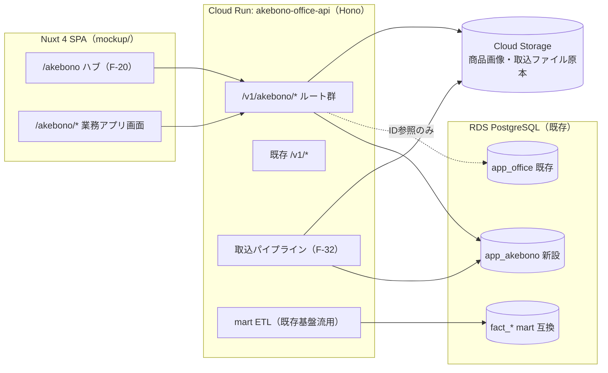
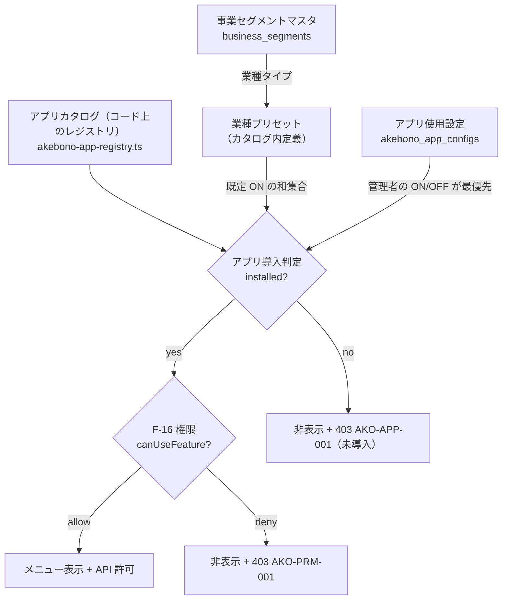
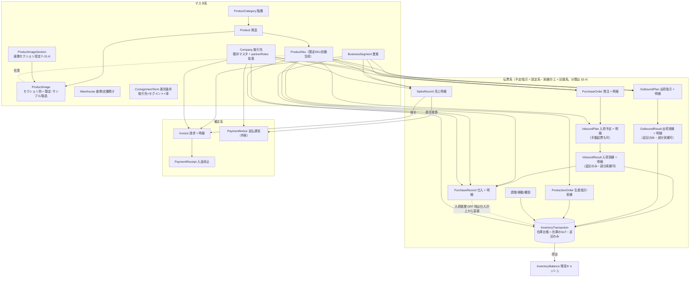
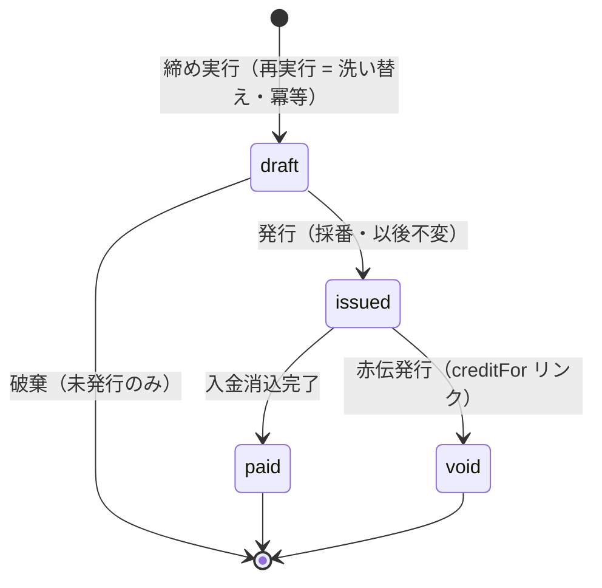
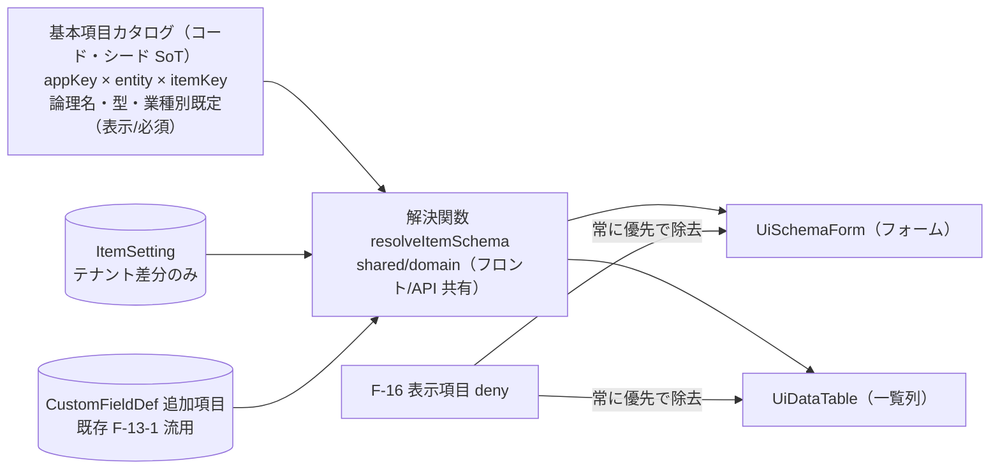
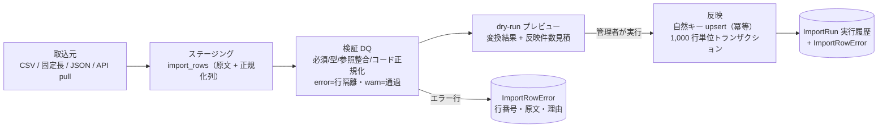
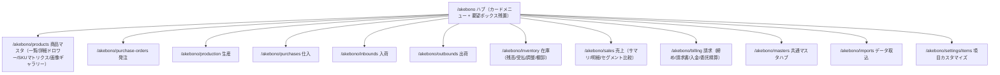

# Phase 5（増分）: Akebonoメニュー 業務アプリ群 基本設計

- **作成日:** 2026-07-20
- **作成ロール:** コーディングエージェント（壁打ちナビゲーター・システム監査官視点で協議のうえ起草）
- **ステータス:** **ドラフト（壁打ち用）**。オペレーター承認前・実装未着手
- **要件:** `../phase3/akebono-menu-functional-requirements.md`（F-20〜F-33）
- **SoT 宣言:** 本書は Akebonoメニュー（業務アプリ群）の設計 SoT。既存 `data-design.md` / `api-design.md` / `architecture.md` / `screen-design.md`（オフィス系機能の SoT）は変更せず、承認後に相互参照を追記する。akebono-scm-platform `docs/platform-design/`（プラットフォーム統合設計）と将来整合させるべき点は各節に「PF 整合」として明記する
- **未決事項:** `../phase3/akebono-menu-discussion-points.md` に集約（本文では #n で参照）
- **改訂:** 2026-07-20 壁打ち第 1 巡のオペレーター決定（同ファイル冒頭の決定記録 #1〜#14）を反映。主な設計変更 = 画像セクションの設定化（#10）・tenant_id の v1 先行導入（#11）・委託精算方向の確定（#5）

---

## 1. アーキテクチャ方針

### 1.1 技術スタック評価（要件「最もコスト対パフォーマンスが高いものを採択」への回答）

業務データストアの候補比較:

| 観点 | ① PostgreSQL（既存 RDS に同居）★推奨 | ② Firestore | ③ 新規 DB インスタンス |
|---|---|---|---|
| 追加インフラコスト | **ゼロ**（既存 RDS・Cloud Run・CI/CD をそのまま使う） | 読書き課金が明細データ量に比例。集計クエリごとに読み取り課金 | RDS 1 台分の固定費増 |
| トランザクション整合 | 在庫台帳・請求締め・赤黒訂正に必要な**複数行 ACID・行ロック・一意制約が素で使える** | クロスドキュメント整合はアプリ層負担。冪等 upsert 制約（複合一意）が弱い | ①と同等 |
| 集計・分析 | SQL 集計 + 既存 mart ETL（fact_sales / mart_load_runs）へ**同一 DB 内で直結** | 集計は都度全読み or 二重管理の集計ドキュメントが必要 | ETL がクロス DB になる |
| 兄弟リポジトリとの整合 | **4 リポジトリ全部が業務 SoT = PostgreSQL**。scm-platform 既決「Firestore は Config-Store 限定・SoT にしない」（AKB-DOC-13） | 既決に反する | スキーマ設計は流用可 |
| 運用 | 既存マイグレーション機構（起動時自動適用・advisory lock）を流用 | セキュリティルール・インデックス管理が別系統で増える | 運用対象が 2 系統に |

**採択: ① PostgreSQL（既存 RDS 同居）**（**決定 #1・2026-07-20 オペレーター承認**）。Firestore は既存方針どおり利用しない（本アプリでは Config 用途も configs テーブルで足りている）。

### 1.2 スキーマ配置

**決定（#1・2026-07-20）: 同一 DB 内に新スキーマ `app_akebono` を新設**。

- 理由: ① オフィス系（勤怠・日報 = C3 労務データ）と商流系（C2 取引データ)の論理境界が明確になる ② scm-platform の「サービス別スキーマ分割」（app_retail/app_maker/app_wms + 検討中の app_office）と相似形になり、**将来プラットフォームへ移送する単位がスキーマごと切り出せる** ③ バックアップ・権限・監査の粒度を分けられる
- 規約: **スキーマ横断の物理 FK は張らない**（scm-platform 既決）。`members` / `companies` / `configs` 等 app_office 側への参照は ID 参照 + アプリ層整合（既存の論理参照パターンと同じ）
- マイグレーションは既存機構（`api/db/migrations/` ファイル名昇順 + schema_migrations + 起動時自動適用）をそのまま使い、`CREATE SCHEMA IF NOT EXISTS app_akebono` から始める

### 1.3 全体構成（既存に対する増分）

- フロント/バック分担は既存方針を踏襲: **重い処理（在庫導出・締め・取込・ETL・集計）はサーバー**、フロントは表示射影と入力
- 共有ドメイン層 `shared/domain/` に在庫残高計算・請求締め計算・会計年度（既存 fiscal）等の純粋関数を置き、フロントのプレビュー計算と API の確定計算を一致させる（既存パターン）
- 商品画像・取込ファイル原本は Cloud Storage（既存 documents の STORAGE_BUCKET 方式 + DB bytea フォールバック・署名 URL 配信を流用 = 原則 3）

### 1.4 モックアップ先行

Phase 5 の反復（I/F 設計 ⇄ プロトタイプ）は既存と同じくモックアップ先行とする。`useMockDb` の新コレクション + 決定的シード（自社の陶磁器/SI データを模したデモ）で全画面を操作可能にし、承認後にバッチ移行（デュアルモード）で API 接続する。既存の「モック → API ハイドレーションキャッシュ」機構は**一覧が全件前提**のため、Akebonoメニューでは**ページング対応キャッシュ（期間・フィルタキー単位）**を新設する（XA-6。勤怠のキー単位キャッシュ方式を一般化）。

---

## 2. メニュー・アプリ基盤設計（F-20）

### 2.1 メニュー解決の流れ

- **判定は 2 段**: ① テナント導入状態（`akebono_app_configs`。scm-platform の `tenant_application` に相当）② 利用者権限（既存 F-16。同 `entitlement`/RBAC に相当）。**新しい権限機構は作らない**
- カタログ（アプリキー・名称・説明・業種プリセット・依存・既定ラベル）は**コード上のレジストリが SoT**（menu-registry.ts と同型）。DB はテナントの選択（ON/OFF・ラベルオーバーライド）だけを持つ → プリセット改訂がデプロイで配れる
- ダッシュボード（F-01-1）には「AKEBONO業務」カテゴリで使用中アプリを表示（F-13-8 のカテゴリカスタマイズに乗る）。nav-map に親（/akebono）・関連（各マスタ・設定）を追加

### 2.2 エンティティ

| エンティティ | 主要属性 | 分類 |
|---|---|---|
| `AkebonoAppConfig` | appKey（レジストリ参照・一意）, enabled, labelOverride?, source(`preset`/`manual`), updatedBy | 設定系（upsert。監査ログ記録） |
| `BusinessSegment` | id, name, industryType(`retail`/`maker`/`logistics`/`it_service`/`other`), displayOrder, active | マスタ系（論理削除。**使用中セグメントの無効化は伝票参照チェックで拒否**） |

プリセット適用（F-20-4）は「現状とプリセットの差分を提示 → 管理者確認 → 適用」のフローで、**確認なしの自動 OFF はしない**（既存設定の保護 = 原則 2）。

---

## 3. データ設計

### 3.1 設計原則（本アプリ群での宣言）

参考リポジトリの既決事項から採用する規約:

1. **PK はサロゲート**（`prefix-UUID` text。既存 api/src/lib/ids.ts 方式）。**自然キー（商品コード等）は UNIQUE 制約に限定し、リレーションに使わない**（warehouse サロゲートキー主義・undeux P1/P2）。マスタの自然キー一意は**部分一意（`WHERE active`）**とし、論理削除済みコードの再利用を許す（復元時に重複があれば警告し復元を拒否） 
2. **データ 3 分類**を各テーブルに宣言: 設定系（更新可 + 論理削除）/ **記録系（追記のみ・訂正は赤黒）** / **確定系（発行後不変・訂正は赤伝リンク）**（scm-platform 既決）
3. **ON DELETE 既定 RESTRICT**。CASCADE は「ヘッダ→明細」の集約子のみ明示（warehouse P10）。SKU など全伝票から参照されるマスタは RESTRICT + 論理削除
4. 区分値は text + CHECK（snake_case）。金額は numeric(12,2)・数量は numeric(12,2)（サービス業の人日 0.5 等に対応）
5. 全トランザクションに `segment_id`（XA-2）。**全 app_akebono テーブルは先頭列に `tenant_id text NOT NULL` を持つ（決定 #11・2026-07-20。v1 は定数 `akebono`）**。本書のエンティティ表・一意制約の表記では tenant_id を省略しているが、物理定義では全テーブルの先頭列 + 全 UNIQUE/主要索引の先頭に含める（scm-platform「tenant_id 全経路貫通」規約準拠。mart の tenant_key へは境界で変換 = 既存 fact_sales と同じ）。RLS の有効化はマルチテナント化時
6. **伝票番号は接頭辞連番**（PO-0001 / INV-0001 等。既存 WF-xxxx と同型 = 決定 #14）。採番はサーバー一元（tenant_id スコープ）・取消による欠番は許容

### 3.2 エンティティ関係（全体図）

### 3.3 マスタ系エンティティ

| エンティティ | 主要属性 | 一意制約・備考 |
|---|---|---|
| `Product` | id, code, name, segmentId, categoryId?, defaultSupplierCompanyId?, listPrice, standardCost, taxRateId, unitId, billingType(`one_time`/`monthly`/`usage`/null = 物販), variantAxis1Label?, variantAxis2Label?, description, active, custom | UNIQUE(segmentId, code)。billingType は情報サービス向け（F-21-1） |
| `ProductSku` | id, productId, code, janCode?, axis1Value?, axis2Value?, sellPrice?, costPrice?, isDefault(既定 SKU), active | UNIQUE(productId, code)。**汎用 2 軸**（undeux ADR-008）。既定 SKU は productId ごとに 1 件（部分一意） |
| `ProductImage` | id, productId, skuId?, sectionId(画像セクション), displayOrder, filename, mime, sizeBytes, storage(`gcs`/`db`), storagePath, active | 実体は GCS（documents 方式流用）。サムネイル = サムネイル優先セクション（既定 = 製品画像）の displayOrder 先頭 → 無ければ他セクション先頭（セクションバッジで明示）。アーカイブ = 論理削除（原則 9.5） |
| `ProductImageSection`（F-21-6・決定 #10） | id, name, isThumbnailPriority(サムネイル優先), isSeed(既定シード = 削除不可・名称変更可), displayOrder, active | **商品マスタのオプション設定**（画像の区分を固定 2 区分にせず設定化 = 決定 #10・2026-07-20）。既定シード = `製品画像`（サムネイル優先）・`サンプル画像`。追加・名称変更・並び替え・無効化可（例: 着用画像・詳細画像）。**サムネイル優先は常に 1 件のみ**（部分一意 `WHERE isThumbnailPriority AND active`。ProductSku.isDefault と同パターン）。**画像が紐付くセクションの無効化は参照チェックで拒否** |
| `ProductCategory` | id, name, parentId?, displayOrder, active | 自己参照階層（部署マスタと同パターン・循環禁止） |
| `Warehouse` | id, name, kind(`own`/`store_deposit`/`external`), companyId?(store_deposit の店舗), displayOrder, active | 店舗預け在庫は「店舗 = 倉庫」として表現（F-26-2） |
| `VariantAxisTemplate`（F-30-8） | id, name, axis1Label, axis2Label, industryTypes[], displayOrder, active | 業種タイプ別の軸ラベルの組（カラー×サイズ / 容量×味 等）。**初期値はコード上のカタログシード**（migration 投入・冪等）+ 汎用マスタとして編集可。商品登録時の軸ラベル入力の候補を供給する（テンプレートは候補であり強制ではない） |
| `Unit` / `TaxRate` / `PaymentTerm` | 名称・率・締め/サイト等 | TaxRate は適用開始日で履歴保持（税率改定に耐える） |
| `ConsignmentTerm` | id, companyId, segmentId, marginRate, direction(`bill_store_margin`), validFrom, active | 履歴保持（validFrom）。**精算方向は決定 #5（2026-07-20）で確定**: 店舗が売上金を保有 → 当社は店舗へ当社取り分（マージン）を請求 → 当社から作家へ支払（値域は現状 `bill_store_margin` のみ。将来別方式が必要になれば値を追加）。**作家支払額の算定式（売上連動率 or 仕入単価 × 販売数）は付帯確認 = 委託精算実装前に確定** |
| `Company`（既存拡張） | **追加列のみ**: partnerRoles text, paymentTermId?, billingTermId? | 既存の顧客データ（kind='customer'）は `partnerRoles=['customer']` の更新パッチ（原則 7。§9.3） |
| `AkebonoAppConfig` / `BusinessSegment` | §2.2 | |
| `ItemSetting`（F-31） | id, appKey, entity, itemKey, formVisible?, formRequired?, listVisible?, displayOrder?, labelOverride? | **差分のみ保存**（未設定 = カタログ既定 = 下位互換）。カタログ（基本項目セット + 業種別既定）はコード上のシードが SoT（scm-platform ADR-039 の app_managed_item + tenant_app_item を単一テナント向けに簡約） |
| `ImportSource` / `ImportMapping` / `FixedLayout` | §5 | |

追加項目は既存 `CustomFieldDef`（F-13-1）の entity 値域に akebono エンティティを追加して流用する（新機構なし = 原則 3）。

### 3.4 記録系・確定系エンティティ

| エンティティ | 主要属性 | 分類・冪等キー |
|---|---|---|
| `PurchaseOrder` + `PurchaseOrderLine` | 番号, companyId, segmentId, status(`draft`/`ordered`/`partially_received`/`closed`/`canceled`), orderDate, dueDate / 明細: skuId, qty, unitPrice, receivedQty(導出) | ヘッダ→明細 CASCADE。確定後の明細変更は改訂履歴 |
| `ProductionOrder` + `ProductionResult` | 指示: skuId, qty, dueDate, status(`draft`/`instructed`/`in_progress`/`completed`/`canceled`) / 実績: completedQty, defectQty, completedAt | 実績は記録系（追記のみ）。完成 → InventoryTransaction(+) |
| `InboundPlan` + `InboundPlanLine` | 発注参照（poId?）or 手動起票, warehouseId, dueDate, status(`pending`/`partial`/`completed`/`canceled`) / 明細: skuId, qty | 設定系（予定は編集可・完了/取消で確定）。F-27-5 論理在庫（+）の導出元 |
| `InboundResult` + `InboundResultLine` | planId?, warehouseId, receivedAt / 明細: planLineId?, skuId, qty(検品数) | **記録系・追記のみ。部分実績を複数回登録可**（warehouse inbound_results 同型）。明細行ごとに InventoryTransaction(+) を生成。**取込は commitToken で二重防止** |
| `PurchaseRecord` + 明細 | companyId, segmentId, purchaseDate, purchaseType(`outright` 買取/`consignment` 委託), inboundResultId? / 明細: skuId, qty, costPrice | 記録系・訂正は赤黒。委託は F-29-4 の精算対象。**入荷管理 OFF の場合は仕入明細行から直接 InventoryTransaction(+) を生成** |
| `OutboundPlan` + `OutboundPlanLine` | companyId(出荷先), warehouseId(出荷元), segmentId, dueDate, status(`pending`/`partial`/`completed`/`canceled`) / 明細: skuId, qty | 設定系（指示）。取消は赤伝フラグ。F-27-5 論理在庫（−）の導出元。**単独 DELETE 禁止**（warehouse 既決を踏襲・取消はステータスで表現） |
| `OutboundResult` + `OutboundResultLine` | planId?, warehouseId?(plan 無しの直接登録時は必須), companyId?(同・出荷先), shippedAt / 明細: planLineId?, skuId, qty | **記録系・追記のみ。部分実績を複数回登録可**。指示参照 or 直接登録の両対応（入荷側と対称 = REQ F-26-2）。明細行ごとに InventoryTransaction(−) を生成。店舗納品は store_deposit 倉庫への transfer_in/out の対を同一トランザクションで生成 |
| `InventoryTransaction` | id, skuId, warehouseId, qty(±), kind(`inbound`/`outbound`/`purchase_in`/`adjust`/`transfer_in`/`transfer_out`/`production_in`/`stocktake`), reason?, refType/refLineId(発生元の**明細行**), occurredAt | **在庫の SoT・追記のみ**（warehouse 実証方式）。冪等キーは **UNIQUE(refType, refLineId, kind)** = 発生元明細行 1 行につき台帳 1 行（同一伝票内の同一 SKU 複数行・部分実績の複数回確定と両立）。**refLineId の値域は実績側の行 id のみ**（InboundResultLine / OutboundResultLine / PurchaseRecord 明細 / ProductionResult / 調整・移動・棚卸行。予定/指示の明細は指さない = 台帳を生成するのは実績だけ） |
| `InventoryBalance` | skuId, warehouseId, qty, asOf | **導出キャッシュ**（SoT は台帳）。伝票確定時に差分更新 + `POST /recompute` の全再計算（手動回復パス = 原則 6） |
| `SalesRecord` | id, salesDate, companyId(得意先), segmentId, skuId, qty, unitPrice, amount, costPrice?, channel?, billingType?, sourceKind(`manual`/`shipment`/`import`/`monthly_bulk`), sourceRef?, invoiceId?(請求済みリンク), correctionOf?(赤黒元) | **売上の SoT（明細）**・記録系・訂正は赤黒。月次集約はサーバー導出。取込冪等キーは ImportRun 単位の commitToken + 行ハッシュ。**monthly_bulk の再登録（同一 月 × 得意先 × セグメント）はサーバーが旧有効行との差分を赤黒で自動計上**（集計結果は upsert と同値 = 互換 API の冪等性を維持しつつ台帳は追記のみ） |
| `Invoice` + `InvoiceLine` | 番号, companyId, segmentId?(null = 複数セグメント合算。明細行はセグメント保持), periodFrom/To, invoiceType(`sales` 通常/`consignment_margin` 委託マージン), status(`draft`/`issued`/`paid`/`void`), issuedAt, totalAmount, creditFor?(赤伝元) | **確定系**: draft は洗い替え再生成可（冪等）・**issued 以降は不変**・訂正は赤伝（undeux DB-07 準拠）。締めの二重生成防止は**部分一意 UNIQUE(companyId, invoiceType, periodFrom, COALESCE(segmentId,'ALL')) WHERE status='draft'**（draft は同時に 1 世代のみ。**issued/void/赤伝/再発行は一意制約の対象外**なので赤伝 → 再発行のフローと両立する） |
| `PaymentNotice` + 明細 | companyId(作家), segmentId, period, 対象 SalesRecord 明細, marginRate スナップショット, payableAmount, status(`draft`/`confirmed`/`paid`) | 確定系。委託条件は**発行時点の率をスナップショット**（後の率改定に影響されない） |
| `PaymentReceipt` | invoiceId, receivedAt, amount, method | 記録系（入金消込・部分入金可） |
| `ImportRun` / `ImportRowError` | §5 | 記録系 |

### 3.5 ステータス遷移（代表: 請求）

伝票系（発注・出荷）は正順遷移のみ・FOR UPDATE 直列化（既存ワークフロー/インシデントと同じ実装パターン）。

### 3.6 SoT 宣言（開発原則 6 への回答）

| データ | SoT | 導出・キャッシュ | 回復パス |
|---|---|---|---|
| 在庫残高 | `InventoryTransaction`（台帳） | `InventoryBalance` | 全再計算 API（管理者） |
| 月次売上（既存 sales_monthly） | `SalesRecord`（明細）へ**移行後は明細が SoT** | sales_monthly 互換ビュー（F-15 API 互換） | 明細から再集約 |
| 請求金額 | draft 期間中: SalesRecord から都度導出 / **issued 後: Invoice が SoT（不変）** | — | 赤伝 + 再発行 |
| 商品画像実体 | Cloud Storage | ProductImage メタ（DB） | 実体先行 → メタ確定（documents と同順序） |
| マッピング定義 | ImportMapping（版管理・active 版不変） | — | 旧版へ切替 |
| メニュー表示 | レジストリ（コード）+ AkebonoAppConfig | フロントの表示状態 | — |
| mart（fact_*） | 各業務 SoT | 全ファクトが再構築可能 | ETL 再実行（既存 mart_load_runs） |

---

## 4. 項目カスタマイズ設計（F-31）

- 解決順: カタログ既定（業種タイプ別）→ ItemSetting 差分 → CustomFieldDef 追加 → **F-16 deny で最終除去**（権限が常に勝つ = F-31-5）
- 基本項目の「差し引き」= formVisible/listVisible=false（**削除ではない**。データは保持・再表示可能 = ADR-039 同旨）。必須解除は「カタログで必須固定」の項目（コード・数量等の整合必須項目）には適用不可
- API バリデーション: zod スキーマは「カタログ必須固定」だけを強制し、テナント必須はサーバーで ItemSetting を参照して追加検証（画面と API の二重定義を防ぐため resolveItemSchema を共有）
- **PF 整合:** scm-platform ADR-039/040（app_managed_item / tenant_app_item / app_master_def）の単一テナント簡約版。tenant_id は決定 #11 により v1 から全テーブルが保持済みのため、マルチテナント化時は RLS の有効化と実テナント値の運用開始のみで昇格できる

---

## 5. データ取込・連携基盤設計（F-32）

### 5.1 パイプライン

- **原本保全**: アップロードファイルは GCS（documents 方式）に保存し ImportRun から参照（再取込・監査用）
- **冪等**: ImportRun ごとの commitToken + 対象エンティティの自然キー upsert。同一ファイルの再実行は「更新 0 件」に収束する（warehouse の commit + file_hash 方式を簡約）
- **部分成功**: エラー行は隔離し健全行を反映（原則 4）。結果は `applied / skipped / failed` の 3 計数で報告
- 取消（F-32-5): マスタ系 = 反映時に旧値 JSON を ImportRun に保全 → 復元（**取込後に更新された行は復元スキップ + 警告** = updated_at ガードで lost update を防ぐ）。トランザクション系 = 赤黒一括生成。**決定 #9（2026-07-20）で確定**

### 5.2 マッピングメタモデル

| エンティティ | 主要属性 |
|---|---|
| `ImportSource` | id, name, method(`file_csv`/`file_fixed`/`file_json`/`api_pull`), encoding(`utf8`/`sjis`), targetEntity(`product`/`sku`/`company`/`sales_record`/`inventory`/…), apiConfig?(url, authKind, secretRef), schedule?(`manual`/`daily`), active |
| `ImportMapping` | id, sourceId, version, status(`draft`/`active`/`superseded`), fields[{sourceField(列名 or 固定長項目名 or JSON パス), targetItemKey, transforms[]}], createdBy | active 版は不変。改訂は新版作成 → 切替 |
| `FixedLayout` | id, sourceId, fields[{name, start, length, type, trim}] | Shift_JIS はバイト位置で切り出し（warehouse RecordLayout 参考） |
| `ImportRun` | id, sourceId, mappingVersion, fileRef?, startedAt, finishedAt, status(`staged`/`validated`/`applied`/`failed`/`reverted`), counts{staged, applied, skipped, failed}, commitToken, executedBy | 記録系（追記のみ） |
| `ImportRowError` | runId, rowNo, rawText, errorCode, message | 記録系。CSV ダウンロード可 |

変換 transforms の値域（決定論的純関数のみ・v1）: `trim` / `zenhan`(全半角) / `upper`/`lower` / `dateFormat(from,to)` / `numberFormat`(桁区切り除去) / `fixedValue` / `codeLookup(mapTable)` / `concat(fields, sep)` / `split(sep, index)`。コード変換表はマッピング定義内に保持（外部コード → マスタ ID）。

- **AI 候補提示**: 列名・サンプル値から既存 Vertex AI 基盤（api/src/lib/llm.ts）で target 候補を構造化出力 → **人が確定**（自動確定しない。LLM 無効環境は字句類似のヒューリスティック = 既存パターン踏襲）
- **API 接続（v1.5）**: REST pull（Bearer / API キー / Basic）。認証秘匿値は Secret Manager 参照名のみ DB に持つ。push 受信（Webhook）は v2

### 5.3 取込・外部アクセスのセキュリティ（AS 観点）

- **権限:** 取込元定義・マッピング定義・実行・取消はすべて**管理者限定**（機能キー akebono-imports + admin ガード）
- **SSRF 対策:** API pull（F-32-1）と画像 URL 取込（F-21-5）はサーバー側の外部アクセスであるため、① https のみ許可 ② プライベート IP・リンクローカル・メタデータエンドポイントへの解決を拒否 ③ リダイレクトは 3 回まで + 各ホップで再検証 ④ 応答サイズ上限 を実装要件とする
- **シークレット登録の手動ステップ排除（原則 1）:** API 接続のシークレットは既存 `scripts/setup-deploy-secrets.ps1` の拡張（または管理画面からの登録 API → Secret Manager 書込）で完結させ、コンソール手作業を標準手順にしない
- **原本・エラー行の扱い:** 取込原本とエラー行原文は業務データと同じ機密度（C2 相当）で扱い、参照は管理者限定。保持期間は 1 年（決定 #14・2026-07-20。超過分は自動削除 or アーカイブ）

---

## 6. API 設計

### 6.1 リソース一覧（`/v1/akebono/*`）

| リソース | エンドポイント（代表） | 備考 |
|---|---|---|
| アプリ設定 | `GET/PUT /v1/akebono/apps`・`POST /apps/apply-preset` | 管理者。preset 適用は差分提示 → 確定の 2 段 |
| セグメント・各マスタ | 既存汎用マスタ機構 `/v1/masters/{entity}` に追加登録 | business-segments / warehouses / units / tax-rates / payment-terms / consignment-terms / variant-axis-templates / product-categories / product-image-sections（原則 3: マスタ CRUD は registry 追加のみ）。**例外規約: akebono 系マスタは機能ガード（F-16）の対象に含める**（既存の「/v1/masters はデータ面のためガード対象外」の例外。consignment-terms 等の C2 取引条件を機能 deny 利用者が参照できる穴を塞ぐ。registry にエンティティ → 機能キーの対応を持たせ middleware で判定。対応例: consignment-terms / payment-terms → `akebono-billing`、warehouses → `akebono-inventory`、business-segments / units / tax-rates / variant-axis-templates / product-categories / product-image-sections → `akebono-products`） |
| 商品 | `GET/POST/PATCH /v1/akebono/products`・`/products/:id/skus`（一括 upsert = マトリクス保存）・`/products/:id/images`（base64・並び替え・セクション変更・archive/restore） | 一覧は **必須ページング**（page/size + フィルタ）。PATCH は部分更新（Object.hasOwn フィルタ = 既存 Zod v4 対策踏襲）。画像セクション設定は汎用マスタ `product-image-sections`（本表のマスタ行参照） |
| 発注 | `GET/POST /v1/akebono/purchase-orders`・`POST /:id/transition` | 正順状態機械・FOR UPDATE |
| 生産 | `GET/POST /v1/akebono/production-orders`・`POST /:id/results` | 実績追記 |
| 入荷/出荷 | `GET/POST /v1/akebono/inbound-plans`・`POST /inbound-plans/:id/results`・`POST /v1/akebono/inbound-results`（plan 無しの直接登録）・`GET/POST /v1/akebono/outbound-plans`・`POST /outbound-plans/:id/results`・`POST /v1/akebono/outbound-results`（同・直接登録）・`POST /:id/transition` | 予定/指示（設定系）と実績（追記のみ）を分離。実績登録で在庫台帳へ（同一トランザクション内・明細行単位の冪等キー） |
| 在庫 | `GET /v1/akebono/inventory/balances`・`/transactions`・`POST /adjustments`・`/transfers`・`/stocktakes`・`POST /inventory/recompute` | recompute = 手動回復パス（管理者） |
| 売上 | `GET/POST /v1/akebono/sales-records`・`POST /sales-records/corrections`（赤黒）・`GET /v1/akebono/sales/summary`（セグメント別集計） | **既存 `GET/POST /v1/sales` は互換維持**（内部で明細/月次一括へ委譲）。フロント移管完了後に deprecation |
| 請求 | `POST /v1/akebono/billing/close`（締め・冪等）・`GET/POST /invoices`・`POST /invoices/:id/issue`・`/void`・`POST /invoices/:id/receipts`・`POST /billing/consignment-close`（委託精算） | issue 以降は金額 API で不変 |
| 取込 | `GET/POST /v1/akebono/imports/sources`・`/mappings`（+ `/suggest` AI 候補）・`POST /imports/runs`（stage→validate→apply の段階 API）・`GET /runs/:id/errors` | 実行は非同期（202 + ポーリング。既存 AI タスクの追跡パターン） |
| 項目設定 | `GET/PUT /v1/akebono/item-settings`・`GET /item-catalog` | カタログは読み取り専用 |
| ETL | 既存 `POST /v1/sales/etl/run` を拡張 + `POST /jobs/akebono-mart-etl` | 既存 mart_load_runs へ記録 |

規約は既存を踏襲: レスポンス `{data}` / `{error:{code,message}}`、DB snake_case ⇄ API camelCase、変更系は監査ログ（非ブロッキング）、状態遷移は FOR UPDATE。

### 6.2 エラーコード領域の予約

実装時に既存台帳（api-design.md §4）へ起番する。予約領域: `AKO-APP`(アプリ基盤) / `AKO-PRD`(商品・SKU・画像) / `AKO-SEG`(セグメント) / `AKO-POR`(発注) / `AKO-MFG`(生産) / `AKO-PCH`(仕入) / `AKO-INB`(入荷) / `AKO-OUT`(出荷) / `AKO-INV`(在庫) / `AKO-SLS`(売上明細) / `AKO-BIL`(請求・支払) / `AKO-IMP`(取込) / `AKO-FLD`(項目カスタマイズ)。既存 `AKO-SAL` は月次互換 API 用に維持する。**`AKO-SAL`（月次互換）と `AKO-SLS`（明細）は混同しやすいため、台帳起番時に両者の使い分け注記を必ず併記すること。**

### 6.3 I/F 設計 6 視点チェック（宣言）

| 視点 | 回答 |
|---|---|
| 技術スタック制約 | PostgreSQL 前提の一意制約・FOR UPDATE・トランザクションを使用。Firestore 固有機構に依存しない |
| ユースケース | UC-09〜13 の全フローが上記 API で一気通貫（委託精算 = close → invoices/payment-notices、取込 = sources → mappings → runs） |
| ユーザビリティ | SKU マトリクス一括 upsert・締めドラフト洗い替え・dry-run プレビュー等、画面操作単位に API を切る |
| データ設計上の都合 | マスタは既存汎用マスタ機構に載せ、セレクト類は既存 useMasterCrudAsync キャッシュを流用 |
| 型の継承 | shared/domain に akebono 型を追加。SalesRecord ⊃ 既存 SalesMonthly の互換写像を型で表現 |
| データフロー整合 | §3.6 SoT 宣言のとおり一方向（伝票 → 台帳 → 残高 / 明細 → 請求 → mart）。全データフローはモックアップで検証してから API 化 |

---

## 7. 画面設計

### 7.1 サイトマップ（増分）

- 旧 `/sales` は移管完了後 `/akebono/sales` へリダイレクト（ブックマーク互換）
- 使用 = OFF のアプリはハブに表示しない。直接 URL アクセスは「未導入」案内ページ（404 にしない = 導入導線）

### 7.2 画面パターン（既存デザインシステムの適用）

| パターン | 実現方法 |
|---|---|
| 一覧 → 詳細 | UiDataTable（**サーバーページング対応を拡張**: page/total を props 化）+ UiDrawer。モバイルはカード型（mobileMode） |
| 伝票入力 | ヘッダ + 明細行エディタ（新規 widget `LineItemEditor`: SKU オートコンプリート・数量/単価・小計）。UiSchemaForm は F-31 の解決済みスキーマを受ける |
| SKU マトリクス | 新規 widget `SkuMatrix`（縦 = 軸1・横 = 軸2。在庫照会/発注/棚卸で共用）。undeux の SKU マトリクス UI を Vue で再実装 |
| 画像ギャラリー | 新規 widget `ProductImageGallery`（**セクション別グループ表示** = F-21-6 の設定に追随・セクションバッジ・並び替え・主画像指定）。アップロードは documents の実装を流用 |
| 集計 | 既存 charts（Line/Bar/Donut）+ UiKpiCard。セグメント並列比較は KPI 行の横並び + 凡例統一 |
| 取込ウィザード | ステップ UI（アップロード → マッピング → 検証 → プレビュー → 実行）。UiModal + 既存ステージ表示パターン（F-06b-3 の「ステージ → 実行」と同型） |

---

## 8. スタースキーマ接続（F-33）

既存 data-design.md §2 の規約（mart 互換・tenant_key・dim_date_key int・UNIQUE(tenant_key, source_txn_id)・予約メンバー 0/-1/-2・fiscal 非正規化・load_run_id）を全面踏襲する。

| ファクト/ディメンション | グレイン・型 | 対応 SoT | 段階 |
|---|---|---|---|
| `fact_sales`（既存） | 現行: 月 × 顧客 × projectType | sales_monthly 互換ビュー | 移行期維持 |
| `fact_sales_line`（新設） | 売上明細 1 行（日 × 得意先 × SKU × セグメント） | SalesRecord | v1 |
| `fact_inventory_snapshot` | 日 × SKU × 倉庫（**半加法**: 時間軸 SUM 禁止を metric 定義で宣言） | InventoryBalance（日次スナップ） | v1 |
| `fact_purchase` | 仕入明細 1 行 | PurchaseRecord | v1.5 |
| `fact_billing` | 請求明細 1 行（invoiceType で通常/委託を区分） | Invoice / PaymentNotice | v1.5 |
| `dim_product` / `dim_sku` | SCD1（初期）。variant 2 軸列を保持 | Product / ProductSku | v1 |
| `dim_segment` | SCD1 | BusinessSegment | v1 |
| `dim_party`（既存流用） | 取引先 | Company | v1 |

- ETL は既存基盤（手動 + Cloud Scheduler 日次・mart_load_runs）に載せる。**業務 SoT → mart の一方向・逆流禁止**
- **PF 整合:** scm-platform AKB-DOC-16 の fact_sales / fact_inventory_snapshot / fact_billing と同名・同グレインに揃え、将来 mart 本体接続時にテーブル移送 + ETL 先切替のみで済む形（既存 fact_sales と同じ移行戦略）

---

## 9. 既存機能の移管・下位互換（開発原則 7 への回答）

### 9.1 F-15 売上管理 → F-28

| 項目 | 方針 |
|---|---|
| 画面 | `/sales` → `/akebono/sales`。移管後の `/sales` はリダイレクト。nav-map・menu-registry・F-13-8 既定カテゴリを同時更新（原則 5: functional-requirements.md 本体・screen-design.md の該当記述も改訂） |
| データ | `sales_monthly` は**当面 SoT のまま**とし、F-28-2 リリース時に「月次一括明細（sourceKind=monthly_bulk）」へ移行パッチで写像。以後は明細が SoT・sales_monthly は互換ビュー。**id の連続性:** 移行パッチで写像した行は**旧 sales_monthly.id を sourceRef に保持し、互換ビューはそれを行 id として返す**（既存 fact_sales の `UNIQUE(tenant_key, source_txn_id)` に対して同一論理行が別 id で二重ロードされない）。移行後の新規行のみ決定式 `sm-<month>-<companyId>-<segmentId>` で採番する |
| projectType → セグメント | 既存 5 値（biz_consulting/sys_consulting/development/operation/internal）を初期セグメントとしてシードし、実績データの segment_id を写像するデータ更新パッチを提供（**パッチ内容と手順は移行時にオペレーターへ提示** = 原則 7） |
| API | `GET/POST /v1/sales` は互換維持（内部委譲。monthly_bulk の赤黒自動計上 = §3.4 により再送冪等性も維持）。**互換 GET が返すのは projectType 写像表にあるセグメント分のみ**: 新設セグメント（陶磁器委託販売等）は旧 5 値へ逆写像できないため互換応答に含まれない。この期間差異を作らないため、**新セグメントの計上開始はフロント移管（/akebono/sales 切替）と同一バッチで行う**。ETL（fact_sales）は既存キーのまま継続し、fact_sales_line を追加 |
| 週次インサイト・チャットボット | 売上文脈の参照元を段階切替（両参照期間を設けない: 切替バッチで一括） |

### 9.2 既存機能への影響一覧

| 影響先 | 内容 |
|---|---|
| Company マスタ（F-10-4） | partnerRoles 追加（追加列のみ・既存画面は無変更で動作）。顧客画面に「取引ロール」表示を追加 |
| F-16 権限 | 機能キー・表示項目（原価等）の追加。既定 deny の運用デフォルト増分（冪等シード） |
| F-16 機能キー 'sales' | **改称せず継続使用**。週次インサイトの売上マスク（F-06-10）・運用デフォルト（F-16-4）が 'sales' を参照しており、キー変更は既存ルールを壊す（下位互換）。akebono 系機能は新キー（akebono-products / akebono-billing 等）を追加し、売上管理の画面移管後も権限キーは 'sales' のまま |
| F-13-1 カスタム項目 | entity 値域の拡張のみ |
| ダッシュボード/nav-map/menu-registry | 「AKEBONO業務」カテゴリ追加 |
| F-02 意思決定支援 | 売上参照を F-28 集計 API へ切替（判断テーマの KPI 参照） |
| 影響なし | 勤怠・日報・シフト・ワークフロー・AI カンパニー等のオフィス系ドメイン（スキーマ分離により波及なし） |

### 9.3 データ更新パッチ（承認後に生成するもの）

1. Company.partnerRoles 初期値パッチ（**対象は kind='customer' のみ** = `['customer']`。自社（kind='self'）には付与しない）
2. BusinessSegment 初期シード（projectType 5 値 + 陶磁器委託販売）と sales_monthly.segment_id 写像
3. F-16 運用デフォルト増分（既存ルールがある環境へは投入しない = 冪等・状態保護）: 機能 deny（member = akebono-billing / akebono-purchases / akebono-imports）に加え、**表示項目 deny（member = Product.standardCost・ProductSku.costPrice・ConsignmentTerm.marginRate）**を含める（C2 取引条件の既定秘匿 = 要件 §6.3） 

---

## 10. リスクと対応

| # | リスク | 対応 |
|---|---|---|
| 1 | スコープ肥大（9 アプリ + 基盤 3 種を一括実装すると Phase 5 反復が回らない） | §8 段階分け（要件 §8）どおり v1 を絞り、モックアップで全体像 → 実装はバッチ分割（既存の段階移行実績パターン） |
| 2 | 委託精算の金銭フロー誤解釈（マージン請求の向き・作家支払額の定義） | 精算方向は決定 #5（2026-07-20）で確定・反映済み。**残る付帯確認（作家支払額の算定式・委託仕入の債務確定・消費税）を委託精算の実装前に確定**。精算式は ConsignmentTerm に閉じ込め、伝票生成ロジックを差し替え可能にする |
| 3 | 一覧の全件ハイドレーション踏襲による性能劣化 | XA-6 サーバーページングを基盤段階で導入（後付けは全画面改修になるため先行必須） |
| 4 | 既存 sales_monthly 利用箇所（インサイト・チャットボット・ETL）の移行漏れ | 移行バッチ時に `sales_monthly` / `useSales` 参照を grep 全件確認（Push 前チェック #6）し、片側切替を作らない |
| 5 | 取込の誤反映によるマスタ汚損 | dry-run 必須 UI・旧値スナップショット・エラー行隔離。トランザクション系は赤黒でしか取り消さない（巻き戻し禁止 = 原則 2） |
| 6 | scm-platform 統合設計との将来乖離 | 「PF 整合」注記の項目（アプリカタログ・項目カスタマイズ・mart 名/グレイン・取込メタモデル）は命名・構造を合わせ、乖離が必要な場合は本書に設計判断として記録 |
| 7 | 画像・取込ファイルのストレージコスト | 画像 5MB × 20 枚/商品の上限・取込原本の保持期間 1 年（決定 #14・2026-07-20）で制御 |

## 11. 受け入れ基準（Phase 5 ゲートへ向けて）

- [x] discussion-points の全論点がオペレーター判断済み（第 1 巡・2026-07-20 完了。**残 = #5 付帯確認 3 点を委託精算実装前に確定**）
- [ ] サイトマップ・画面定義・I/F 6 視点チェック済み（§6.3 は宣言。モックアップ検証で確定）
- [ ] データ設計が正規化原則・データ 3 分類・SoT 宣言（§3.6）を満たす
- [ ] モックアップがダミーデータ（陶磁器 + SI/SaaS の自社シナリオ）で UC-09〜13 を一気通貫で操作できる
- [ ] 全データフロー（伝票 → 在庫 → 売上 → 請求 → mart）が I/F レベルで矛盾なく通る

## 12. 未決事項

`../phase3/akebono-menu-discussion-points.md` に 14 論点を集約し、**壁打ち第 1 巡（2026-07-20）で全論点に決定が出た**（決定記録は同ファイル冒頭）。残る未決は **#5 の付帯確認 3 点**（作家支払額の算定式・委託仕入の債務確定タイミング・消費税の扱い）のみで、委託精算（F-29-4）の実装着手前に確定する。
