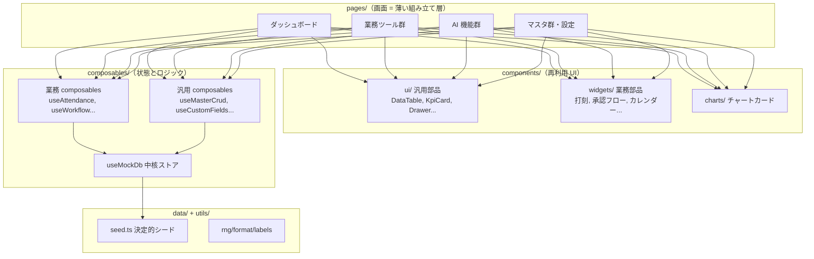

# Phase 5: アーキテクチャ設計

- **作成日:** 2026-07-15（更新: 2026-07-17）
- **作成ロール:** コーディングエージェント（ナビゲーター協議済み）
- **対象:** `mockup/`（Nuxt 4 SPA モックアップ）
- **本番構成:** API（Cloud Run）+ RDS PostgreSQL の本実装アーキテクチャは `phase7/production-architecture.md` が SoT。
  ドメイン型・勤怠計算・JST ユーティリティは repo 直下 `shared/domain/` へ移設し、フロント（本書の対象）と
  API サービス（`api/`）で共有する（mockup 側の `types/domain.ts` / `utils/attendance-calc.ts` は再エクスポートのシム）

## 1. 全体構成



設計原則:

1. **pages は薄く**: 画面はコンポーネントと composables の組み立てに徹する。ロジックを page に書かない
2. **composables が I/F 境界**: 将来 API 実装に差し替えるのは composables 層のみ（phase5/api-design.md）
3. **表示射影は純粋関数**: 集計・判定（36 協定、有給残数、承認経路解決等）は `utils/` の Vue 非依存関数とし、単体テスト対象にする（undeux `regression.ts` / `executiveSummary.ts` 方式）
4. **SoT → キャッシュの一方向**: `useMockDb` のコレクションが SoT。派生値（残数・集計・バッジ数）は computed で導出し、二重管理しない

## 2. ディレクトリ構成

```
mockup/
├── app/
│   ├── app.vue                  # NuxtLayout + NuxtPage
│   ├── assets/css/main.css      # デザイントークン + 共通クラス（唯一の CSS SoT）
│   ├── layouts/default.vue      # AppShell（ヘッダー + モバイル下部ナビ。PC サイドメニューなし・カードメニュー起点）
│   ├── pages/                   # 画面（screen-design.md のサイトマップと 1:1）
│   ├── components/
│   │   ├── ui/                  # 汎用 UI（接頭辞 Ui）
│   │   ├── widgets/             # 業務ウィジェット（ダッシュボード・打刻等）
│   │   ├── charts/              # Chart.js ラッパーカード
│   │   ├── office/              # AIネイティブカンパニー（アイソメトリック等）
│   │   └── masters/             # マスタ共通（汎用 CRUD 画面部品）
│   ├── composables/             # useXxx（api-design.md が I/F 契約）
│   ├── utils/                   # 純粋関数（rng/format/labels/attendance-calc/approval-route 等）
│   ├── types/                   # ドメイン型定義（data-design.md と 1:1）
│   ├── data/                    # 決定的シードデータ
│   └── plugins/chart.client.ts  # Chart.js 登録
├── nuxt.config.ts               # ssr:false, hashMode
├── package.json
├── tsconfig.json
└── README.md                    # 起動方法・デモガイド
```

## 3. 再利用コンポーネント一覧（components/ui — 他社展開の共通部品）

| コンポーネント | Props（主要） | 責務 |
|---|---|---|
| `UiDataTable` | `columns, rows, rowKey, maxHeight, mobileMode('card'\|'scroll'), empty` + `#cell-*` slot | 一覧表示の唯一の実装。PC=高密度テーブル / モバイル=カード型自動変換。ソート・簡易フィルタ |
| `UiKpiCard` | `label, value, sub, delta, tone, icon, to` | KPI 表示。クリック遷移対応 |
| `UiDrawer` | `open, title, width` + slots | 一覧→詳細の標準パターン（右ドロワー） |
| `UiModal` | `open, title` + slots | 確認・フォームダイアログ。フォーカストラップ |
| `UiConfirm` | （useConfirm 経由） | 破壊的操作の確認 |
| `UiStatusBadge` | `tone(ok/warn/serious/crit/info/neutral), label` | 状態表示の統一 |
| `UiTabBar` | `tabs, modelValue` | WAI-ARIA 準拠タブ |
| `UiFilterBar` | slots | 一覧上部のフィルタ行 |
| `UiFormField` | `label, required, error, hint` | フォーム項目ラッパー |
| `UiSchemaForm` | `fields(FieldDef[]), modelValue` | **スキーマ駆動フォーム**。カスタム項目（F-13-1）を動的レンダリング |
| `UiCardMenu` | `items(MenuCard[])` | カード型メニュー（ダッシュボード・支援ツールハブ共用。外部リンク/内部/バッジ対応） |
| `UiPageHeader` | `title, description` + `#actions` | ページ見出しの統一 |
| `UiEmptyState` | `icon, title, hint` + `#action` | 空状態の統一 |
| `UiToastHost` | （useToast 経由） | 操作フィードバック。`aria-live` |
| `UiSearchInput` / `UiSelect` / `UiChipSelect` | 標準入力群 | 汎用区分マスタ（F-13-2）参照対応 |
| `UiAvatar` | `name, kind(human/ai), size` | メンバー/AI社員の表示統一 |
| `UiSectionCard` | `title, description` + slots | セクション枠 |

widgets（業務部品・組み合わせ自由）: `PunchClock`（打刻 = タイムカード。flat プロパティでヘッダーモーダル内でも使用）、`ApprovalFlow`（承認経路の可視化）、`ApprovalActionBar`（承認/却下/差戻し）、`CalendarMonth`（月次カレンダー）、`WeekGrid`（週別グリッド: 勤怠・シフト共用）、`CommentThread`（コメント+リアクション）、`NotificationList`、`EscalationCard`、`UptimeBar`（90 日稼働率）、`RelationGraph`（顧客関係グラフ）、`KnowledgeCard`、`CalendarConnectGate`（Google カレンダー連携ゲート: 擬似 OAuth 同意フロー + 連携状態バー）。masters 配下に `DeptOrgNode`（組織図の再帰ノード）。

charts: `LineChartCard` / `BarChartCard` / `DonutChartCard`（Chart.js。undeux パターン）。

office: `IsometricOffice`（アイソメトリック空間）、`AiEmployeeCard`、`AiTaskBoard`、`ActivityTimeline`。

## 4. composables 一覧（責務と依存）

| composable | 責務 |
|---|---|
| `useMockDb` | 中核ストア。全コレクションの初期化（シード）・localStorage 差分永続・リセット。`collection<T>(name)` で型付きアクセス |
| `useCurrentUser` | 擬似ログイン（デモ用ユーザー切替、権限判定 `isAdmin` 等） |
| `useMasterCrud<T>` | 汎用マスタ CRUD（検索・追加・更新・無効化・監査ログ記録）。全マスタ画面が共用 |
| `useCustomFields` | エンティティ別カスタム項目定義の管理と値の読み書き（F-13-1） |
| `useCodeMaster` | 汎用区分マスタの参照・管理（F-13-2） |
| `useAttendance` | 打刻・日次/週次/月次集計・36 協定アラート・修正申請 |
| `useLeave` | 休暇種別別の付与・残数・申請・年 5 日義務判定・手動/一括付与（管理者/人事。F-04-5/9） |
| `useDepartments` | 部署の参照・組織図ツリー導出・所属メンバー解決（F-10-9。CRUD は useMasterCrud） |
| `useTaskPlans` | タスク計画・AI レビューコメント・振り返り記録・管理者インサイト（F-14） |
| `useShifts` | 募集期間・希望・割当・確定・バリデーション |
| `useReports` | 日報/週報 CRUD・提出状況・コメント・AI 報告の合流 |
| `useCalendar` | Google カレンダー連携（擬似 OAuth・べき等同期・タスク追加/反映/削除。F-06-8） |
| `useReportAssist` | 日報 AI アシスト（入力方式設定・ヒアリング・ぽいぽいメモ・ドラフト生成。F-06-7） |
| `useWorkflow` | 稟議 CRUD・承認経路解決・承認操作・代理設定 |
| `useAiCompany` | AI 社員・ロール・タスク・活動ログ・日次報告生成 |
| `useDecision` | 判断テーマ・オントロジー・シナリオ・判断ログ |
| `useNotifications` | 通知の発行・既読・バッジ数 |
| `useEscalations` | シグナル検知・起票・管理者アクション・ナレッジ還流 |
| `useSystemStatus` | 提供システム状態・インシデント・稼働率（デュアルモード: API モードは `/v1/status` = service_incidents が SoT・uptime はサーバー導出。バッチ6c） |
| `useSales` | 売上サマリ・実績登録（デュアルモード: API モードは `/v1/sales` = sales_monthly が SoT。バッチ6b） |
| `useAkebono` | AKEBONO 要望ボックス（デュアルモード: API モードは `/v1/akebono/wishes` = akebono_wishes が SoT・追記のみ。バッチ6d） |
| `useChatbot` | セッション管理（デュアルモード: API モードは `/v1/chatbot` = chat_sessions / chat_messages が SoT・LLM 一次応答 + マルチターン。バッチ5b）・フォールバックのシナリオベース応答（2 段ルーティング = 今回の質問 → 直近のユーザー発言で再判定）・出典解決・擬似ストリーミング・表示中セッションの sessionStorage タブ内永続 + リロード自動再開（2026-07-18 改善） |
| `useBusinessDay` | 営業日・祝日の参照（翌営業日 = メンバーの勤怠ルールの営業曜日 + 祝日マスタで解決・祝日名のカレンダー表示。計算本体は shared/domain/business-day を API と共有。オペレーター報告 2026-07-18 #4） |
| `useDocuments` | ドキュメントツリー・タグ・検索 |
| `useToast` / `useConfirm` | UI フィードバック |
| `useAppSettings` | 外部リンク・機能トグル・各種ルール設定・汎用設定（`appConfigs` の getConfig/setConfig）・デモリセット |

## 5. 横断設計ルール

1. **決定的シード**: `utils/rng.ts`（hash ベース）以外で乱数を使わない。`new Date()` は「現在時刻」用途のみ（シード生成には固定基準日を使用）
2. **エンティティは論理削除**（`active`/`archived`）。記録系（打刻・承認ログ・活動ログ）は不変・追記のみ
3. **通知・エスカレーション・還流は非ブロッキング**: 主操作の成功後に発火し、失敗しても主操作は成立（開発原則 4）
4. **ID 採番**: `{prefix}-{連番}`（例 `WF-0007`）。useMockDb が採番を一元管理
5. **アクセシビリティ**: フォーカス可視・`aria-live` トースト・タブ/モーダルのキーボード操作は ui コンポーネント側で実装し、画面側の負担をゼロにする
6. **命名**: コンポーネント PascalCase（ディレクトリ接頭辞）、composables `useXxx`、型は `types/` に集約
