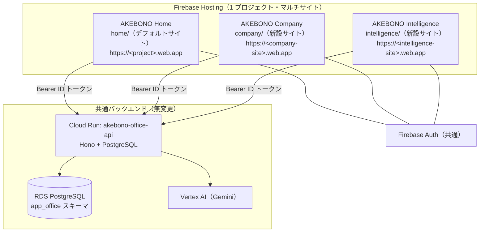
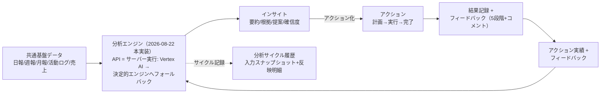

# AKEBONO Company / AKEBONO Intelligence 基本設計

> **作成日:** 2026-08-20（最終更新 2026-08-22）
> **SoT:** 新設 2 アプリの構成・データフロー・デプロイ設計の SoT。機能要件は `../phase3/company-intelligence-requirements.md`。
> **前提:** Database / API は共通。当初の「API 無変更」制約は改善要望 2026-08-22 の本実装指示で解除され、
> Intelligence のモック境界（分析エンジン・記録ストア）は共通 API（`/v1/intelligence/*` = 0090）で本実装済み。

## 1. 全体構成



- 3 サイトとも**同一 Firebase プロジェクト・同一 Firebase Auth・同一 API** を共有する。ユーザーは `members` 登録済みメールで全アプリへサインイン可能。
- API の CORS は完全一致の許可リスト（`CORS_ORIGINS`）。**新サイトのオリジンを `API_CORS_ORIGINS` シークレットへ追加**しないと新アプリの API 接続は失敗する（→ §6）。

## 2. ディレクトリ構成（新アプリは home と同型・自己完結）

```
company/                     # AKEBONO Company（独立 Nuxt 4 SPA）
├── app/
│   ├── assets/css/main.css  # デザイントークン（ブランド色 = 紫系）
│   ├── components/{ui,charts,office}/
│   ├── composables/         # useApi / useMockDb / useAiCompany / useTokenBudget ほか
│   ├── data/seed/           # アプリ専用の決定的シード
│   ├── layouts/ middleware/ pages/ plugins/ types/ utils/
├── firebase.json            # site はデプロイ時に CI が注入（リポジトリへ固有値を持たない）
├── nuxt.config.ts / package.json / tsconfig.json / vitest.config.ts / tests/
intelligence/                # AKEBONO Intelligence（独立 Nuxt 4 SPA。構成は同型）
├── app/
│   ├── assets/css/main.css  # ブランド色 = ティール系
│   ├── components/{ui,charts}/
│   ├── composables/         # useApi / useMockDb / useIntelligenceData / useFoundationData / useIntelStore ほか
│   ├── utils/insight-engine.ts  # 分析エンジンのシム（SoT = shared/domain/intelligence.ts。2026-08-22 本実装）
│   ├── utils/data-foundation.ts # データ基盤 3 カテゴリの定義 SoT（2026-08-22）
│   └── …（同型）
```

**設計判断:**
- 両アプリは `home/` から UI 基盤（CSS トークン・`Ui*` コンポーネント・`useApi`/`useMockDb` パターン・認証 3 点セット）を**複製**して自己完結させる。`shared/` へのフロント共通コード追加は行わない（`shared/**` は API のデプロイトリガ・ビルド対象であり、API 無変更の制約と衝突するため）。「フロントエンドのプロジェクトレベルで別物として扱う」という要件にも一致する。
  - **2026-08-22 更新:** API 無変更の制約解除に伴い、Intelligence の分析エンジン + ドメイン型は
    `shared/domain/intelligence.ts` へ移設した（API のフォールバックとモックモードが同一関数を共有する
    パリティの SoT。`intelligence/app/{utils/insight-engine.ts,types/intelligence.ts}` は再エクスポートのシム）。
- `shared/domain/`（型・`ai-tasks` ほか純粋ロジック）は既存ファイルを**読み取り専用で相対 import** する（home と同一パターン。`shared/` への変更は行わない）。
- localStorage キーはアプリ別に分離: Home = `ako.*`（既存。プレフィクスは識別子のため不変） / Company = `akc.*` / Intelligence = `aki.*`。同一オリジンで配信されるプレビュー時も衝突しない。

## 3. モード設計（home と同一の 3 モード）

| モード | 条件 | データ |
|--------|------|--------|
| モック | `NUXT_PUBLIC_API_BASE` 未設定 | アプリ内シード + localStorage（デモ・体感検証用） |
| dev | API_BASE + `NUXT_PUBLIC_DEV_MEMBER_ID` | `x-dev-member-id` ヘッダ（ローカル/E2E 専用） |
| 本番 | API_BASE + `NUXT_PUBLIC_FIREBASE_CONFIG` | Firebase ID トークン → `/v1/me` 照合 |

**API モードでもフロント SoT のデータ（モック境界）:**

| データ | 保存先 | 取消フロー | 表示 |
|--------|--------|-----------|------|
| Company: トークン予算設定 | `akc.tokenBudget.v1` | 編集上書き + 既定値へリセット | 「モック（ローカル保存）」注記 |
| ~~Intelligence: インサイト/アクション/サイクル~~ | **本実装済み（2026-08-22）**: サーバー SoT（0090 `intel_*`。メンバー単位の所有 = 旧ユーザー別 localStorage と同じ可視性）。旧 `aki.store.v1.<メンバーID>` は初回ロードで自動移行（サーバー空のときのみ = 冪等。移行後は `migratedAt` を刻みバックアップ残置） | 論理削除（アーカイブ）+ 復元 | モックモードのみデモ注記 |

- Company のモック境界データは**ブラウザローカル**であり端末間同期されない。この制約は画面と README に明記する（後日 API 本実装で解消）。
- 記録系（サイクル履歴・フィードバック）は追記保護とし、アーカイブは監査可能な論理削除で行う（原則2・9.5）。

## 4. データフロー（SoT 宣言）

| データ | SoT | キャッシュ/派生 |
|--------|-----|----------------|
| AI タスク・活動ログ・AI 日次報告 | API（PostgreSQL）※モックモードはアプリ内 DB | Company の `apiLoadOnce` キャッシュ |
| AI ロール・AI 社員・メンバー等マスタ | API `/v1/masters/*` | `tbl()` ハイドレーションキャッシュ |
| 日報・週報・月報・活動 4 種・月次売上 | API（読み取り専用） | Intelligence のデータキャッシュ（`useIntelligenceData`） |
| データ基盤の追加ソース（議事録・メディア/EC/委託販売レポート・社内サポート。2026-08-22） | API（読み取り専用） | Intelligence の `useFoundationData` キャッシュ |
| トークン予算設定 | フロント localStorage（モック） | — |
| トークン消費実績 | API 活動ログの `tokens`/`costUsd`（決定的モック値） | `useTokenBudget` が当月集計・予測を導出 |
| インサイト・アクション・サイクル | **API（0090 `intel_*`。2026-08-22 本実装）** ※モックモードはアプリ内 DB | `useIntelStore` のサーバーストアキャッシュ（書込 → 再取得） |

書込順序は常に SoT → キャッシュ（原則6）。API モードの書込は `apiWrite` / `apiResult` 経由で行い、成功後に影響キャッシュを再取得する。

## 5. フィードバックループ設計（Intelligence）



- 生成のたびに「サイクル」レコードを追記し、**どのアクション実績・フィードバックを反映したか**を明細で残す。
- 反映ルール（決定的）: 完了 + 高評価（4-5）→ 同系施策の継続・強化を提案 / 完了 + 低評価（1-2）→ 代替アプローチを提案 / 実行中 → 同種の重複提案を抑制。

## 6. デプロイ設計（Firebase Hosting マルチサイト）

- `firebase.json` は各アプリ配下に置き、**`site` はデプロイ時に CI が `jq` で注入**する（リポジトリへプロジェクト固有値をハードコードしない現行方針を維持）。home は従来どおりデフォルトサイト（`site` 指定なし）で無変更。
- deploy.yml の変更点:
  - `paths` トリガへ `company/**` `intelligence/**` を追加
  - `test` ジョブ: 単体ゲートへ両アプリの `typecheck + vitest`、シナリオゲートへ両アプリの `nuxt generate` を追加。npm キャッシュキーへ両 lock ファイルを追加
  - `preflight`: `FIREBASE_HOSTING_SITE_COMPANY` / `FIREBASE_HOSTING_SITE_INTELLIGENCE` の有無から `company_ready` / `intelligence_ready` を出力。**未登録ならそのアプリのデプロイのみスキップ**（home・API のデプロイは従来どおり = 原則4）
  - `deploy-company` / `deploy-intelligence` ジョブ: `deploy-home` と同型（`entryPoint` を各ディレクトリへ・site 注入ステップ付き・チャンネルは live/staging 共通ロジック）
  - `report` ジョブへ両ジョブの結果行を追加
- **必要な repository secrets（新規 2 件）:**

| Secret | 値 | 用途 |
|--------|-----|------|
| `FIREBASE_HOSTING_SITE_COMPANY` | Hosting サイト ID（例: `akebono-company`） | Company のデプロイ先サイト |
| `FIREBASE_HOSTING_SITE_INTELLIGENCE` | Hosting サイト ID（例: `akebono-intelligence`） | Intelligence のデプロイ先サイト |

- **既存 secrets の更新（1 件）:** `API_CORS_ORIGINS` へ新サイトのオリジン（`https://<site>.web.app`）をカンマ区切りで追加 → **API の再デプロイで反映**（CORS は Cloud Run の環境変数）。
- 初期セットアップ手順・順序は `../phase7/deploy-guide.md` §1-11 に記載（サイト作成 → secrets 登録 → API 再デプロイ → フロントデプロイ）。`scripts/setup-deploy-secrets.ps1` にサイト用パラメータを追加し、手動のコンソール操作を要求しない（原則1）。

## 7. 画面一覧

| アプリ | パス | 画面 | 権限 |
|--------|------|------|------|
| Company | `/` | ダッシュボード（KPI・オフィス・活動・予算アラート） | 全員 |
| Company | `/tasks` | タスクボード + 詳細モーダル | 全員 |
| Company | `/activity` | 活動ログ（トークン/コスト付き） | 全員 |
| Company | `/reports` | AI 日次報告 | 全員 |
| Company | `/tokens` | トークン管理（可視化・予算・制限） | 閲覧全員 / 設定 admin |
| Company | `/employees` `/roles` | AI 社員・ロール管理 | admin |
| Company | `/login` | サインイン（API モード） | — |
| Intelligence | `/` | ダッシュボード | 全員 |
| Intelligence | `/data` | データソース = 3 カテゴリのデータ基盤（2026-08-22 再編） | 全員 |
| Intelligence | `/data/<item>` | データ項目の一覧 → 詳細ドロワー（共通 UI 構造） | 全員 |
| Intelligence | `/insights` | インサイト生成・一覧 | 全員 |
| Intelligence | `/actions` | アクション管理・フィードバック | 全員 |
| Intelligence | `/cycles` | フィードバックループ履歴 | 全員 |
| Intelligence | `/login` | サインイン（API モード） | — |

## 8. エラーコード

- Company 固有: `AKC-TOK-001`（予算超過による依頼ブロック）等 `AKC-{domain}-{n}`
- Intelligence 固有: `AKI-INS-001`（生成対象データなし）等 `AKI-{domain}-{n}`
- API 透過エラーは既存 `AKO-*` をそのまま表示
