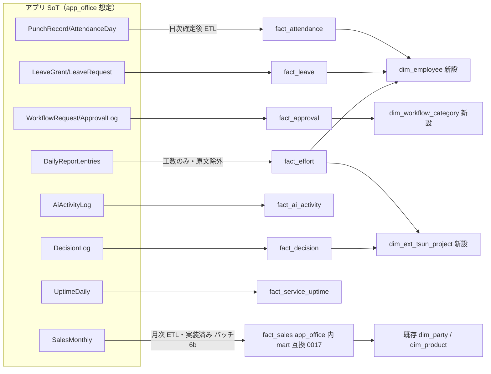

# Phase 5: データ設計（エンティティ定義とスタースキーマ接続）

- **作成日:** 2026-07-15
- **作成ロール:** コーディングエージェント（システム監査官視点で機密度を併記）
- **SoT 宣言:** 業務データの SoT は本アプリ（将来 `app_office` スキーマ）。分析用スタースキーマ（akebono-scm-platform `mart`）は**派生キャッシュ**であり、SoT → mart の一方向 ETL で構築する（逆流禁止）

## 1. エンティティ一覧（モック実装 = `app/types/`、将来 = `app_office` テーブル）

### 1.1 マスタ系（設定系データ: 更新可・論理削除）

| エンティティ | 主要属性 | 機密度 |
|---|---|---|
| `Member` | id, name, email, employmentType(`director`/`employee`/`contract`/`parttime`/`outsource`), googleCalendarConnected（カレンダー連携状態。本実装では OAuth トークンの有無）, attendanceRuleId（勤務体系の個別指定。null=雇用区分の既定を適用）, **departmentId（部署マスタ参照。所属の SoT）**, title, role(`admin`=管理者/`hr`=人事/`member`=一般), hireDate, weeklyDays, weeklyHours, punchRequired, birthDate（18 歳未満深夜判定用）, avatar（プロフィール画像 data URI。本人が /profile で登録。空=イニシャル表示）, active, custom | C2 |
| `Department`（F-10-9） | id, name, parentId（親部署。null=トップレベル。階層構造→組織図を導出）, managerId（責任者）, description, displayOrder, active | C1 |
| `LeaveType`（F-10-10） | id, name, grantMethod(`periodic`=周期自動付与/`manual`=権限者の手動付与), expiryMonths（付与からの使用期限月数。null=期限なし）, isStatutory（法定有給か。true はシード固定・編集/無効化不可）, description, displayOrder, active | C1 |
| `Industry` | id, name, displayOrder, active（直交軸・複合値禁止） | C1 |
| `Company` | id, kind(`self`/`customer`), name, aliases[], industryIds[], primaryIndustryId, size, location, description, ownerMemberId, fiscalStartMonth(自社), active, custom | C2 |
| `Contact` | id, companyId, name, dept, title, keyPerson(1-3), email, phone, notes, active, custom | C2 |
| `RelationType` | id(code), label, direction(`directed`/`mutual`), appliesTo(`company`/`contact`), active | C1 |
| `CompanyRelation` | fromCompanyId, toCompanyId, relationTypeId, notes（有向エッジ。from≠to）※物理削除可（下記設計判断） | C2 |
| `ContactRelation` | fromContactId, toContactId, relationTypeId, notes ※物理削除可（下記設計判断） | C2 |
| `Project` | id, name, companyId, type(`biz_consulting`/`sys_consulting`/`development`/`operation`/`internal`), status, priority, ownerMemberId, memberIds[], startDate, endDate, budget, objective, active, custom | C2 |
| `KnowledgeArticle` | id, domain(`industry`/`company`/`contact`/`relation`/`project`), targetId, title, body, tags[], source(`manual`/`escalation`), sourceRefId, updatedAt, active | C2 |
| `AiRole` | id, name, mission, systemPrompt, permissions[], modelTier(`lite`/`standard`/`pro`), active | C1 |
| `AiEmployee` | id, name, roleId, status(`idle`/`working`/`waiting_approval`), deskPosition{x,y}, active | C1 |
| `CustomFieldDef` | id, entity, key, label, fieldType(`text`/`number`/`date`/`select`/`multiselect`/`boolean`), options[], required, displayOrder, active | C1 |
| `CodeMaster` | id, category(dept/title/projectStatus/…), code, label, displayOrder, active | C1 |
| `ExternalLink` | id, title, url, description, icon, displayOrder, active | C1 |
| `WorkflowRoute` | id, category(稟議区分), minAmount, maxAmount, steps[{order, approverRole/approverMemberId, mode(`serial`/`all`/`majority`)}], active | C1 |
| `AttendanceRule` | id, name, appliesTo(employmentType[]・選択可能な雇用区分), defaultFor(employmentType[]・既定とする雇用区分。区分ごとに 1 ルールのみ=保存時排他), workStart, workEnd, breakMinutes, flex{coreStart,coreEnd,settlementMonths}, closingDay, legalHolidayWeekday, workingWeekdays(営業曜日 0-6。既定 [1-5]), holidayAware(祝日を非営業日扱い。既定 true), active（workingWeekdays / holidayAware は 0020 で追加 = 外注等の週末稼働を勤務体系ごとに表現。翌営業日計算が参照） | C1 |
| `DecisionTheme` | id, title, category(`business`/`project`), objective, semantics[{key,value}], links[{label,to,info}], actions[{name,status,slot,why}], options[{slot(A/B/C),recommended,title,prediction[],basis}], whyRecommend, scenarioParams[], active（意思決定支援 F-02） | C2 |
| `PermissionRule` | id, subjectKind(`role`/`title`/`member`), subjectId, resource(機能キー or マスタエンティティ), field?(null=機能全体/値あり=表示項目), effect(`allow`/`deny`), active（F-16。解決順 個人>役職>ロール・同一レイヤ deny 優先・未設定 allow・既存ロールガードを緩めない制限レイヤ） | C2 |
| `SystemService` | id, name, description, url, components[{id,name}]（バッチ6c で API 化 = `system_services` 0018。マスタ初期値は mockup シードと同一の 3 サービスを migration 投入） | C1 |

> **設計判断（勤務体系の解決）:** 同一雇用区分に固定時間・フレックス・時短等が混在するため、雇用区分だけではルールを決定しない。適用優先順は ①`Member.attendanceRuleId`（個別指定） → ②`defaultFor` に区分を含む既定ルール → ③`appliesTo` に区分を含むルールの先頭（既定未設定時の防御）。個別割当専用ルール（時短等）は `defaultFor` を空にする。

> **設計判断（関係エッジの物理削除）:** マスタ系は論理削除（`active: false`）を原則とするが、`CompanyRelation` / `ContactRelation` の**関係エッジは例外的に物理削除可**とする（誤登録訂正のため。エッジは属性を持たない紐付けであり、論理削除で残す価値より誤った関係が可視化に残る害が大きい）。削除は**確認ダイアログ + 監査ログ（`AuditLog`）記録を必須**とする。

### 1.2 記録系（追記のみ・巻き戻し禁止: 開発原則 2）

| エンティティ | 主要属性 | 機密度 |
|---|---|---|
| `PunchRecord` | id, memberId, date, kind(`in`/`out`/`break_start`/`break_end`), at, source(`web`/`mobile`/`fix`), fixedFrom?, fixReason?, approvedBy? | C3 |
| `AttendanceDay`（日次確定） | memberId, date, buckets{scheduled, statutoryOt, nonStatutoryOt, over60Ot, night, legalHoliday}(分), status(`open`/`fixRequested`/`closed`) | C3 |
| `LeaveGrant` | id, memberId, **leaveTypeId（休暇種別 F-10-10）**, grantDate, days, kind(`normal`/`proportional`=有給自動付与/`special`=手動付与), expireDate（種別の expiryMonths から算出。期限なしは 9999-12-31）, **grantedBy（付与実行者。null=周期自動付与）** | C3 |
| `LeaveRequest` | id, memberId, **leaveTypeId**, date, unit(`full`/`half`), status(`pending`/`approved`/`rejected`), reason, decidedBy | C3 |
| `ShiftPeriod` | id, label, startDate, endDate, wishDeadline, status(`draft`/`open`/`closed`/`adjusting`/`published`) | C2 |
| `ShiftWish` | id, periodId, memberId, date, wish(`want`/`ng`/`either`), from, to | C2 |
| `ShiftAssignment` | id, periodId, memberId, date, from, to, status(`tentative`/`confirmed`/`change_requested`), consentAt? | C2 |
| `DailyReport` | id, memberId(or aiEmployeeId), date, authorKind(`human`/`ai`), entries[{theme(業務テーマ・自由入力), projectId?(旧形式互換。旧データの表示はプロジェクト名へフォールバック), task, hours(0.25 刻み), progress}], reflection, issues, tomorrow, status(`draft`/`submitted`), submittedAt | C3 |
| `WeeklyReport` | id, memberId, weekStart, goalReview, mainWork, issues, nextWeek, status | C3 |
| `ReportComment` | id, reportId, memberId, body, reactions[{memberId, emoji}] | C3 |
| `WorkflowRequest` | id(決裁番号 WF-xxxx), category, title, amount, body, attachments[], requesterId, status(`draft`/`submitted`/`in_review`/`approved`/`rejected`/`remanded`/`withdrawn`), currentStep, routeSnapshot（申請時の経路を凍結保存） | C2 |
| `ApprovalLog` | id, requestId, step, actorId, delegateForId?, action(`approve`/`reject`/`remand`/`withdraw`/`submit`), comment, at | C2 |
| `DelegateSetting` | id, memberId, delegateMemberId, from, to, active | C1 |
| `AiTask` | id, aiEmployeeId, requesterId, title, description, decomposition[{title,done}], status(`proposed`/`approved`/`in_progress`/`blocked`/`done`/`cancelled`), dueDate, confidence(`high`/`mid`/`low`) | C2 |
| `AiActivityLog` | id, aiEmployeeId, taskId?, at, kind(`plan`/`execute`/`report`/`escalate`/`chat`), summary, tokens, costUsd | C2 |
| `Notification` | id, memberId, kind(`approval`/`comment`/`reminder`/`ai_report`/`system`/`escalation`), title, body, link, read, at | C2 |
| `Escalation` | id, reason(`issue_reported`/`stalled_task`/`overload`/`low_confidence`/`overtime_alert`), targetMemberId/aiEmployeeId, context, status(`open`/`resolved`), resolution{type(`answer`/`ruling`/`no_action`), body, resolvedBy, at}, knowledgeReflected, dedupeKey | C3 |
| `ServiceIncident` | id, serviceId, title, impact(`minor`/`major`/`critical`), status(`investigating`/`identified`/`monitoring`/`resolved`), updates[{status, body, at}], startedAt, resolvedAt（バッチ6c で API 化 = `service_incidents` 0018。updates は追記のみ・status/resolvedAt はその射影・正順遷移を FOR UPDATE で直列化） | C1 |
| `UptimeDaily` | serviceId, date, downMinutes, worstState（バッチ6c で API 化 = `uptime_daily` 0018。**SoT はインシデント**で本テーブルは日次導出（shared/domain/uptime）。非 operational の日のみ格納し、再計算 = 窓内 DELETE→INSERT で冪等。モックのシード乱数 uptime は本番へ持ち込まない） | C1 |
| `DecisionLog` | id, themeId, chosenSlot, reason, decidedBy, at | C2 |
| `ChatSession` | id, memberId, title(最初の質問 40 字), createdAt, updatedAt（F-09-3 セッション管理。更新は title/updatedAt のみ = 記録保護） | C2 |
| `ChatMessage` | id, sessionId, seq(表示順の SoT), role(`user`/`assistant`), content, sources[], suggestions[], at（追記のみ・削除更新なし） | C2 |
| `AuditLog` | id, actorId, action, entity, entityId, detail, at | C3 |
| `AkebonoWish` | id, memberId, body, at（バッチ6d で API 化 = `akebono_wishes` 0019。追記のみ・編集/削除なし。全員参照可 = 社内 C2） | C2 |
| `SalesMonthly` | month(YYYY-MM), projectType, companyId, amount, cost（バッチ6b で API 化 = `sales_monthly` 0017。**実績データ**: 追記のみではなく冪等キー month × company × projectType の upsert で管理者が更新可。マスタ初期値シードは投入しない = 実績を偽装しない設計判断） | C2 |
| `Holiday` | id, date(一意), name, source(`official`/`manual`)（オペレーター報告 2026-07-18 #4 で追加 = `public_holidays` 0020。**SoT は本テーブル**で、内閣府「国民の祝日」CSV（Shift_JIS）は取込元 = `POST /v1/holidays/import` が date 一意の upsert（冪等・再取込可）。手動追加・物理削除は汎用マスタ経由。翌営業日計算（shared/domain/business-day）とカレンダー表示（AI業務アシスタントの対象日バッジ）が参照） | C2 |

> **設計判断（休暇付与の冪等性・権限）:** 休暇の手動付与（個別・一括 F-04-9）は**同一メンバー × 休暇種別 × 付与日の重複をスキップ**する（一括付与の再実行・誤操作で残数が二重に増えない = 開発原則2）。付与・申請の承認/却下は管理者または人事ロール（`role: 'hr'`）のみ実行可。残数の保有上限 40 日は法定有給（`isStatutory`）のみに適用する。

### 1.3 AI業務アシスタント / 日報 AI アシスト関連（F-14・F-06-7/8）

| エンティティ | 主なフィールド | 分類 | 機密度 |
|---|---|---|---|
| `CalendarEvent`（google 発） | id(決定的 `gcal-…`), memberId, date, from, to, title, source=`google`, projectId（タイトルから推定 or 手動） | 外部キャッシュ（SoT は Google。編集・削除不可） | C2 |
| `CalendarEvent`（app 発） | id, memberId, date, from, to, title, source=`app`, syncedToGoogle, projectId | 本人管理のタスク（編集・削除可。SoT は本アプリ） | C2 |
| `HearingLog` | id, memberId, date, kind(`qa`=ヒアリング回答/`memo`=ぽいぽいメモ), calendarEventId, question, answer, at | 記録系（追記のみ・巻き戻し禁止） | C3（課題回答を含み `DailyReport` と同水準） |
| `TaskPlan`（F-14） | id, memberId, date（実施予定日）, calendarEventId（null=手動）, title, purpose（目的）, doneCriteria（達成条件）, approach（段取り）, aiComment/aiCommentAt（AI レビュー。再取得で上書き可）, status(`planned`/`done`), outcome（結果）, reflection（所感）, resultAt, createdAt/updatedAt | ハイブリッド: planned 中は本人が編集・削除可 / **結果記録（done）後は編集不可 = 記録系へ確定** | C3（業務内容の原文を含み `DailyReport` と同水準） |
| `AppConfigItem` | key, value（例: reportInputMode = `form`/`assist`/`both`） | 設定系（upsert 更新可。SoT は本アプリ） | C1 |

> **SoT 宣言（カレンダー）:** `source='google'` の予定は **Google カレンダーが SoT**（本アプリはキャッシュ。編集・削除不可、決定的 id によるべき等 upsert で同期）。`source='app'` の予定は**本アプリが SoT**（`syncedToGoogle` で Google への反映状態を持つ）。連携解除後もキャッシュは表示用に保持し、**未連携メンバーには初期キャッシュを投入しない**（連携＝同意して初めて同期される、を再現）。HearingLog は記録系（追記のみ）。日報ドラフトは保存せずフォームへ流し込むのみで、**提出済み日報は再生成で上書きしない**（ai-manager の confirmed 保護と同型）。

## 2. スタースキーマ接続（akebono-scm-platform `mart` 規約準拠）

### 2.1 接続方針

- akebono-scm-platform の調査結果（AKB-DOC-16）に基づく。**現行 mart は SCM 特化でオフィス系ファクトは未定義**のため、以下の拡張を提案する。共有ディメンション（`dim_date`/`dim_party`/`dim_currency`）と `dim_tenant.tenant_type='internal'`・`dim_location.location_type='office'` は既存資産をそのまま利用する
- 共通規約の踏襲: `tenant_key` 先頭列 / `dim_date_key int (yyyymmdd)` / 予約メンバー `0`(Unknown) `-1`(N/A) `-2`(Invalid) / 冪等キー `UNIQUE(tenant_key, source_txn_id)` / 会計期 `fiscal_year/quarter/month` は `dim_tenant.fiscal_start_month` から非正規化 / 監査列 `load_run_id, created_at` / 区分値は text + CHECK
- 機密度: 労務系ファクトは `metric_definition.access_policy` を C3 に設定。日報**原文は mart に載せない**（件数・工数のみ。ai-manager の「原文を返さない」原則踏襲）

### 2.2 新規ディメンション提案

| ディメンション | 型 | 主要列 |
|---|---|---|
| `dim_employee`（AKB-DOC-16 §4.2 でオプション予約済 → 正式化） | SCD2 | tenant_key, member_id(退化), employee_code, employee_name, employment_type, dept, title, weekly_days, hire_date, valid_from/valid_to/is_current/row_hash/is_inferred/load_run_id |
| `dim_ext_tsun_project` | SCD1 | tenant_key, project_id(退化), project_name, project_type, customer_party_key, status |
| `dim_leave_type` | SCD1 | tenant_key, leave_code(paid_full/paid_half/…), label |
| `dim_workflow_category` | SCD1 | tenant_key, category_code(purchase/contract/expense/hiring/trip/other), label |

顧客(会社)は既存 `dim_party`（`is_customer=true`）へ写像。顧客(人)・顧客関係は分析軸ではなく AI 文脈（RAG/ナレッジ）側で活用するため mart 対象外とする（設計判断として明示）。

### 2.3 新規ファクト提案

| ファクト | グレイン | 主メジャー | 加法性 |
|---|---|---|---|
| `fact_attendance` | 日 × メンバー | scheduled_min, statutory_ot_min, non_statutory_ot_min, over60_ot_min, night_min, legal_holiday_min | additive |
| `fact_leave` | 付与/消化イベント 1 行 | granted_days(+), consumed_days(−), event_type CHECK IN ('grant','consume','expire') | additive（**残数は半加法** → メトリクス層で `semi_additive` 宣言） |
| `fact_approval` | 承認ステップ 1 行 | lead_time_hours, amount, step_no, action | additive（金額）/ non_additive（リードタイム→平均系） |
| `fact_effort` | 日 × メンバー × プロジェクト | effort_hours（日報工数） | additive |
| `fact_ai_activity` | AI 活動 1 行 | tokens, cost_usd, activity_count | additive |
| `fact_decision` | 判断ログ 1 行 | decision_count, options_considered | additive |
| `fact_service_uptime` | 日 × サービス | down_minutes, uptime_ratio | additive（down_minutes）/ non_additive（ratio） |

売上は既存 `fact_sales`（役務売上として dim_product をサービス品目に転用）または `fact_billing` を利用し、新設しない（開発原則 3）。

> **実装状況（バッチ6b・オペレーター判断 2026-07-18）:** fact_sales の ETL 出力先は akebono-scm-platform の mart へ直接書かず、**app_office 内に mart 規約準拠の互換テーブル `fact_sales`（migration 0017）** として実装した。規約準拠点: `tenant_key` 先頭列（定数 `akebono`。mart 本体接続時に実テナントキーへ揃える）・`dim_date_key int (yyyymmdd)`（月次グレイン = 月初日）・冪等キー `UNIQUE(tenant_key, source_txn_id)`（source_txn_id = sales_monthly.id）・会計期 `fiscal_year/quarter/month` は自社 fiscalStartMonth から非正規化（shared/domain/fiscal をフロントと共有）・監査列 `load_run_id, created_at`（発行元 = `mart_load_runs` 追記のみ）。`customer_company_id` / `project_type` は dim_party / dim_product 接続前の**退化キー**。ETL は sales_monthly → fact_sales の一方向（逆流禁止）で、管理者の手動実行（`POST /v1/sales/etl/run`）と日次バッチ（`POST /jobs/sales-mart-etl`・Cloud Scheduler + CRON_SECRET）の両経路（イベント + 手動回復 = 原則6）。将来 mart 本体へ接続する際はテーブル移送 + ETL 先の切替のみで済む。

日報 AI アシスト関連（`CalendarEvent` / `HearingLog` / `AppConfigItem`）は **mart 対象外**とする（設計判断として明示）: カレンダー予定・ヒアリングログは日報ドラフトの入力材料（原文系）であり、分析価値は `fact_effort`（日報工数）に集約済み。原文を mart に載せない原則（§2.1）にも従う。設定値（AppConfig）は分析対象外。

`TaskPlan`（F-14）は**管理者インサイトの元ネタ**として集計値のみ mart 候補とする: `fact_task_plan`（グレイン: 日 × メンバー。planned_count, done_count, reflection_count。additive）を本実装フェーズで追加提案。**目的・段取り・結果・所感の原文は mart に載せない**（原則踏襲。モックでは `useTaskPlans.insights` がアプリ内集計で代替）。休暇は既存 `fact_leave` に `leave_type_code`（dim_leave_type 参照）を追加して種別別分析に対応する。部署は `dim_employee` に `department_id/department_name`（SCD2 属性）として写像する。

### 2.4 マッピング表（アプリ SoT → mart）

### 2.5 モックアップでの表現

- モックの型定義（`app/types/`）は上記ファクトへ写像可能な形（バケット分解済み勤怠・イベント型有給・ステップ型承認ログ）で持つ
- 意思決定支援・売上サマリの画面に「mart メトリクス相当」のコード（例 `AKO-MET-ATT-001 総労働時間`）を出典バッジで表示し、分析基盤接続の意図を体感できるようにする（**モックアップ未実装。本実装フェーズで追加予定**）

## 3. 変更時の必須確認（CLAUDE.md 開発原則 6 への回答）

1. 新しい書込はすべて `useMockDb`（SoT）へ先に行い、通知・バッジ等の派生は computed/イベントで後続反映する
2. 外部システム連携（将来の mart ETL）はイベント（日次確定）+ 手動再同期（管理画面の再構築ボタン想定）の両方を設計に含める
3. 通知・エスカレーション起票は冪等（dedupeKey + クールダウン）で、失敗しても主フローを止めない
4. 新エンティティは 型定義（types/）・アクセス制御（機密度表）・SoT 宣言（本書）を同時更新する
