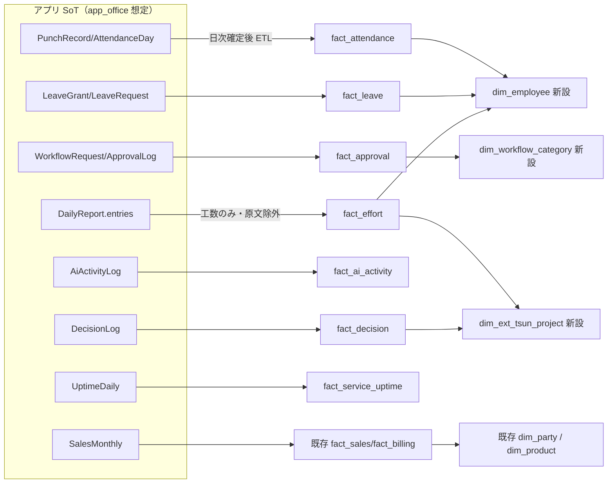

# Phase 5: データ設計（エンティティ定義とスタースキーマ接続）

- **作成日:** 2026-07-15
- **作成ロール:** コーディングエージェント（システム監査官視点で機密度を併記）
- **SoT 宣言:** 業務データの SoT は本アプリ（将来 `app_office` スキーマ）。分析用スタースキーマ（akebono-scm-platform `mart`）は**派生キャッシュ**であり、SoT → mart の一方向 ETL で構築する（逆流禁止）

## 1. エンティティ一覧（モック実装 = `app/types/`、将来 = `app_office` テーブル）

### 1.1 マスタ系（設定系データ: 更新可・論理削除）

| エンティティ | 主要属性 | 機密度 |
|---|---|---|
| `Member` | id, name, email, employmentType(`director`/`employee`/`contract`/`parttime`/`outsource`), dept, title, role(`admin`/`member`), hireDate, weeklyDays, weeklyHours, punchRequired, birthDate（18 歳未満深夜判定用）, active, custom | C2 |
| `Industry` | id, name, displayOrder, active（直交軸・複合値禁止） | C1 |
| `Company` | id, kind(`self`/`customer`), name, aliases[], industryIds[], primaryIndustryId, size, location, description, ownerMemberId, fiscalStartMonth(自社), active, custom | C2 |
| `Contact` | id, companyId, name, dept, title, keyPerson(1-3), email, phone, notes, active, custom | C2 |
| `RelationType` | id(code), label, direction(`directed`/`mutual`), appliesTo(`company`/`contact`), active | C1 |
| `CompanyRelation` | fromCompanyId, toCompanyId, relationTypeId, notes（有向エッジ。from≠to） | C2 |
| `ContactRelation` | fromContactId, toContactId, relationTypeId, notes | C2 |
| `Project` | id, name, companyId, type(`biz_consulting`/`sys_consulting`/`development`/`operation`/`internal`), status, priority, ownerMemberId, memberIds[], startDate, endDate, budget, objective, active, custom | C2 |
| `KnowledgeArticle` | id, domain(`industry`/`company`/`contact`/`relation`/`project`), targetId, title, body, tags[], source(`manual`/`escalation`), sourceRefId, updatedAt, active | C2 |
| `AiRole` | id, name, mission, systemPrompt, permissions[], modelTier(`lite`/`standard`/`pro`), active | C1 |
| `AiEmployee` | id, name, roleId, status(`idle`/`working`/`waiting_approval`), deskPosition{x,y}, active | C1 |
| `CustomFieldDef` | id, entity, key, label, fieldType(`text`/`number`/`date`/`select`/`multiselect`/`boolean`), options[], required, displayOrder, active | C1 |
| `CodeMaster` | id, category(dept/title/projectStatus/…), code, label, displayOrder, active | C1 |
| `ExternalLink` | id, title, url, description, icon, displayOrder, active | C1 |
| `WorkflowRoute` | id, category(稟議区分), minAmount, maxAmount, steps[{order, approverRole/approverMemberId, mode(`serial`/`all`/`majority`)}], active | C1 |
| `AttendanceRule` | id, name, appliesTo(employmentType[]), workStart, workEnd, breakMinutes, flex{coreStart,coreEnd,settlementMonths}, closingDay, legalHolidayWeekday, active | C1 |
| `SystemService` | id, name, description, url, components[{id,name}] | C1 |

### 1.2 記録系（追記のみ・巻き戻し禁止: 開発原則 2）

| エンティティ | 主要属性 | 機密度 |
|---|---|---|
| `PunchRecord` | id, memberId, date, kind(`in`/`out`/`break_start`/`break_end`), at, source(`web`/`mobile`/`fix`), fixedFrom?, fixReason?, approvedBy? | C3 |
| `AttendanceDay`（日次確定） | memberId, date, buckets{scheduled, statutoryOt, nonStatutoryOt, over60Ot, night, legalHoliday}(分), status(`open`/`fixRequested`/`closed`) | C3 |
| `LeaveGrant` | id, memberId, grantDate, days, kind(`normal`/`proportional`), expireDate | C3 |
| `LeaveRequest` | id, memberId, date, unit(`full`/`half`), status(`pending`/`approved`/`rejected`), reason, decidedBy | C3 |
| `ShiftPeriod` | id, label, startDate, endDate, wishDeadline, status(`draft`/`open`/`closed`/`adjusting`/`published`) | C2 |
| `ShiftWish` | id, periodId, memberId, date, wish(`want`/`ng`/`either`), from, to | C2 |
| `ShiftAssignment` | id, periodId, memberId, date, from, to, status(`tentative`/`confirmed`/`change_requested`), consentAt? | C2 |
| `DailyReport` | id, memberId(or aiEmployeeId), date, authorKind(`human`/`ai`), entries[{projectId, task, hours(0.25 刻み), progress}], reflection, issues, tomorrow, status(`draft`/`submitted`), submittedAt | C3 |
| `WeeklyReport` | id, memberId, weekStart, goalReview, mainWork, issues, nextWeek, status | C3 |
| `ReportComment` | id, reportId, memberId, body, reactions[{memberId, emoji}] | C3 |
| `WorkflowRequest` | id(決裁番号 WF-xxxx), category, title, amount, body, attachments[], requesterId, status(`draft`/`submitted`/`in_review`/`approved`/`rejected`/`remanded`/`withdrawn`), currentStep, routeSnapshot（申請時の経路を凍結保存） | C2 |
| `ApprovalLog` | id, requestId, step, actorId, delegateForId?, action(`approve`/`reject`/`remand`/`withdraw`/`submit`), comment, at | C2 |
| `DelegateSetting` | id, memberId, delegateMemberId, from, to, active | C1 |
| `AiTask` | id, aiEmployeeId, requesterId, title, description, decomposition[{title,done}], status(`proposed`/`approved`/`in_progress`/`blocked`/`done`/`cancelled`), dueDate, confidence(`high`/`mid`/`low`) | C2 |
| `AiActivityLog` | id, aiEmployeeId, taskId?, at, kind(`plan`/`execute`/`report`/`escalate`/`chat`), summary, tokens, costUsd | C2 |
| `Notification` | id, memberId, kind(`approval`/`comment`/`reminder`/`ai_report`/`system`/`escalation`), title, body, link, read, at | C2 |
| `Escalation` | id, reason(`issue_reported`/`stalled_task`/`overload`/`low_confidence`/`overtime_alert`), targetMemberId/aiEmployeeId, context, status(`open`/`resolved`), resolution{type(`answer`/`ruling`/`no_action`), body, resolvedBy, at}, knowledgeReflected, dedupeKey | C3 |
| `ServiceIncident` | id, serviceId, title, impact(`minor`/`major`/`critical`), status(`investigating`/`identified`/`monitoring`/`resolved`), updates[{status, body, at}], startedAt, resolvedAt | C1 |
| `UptimeDaily` | serviceId, date, downMinutes, worstState | C1 |
| `DecisionLog` | id, themeId, chosenSlot, reason, decidedBy, at | C2 |
| `AuditLog` | id, actorId, action, entity, entityId, before?, after?, at | C3 |
| `SalesMonthly`（モック） | month, projectType, companyId, amount, cost | C2 |

## 2. スタースキーマ接続（akebono-scm-platform `mart` 規約準拠）

### 2.1 接続方針

- akebono-scm-platform の調査結果（AKB-DOC-16）に基づく。**現行 mart は SCM 特化でオフィス系ファクトは未定義**のため、以下の拡張を提案する。共有ディメンション（`dim_date`/`dim_party`/`dim_currency`）と `dim_tenant.tenant_type='internal'`・`dim_location.location_type='office'` は既存資産をそのまま利用する
- 共通規約の踏襲: `tenant_key` 先頭列 / `dim_date_key int (yyyymmdd)` / 予約メンバー `0`(Unknown) `-1`(N/A) `-2`(Invalid) / 冪等キー `UNIQUE(tenant_key, source_txn_id)` / 会計期 `fiscal_year/quarter/month` は `dim_tenant.fiscal_start_month` から非正規化 / 監査列 `load_run_id, created_at` / 区分値は text + CHECK
- 機密度: 労務系ファクトは `metric_definition.access_policy` を C3 に設定。日報**原文は mart に載せない**（件数・工数のみ。ai-manager の「原文を返さない」原則踏襲）

### 2.2 新規ディメンション提案

| ディメンション | 型 | 主要列 |
|---|---|---|
| `dim_employee`（AKB-DOC-16 §4.2 でオプション予約済 → 正式化） | SCD2 | tenant_key, member_id(退化), employee_code, employee_name, employment_type, dept, title, weekly_days, hire_date, valid_from/valid_to/is_current/row_hash/is_inferred/load_run_id |
| `dim_ext_tsun_project` | SCD1 | tenant_key, project_id(退化), project_name, project_type, customer_party_key, status |
| `dim_leave_type` | SCD1 | tenant_key, leave_code(paid_full/paid_half/…), label |
| `dim_workflow_category` | SCD1 | tenant_key, category_code(purchase/contract/expense/hiring/trip/other), label |

顧客(会社)は既存 `dim_party`（`is_customer=true`）へ写像。顧客(人)・顧客関係は分析軸ではなく AI 文脈（RAG/ナレッジ）側で活用するため mart 対象外とする（設計判断として明示）。

### 2.3 新規ファクト提案

| ファクト | グレイン | 主メジャー | 加法性 |
|---|---|---|---|
| `fact_attendance` | 日 × メンバー | scheduled_min, statutory_ot_min, non_statutory_ot_min, over60_ot_min, night_min, legal_holiday_min | additive |
| `fact_leave` | 付与/消化イベント 1 行 | granted_days(+), consumed_days(−), event_type CHECK IN ('grant','consume','expire') | additive（**残数は半加法** → メトリクス層で `semi_additive` 宣言） |
| `fact_approval` | 承認ステップ 1 行 | lead_time_hours, amount, step_no, action | additive（金額）/ non_additive（リードタイム→平均系） |
| `fact_effort` | 日 × メンバー × プロジェクト | effort_hours（日報工数） | additive |
| `fact_ai_activity` | AI 活動 1 行 | tokens, cost_usd, activity_count | additive |
| `fact_decision` | 判断ログ 1 行 | decision_count, options_considered | additive |
| `fact_service_uptime` | 日 × サービス | down_minutes, uptime_ratio | additive（down_minutes）/ non_additive（ratio） |

売上は既存 `fact_sales`（役務売上として dim_product をサービス品目に転用）または `fact_billing` を利用し、新設しない（開発原則 3）。

### 2.4 マッピング表（アプリ SoT → mart）

### 2.5 モックアップでの表現

- モックの型定義（`app/types/`）は上記ファクトへ写像可能な形（バケット分解済み勤怠・イベント型有給・ステップ型承認ログ）で持つ
- 意思決定支援・売上サマリの画面に「mart メトリクス相当」のコード（例 `AKO-MET-ATT-001 総労働時間`）を出典バッジで表示し、分析基盤接続の意図を体感できるようにする

## 3. 変更時の必須確認（CLAUDE.md 開発原則 6 への回答）

1. 新しい書込はすべて `useMockDb`（SoT）へ先に行い、通知・バッジ等の派生は computed/イベントで後続反映する
2. 外部システム連携（将来の mart ETL）はイベント（日次確定）+ 手動再同期（管理画面の再構築ボタン想定）の両方を設計に含める
3. 通知・エスカレーション起票は冪等（dedupeKey + クールダウン）で、失敗しても主フローを止めない
4. 新エンティティは 型定義（types/）・アクセス制御（機密度表）・SoT 宣言（本書）を同時更新する
