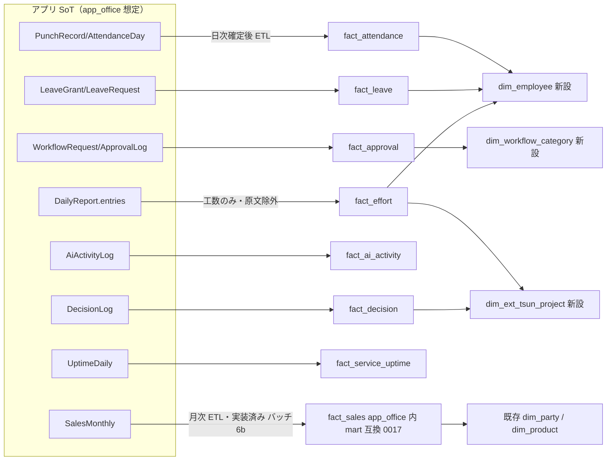

# Phase 5: データ設計（エンティティ定義とスタースキーマ接続）

- **作成日:** 2026-07-15
- **作成ロール:** コーディングエージェント（システム監査官視点で機密度を併記）
- **SoT 宣言:** 業務データの SoT は本アプリ（将来 `app_office` スキーマ）。分析用スタースキーマ（akebono-scm-platform `mart`）は**派生キャッシュ**であり、SoT → mart の一方向 ETL で構築する（逆流禁止）

## 1. エンティティ一覧（モック実装 = `app/types/`、将来 = `app_office` テーブル）

### 1.1 マスタ系（設定系データ: 更新可・論理削除）

| エンティティ | 主要属性 | 機密度 |
|---|---|---|
| `Member` | id, name, email, employmentType(`director`/`employee`/`contract`/`parttime`/`outsource`), googleCalendarConnected（カレンダー連携状態。本実装では OAuth トークンの有無）, attendanceRuleId（勤務体系の個別指定。null=雇用区分の既定を適用）, **departmentId（部署マスタ参照。所属の SoT）**, title, role(`admin`=管理者/`hr`=人事/`member`=一般), hireDate, weeklyDays, weeklyHours, punchRequired, birthDate（18 歳未満深夜判定用）, avatar（プロフィール画像 data URI。本人が /profile で登録。空=イニシャル表示）, segmentIds[]（担当業態。businessSegments 参照。F-01 コックピットの事業計器の出し分け。空=未設定=業態スイッチャの選択に従う=下位互換。migration 0039 = `segment_ids` jsonb 既定 `[]`）, active, custom | C2 |
| `Department`（F-10-9） | id, name, parentId（親部署。null=トップレベル。階層構造→組織図を導出）, managerId（責任者）, description, displayOrder, active | C1 |
| `LeaveType`（F-10-10） | id, name, grantMethod(`periodic`=周期自動付与/`manual`=権限者の手動付与), expiryMonths（付与からの使用期限月数。null=期限なし）, isStatutory（法定有給か。true はシード固定・編集/無効化不可）, description, displayOrder, active | C1 |
| `Industry` | id, name, displayOrder, active（直交軸・複合値禁止） | C1 |
| `Company` | id, kind(`self`/`customer`), name, aliases[], industryIds[], primaryIndustryId, size, location, description, ownerMemberId, fiscalStartMonth(自社), active, custom | C2 |
| `Contact` | id, companyId, name, dept, title, keyPerson(1-3), email, phone, notes, active, custom | C2 |
| `RelationType` | id(code), label, direction(`directed`/`mutual`), appliesTo(`company`/`contact`), active | C1 |
| `CompanyRelation` | fromCompanyId, toCompanyId, relationTypeId, notes（有向エッジ。from≠to）※物理削除可（下記設計判断） | C2 |
| `ContactRelation` | fromContactId, toContactId, relationTypeId, notes ※物理削除可（下記設計判断） | C2 |
| `Project` | id, name, companyId, type(`biz_consulting`/`sys_consulting`/`development`/`operation`/`internal`), status, priority, ownerMemberId, memberIds[], startDate, endDate, budget, objective, active, custom | C2 |
| `KnowledgeArticle` | id, domain(`industry`/`company`/`contact`/`relation`/`project`), targetId, title, body, tags[], source(`manual`/`escalation`), sourceRefId, updatedAt, active | C2 |
| `AiRole` | id, name, mission, systemPrompt, permissions[], modelTier(`lite`/`standard`/`pro`), active | C1 |
| `AiEmployee` | id, name, roleId, status(`idle`/`working`/`waiting_approval`), deskPosition{x,y}, active | C1 |
| `CustomFieldDef` | id, entity, key, label, fieldType(`text`/`number`/`date`/`select`/`multiselect`/`boolean`), options[], required, displayOrder, active | C1 |
| `CodeMaster` | id, category(dept/title/projectStatus/…), code, label, displayOrder, active | C1 |
| `ExternalLink` | id, title, url, description, icon, displayOrder, active | C1 |
| `WorkflowRoute` | id, category(稟議区分), minAmount, maxAmount, steps[{order, approverRole/approverMemberId, mode(`serial`/`all`/`majority`)}], active | C1 |
| `AttendanceRule` | id, name, appliesTo(employmentType[]・選択可能な雇用区分), defaultFor(employmentType[]・既定とする雇用区分。区分ごとに 1 ルールのみ=保存時排他), workStart, workEnd, breakMinutes, flex{coreStart,coreEnd,settlementMonths}, closingDay, legalHolidayWeekday, workingWeekdays(営業曜日 0-6。既定 [1-5]), holidayAware(祝日を非営業日扱い。既定 true), active（workingWeekdays / holidayAware は 0020 で追加 = 外注等の週末稼働を勤務体系ごとに表現。翌営業日計算が参照） | C1 |
| `Goal`（F-01 コックピット着地予報 = cockpit-design §2.2。2026-07-29 追加・本実装 = migration 0039） | id, metric(`segment_sales`=業態売上・円/`report_rate`=日報提出率・%0-100), segmentId（`segment_sales` のとき対象業態=businessSegments 参照・必須。`report_rate` は null=全社）, monthlyValue（月次目標値）, note, active（汎用マスタ CRUD `/v1/masters/goals`・論理削除のみ。同一 (metric, segmentId) の active 重複は登録時に警告し評価は最新 1 件=後勝ち=createdAt 降順・無ければ配列末尾。goals が空でも予報層は「目標未設定」導線へフォールバック）。**機密度 C2（経営目標）の参照制御**: 一覧 GET はサーバー側行フィルタ = admin / sales 機能を許可されたユーザー（canUseFeature のレイヤ解決。ルール未設定は既定 allow=下位互換）は全件・hr（sales deny 時）は report_rate 全件+自分の担当業態の segment_sales（運用デフォルト pr-def-05 = hr sales deny と整合。提出率予報の材料は維持しつつ他業態の経営数字は返さない。レビュー2巡目 G2）・それ以外は自分の担当業態（members.segment_ids）の segment_sales のみ（report_rate=全社目標は返さない。監査指摘 2026-07-29 → 行フィルタ採用。書込は従来どおり admin のみ） | C2 |
| `DecisionTheme` | id, title, category(`business`/`project`), objective, semantics[{key,value}], links[{label,to,info}], actions[{name,status,slot,why}], options[{slot(A/B/C),recommended,title,prediction[],basis}], whyRecommend, scenarioParams[], active（意思決定支援 F-02） | C2 |
| `PermissionRule` | id, subjectKind(`role`/`title`/`member`), subjectId, resource(機能キー or マスタエンティティ), field?(null=機能全体の利用可否。**フィールドリソースでは「マスタ全体」= 全項目の一括既定（バッチ7m）**/値あり=表示項目), effect(`allow`/`deny`), active（F-16。解決順 個人>役職>ロール・同一レイヤ deny 優先・**同一レイヤ内は明示キー → 一括キー（field=null・member:*）→ の順で参照（バッチ7m）**・どのレイヤにも無ければアプリ既定値（機能・表示項目・日報参照 = allow / AIアシスタント参照 = deny）・既存ロールガードを緩めない制限レイヤ。**field='ai-scope' は AI 参照範囲の擬似フィールド（バッチ7g）: allow = すべて / deny = 自分の登録データのみ。既定は shared AI_SCOPE_FEATURES の区分ごとに定義（poipoi = all / attendance・ai-assistant = own）**。**resource='reports' + field='member:<対象メンバー id>' は日報・週報の参照対象の擬似フィールド（バッチ7h = F-16-6。2026-07-22 で全員の週報にも適用）: deny = その対象者の日報・週報を参照不可。未設定 = 参照可・自分は常に参照可（shared canViewMemberReports）**。**resource='attendance' + field='timecard-all' は全員のタイムカードの参照の擬似フィールド（2026-07-22）: 既定 = 管理者/人事のみ参照可（shared canViewAllTimecards・timecardAllDefault）。allow で一般へ付与・deny で人事から剥奪できる**。**field='member:*' は参照対象（日報 = reports / AIアシスタント = ai-assistant）の全メンバー一括既定（バッチ7m。'*' はメンバー id として発番されない予約値）**） | C2 |
| `SystemService` | id, name, description, url, components[{id,name}]（バッチ6c で API 化 = `system_services` 0018。マスタ初期値は mockup シードと同一の 3 サービスを migration 投入） | C1 |

> **設計判断（勤務体系の解決）:** 同一雇用区分に固定時間・フレックス・時短等が混在するため、雇用区分だけではルールを決定しない。適用優先順は ①`Member.attendanceRuleId`（個別指定） → ②`defaultFor` に区分を含む既定ルール → ③`appliesTo` に区分を含むルールの先頭（既定未設定時の防御）。個別割当専用ルール（時短等）は `defaultFor` を空にする。

> **設計判断（関係エッジの物理削除）:** マスタ系は論理削除（`active: false`）を原則とするが、`CompanyRelation` / `ContactRelation` の**関係エッジは例外的に物理削除可**とする（誤登録訂正のため。エッジは属性を持たない紐付けであり、論理削除で残す価値より誤った関係が可視化に残る害が大きい）。削除は**確認ダイアログ + 監査ログ（`AuditLog`）記録を必須**とする。

### 1.2 記録系（追記のみ・巻き戻し禁止: 開発原則 2）

| エンティティ | 主要属性 | 機密度 |
|---|---|---|
| `PunchRecord` | id, memberId, date, kind(`in`/`out`/`break_start`/`break_end`), at, source(`web`/`mobile`/`fix`), fixedFrom?, fixReason?, approvedBy? | C3 |
| `AttendanceDay`（日次確定） | memberId, date, buckets{scheduled, statutoryOt, nonStatutoryOt, over60Ot, night, legalHoliday}(分), status(`open`/`fixRequested`/`closed`) | C3 |
| `LeaveGrant` | id, memberId, **leaveTypeId（休暇種別 F-10-10）**, grantDate, days, kind(`normal`/`proportional`=有給自動付与/`special`=手動付与), expireDate（種別の expiryMonths から算出。期限なしは 9999-12-31）, **grantedBy（付与実行者。null=周期自動付与）** | C3 |
| `LeaveRequest` | id, memberId, **leaveTypeId**, date, unit(`full`/`half`), status(`pending`/`approved`/`rejected`), reason, decidedBy | C3 |
| `ShiftPeriod` | id, label, startDate, endDate, wishDeadline, status(`draft`/`open`/`closed`/`adjusting`/`published`) | C2 |
| `ShiftWish` | id, periodId, memberId, date, wish(`want`/`ng`/`either`), from, to | C2 |
| `ShiftAssignment` | id, periodId, memberId, date, from, to, status(`tentative`/`confirmed`/`change_requested`), consentAt? | C2 |
| `DailyReport` | id, memberId(or aiEmployeeId), date, authorKind(`human`/`ai`), entries[{theme(テーマ・自由入力。旧称: 業務テーマ), projectId?(旧形式互換。旧データの表示はプロジェクト名へフォールバック), task(内容), hours(時間・0.25 刻み), progress}], reflection, issues, tomorrow(旧形式の明日の予定 = 自由記述。互換表示用), **tomorrowPlans?[{theme, purpose, task, hours}]（明日の予定・最大 3 件 = TOMORROW_PLANS_MAX。翌営業日の日報エディタへ自動反映。migration 0029 = 2026-07-22）**, status(`draft`/`submitted`), submittedAt | C3 |
| `WeeklyReport` | id, memberId, weekStart, goalReview, mainWork, issues, nextWeek, status | C3 |
| `ReportComment` | id, reportId, memberId, body, reactions[{memberId, emoji}] | C3 |
| `WorkflowRequest` | id(決裁番号 WF-xxxx), category, title, amount, body(旧形式の本文。互換表示用), **purpose?(目的), content?(内容 = 区分別テンプレート対応。migration 0029 = 2026-07-22 で本文を分割。新規は body='' で purpose/content が正)**, attachments[], requesterId, status(`draft`/`submitted`/`in_review`/`approved`/`rejected`/`remanded`/`withdrawn`), currentStep, routeSnapshot（申請時の経路を凍結保存） | C2 |
| `ApprovalLog` | id, requestId, step, actorId, delegateForId?, action(`approve`/`reject`/`remand`/`withdraw`/`submit`), comment, at | C2 |
| `DelegateSetting` | id, memberId, delegateMemberId, from, to, active | C1 |
| `AiTask` | id, aiEmployeeId, requesterId, title, description, decomposition[{title,done}], status(`proposed`/`approved`/`in_progress`/`blocked`/`done`/`cancelled`), dueDate, confidence(`high`/`mid`/`low`), outputs[{step(-1=統合報告), title, body, at}]（バッチ7f 0025 = ステップ実遂行の成果物。追記のみ） | C2 |
| `AiActivityLog` | id, aiEmployeeId, taskId?, at, kind(`plan`/`execute`/`report`/`escalate`/`chat`), summary, tokens, costUsd | C2 |
| `AiTaskQuestion` | id, taskId, stepIndex, question, status(`open`/`answered`), answer, answeredBy, askedAt, answeredAt（バッチ7f = `ai_task_questions` 0025。AI が依頼者へ確認を求める質問。open が残る間はタスクをブロック = 回答で再開。追記 + 回答で確定） | C2 |
| `AiTaskFile` | id, taskId, questionId?, filename, mime, sizeBytes, bytes, extractedText, uploadedBy（バッチ7f = `ai_task_files` 0025。依頼・回答の添付原本。.md/.txt/.pdf/.docx/.pptx はテキスト抽出・.jpg/.png は LLM マルチモーダル入力。DL は依頼者 + 管理者） | C2 |
| `Notification` | id, memberId, kind(`approval`/`comment`/`reminder`/`ai_report`/`system`/`escalation`), title, body, link, read, at | C2 |
| `Escalation` | id, reason(`issue_reported`/`stalled_task`/`overload`/`low_confidence`/`overtime_alert`), targetMemberId/aiEmployeeId, context, status(`open`/`resolved`), resolution{type(`answer`/`ruling`/`no_action`), body, resolvedBy, at}, knowledgeReflected, dedupeKey | C3 |
| `ServiceIncident` | id, serviceId, title, impact(`minor`/`major`/`critical`), status(`investigating`/`identified`/`monitoring`/`resolved`), updates[{status, body, at}], startedAt, resolvedAt（バッチ6c で API 化 = `service_incidents` 0018。updates は追記のみ・status/resolvedAt はその射影・正順遷移を FOR UPDATE で直列化） | C1 |
| `UptimeDaily` | serviceId, date, downMinutes, worstState（バッチ6c で API 化 = `uptime_daily` 0018。**SoT はインシデント**で本テーブルは日次導出（shared/domain/uptime）。非 operational の日のみ格納し、再計算 = 窓内 DELETE→INSERT で冪等。モックのシード乱数 uptime は本番へ持ち込まない） | C1 |
| `DecisionLog` | id, themeId, chosenSlot, reason, decidedBy, at | C2 |
| `ChatSession` | id, memberId, title(最初の質問 40 字), createdAt, updatedAt（F-09-3 セッション管理。更新は title/updatedAt のみ = 記録保護） | C2 |
| `ChatMessage` | id, sessionId, seq(表示順の SoT), role(`user`/`assistant`), content, sources[], suggestions[], at（追記のみ・削除更新なし） | C2 |
| `AuditLog` | id, actorId, action, entity, entityId, detail, at | C3 |
| `AkebonoWish` | id, memberId, body, at（バッチ6d で API 化 = `akebono_wishes` 0019。追記のみ・編集/削除なし。全員参照可 = 社内 C2） | C2 |
| `SalesMonthly` | month(YYYY-MM), projectType, companyId, amount, cost（バッチ6b で API 化 = `sales_monthly` 0017。**実績データ**: 追記のみではなく冪等キー month × company × projectType の upsert で管理者が更新可。マスタ初期値シードは投入しない = 実績を偽装しない設計判断） | C2 |
| `CalendarToken` 追記 | selectedCalendarIds（バッチ7b = 0022。同期対象カレンダーの選択。既定 `["primary"]` = 従来挙動の下位互換。設定系データ = 再同期で巻き戻らない） | C3 |
| `DocumentNode`（バッチ7l で本実装 = `documents` 0027） | id, parentId, kind(`folder`/`file`), name, tags, summary, mime, sizeBytes, storage(`none`/`gcs`/`db`), storagePath, source(`upload`/`drive`), driveFileId, driveWebLink, extractedText(≤20,000cp = 検索・AI 供給用の派生キャッシュ), active, updatedBy。**SoT 宣言: メタ = documents テーブル / 実体 = Cloud Storage（STORAGE_BUCKET・`documents/<id>/<filename>`）または `document_blobs`（bytea フォールバック = 未設定環境）。実体を先に保存 → メタ確定（原則6）。extractedText は原本から再抽出可能な派生**。アーカイブ = 論理削除（実体保持 = 復元可・原則 9.5）。Drive 取込はコピー保管（Drive 側が更新されても自動同期しない = 取込時点のスナップショット） | C2 |
| `AiTask` 追記 | requesterAiEmployeeId（依頼元 AI 社員。人間からの直接依頼は null）・parentTaskId（連携元タスク）（バッチ7b = 0022。**追加列のみ = 既存タスクデータ不変**。マネージャーの承認で子タスクを生成し、完了/ブロック/中止は親子間で連動） | C2 |
| `WorkCategory` | id, name, displayOrder, active（バッチ7c = `work_categories` 0023。ぽいぽいポスト・議事録の任意分類） | C1 |
| `Note` | id, memberId, kind(`poipoi`=本人のみ/`minutes`=全員), title, body, projectId?, companyId?, workCategoryId?, source(`text`/`upload`), active(0024。**取消 = 論理削除 + 監査ログ・復元 = 取消の取消** = 原則 9.5 操作の取消可能性。取消済みの表示・原本参照は復元権限者のみ)（バッチ7c/7d = `notes` 0023/0024。**記録系 = 追記 + 論理削除のみ**。取込原本は `note_files`。検索インデックスへ自動反映 = poipoi は owner スコープ・active=false は除外） | poipoi=C3+管理者閲覧（バッチ7e。フィードバック用途 = 管理者はオリジナル閲覧可・取消/AI 参照は本人のみ） / minutes=C2 |
| `SearchDoc` | sourceKind(`company`/`contact`/`industry`/`knowledge`/`project`/`note`) × sourceId(一意), title, aliases, body(AI 最適化平文), segments[(entity, field) チェック付き表示単位], bodyHash, embedding(Vertex 埋め込み。無効環境は null), ownerMemberId(null=全員。poipoi は本人のみ = 0023), links jsonb(`{companyId?, projectId?}` = ノートの紐付け。顧客未指定でも PJ 経由で顧客を補完。質問（今回の質問 → 履歴の新しい順の優先で解決）に別顧客/別 PJ の言及がある場合に AI 文脈から除外 = 混入防止 0024・バッチ7d)（バッチ7a = `search_docs` 0021。**派生キャッシュで SoT は各マスタ/ナレッジ本体** = 常に全再生成可能。更新経路 = マスタ書込後の自動再生成（デバウンス）+ 起動時 + `POST /v1/search/reindex` の手動回復（原則6）。照合は生データ・描画は segments の表示項目権限チェック通過行のみ = F-16 準拠） | C2 |
| `KnowledgeFile` | id, knowledgeId, filename, mime, sizeBytes, bytes(原本), uploadedBy（バッチ7a = `knowledge_files` 0021。ドキュメント取込（.md/.txt/.pdf/.docx）の**アップロード原本の保全**（監査・再抽出用）。抽出テキストは knowledge_articles.body が SoT = 既存スキーマ不変） | C2 |
| `Holiday` | id, date(一意), name, source(`official`/`manual`)（オペレーター報告 2026-07-18 #4 で追加 = `public_holidays` 0020。**SoT は本テーブル**で、内閣府「国民の祝日」CSV（Shift_JIS）は取込元 = `POST /v1/holidays/import` が date 一意の upsert（冪等・再取込可）。手動追加・物理削除は汎用マスタ経由。翌営業日計算（shared/domain/business-day）とカレンダー表示（AI業務アシスタントの対象日バッジ）が参照。**設計判断: 取込は追加・更新のみで削除しない** = 誤って登録済みデータを消さない安全側。祝日の「移動・取消」（実例: 五輪特措法 2020/2021 の海の日移動）が告示された場合は旧日付の official 行が残るため、/masters/holidays 画面から手動削除する） | C2 |

> **設計判断（休暇付与の冪等性・権限）:** 休暇の手動付与（個別・一括 F-04-9）は**同一メンバー × 休暇種別 × 付与日の重複をスキップ**する（一括付与の再実行・誤操作で残数が二重に増えない = 開発原則2）。付与・申請の承認/却下は管理者または人事ロール（`role: 'hr'`）のみ実行可。残数の保有上限 40 日は法定有給（`isStatutory`）のみに適用する。

### 1.3 AI業務アシスタント / 日報 AI アシスト関連（F-14・F-06-7/8）

| エンティティ | 主なフィールド | 分類 | 機密度 |
|---|---|---|---|
| `CalendarEvent`（google 発） | id(決定的 `gcal-…`), memberId, date, from, to, title, source=`google`, projectId（タイトルから推定 or 手動） | 外部キャッシュ（SoT は Google。編集・削除不可） | C2 |
| `CalendarEvent`（app 発） | id, memberId, date, from, to, title, source=`app`, syncedToGoogle, projectId | 本人管理のタスク（編集・削除可。SoT は本アプリ） | C2 |
| `HearingLog` | id, memberId, date, kind(`qa`=ヒアリング回答/`memo`=ぽいぽいポスト), calendarEventId, question, answer, at | 記録系（追記のみ・巻き戻し禁止） | C3（課題回答を含み `DailyReport` と同水準） |
| `TaskPlan`（F-14） | id, memberId, date（実施予定日）, calendarEventId（null=手動）, title, purpose（目的）, doneCriteria（達成条件）, approach（段取り）, aiComment/aiCommentAt（AI レビュー。status を問わず後追い取得可・上書きのみ）, status(`planned`/`done`), outcome（結果）, reflection（所感）, resultAt, createdAt/updatedAt | ハイブリッド（本人管理）: **planned/done とも本人が編集・再記録・削除できる（誤登録の訂正。オペレーター指示 2026-07-21）**。done の訂正は**監査ログ付き** + 初回記録日時 `resultAt` は保持（原則2 の巻き戻し防止を「監査ログ付き訂正」へ緩和 = 提出済み日報と同型）。他メンバーの参照は F-16-7 の許可制（既定 = 参照不可・readonly） | C3（業務内容の原文を含み `DailyReport` と同水準） |
| `AppConfigItem` | key, value（例: reportInputMode = `form`/`assist`/`both`。**バッチ7h 追加キー: `teamVisibleMemberIds` = チームタブ表示メンバーの JSON 配列（''/空 = 既定表示 = マトリクスは社員・契約・アルバイト / タイムラインは全員。バッチ7k で候補 = 在籍中の全メンバー）・`menu-categories-dashboard` / `menu-categories-masters` = メニューカテゴリ定義の JSON（'' = 既定構成）**） | 設定系（upsert 更新可。SoT は本アプリ） | C1 |
| `WeeklyInsightRecord`（weekly_insights・バッチ7j） | id, weekStart, audience（`company` = 全体共通 / `member:<id>` = 個別）, metrics, insight, llm, generatedBy, generatedAt。週 × audience で一意 | **導出キャッシュ**（SoT は集計元の各テーブル。再生成 = upsert 上書き・記録系ではない）。全体は配信時に閲覧者マスク（売上 = sales 権限・memberHours/issues = F-16-6） | C2（全体の洞察本文は個人名・売上に言及しない形で生成） |

> **SoT 宣言（カレンダー）:** `source='google'` の予定は **Google カレンダーが SoT**（本アプリはキャッシュ。編集・削除不可、決定的 id によるべき等 upsert で同期）。`source='app'` の予定は**本アプリが SoT**（`syncedToGoogle` で Google への反映状態を持つ）。連携解除後もキャッシュは表示用に保持し、**未連携メンバーには初期キャッシュを投入しない**（連携＝同意して初めて同期される、を再現）。HearingLog は記録系（追記のみ）。日報ドラフトは保存せずフォームへ流し込むのみで、**提出済み日報は再生成で上書きしない**（ai-manager の confirmed 保護と同型）。

### 1.4 メディア分析関連（F-40。2026-07-28 追加・本実装 = migration 0030）

| エンティティ（テーブル） | 主要属性 | 分類 / SoT | 機密度 |
|---|---|---|---|
| `MediaSetting`（media_settings） | id, segmentId(一意), siteName, siteUrl, analysisGoal, targetAudience, defaultTone, keywords[], active | 設定系（segment 1:1 の upsert。部分更新 = 送ったキーのみ）。SoT = 本アプリ | C1 |
| `media_ga_tokens` | segmentId(PK), propertyId/propertyName（GA4 プロパティ。NULL = 選択前の中間状態）, accessTokenEnc/refreshTokenEnc（AES-256-GCM）, expiresAt, scope, connectedBy, connectedAt | 設定系（**セグメント単位** = メディアは業態の資産）。トークンは Google 発行物 = 喪失時は再連携で回復（バックアップ対象外の設計判断。calendar_tokens と同型） | C3（暗号化保管・クライアントへ出さない） |
| `media_oauth_states` | nonce(PK), memberId, segmentId, createdAt | 一時データ（一回性 + 10 分 TTL。calendar_oauth_states と同型） | C2 |
| `media_metrics_cache` | segmentId × cacheKey(PK), payload, fetchedAt | **導出キャッシュ**（SoT は GA。TTL 30 分・force 再取得可・インベントリ/設定/連携変更で破棄） | C2 |
| `MediaArticle`(media_articles) | id, segmentId, path, title, section, publishedAt, wordCount, status, origin(`seed`/`generated`), generatedArticleId, active | 設定系/資産（サイトのコンテンツ資産インベントリ。**集計値は持たない = GA が SoT**・セクション対応と記事数の SoT は本テーブル）。論理削除で取消・復元（原則9.5）。**UNIQUE(segmentId, path) WHERE active** = 重複登録防止 | C1 |
| `ArticleBrief`(media_article_briefs) | id, segmentId, topic, keyword, purpose, quality, tone, audience, fromInsightId, createdBy, createdAt | 記録系（生成依頼の記録 = 追記のみ） | C2 |
| `GeneratedArticle`(media_generated_articles) | id, segmentId, briefId, payload(GeneratedArticleDraft), llm, adoptedArticleId, active, createdBy, createdAt | 生成物（論理削除で取消・復元。採用でインベントリ化 = 冪等） | C2 |
| `MediaInsightRecord`(media_insights) | id, segmentId × scope(`media`/`integrated`)(一意), periodKey, metrics, insight, llm, warning（劣化データ由来の告知）, generatedBy, generatedAt | **導出キャッシュ**（weekly_insights と同型 = 再生成で upsert 上書き） | C2 |

> **SoT 宣言（メディア分析）:** GA 由来の集計値（セッション・PV・CV 等）は **Google Analytics が SoT**
> （本アプリの metrics キャッシュ・保管済みインサイトの metrics は導出）。segment_id は
> 0030 作成時点で businessSegments が未移行のモック側コレクションだったため FK なし
> （0030 の設計判断コメント参照）。**Phase B（0031）で business_segments テーブルへ移行済み**だが、
> FK の後付けは Phase C（記録系移行）の参照整合引き上げと合わせて判断する（§1.5）。
> 統合分析（scope=integrated）は **Phase C（0032）でサーバー組み立てへ引き上げ済み**: 売上軸 =
> sales_records（§1.6）+ メディア軸 = GA を GET `/v1/media/integrated` がサーバーで突合し、
> インサイト生成のクライアント合成メトリクス受領は廃止（M2 の改ざん耐性限界は解消・AKO-MEDIA-016 は欠番）。
> ダッシュボード保管（dashboardInsights）のみモック側コレクションが残る（Phase D で media_insights と同型へ）。

### 1.5 Akebono 設定系の API 永続化（Phase B。2026-07-29 追加・本実装 = migration 0031）

従来モックコレクション（localStorage・日次リシード）だった Akebono 設定系 12 コレクションを
`app_office` テーブルへ移行した。**すべて設定系**（更新可・論理削除 or 明示的な差分削除。記録系ではない）。

| エンティティ（テーブル） | 主要属性 | 分類 / SoT | 機密度 |
|---|---|---|---|
| `BusinessSegment`（business_segments） | id, name, industryType(`retail`/`maker`/`logistics`/`it_service`/`other`), displayOrder, appName/appIcon/appIconImage（業態アプリ表示。iconImage = data URI 上限 400,000 文字）, defaultUnitId, defaultBillingType, defaultVariantAxis1/2Label, active | 設定系（汎用マスタ registry = `/v1/masters/business-segments`）。SoT = 本テーブル。**業態軸の根** — media_ga_tokens / Phase C 記録系が segment_id で参照 | C1 |
| `Warehouse`（warehouses） | id, name, kind(`own`/`store_deposit`/`external`), companyId（store_deposit の店舗）, displayOrder, active | 設定系（registry） | C1 |
| `Unit`（units） | id, name, displayOrder, active | 設定系（registry） | C1 |
| `TaxRate`（tax_rates） | id, name, rate(0–1), displayOrder, active | 設定系（registry） | C1 |
| `PaymentTerm`（payment_terms） | id, name, closingDay(1–31), payMonthOffset(0–3), payDay(1–31), active | 設定系（registry） | C1 |
| `ConsignmentTerm`（consignment_terms） | id, companyId, segmentId, role(`store`/`consignor_artist`), marginRate, payoutMethod/payoutRate, liabilityTiming, taxRateId, taxIncluded, rounding, validFrom, active | 設定系（registry）。取引先×業態×ロールの委託条件 | C2 |
| `VariantAxisTemplate`（variant_axis_templates） | id, name, axis1Label, axis2Label, industryTypes(jsonb), displayOrder, active | 設定系（registry） | C1 |
| `ProductCategory`（product_categories） | id, name, parentId（自己参照階層。アプリ層解決）, displayOrder, active | 設定系（registry） | C1 |
| `ProductImageSection`（product_image_sections） | id, name, isThumbnailPriority, **isSeed（既定シード = 無効化不可 AKO-AKB-002・名称変更可）**, displayOrder, active | 設定系（registry + 専用アーカイブガード） | C1 |
| `AkebonoAppConfig`（akebono_app_configs） | **PK (segmentId, appKey)**, enabled, labelOverride, source(`preset`/`manual`) | 設定系（複合キー = registry に合わないため**専用 API** `/v1/akebono/app-configs` のバッチ upsert）。行が無い業態は業種プリセットへフォールバック（コード側既定） | C1 |
| `ItemSetting`（item_settings） | id, **UNIQUE (appKey, entity, itemKey)**, formVisible/formRequired/listVisible/displayOrder/labelOverride（すべて nullable = 差分列） | 設定系（**差分テーブル** = 空はカタログ既定。専用 API `/v1/akebono/item-settings` の部分 upsert + エンティティ単位 reset = 取消フロー 原則9.5） | C1 |

> **SoT 宣言（Akebono 設定系）:** 上記テーブルが SoT（API モードのフロントは `apiCollection`
> キャッシュへ SoT 書込 → 反映の順で更新）。**カタログ系の静的定義はフロントコードが SoT**
> — アプリカタログ（APP_CATALOG）・業種プリセット・項目カタログ（ITEM_CATALOG）はコード定義で、
> akebono_app_configs / item_settings は「業態ごとの選択・テナント差分」だけを持つ
> （サーバーはキー形式のみ検証し存在検証しない = 設計判断。カタログ更新でサーバー再デプロイ不要）。
> **初期データ:** 9 マスタはモックシードと同一 id・同一値を投入（業態軸の喪失防止 + 既存
> media_ga_tokens 等が seg-01 を参照する下位互換 = 原則7。0031 冒頭コメントが判断の正）。
> akebono_app_configs / item_settings は投入しない（プリセット/カタログ既定がコード側でフォールバック）。
> **FK なしの理由:** warehouses.company_id / consignment_terms.company_id 等の参照先シード
> （c-ak-* デモ取引先）が実環境に存在しないため。Phase C（記録系移行）で参照整合の引き上げを判断する。

### 1.6 Akebono 記録系の API 永続化（Phase C。2026-07-29 追加・本実装 = migration 0032・堅牢化 0033・外部レビュー対応 0034）

従来モックコレクション（localStorage・日次リシード）だった Akebono 記録系 15 コレクションを
`app_office` テーブルへ移行した。**初期データはシードしない**（実データは登録から育てる =
akebono_wishes / sales_monthly / media_articles と同方針。各画面は空状態の登録案内を持つ）。
伝票コード（PO-0001 等）は `akebono_doc_seqs`（prefix → last の単一 UPDATE）で原子的に採番する。

| エンティティ（テーブル） | 主要属性 | 分類 / SoT | 機密度 |
|---|---|---|---|
| `Product`（products） | id, code（**UNIQUE(segment_id, code) WHERE active** = 論理削除後の再利用可）, name, segmentId, categoryId, defaultSupplierCompanyId, listPrice, standardCost, taxRateId, unitId, billingType, variantAxis1/2Label, description, active, custom | 設定系（更新可・論理削除）。作成時に既定 SKU を自動生成（XA-1） | C2 |
| `ProductSku`（product_skus） | id, productId, code, janCode, axis1/2Value, sellPrice/costPrice（null = 商品既定）, isDefault, active | 設定系。マトリクス生成は既存軸値の組をスキップ = 冪等・生成で既定 SKU 無効化 | C2 |
| `ProductImage`（product_images） | id, productId, skuId, sectionId, displayOrder, filename, mime, **dataUrl（data URI TEXT・400,000 字上限・png/jpeg/webp/gif base64 のみ = SVG 拒否）**, active | 設定系（論理削除で取消/復元 = 原則9.5）。documents の blob/GCS は原本保全用で表示サムネイルには過剰と判断（0032 コメント） | C2 |
| `PurchaseOrder`（purchase_orders） | id, code, companyId, segmentId, status（状態機械 = shared PO_STATUS_NEXT）, orderDate, dueDate, **lines jsonb**, note | 指示系（遷移のみ・DELETE なし） | C2 |
| `ProductionOrder`（production_orders） | id, code, skuId, qty, warehouseId, dueDate, status, **results jsonb（追記のみ）** | 指示系 + 実績（実績登録 = 追記 + 在庫 production_in + 全数完成で completed。1 トランザクション） | C2 |
| `InboundPlan`（inbound_plans） | id, code, poId, warehouseId, dueDate, status, lines jsonb | 予定系（実績から pending/partial/completed を再計算。実績ありは取消不可 AKO-INB-003） | C2 |
| `InboundResult`（inbound_results） | id, code, planId, warehouseId, receivedAt, lines jsonb（planLineId 消込） | **記録系（追記のみ）**。登録 = 実績 + 在庫 inbound(+) + 予定ステータスを 1 トランザクション | C2 |
| `PurchaseRecord`（purchase_records） | id, code, companyId, segmentId, purchaseDate, purchaseType, warehouseId（入荷管理 OFF 経路の入庫先）, lines jsonb（**GIN `jsonb_path_ops` = 0034**）, correctionOf | **記録系（訂正は赤黒）**。warehouseId ありは purchase_in(+)・訂正で在庫も戻す。二重訂正は 409。委託精算の原価解決は `lines @> [{"skuId":…}]` で対象 SKU の最新仕入 1 件を取る（GIN が支える = Codex P1-1） | C2 |
| `OutboundPlan`（outbound_plans） | id, code, companyId, warehouseId, segmentId, dueDate, status, lines jsonb | 指示系（取消はステータス） | C2 |
| `OutboundResult`（outbound_results） | id, code, planId, warehouseId, companyId, shippedAt, lines jsonb | **記録系（追記のみ）**。在庫不足 409・出庫(−) + 店舗納品（partner_roles=store × store_deposit 倉庫）は預け在庫へ transfer_in(+) | C2 |
| `InventoryTransaction`（inventory_transactions) | id, skuId, warehouseId, qty(±), kind, reason, refType, refLineId, occurredAt。**UNIQUE(ref_type, ref_line_id, kind)** = 冪等キー・INDEX(sku_id, warehouse_id) | **在庫の SoT（台帳・追記のみ）**。残高 = Σqty。**API モードは残高 = サーバー全量集約 `GET /inventory-balances`（GROUP BY・HAVING SUM<>0）**（明細 GET は表示用の LIMIT 20000 打ち切りあり = 2 万行超で残高が壊れる Codex P1-2 の是正）。モックモードは全件ローカル shared foldBalances。調整/移動/棚卸は専用 API | C2 |
| `SalesRecord`（sales_records） | id, code, salesDate, companyId, segmentId, skuId, qty, unitPrice, amount, costPrice/billingType（サーバーが SKU/商品から解決）, channel, sourceKind, invoiceId（請求リンク）, correctionOf, active | **売上の SoT（記録系・訂正は赤黒）**。統合メトリクス（/v1/media/integrated）の売上軸の源泉。請求済みの訂正は 409（請求側で赤伝） | C3（売上） |
| `Invoice`（invoices） | id, code, companyId, segmentId(null = 合算), periodFrom/To, invoiceType, status, issuedAt, totalAmount, creditFor, lines/snapshot/sourceRecordIds jsonb。**UNIQUE(company_id, period_from, period_to, invoice_type) WHERE draft**（0033 = 並行 close の二重ドラフト防止） | **確定系（issued 以降不変・訂正は赤伝 = マイナス請求の追記 + 売上リンク解除）**。draft は洗い替え可（設定系） | C3 |
| `PaymentNotice`（payment_notices） | id, code, companyId(作家), segmentId, periodFrom/To, status, payableAmount, lines/snapshot jsonb | **確定系**（発行時点の委託条件をスナップショット凍結） | C3 |
| `PaymentReceipt`（payment_receipts） | id, invoiceId, receivedAt, amount, method, **voidedAt/voidedBy（0033 = 監査列付き論理取消）** | **記録系（追記のみ・部分入金可）**。有効入金（voided_at IS NULL）の合計が全額で請求を paid・取消で paid → issued 再計算（取消フロー = 原則9.5） | C3 |

> **SoT 宣言（Akebono 記録系）:** 上記テーブルが SoT。在庫残高・消込率・月次集計・KPI は導出
> （表示射影はフロント純関数 = shared/domain/akebono・media-integrated を API と共有）。
> 金額算定（税・店舗マージン・作家支払）は shared/domain/akebono の設定注入型純関数が SoT =
> 両モードで同一の計算結果。**統合メトリクス（業務 × メディア）は Phase C でサーバー組み立て**
> （GET `/v1/media/integrated` = 売上軸 sales_records + メディア軸 GA。§1.4 参照）。
> companies の Akebono 拡張（partner_roles / payment_term_id / billing_term_id）は 0032 で物理列化
> （追加列のみ = 原則7）。
> **FK を張らない判断（Phase C で再評価・確定）:** 参照整合は API 書込パスの存在検証
> （SKU・倉庫・会社・セグメント）で担保する。①明細（lines jsonb）内参照は FK で表現できず整合手段が
> 二重になる ②記録系の原本は赤黒で不変・マスタは論理削除のみ = 物理削除起点の孤児参照が運用上生じない
> ③モック期 localStorage データを API へ持ち込む経路が無い、ため（0030/0031 への FK 後付けも同判断で
> 行わない。0032 冒頭コメントが正）。0031 シードの c-ak-* 参照（warehouses / consignment_terms）は
> 実運用開始時に実取引先へ付け替える（オペレーター手順 = implementation-status §39）。
> **取消フローの現状（原則9.5）:** 売上・仕入 = 赤黒 / 通常請求 = 赤伝 / 入金 = 論理取消（0033）/
> 予定・指示 = ステータス取消 / **委託精算（マージン請求 + 支払通知の組）= Phase D（0037）で取消フロー実装済み**
> （マージン請求の赤伝 + 支払通知の論理取消 voided_at + 売上リンク解除 = 再締め可能。§1.7 参照）。
> 入荷/出荷/生産の実績は伝票レベルの補償手段は未対応（在庫の数量は adjust で補償可 = §40 残課題）。

### 1.7 Akebono 残記録系・導出系の API 永続化（Phase D。2026-07-29 追加・本実装 = migration 0035-0038 = 最終フェーズ）

Phase B（設定系）・Phase C（記録系 + 売上軸）に続く**最終フェーズ**。残っていたモックコレクション
（importSources / importMappings / importRuns / dashboardInsights）を `app_office` へ移行し、
**API モードで localStorage 保管のまま日次消失するモックコレクションを 0 にした**（走査した 30 コレクションの
移行完了表は implementation-status §40）。委託精算の取消（0037）・出荷→売上連携（0038）も本フェーズで実装。

| エンティティ（テーブル） | 主要属性 | 分類 / SoT | 機密度 |
|---|---|---|---|
| `ImportSource`（import_sources） | id, name, method（file_csv/file_fixed/file_json/api_pull）, encoding（utf8/sjis）, targetEntity, schedule, active | 設定系（CRUD・論理削除で取消/復元 = 原則9.5）。SoT = 本テーブル | C2 |
| `ImportMapping`（import_mappings） | id, sourceId, version, status（draft/active/superseded）, **fields jsonb**（sourceField/targetItemKey/transform）, createdAt。**UNIQUE(source_id, version)** + 部分一意 `(source_id) WHERE status='active'` | 設定系/版管理（新版を追記し旧 active は superseded = 上書きせず履歴を残す）。version 採番は advisory lock で直列化 | C2 |
| `ImportRun`（import_runs） | id, code, sourceId, mappingVersion, startedAt/finishedAt, status, **counts jsonb**（staged/applied/skipped/failed）, **errors jsonb**（隔離行） | **記録系（追記のみ・訂正しない = 監査性）**。実行はサーバーが決定的にシミュレートして記録（実ファイル取込は F-32 後続 = §40 残課題） | C2 |
| `DashboardInsightRecord`（dashboard_insights） | id, scope（segment/company）, segmentId（company は '' 番兵）, periodKey, **metrics/insight jsonb**, llm, generatedBy, generatedAt。**UNIQUE(scope, segment_id)** | **導出キャッシュ**（記録系ではない）。生成 → 保管 → 再生成で upsert 上書き（media_insights 0030 / weekly_insights 0026 と同型）。集計材料 = サーバー組み立て（buildIntegratedMetrics = 売上軸 sales_records + メディア軸 GA。Phase C を消費）。洞察 = Vertex AI → 失敗時ヒューリスティック（原則4） | C3（売上を含む） |

> **委託精算取消（0037・原則9.5）:** invoices / payment_notices に `settlement_id`（精算バッチ id）を付与し、
> `POST /v1/akebono/consignment/cancel` が業態 × 月のバッチを特定して取消する。①マージン請求（issued・credit_for
> IS NULL のみ）を void + 赤伝（マイナス請求）を追記 ②対象売上の invoice_id を解除（再締め可能に）
> ③支払通知を論理取消（`voided_at`/`voided_by` = payment_receipts 0033 と同型。赤伝の器が無いため監査列で無効化）。
> close と同一 advisory lock で排他 = 並行 close/cancel を直列化・二重取消は AKO-BIL-010（409）。
> **下流確定状態の保護（レビュー MAJOR-1）:** バッチに有効入金のあるマージン請求（部分入金含む）or 確定済み支払通知が
> 1 件でもあれば取消を **AKO-BIL-011 で拒否**（片側だけ反転すると paid マージンが取消対象から外れ孤児入金が残り、
> 支払通知は期間一括 void で再締め時に片側が消えるため）。先に入金取消（AKO-BIL-009）を行えば取消可能。判断は共有純関数
> `consignmentCancelBlockReason`（両モード同一）。
> **出荷→売上連携（0038）:** 出荷実績登録に `postSales` オプションを追加し、対象明細から売上明細を自動生成
> （source_kind='shipment'・source_ref='obr:<明細行id>'・同一トランザクションで原子的）。二重計上防止 = 部分一意
> INDEX `sales_records(source_ref) WHERE source_kind='shipment'`。**店舗預けの出荷は「販売」ではないため対象外**
> （店舗販売時に別途計上 = 二重の売上導線を作らない。AKO-OUT-005）。単価は SKU 販売単価 → 商品標準販売単価で解決。
> **currentSegment（`ako.currentSegment.v1`）は端末ローカルのまま（移行しない）:** 「直近の作業コンテキスト」= 一時的な
> UI 選択状態で、記録系でも設定系でもない。useMockDb（日次リシード）とは別の専用 localStorage キーのため**日次消失しない**
> （useCurrentUser と同パターン）。無効 id は resolveDefaultSegmentId で先頭業態へフォールバック = 非破壊（原則2）。
> 「今どの業態を見ているか」の端末間同期はむしろ不都合なため、端末ローカルが妥当と判断（implementation-status §40）。

## 2. スタースキーマ接続（akebono-scm-platform `mart` 規約準拠）

### 2.1 接続方針

- akebono-scm-platform の調査結果（AKB-DOC-16）に基づく。**現行 mart は SCM 特化でオフィス系ファクトは未定義**のため、以下の拡張を提案する。共有ディメンション（`dim_date`/`dim_party`/`dim_currency`）と `dim_tenant.tenant_type='internal'`・`dim_location.location_type='office'` は既存資産をそのまま利用する
- 共通規約の踏襲: `tenant_key` 先頭列 / `dim_date_key int (yyyymmdd)` / 予約メンバー `0`(Unknown) `-1`(N/A) `-2`(Invalid) / 冪等キー `UNIQUE(tenant_key, source_txn_id)` / 会計期 `fiscal_year/quarter/month` は `dim_tenant.fiscal_start_month` から非正規化 / 監査列 `load_run_id, created_at` / 区分値は text + CHECK
- 機密度: 労務系ファクトは `metric_definition.access_policy` を C3 に設定。日報**原文は mart に載せない**（件数・工数のみ。ai-manager の「原文を返さない」原則踏襲）

### 2.2 新規ディメンション提案

| ディメンション | 型 | 主要列 |
|---|---|---|
| `dim_employee`（AKB-DOC-16 §4.2 でオプション予約済 → 正式化） | SCD2 | tenant_key, member_id(退化), employee_code, employee_name, employment_type, dept, title, weekly_days, hire_date, valid_from/valid_to/is_current/row_hash/is_inferred/load_run_id |
| `dim_ext_tsun_project` | SCD1 | tenant_key, project_id(退化), project_name, project_type, customer_party_key, status |
| `dim_leave_type` | SCD1 | tenant_key, leave_code(paid_full/paid_half/…), label |
| `dim_workflow_category` | SCD1 | tenant_key, category_code(purchase/contract/expense/hiring/trip/other), label |

顧客(会社)は既存 `dim_party`（`is_customer=true`）へ写像。顧客(人)・顧客関係は分析軸ではなく AI 文脈（RAG/ナレッジ）側で活用するため mart 対象外とする（設計判断として明示）。

### 2.3 新規ファクト提案

| ファクト | グレイン | 主メジャー | 加法性 |
|---|---|---|---|
| `fact_attendance` | 日 × メンバー | scheduled_min, statutory_ot_min, non_statutory_ot_min, over60_ot_min, night_min, legal_holiday_min | additive |
| `fact_leave` | 付与/消化イベント 1 行 | granted_days(+), consumed_days(−), event_type CHECK IN ('grant','consume','expire') | additive（**残数は半加法** → メトリクス層で `semi_additive` 宣言） |
| `fact_approval` | 承認ステップ 1 行 | lead_time_hours, amount, step_no, action | additive（金額）/ non_additive（リードタイム→平均系） |
| `fact_effort` | 日 × メンバー × プロジェクト | effort_hours（日報工数） | additive |
| `fact_ai_activity` | AI 活動 1 行 | tokens, cost_usd, activity_count | additive |
| `fact_decision` | 判断ログ 1 行 | decision_count, options_considered | additive |
| `fact_service_uptime` | 日 × サービス | down_minutes, uptime_ratio | additive（down_minutes）/ non_additive（ratio） |

売上は既存 `fact_sales`（役務売上として dim_product をサービス品目に転用）または `fact_billing` を利用し、新設しない（開発原則 3）。

> **実装状況（バッチ6b・オペレーター判断 2026-07-18）:** fact_sales の ETL 出力先は akebono-scm-platform の mart へ直接書かず、**app_office 内に mart 規約準拠の互換テーブル `fact_sales`（migration 0017）** として実装した。規約準拠点: `tenant_key` 先頭列（定数 `akebono`。mart 本体接続時に実テナントキーへ揃える）・`dim_date_key int (yyyymmdd)`（月次グレイン = 月初日）・冪等キー `UNIQUE(tenant_key, source_txn_id)`（source_txn_id = sales_monthly.id）・会計期 `fiscal_year/quarter/month` は自社 fiscalStartMonth から非正規化（shared/domain/fiscal をフロントと共有）・監査列 `load_run_id, created_at`（発行元 = `mart_load_runs` 追記のみ）。`customer_company_id` / `project_type` は dim_party / dim_product 接続前の**退化キー**。ETL は sales_monthly → fact_sales の一方向（逆流禁止）で、管理者の手動実行（`POST /v1/sales/etl/run`）と日次バッチ（`POST /jobs/sales-mart-etl`・Cloud Scheduler + CRON_SECRET）の両経路（イベント + 手動回復 = 原則6）。将来 mart 本体へ接続する際はテーブル移送 + ETL 先の切替のみで済む。

日報 AI アシスト関連（`CalendarEvent` / `HearingLog` / `AppConfigItem`）は **mart 対象外**とする（設計判断として明示）: カレンダー予定・ヒアリングログは日報ドラフトの入力材料（原文系）であり、分析価値は `fact_effort`（日報工数）に集約済み。原文を mart に載せない原則（§2.1）にも従う。設定値（AppConfig）は分析対象外。

`TaskPlan`（F-14）は**管理者インサイトの元ネタ**として集計値のみ mart 候補とする: `fact_task_plan`（グレイン: 日 × メンバー。planned_count, done_count, reflection_count。additive）を本実装フェーズで追加提案。**目的・段取り・結果・所感の原文は mart に載せない**（原則踏襲。モックでは `useTaskPlans.insights` がアプリ内集計で代替）。休暇は既存 `fact_leave` に `leave_type_code`（dim_leave_type 参照）を追加して種別別分析に対応する。部署は `dim_employee` に `department_id/department_name`（SCD2 属性）として写像する。

### 2.4 マッピング表（アプリ SoT → mart）

```mermaid
flowchart LR
    subgraph SoT["アプリ SoT（app_office 想定）"]
        A1[PunchRecord/AttendanceDay]
        A2[LeaveGrant/LeaveRequest]
        A3[WorkflowRequest/ApprovalLog]
        A4[DailyReport.entries]
        A5[AiActivityLog]
        A6[DecisionLog]
        A7[UptimeDaily]
        A8[SalesMonthly]
    end
    A1 -->|日次確定後 ETL| F1[fact_attendance]
    A2 --> F2[fact_leave]
    A3 --> F3[fact_approval]
    A4 -->|工数のみ・原文除外| F4[fact_effort]
    A5 --> F5[fact_ai_activity]
    A6 --> F6[fact_decision]
    A7 --> F7[fact_service_uptime]
    A8 -->|月次 ETL・実装済み バッチ6b| F8[fact_sales app_office 内 mart 互換 0017]
    F1 & F2 & F4 --> D1[dim_employee 新設]
    F3 --> D2[dim_workflow_category 新設]
    F4 & F6 --> D3[dim_ext_tsun_project 新設]
    F8 --> D4[既存 dim_party / dim_product]
```

### 2.5 モックアップでの表現

- モックの型定義（`app/types/`）は上記ファクトへ写像可能な形（バケット分解済み勤怠・イベント型有給・ステップ型承認ログ）で持つ
- 意思決定支援・売上サマリの画面に「mart メトリクス相当」のコード（例 `AKO-MET-ATT-001 総労働時間`）を出典バッジで表示し、分析基盤接続の意図を体感できるようにする（**モックアップ未実装。本実装フェーズで追加予定**）

## 3. 変更時の必須確認（CLAUDE.md 開発原則 6 への回答）

1. 新しい書込はすべて `useMockDb`（SoT）へ先に行い、通知・バッジ等の派生は computed/イベントで後続反映する
2. 外部システム連携（将来の mart ETL）はイベント（日次確定）+ 手動再同期（管理画面の再構築ボタン想定）の両方を設計に含める
3. 通知・エスカレーション起票は冪等（dedupeKey + クールダウン）で、失敗しても主フローを止めない
4. 新エンティティは 型定義（types/）・アクセス制御（機密度表）・SoT 宣言（本書）を同時更新する
