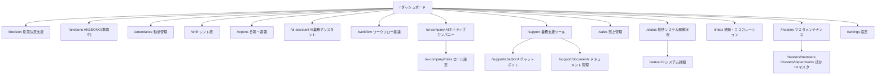

# Phase 5: 画面設計・デザインシステム

- **作成日:** 2026-07-15
- **作成ロール:** コーディングエージェント（ユーザー・運用サポート視点で U-1〜U-5 を織込み）

## 1. サイトマップ

ナビゲーション:
- **PC**: サイドメニューなし（2026-07-16 オペレーター指示で廃止）。ヘッダー（ロゴ=ホームリンク・ページタイトル・ホームボタン・**タイムカードボタン（モーダルで打刻）**・通知ベル・アカウントメニュー（API モード = プロフィール + ログアウト / モックモード = プロフィール + デモユーザー切替））+ 遷移はダッシュボードのカード型メニュー起点。未定義ルートは 404 ページ（pages/[...slug].vue）で受ける
- **モバイル**: 下部ナビ 5 項目（ホーム / 勤怠 / 日報 / 通知 / メニュー）。メニューは全機能へのシート
- 権限による出し分け: 管理者のみ（マスタ・設定・エスカレーション対応・シフト調整・勤怠ルール）。アルバイトはシフト中心のホーム

## 2. 画面定義（主要画面の構成要素）

### `/` ダッシュボード
- **カード型メニューと通知のみ**を配置（2026-07-16 オペレーター指示）
- カード型メニュー（カテゴリ: 意思決定支援 / AKEBONO / 業務ツール / AIネイティブカンパニー / 経営・状況 / 業務支援 / 管理※管理者。バッジ付き）
- 通知フィード（直近 5 件）
- 打刻はヘッダーの「タイムカード」ボタン → モーダル（PunchClock 再利用 + `/attendance?tab=daily` リンク。モーダル内リンクで遷移すると自動クローズ）

### `/sales` 売上管理（旧ダッシュボード売上サマリの独立ページ。F-15）
- KPI 行（今月売上・前年比 / 粗利率・前年差）+ 年度セレクタ
- 月次推移（LineChartCard）・事業種別内訳（DonutChartCard）・顧客別内訳（BarChartCard 横棒）
- 「意思決定支援で深掘る」導線
- 実績登録（管理者のみ・バッチ6b）: ヘッダー「実績登録」ボタン → モーダル（対象月 type=month・顧客(会社)・事業種別・売上・原価）。同一「月 × 顧客 × 事業種別」は上書き（冪等 upsert）の旨を明示

### `/attendance` 勤怠管理（タブ: 日次 / 週次 / 月次 / 休暇 / 申請 / タイムカード※管理者・人事 / 休暇管理※管理者・人事 / 設定※管理者）
- 日次: タイムライン + 6 バケット集計表 + 修正申請ボタン（理由必須モーダル）
- 月次: CalendarMonth（日別の勤務時間・休暇・アラート色）+ サマリー + 36 協定アラートパネル（45h 接近ゲージ、2〜6 ヶ月平均、45h 超回数）
- 休暇: 有給残数 KPI・特別休暇の残数カード・年 5 日義務トラッカー（進捗バー）・付与/取得履歴（UiDataTable）・申請モーダル（休暇種別セレクト = 残数のある種別のみ）
- タイムカード（F-04-8）: 開閉可能フィルター（期間・部署・氏名 autocomplete=datalist）+ テーブル（日付/名前/出勤時間/退勤時間/労働時間）。行クリックで日次へ
- 休暇管理（F-04-9）: 一覧（名前/有給日/取得日/残日/設定日）⇔ 明細（取得日付/名前/休暇種別）のモード切替 + 個別付与・一括付与モーダル（対象: 全員/雇用区分/部署・人数プレビュー・重複スキップ）
- 設定: AttendanceRule の一覧編集（雇用区分別）

### `/shift` シフト表（タブ: 募集期間 / 希望提出 / 調整※管理者 / 確定シフト）
- 調整: WeekGrid（縦=スタッフ、横=日、セル=時間帯チップ）+ 日別必要人数 vs 割当の過不足バー + バリデーション警告リスト
- 希望提出: 日別に want/ng/either をトグル + 時間帯入力（モバイル最適化: 大きめタップ領域）
- 確定シフト: 本人ビュー（モバイルはカード型リスト）

### `/reports` 日報・週報（タブ: 自分 / 全員の日報 / チーム※管理者 / 週報）
- 自分: 日付ナビ（上段 = ← / 今日 / →・下段 = 選択中の日付を直接選択可）+ エントリ行（業務テーマ自由入力 + 作業内容 + 工数ステッパー 0.25h + 進捗。**PC は 4 コントロールを 1 行に収める**・旧データのプロジェクトはテーマ表示へフォールバック）+ 所感/課題/明日 + 提出ボタン。工数と勤怠の乖離警告
- 全員の日報（バッチ5e）: 対象月セレクト + 提出済み日報の一覧（日付・名前・サマリー・工数。UiDataTable = PC 行 / モバイル カードの自動切替）→ 押下で詳細ドロワー（CommentThread 付き）
- 自分（AI アシスト入力。F-06-7）: 設定が `both` のときは「通常入力 / AI アシスト」切替トグルを表示。アシスト時は ①材料サマリカード（タスク計画の結果 x/y・ぽいぽいポスト n 件・ヒアリング回答 n/m + AI業務アシスタントへの導線。**材料の入力 UI は `/ai-assistant` へ移設**）②ドラフト生成 → 生成根拠バナー付きでフォームに流し込み、確認・修正して提出。提出済みの日は再生成不可
- チーム: 提出状況マトリクス（メンバー×日: ✓/未/休）+ リマインド送信 + 日報詳細ドロワー（CommentThread 付き）
- **AI社員の日次報告**が同一タイムラインに `UiAvatar(kind=ai)` 付きで混在表示

### `/ai-assistant` AI業務アシスタント（F-14）
- 上段: Google カレンダー連携ゲート（F-06-8 と共通の擬似 OAuth。未連携でも手動計画は可能）
- 左（明日の計画）: 対象日ナビ（既定=翌営業日。営業日は勤怠ルールの営業曜日 + 祝日マスタで勤務体系ごとに解決 = 外注等の週末稼働に対応。対象日が暦日の明日と異なる場合は「翌営業日」バッジ・祝日は「祝: 名称」バッジを表示 = オペレーター報告 2026-07-18 #4）+ 予定からの計画候補（連携時。ワンタップ計画化 + Google から同期）+ 計画カード（目的/達成条件/段取り + AI コメント + 編集/削除）+ 「AI コメントをもらう/再取得」+ 手動タスク追加モーダル
- 右（今日の振り返り）: 対象日ナビ（既定=今日）+ 計画ごとの結果・所感入力（記録後は読み取り専用 = 記録系保護）+ ぽいぽいポスト + AI ヒアリング（F-06-7 から移設）+ 「日報ドラフトを生成する」導線
- 下段（管理者のみ）: チームインサイト（直近 7 日の計画数・結果記録・完了率・振り返り記入率）
- モバイル: 左右カラムは縦積み

### `/workflow` ワークフロー（タブ: 自分の申請 / 承認待ち / 全件※管理者 / 経路設定※管理者）
- 申請作成モーダル: 区分 → 金額入力で承認経路をリアルタイムプレビュー（ApprovalFlow）
- 詳細ドロワー: 本文 + ApprovalFlow（現在ステップ強調）+ ApprovalActionBar + ApprovalLog タイムライン
- 経路設定: 区分×金額帯マトリクスの編集

### `/ai-company` AIネイティブカンパニー
- 上段: IsometricOffice（SVG アイソメトリック。デスクに AI社員アバター、状態パルス。クリックで詳細ドロワー）
- 詳細ドロワー: ロール・現在タスク・「タスクを依頼」フォーム → 分解案提示 → 承認ボタン
- 下段タブ: タスクボード（カンバン: proposed/approved/in_progress/done）/ 活動ログ（ActivityTimeline）/ 日次報告
- `/ai-company/roles`: ロール一覧 + 作成/編集モーダル（名前・ミッション・システムプロンプト・モデル層・権限チェック）

### `/decision` 意思決定支援
- テーマ一覧（カード）→ テーマ詳細: 3 カラム（①意味: 属性/KPI 表 ②関係: マスタ実データへのリンクチップ ③制約: ○/△/✗ 打ち手リスト。✗はグレーアウト+取消線）
- 選択肢 A/B/C カード（AI 推奨に ★ + ring 強調。予測影響・根拠）+ シナリオスライダー（単価・稼働率 → 予測即時再計算）
- 「この選択肢で判断を記録」→ DecisionLog へ追加 + トースト + 履歴タブに反映

### `/support` ほか
- `/support`: UiCardMenu で内部アプリ（chatbot/documents）と ExternalLink 設定分を混在表示。「リンクを追加」→ 設定へ
- `/support/chatbot`: 会話 UI（吹き出し、擬似ストリーミング、出典バッジ、サジェスト質問チップ、入力 2000 字制限）+ セッション管理（「新しい会話」ボタン・「履歴」ドロワーから過去セッションを選んで続きから再開）
- `/support/documents`: 左フォルダツリー + 右一覧（タグ・検索・プレビュードロワー）。バッチ7l で本実装:
  実ファイルのアップロード（10MB・抽出対象形式はヒント表示）・「ドライブから取込」モーダル
  （連携状態 → 検索 → 複数選択 → 取込先フォルダ。未接続は AI アシスタントの連携導線を案内・失敗分は選択に残して再試行可能）・
  ドロワーに Drive 取込/AI 検索対象バッジ + ダウンロード（署名 URL → base64 縮退）+ 取込元リンク・
  一覧下部に「アーカイブ済み（n）」トグル + 復元（原則 9.5）
- `/status`: 全体バナー（最悪値ロールアップ）+ サービスカード（UptimeBar 90 日 + uptime%）
- `/status/:id`: コンポーネント別状態 + インシデント履歴フィード + 管理者はインシデント登録/更新操作可
- `/inbox`: タブ（通知 / エスカレーション）。エスカレーションカードに 3 アクション（回答送信/裁定記録/対応不要）。裁定記録はナレッジ還流トグル付きモーダル
- `/masters`: ハブ（14 マスタ + ナレッジのカード。権限設定 `/masters/permissions` = 3 レイヤの権限ルール CRUD・祝日 `/masters/holidays` = 公式取込 + 手動管理を含む）→ 各マスタは共通レイアウト（UiFilterBar + UiDataTable + UiDrawer + UiSchemaForm）。顧客関係は 会社/人/関係種別 の 3 ページ（会社・人は RelationGraph + エッジ一覧）
- `/masters/departments`（F-10-9）: 組織図 ⇔ 一覧のビュー切替。組織図は階層ツリー（DeptOrgNode 再帰カード: 部署名・責任者バッジ・所属メンバーチップ・接続線）。詳細ドロワーに所属メンバー一覧 + 配属セレクト（他部署からの異動）。編集フォームは親部署（循環防止で自部署配下を除外）・責任者・表示順
- `/masters/leave-types`（F-10-10）: 休暇名・付与方式（周期自動/手動）・使用期限（月数。空欄=期限なし）・表示順。法定有給は「法定」バッジ付きで編集・無効化不可。休暇管理（付与の実行）への導線
- `/settings`: セクション（カスタム項目 / 汎用区分 / 外部リンク / 日報の入力方式 / 機能トグル / 勤怠ルール / 承認経路 / エスカレーションルール / 監査ログ / デモデータリセット）
- `/profile`（バッチ5e）: プロフィール画像（選択 → 256px 縮小プレビュー → 保存 / 削除）+ パスワード変更（API モードのメール/パスワード認証のみ。Google SSO・dev 認証・モックは説明文）+ アカウント情報（読み取り専用）。ヘッダーのアカウントメニュー（API モード = プロフィール + ログアウト / モックモード = プロフィール + デモユーザー切替）から遷移

## 3. デザインシステム（洗練されたシンプル）

### 3.1 デザイントークン（`app/assets/css/main.css` に一元定義）

| トークン | 値 | 用途 |
|---|---|---|
| `--c-page` | `#f6f7f8` | ページ背景（ライト基調） |
| `--c-surface` | `#ffffff` | カード・パネル |
| `--c-ink` | `#111418` | 主要文字 |
| `--c-sub` | `#4b5563` | 補助文字 |
| `--c-muted` | `#9aa1ab` | 弱い文字・プレースホルダ |
| `--c-line` | `#e5e7eb` | 罫線・カード境界 |
| `--c-brand` | `#0f6bd7` | ブランド（アクセント。akebono=夜明けの青） |
| `--c-brand-soft` | `#e8f1fc` | 選択状態・ホバー背景 |
| `--c-ok` / `--c-warn` / `--c-serious` / `--c-crit` / `--c-info` | `#12915b` / `#c77d00` / `#d96038` / `#cf3341` / `#4c66c4` | ステータス（系列色への転用禁止） |
| `--series-1..6` | `#2a78d6 #1baf7a #eda100 #7a5af5 #e2647f #4fb3c9` | チャート系列（固定順） |

- 原則: 白ベース + 低彩度グレー + 単一ブランドアクセント。**色数を増やさない**。ダークテーマは将来対応（トークン設計で余地確保）
- タイポグラフィ: システムフォントスタック + `font-feature-settings:'palt'`。数値は `tabular-nums`。見出し 20/16px、本文 14px、補助 12px（高密度業務 UI）
- 密度: 行高 32px 基準・カード内 padding 12–16px・カード間 gap 12px。ヒーロー的余白は作らない
- 角丸: カード 10px / ボタン・入力 8px / バッジ pill
- 影: 原則なし（境界線で面を区切る）。ドロワー・モーダルのみ浅い影
- アイコン: **lucide-vue-next** 16–20px、線幅デフォルト。絵文字禁止

### 3.2 レスポンシブ規範

| ブレークポイント | 挙動 |
|---|---|
| `<768px`（モバイル） | 下部ナビ表示。UiDataTable は card モード。フォームは 1 カラム。打刻ボタンは大型化 |
| `768–1024px` | 2 カラムグリッド（ヘッダー + カードメニュー遷移） |
| `>1024px` | 3–4 カラムグリッド、KPI 4–6 枚/行 |

- タッチターゲット最小 44px（モバイル）
- 横スクロールが必要な表（週別グリッド等）はコンテナ内スクロール。ページ全体は横スクロールさせない

### 3.3 インタラクション規範（X-1 の実装ルール）

1. すべてのボタン・行・カードは、遷移 / ドロワー / モーダル / トースト / 状態変化のいずれかで**必ず反応**する
2. 保存系操作は成功トースト（`aria-live`）+ 対象一覧への即時反映
3. 未実装概念（AKEBONO 等）は「準備中」の明示 + 受付系の反応（要望ボックス）を返す
4. 操作結果が他画面に波及する場合（打刻→勤怠、課題→エスカレーション）はトースト内にリンクを付け、波及先を確認できるようにする

## 4. U 基準セルフチェック

| 基準 | 対応 |
|---|---|
| U-1 入力最適化 | 選択肢化（CodeMaster 参照）・プリフィル・ステッパー・経路自動決定 |
| U-2 出力直感性 | KPI 文脈表示・状態バッジ統一・過不足バー・アラートゲージ |
| U-3 操作フロー | 打刻/日報/申請 2 クリック以内。ドロワーで一覧文脈を保持 |
| U-4 エラー誘導 | バリデーション文言に原因+次アクション。差戻しコメント必須 |
| U-5 アクセシビリティ | 共通コンポーネントで ARIA/フォーカス/コントラスト担保 |

## 5. ナビゲーション・入力/参照分離の UX 設計（バッチ7h・オペレーター指示 2026-07-19 #10）

> 現状調査（2026-07-19）: 戻る導線は子詳細ページ 6 箇所の個別実装のみで非規約化。メニュー定義は
> ダッシュボード / マスタハブ / 全機能メニューの 3 ページに分散ハードコード。入力フォームと一覧の
> 同一ページ同居は ぽいぽいポスト・議事録（フォーム上・一覧下）・会社間/人間関係マスタ（一覧上・
> フォーム下）・日報 mine タブ（エディタ + 過去一覧）が該当。チームマトリクスは管理者専用・絞り込みなし。

### 5.1 ナビゲーション情報設計（NAV_MAP = 単一レジストリ）

- **SoT**: `mockup/app/utils/nav-map.ts` に「ルート → { parent, related[] }」を一元定義する。
  ページ個別のアドホックな戻るリンク・関連リンクは廃止し、レジストリ駆動へ寄せる（原則3）。
- **戻る導線（parent）**: 階層を持つ全ページに親を宣言（例: `/masters/members` → `/masters`、
  `/support/chatbot` → `/support`、`/decision/:id` → `/decision`、トップレベル業務ページ → `/`）。
  レイアウトヘッダーのタイトル左に ArrowLeft の「親ページへ戻る」リンクとして全ページ共通描画
  （ホームボタンは従来どおり併存。ブラウザ履歴 back ではなく**構造上の親**へ戻る = 迷子にならない）。
- **関連ページ導線（related）**: 各ページに「そのページの機能に関係するマスタ・設定・関連機能」を宣言
  （例: 日報・週報 → AI業務アシスタント / 業務種別マスタ / メンバー管理 / 権限設定 / 設定（入力方式）。
  勤怠 → 休暇種別マスタ / 祝日マスタ / 勤怠ルール）。レイアウトヘッダーの「関連」ドロップダウン
  （lucide Link2）で全ページ共通描画。権限（canPath）と管理者限定フラグでフィルタし、空なら非表示。
- **モバイル**: 親リンクはヘッダー内に常時表示（44px タッチターゲット）。関連ドロップダウンも同位置。
  下部ナビ（主要 5 導線）は不変。

### 5.2 入力と参照の分離（参照 = 基本ビュー・入力 = 明示アクション）

| 画面 | Before（同居） | After |
|---|---|---|
| ぽいぽいポスト / 議事録 | フォーム上・一覧下 | **一覧が基本ビュー**。ヘッダーの「投げ込む/登録する」ボタン → 入力モーダル（本文 + 紐付け + ファイル取込ステージ）。取消/復元・詳細モーダルは不変 |
| 会社間関係 / 人間関係 | 一覧上・追加フォーム下 | マスタ標準に統一: ヘッダー「追加」ボタン → ドロワーのフォーム（他 14 マスタと同型） |
| 日報・週報 mine | エディタ + 過去一覧の縦積み | **参照が基本ビュー**（本日の提出状態カード + 過去の日報一覧）。「日報を書く」ボタンでエディタビューへ切替（大型フォームのためモーダルではなくビュー切替。提出/下書き保存後は参照へ自動復帰） |
| 判断: 勤怠の打刻・AI アシスタントの計画入力 | — | 対象外。打刻はアクション（フォームではない）・計画はその場編集が UX 上適切。マスタ系は既にドロワー分離済み |

### 5.3 カードメニューのカテゴリ化（カスタマイズ可能）

- **メニューレジストリ**: `mockup/app/utils/menu-registry.ts` にダッシュボード / マスタハブの全カードを
  安定 id 付きで一元定義（既存 3 ページのハードコード computed を置換。権限フィルタ・バッジ注入は不変）。
- **カテゴリ設定（SoT = configs）**: `menu-categories-dashboard` / `menu-categories-masters` に
  `{ id, label, cardIds[] }[]` を保存（API モード = /v1/configs・モック = appConfigs。既定値は現行の
  セクション構成から導出）。**未割当カードは自動的に「その他」カテゴリへ**（新機能のカードが消えない）。
- **表示**: カードグリッド上部にカテゴリチップ（すべて / カテゴリ…）。選択カテゴリのカードのみ表示。
  選択はページごとに sessionStorage 記憶（リロード後も維持・アカウント設定ではない = 軽い状態）。
- **カスタマイズ UI（設定ページ・管理者）**: カテゴリの追加・削除・名称変更・並び替え・カード割当
  （論理名で検索する UiMultiCombobox）。**取消フロー（原則 9.5）= 「既定に戻す」ボタン + 全操作が
  再編集で上書き可能**。削除はカテゴリ定義のみ（カードは「その他」へ戻る = データ喪失なし）。

### 5.4 チームタブの表示メンバー設定 + 日報参照権限（F-16-6）

- **表示メンバー設定（configs）**: `teamVisibleMemberIds`。チームタブの歯車（管理者）からモーダルで選択・保存。
  マトリクスの行はこの集合が基礎。**バッチ7k（オペレーター指示 2026-07-19 #13）で候補を在籍中の全メンバー
  （取締役・外注含む）へ拡大**し、モーダルの候補行・選択チップに雇用区分バッジを表示。
  未設定 = 既定表示（マトリクス = 社員・契約・アルバイト / タイムライン = 全員 = 従来どおり）。
  設定あり = マトリクス・タイムラインとも「選択メンバー + 自分」で統一（バッチ7h の「候補外は常に表示」
  特例のうち在籍中の取締役・外注分は、選択肢に出るようになったため廃止。候補に出ない在籍外 =
  退職者等は引き続き設定の影響外 = 常時表示）。判定 SoT = `mockup/app/utils/team-visibility.ts`。
- **日報参照権限（PermissionRule 擬似フィールド）**: `resource='reports'` + `field='member:<memberId>'`
  + `effect=deny` で「その対象者の日報を参照できない」をレイヤ（ロール/役職/個人）ごとに設定
  （未設定 = 参照可 = 下位互換。**自分の日報は常に参照可**）。解決は既存 canViewField と同一。
  適用範囲: チームマトリクス・全員の日報タブ・詳細ドロワー・API の日報一覧（scope=all/team）・
  チャットボットの他人日報文脈。権限設定 UI はルール一覧に擬似リソース「日報の参照対象」として追加
  （対象メンバーを論理名コンボボックスで指定。権限表マトリクスは対象がメンバー×対象者の 2 次元に
  なるため対象外 = 設計判断）。
- **チームタブの公開**: 従来の管理者専用から「reports 機能が使える全員」へ変更。ただし一括リマインド・
  工数乖離表示は従来どおり管理者/HR 限定。メンバーには「表示メンバー設定 ∩ 参照権限」の列のみ見える。
