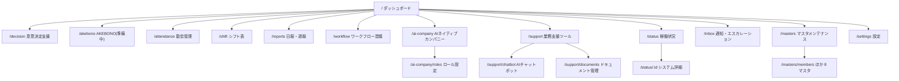

# Phase 5: 画面設計・デザインシステム

- **作成日:** 2026-07-15
- **作成ロール:** コーディングエージェント（ユーザー・運用サポート視点で U-1〜U-5 を織込み）

## 1. サイトマップ

ナビゲーション:
- **PC**: 左サイドバー（グループ: ホーム / 業務 / AI / 支援 / 管理）+ ヘッダー（ページタイトル・通知ベル・デモユーザー切替）
- **モバイル**: 下部ナビ 5 項目（ホーム / 勤怠 / 日報 / 通知 / メニュー）。メニューは全機能へのシート
- 権限による出し分け: 管理者のみ（マスタ・設定・エスカレーション対応・シフト調整・勤怠ルール）。アルバイトはシフト中心のホーム

## 2. 画面定義（主要画面の構成要素）

### `/` ダッシュボード
- 上段: あいさつ + 打刻ウィジェット（PunchClock: 状態機械ボタン + 本日タイムライン）
- KPI 行: 今月売上 / 前年比 / 承認待ち件数 / 未読通知（クリックで各画面へ）
- 売上サマリカード: 月次推移（LineChartCard）+ 事業別内訳（DonutChartCard）→「意思決定支援で深掘る」導線
- 稼働状況カード: サービス別 StatusBadge の一覧 → `/status` へ
- カード型メニュー（UiCardMenu 6 枚 + バッジ）
- 通知フィード（直近 5 件）
- **モバイル**: 打刻 → KPI 2 枚 → メニュー → 通知 の縦積み

### `/attendance` 勤怠管理（タブ: 日次 / 週次 / 月次 / 有給 / 設定※管理者）
- 日次: タイムライン + 6 バケット集計表 + 修正申請ボタン（理由必須モーダル）
- 月次: CalendarMonth（日別の勤務時間・休暇・アラート色）+ サマリー + 36 協定アラートパネル（45h 接近ゲージ、2〜6 ヶ月平均、45h 超回数）
- 有給: 残数 KPI・年 5 日義務トラッカー（進捗バー）・付与/取得履歴（UiDataTable）・申請モーダル
- 設定: AttendanceRule の一覧編集（雇用区分別）

### `/shift` シフト表（タブ: 募集期間 / 希望提出 / 調整※管理者 / 確定シフト）
- 調整: WeekGrid（縦=スタッフ、横=日、セル=時間帯チップ）+ 日別必要人数 vs 割当の過不足バー + バリデーション警告リスト
- 希望提出: 日別に want/ng/either をトグル + 時間帯入力（モバイル最適化: 大きめタップ領域）
- 確定シフト: 本人ビュー（モバイルはカード型リスト）

### `/reports` 日報・週報（タブ: 自分 / チーム※管理者 / 週報）
- 自分: 日付ナビ + エントリ行（プロジェクト select + 作業内容 + 工数ステッパー 0.25h）+ 所感/課題/明日 + 提出ボタン。工数と勤怠の乖離警告
- チーム: 提出状況マトリクス（メンバー×日: ✓/未/休）+ リマインド送信 + 日報詳細ドロワー（CommentThread 付き）
- **AI社員の日次報告**が同一タイムラインに `UiAvatar(kind=ai)` 付きで混在表示

### `/workflow` ワークフロー（タブ: 自分の申請 / 承認待ち / 全件※管理者 / 経路設定※管理者）
- 申請作成モーダル: 区分 → 金額入力で承認経路をリアルタイムプレビュー（ApprovalFlow）
- 詳細ドロワー: 本文 + ApprovalFlow（現在ステップ強調）+ ApprovalActionBar + ApprovalLog タイムライン
- 経路設定: 区分×金額帯マトリクスの編集

### `/ai-company` AIネイティブカンパニー
- 上段: IsometricOffice（SVG アイソメトリック。デスクに AI社員アバター、状態パルス。クリックで詳細ドロワー）
- 詳細ドロワー: ロール・現在タスク・「タスクを依頼」フォーム → 分解案提示 → 承認ボタン
- 下段タブ: タスクボード（カンバン: proposed/approved/in_progress/done）/ 活動ログ（ActivityTimeline）/ 日次報告
- `/ai-company/roles`: ロール一覧 + 作成/編集モーダル（名前・ミッション・システムプロンプト・モデル層・権限チェック）

### `/decision` 意思決定支援
- テーマ一覧（カード）→ テーマ詳細: 3 カラム（①意味: 属性/KPI 表 ②関係: マスタ実データへのリンクチップ ③制約: ○/△/✗ 打ち手リスト。✗はグレーアウト+取消線）
- 選択肢 A/B/C カード（AI 推奨に ★ + ring 強調。予測影響・根拠）+ シナリオスライダー（単価・稼働率 → 予測即時再計算）
- 「この選択肢で判断を記録」→ DecisionLog へ追加 + トースト + 履歴タブに反映

### `/support` ほか
- `/support`: UiCardMenu で内部アプリ（chatbot/documents）と ExternalLink 設定分を混在表示。「リンクを追加」→ 設定へ
- `/support/chatbot`: 会話 UI（吹き出し、擬似ストリーミング、出典バッジ、サジェスト質問チップ、入力 2000 字制限）
- `/support/documents`: 左フォルダツリー + 右一覧（タグ・検索・アップロードモック・プレビュードロワー）
- `/status`: 全体バナー（最悪値ロールアップ）+ サービスカード（UptimeBar 90 日 + uptime%）
- `/status/:id`: コンポーネント別状態 + インシデント履歴フィード + 管理者はインシデント登録/更新操作可
- `/inbox`: タブ（通知 / エスカレーション）。エスカレーションカードに 3 アクション（回答送信/裁定記録/対応不要）。裁定記録はナレッジ還流トグル付きモーダル
- `/masters`: ハブ（8 マスタ + ナレッジのカード）→ 各マスタは共通レイアウト（UiFilterBar + UiDataTable + UiDrawer + UiSchemaForm）。顧客関係は RelationGraph + エッジ一覧
- `/settings`: セクション（カスタム項目 / 汎用区分 / 外部リンク / 機能トグル / 勤怠ルール / 承認経路 / エスカレーションルール / 監査ログ / デモデータリセット）

## 3. デザインシステム（洗練されたシンプル）

### 3.1 デザイントークン（`app/assets/css/main.css` に一元定義）

| トークン | 値 | 用途 |
|---|---|---|
| `--c-page` | `#f6f7f8` | ページ背景（ライト基調） |
| `--c-surface` | `#ffffff` | カード・パネル |
| `--c-ink` | `#111418` | 主要文字 |
| `--c-sub` | `#4b5563` | 補助文字 |
| `--c-muted` | `#9aa1ab` | 弱い文字・プレースホルダ |
| `--c-line` | `#e5e7eb` | 罫線・カード境界 |
| `--c-brand` | `#0f6bd7` | ブランド（アクセント。akebono=夜明けの青） |
| `--c-brand-soft` | `#e8f1fc` | 選択状態・ホバー背景 |
| `--c-ok` / `--c-warn` / `--c-serious` / `--c-crit` / `--c-info` | `#12915b` / `#c77d00` / `#d96038` / `#cf3341` / `#4c66c4` | ステータス（系列色への転用禁止） |
| `--series-1..6` | `#2a78d6 #1baf7a #eda100 #7a5af5 #e2647f #4fb3c9` | チャート系列（固定順） |

- 原則: 白ベース + 低彩度グレー + 単一ブランドアクセント。**色数を増やさない**。ダークテーマは将来対応（トークン設計で余地確保）
- タイポグラフィ: システムフォントスタック + `font-feature-settings:'palt'`。数値は `tabular-nums`。見出し 20/16px、本文 14px、補助 12px（高密度業務 UI）
- 密度: 行高 32px 基準・カード内 padding 12–16px・カード間 gap 12px。ヒーロー的余白は作らない
- 角丸: カード 10px / ボタン・入力 8px / バッジ pill
- 影: 原則なし（境界線で面を区切る）。ドロワー・モーダルのみ浅い影
- アイコン: **lucide-vue-next** 16–20px、線幅デフォルト。絵文字禁止

### 3.2 レスポンシブ規範

| ブレークポイント | 挙動 |
|---|---|
| `<768px`（モバイル） | 下部ナビ表示・サイドバー非表示。UiDataTable は card モード。フォームは 1 カラム。打刻ボタンは大型化 |
| `768–1024px` | サイドバー折りたたみ（アイコンのみ）。2 カラムグリッド |
| `>1024px` | フルサイドバー。3–4 カラムグリッド、KPI 4–6 枚/行 |

- タッチターゲット最小 44px（モバイル）
- 横スクロールが必要な表（週別グリッド等）はコンテナ内スクロール。ページ全体は横スクロールさせない

### 3.3 インタラクション規範（X-1 の実装ルール）

1. すべてのボタン・行・カードは、遷移 / ドロワー / モーダル / トースト / 状態変化のいずれかで**必ず反応**する
2. 保存系操作は成功トースト（`aria-live`）+ 対象一覧への即時反映
3. 未実装概念（AKEBONO 等）は「準備中」の明示 + 受付系の反応（要望ボックス）を返す
4. 操作結果が他画面に波及する場合（打刻→勤怠、課題→エスカレーション）はトースト内にリンクを付け、波及先を確認できるようにする

## 4. U 基準セルフチェック

| 基準 | 対応 |
|---|---|
| U-1 入力最適化 | 選択肢化（CodeMaster 参照）・プリフィル・ステッパー・経路自動決定 |
| U-2 出力直感性 | KPI 文脈表示・状態バッジ統一・過不足バー・アラートゲージ |
| U-3 操作フロー | 打刻/日報/申請 2 クリック以内。ドロワーで一覧文脈を保持 |
| U-4 エラー誘導 | バリデーション文言に原因+次アクション。差戻しコメント必須 |
| U-5 アクセシビリティ | 共通コンポーネントで ARIA/フォーカス/コントラスト担保 |
