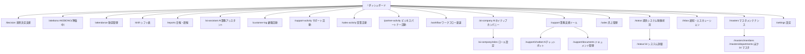

# Phase 5: 画面設計・デザインシステム

- **作成日:** 2026-07-15
- **作成ロール:** コーディングエージェント（ユーザー・運用サポート視点で U-1〜U-5 を織込み）

## 1. サイトマップ

```mermaid
graph TD
    HOME["/ ダッシュボード"]
    HOME --> DEC["/decision 意思決定支援"]
    HOME --> AKB["/akebono AKEBONO(準備中)"]
    HOME --> ATT["/attendance 勤怠管理"]
    HOME --> SHIFT["/shift シフト表"]
    HOME --> REP["/reports 日報・週報"]
    HOME --> AIA["/ai-assistant AI業務アシスタント"]
    HOME --> CLG["/customer-log 顧客活動"]
    HOME --> SUPACT["/support-activity サポート活動"]
    HOME --> SALACT["/sales-activity 営業活動"]
    HOME --> PTNACT["/partner-activity ビジネスパートナー活動"]
    HOME --> WF["/workflow ワークフロー稟議"]
    HOME --> AIC["/ai-company AIネイティブカンパニー"]
    AIC --> ROLES["/ai-company/roles ロール設定"]
    HOME --> SUP["/support 業務支援ツール"]
    SUP --> BOT["/support/chatbot AIチャットボット"]
    SUP --> DOCS["/support/documents ドキュメント管理"]
    HOME --> SAL["/sales 売上管理"]
    HOME --> ST["/status 提供システム稼働状況"]
    ST --> STD["/status/:id システム詳細"]
    HOME --> INB["/inbox 通知・エスカレーション"]
    HOME --> MST["/masters マスタメンテナンス"]
    MST --> M1["/masters/members /masters/departments ほか 14 マスタ"]
    HOME --> SET["/settings 設定"]
```

ナビゲーション:
- **PC**: サイドメニューなし（2026-07-16 オペレーター指示で廃止）。ヘッダー（ロゴ=ホームリンク・ページタイトル・ホームボタン・**タイムカードボタン（モーダルで打刻）**・通知ベル・アカウントメニュー（API モード = プロフィール + ログアウト / モックモード = プロフィール + デモユーザー切替））+ 遷移はダッシュボードのカード型メニュー起点。未定義ルートは 404 ページ（pages/[...slug].vue）で受ける
- **モバイル**: 下部ナビ 5 項目（ホーム / 勤怠 / 日報 / 通知 / メニュー）。メニューは全機能へのシート
- 権限による出し分け: 管理者のみ（マスタ・設定・エスカレーション対応・シフト調整・勤怠ルール）。アルバイトはシフト中心のホーム

## 2. 画面定義（主要画面の構成要素）

### `/` ダッシュボード
- **カード型メニューと通知のみ**を配置（2026-07-16 オペレーター指示）
- カード型メニュー（カテゴリ: 意思決定支援 / AKEBONO / 業務ツール / AIネイティブカンパニー / 経営・状況 / 業務支援 / 管理※管理者。バッジ付き）
- 通知フィード（サイド欄。「すべて」+ カテゴリタブ〔エスカレーション/承認依頼/稟議/**日報/顧客活動/議事録**〕 + 未読のみフィルタ。直近 8 件）。**表示するカテゴリタブはレイアウトの「通知タブ」で設定可**（ユーザー > 全社 > 既定。「すべて」は常時表示。2026-08-12）
- 打刻はヘッダーの「タイムカード」ボタン → モーダル（PunchClock 再利用 + `/attendance?tab=daily` リンク。モーダル内リンクで遷移すると自動クローズ）。**ダッシュボードの「レイアウト」ボタン左にも同一挙動の「タイムカード」ボタンを配置（2026-08-12・`/attendance` 権限保持時のみ・ページローカルの同一モーダル）**
- **表示・配置カスタマイズ（レイアウト。オペレーター指示 2026-08-03。詳細 = 5.6。2026-08-18 分離）**: ヘッダー右の「レイアウト」ボタン → モーダル。**「レイアウト（通知の配置）」（通知欄の位置を「上」「右」「下」「非表示」の 4 択から選択・プレビュー付き。セクション構成は変更しない）**／**「セクション設定」（サブモード「テンプレート」= 6 種・プレビュー付き〔**notify-first = 通知を最上段に全幅配置 = 改善要望 2026-08-17**。適用時は通知の配置を維持〕と「自由設定」= 追加・削除・改名・並び替え・カード割当〔候補 = 基本メニュー + 外部リンク + AKEBONO 業態アプリ。**セクション内のカード並び順をドラッグ&ドロップ or ↑/↓ で入れ替え可〔cardIds の配列順 = 表示順〕= 改善要望 2026-08-17**〕+ **お気に入り保存・呼び出し**）**／**「アプリヘッダー」（ヘッダーのクイックアクセス設定。候補に AIチャットボット・改善のタネを追加 = 2026-08-17・**通知ベル = 2026-08-18**。従来ヘッダー右の「表示」ボタンから移設。2026-08-12）**／**「通知タブ」（通知欄・通知センターに出すカテゴリタブの設定。2026-08-12）**をタブ切替。**ユーザー設定 > テナント設定 > デフォルト**の 3 階層で解決（セクション配置・ヘッダークイックアクセス・通知タブも同 3 階層）
- **ヘッダーのパス表示（パンくず。全ページ共通 = 改善要望 2026-08-17）**: ブランド（/）に続けて nav-map の parent 連鎖による**全階層**を `/` 区切りで表示し、**各階層は押下でその場所へ遷移できる**（NuxtLink）。現在ページ名は resolvePageLabel（ナビ + カードメニュー + nav-map 導線ラベルの合併 = 2 階層目のサブページも固有名）。中間階層はモバイルでは非表示（sm+）・現在ページ名は常時表示（truncate）
- **通知からの遷移（改善要望 2026-08-17）**: 通知の link に対象を特定するクエリを含め、対象の情報が即時見える状態で遷移する（稟議 = `/workflow?open=<id>` で詳細ドロワー直開・日報コメント = `/reports?date=<日付>` で対象日を初期表示。勤怠・休暇は従来から `?tab=` で対象タブ直行）。他の通知源も同パターンで順次対応する

### `/sales` 売上管理（旧ダッシュボード売上サマリの独立ページ。F-15）
- KPI 行（今月売上・前年比 / 粗利率・前年差）+ 年度セレクタ
- 月次推移（LineChartCard）・事業種別内訳（DonutChartCard）・顧客別内訳（BarChartCard 横棒）
- 「意思決定支援で深掘る」導線
- 実績登録（管理者のみ・バッチ6b）: ヘッダー「実績登録」ボタン → モーダル（対象月 type=month・顧客(会社)・事業種別・売上・原価）。同一「月 × 顧客 × 事業種別」は上書き（冪等 upsert）の旨を明示

### `/attendance` 勤怠管理（タブ: 日次 / 週次 / 月次 / 休暇 / 申請 / 全員のタイムカード※権限表制御 / 休暇管理※管理者・人事 / 設定※管理者）
- 日次: タイムライン + 6 バケット集計表 + 修正申請ボタン（理由必須モーダル）
- 月次: CalendarMonth（日別の勤務時間・休暇・アラート色）+ サマリー + 36 協定アラートパネル（45h 接近ゲージ、2〜6 ヶ月平均、45h 超回数）
- 休暇: 有給残数 KPI・特別休暇の残数カード・年 5 日義務トラッカー（進捗バー）・付与/取得履歴（UiDataTable）・申請モーダル（休暇種別セレクト = 残数のある種別のみ）
- 全員のタイムカード（F-04-8。旧称: タイムカード = 2026-07-22 改称）: 開閉可能フィルター（期間・部署・氏名 autocomplete=datalist）+ テーブル（日付/名前/出勤時間/退勤時間/労働時間）。行クリックで日次へ（他メンバーの日次は管理者/人事のみ）。**参照可否は権限表（attendance / timecard-all。既定 = 管理者/人事）で管理**
- 休暇管理（F-04-9）: 一覧（名前/有給日/取得日/残日/設定日）⇔ 明細（取得日付/名前/休暇種別）のモード切替 + 個別付与・一括付与モーダル（対象: 全員/雇用区分/部署・人数プレビュー・重複スキップ）
- 設定: AttendanceRule の一覧編集（雇用区分別）

### `/timecard` タイムカード（本人・独立メニュー。F-04-10 = 2026-07-22 で `/attendance` のタブから切り出し）
- **ログインユーザー本人のタイムカードのみ**。打刻ウィジェット（WidgetsPunchClock。打刻対象外メンバーは案内のみ）+ 期間フィルター（から/まで・上限 62 日）+ 出退勤テーブル（日付/出勤時間/退勤時間/休憩/労働時間）+ 出勤日数・実労働合計
- 休暇申請モーダルの「理由」は placeholder「任意。承認者への補足があれば記入してください」（2026-07-22 で hint から移動）

### `/shift` シフト表（タブ: 募集期間 / 希望提出 / 調整※管理者 / 確定シフト。タブ利用可否は権限表のタブ行 F-16-8 でも制御可 = 2026-08-18）
- 調整: WeekGrid（縦=スタッフ、横=日、セル=時間帯チップ）+ 日別必要人数 vs 割当の過不足バー + バリデーション警告リスト
- 希望提出: 日別に want/ng/either をトグル + 時間帯入力（モバイル最適化: 大きめタップ領域）
- 確定シフト: 本人ビュー（モバイルはカード型リスト）

### `/reports` 日報・週報（タブ: 自分の日報 / 自分の週報 / 全員の日報 / 全員の週報 / チーム = 2026-07-22 で再編。旧 `?tab=weekly` は自分の週報へ互換マップ。タブ利用可否は権限表のタブ行 F-16-8 でも制御可 = 2026-08-18）
- 自分の日報: 日付ナビ（上段 = ← / 今日 / →（月ビュー時は ← / 今月 / →）・下段 = 選択中の日付を直接選択可）+ **表示モード「週」「月」トグル（週 = 週ストリップ・月 = 1 日〜末日の横スクロール / カレンダー形式の 2 ビュー。日クリックで選択日切替 = 2026-07-22）** + **共通ヘッダ 1 行のテーブル形式エントリ入力（テーマ自由入力 + 内容 + 時間ステッパー 0.25h = 2026-07-22 で名称変更・テーブル化**・**「進捗」列は入力フォームでは非表示 = オペレーター指示 2026-07-31。既存データの進捗値は編集・保存でも保持し、参照表示（提出済み表示・詳細ドロワー）には引き続き出る = 原則7**・旧データのプロジェクトはテーマ表示へフォールバック）+ **本日の所感 / 本日の課題（旧称: 所感/課題 → 2026-08-03 改称。本日の課題は種別セレクト〔UiSelect・空 = 未選択・DAILY_ISSUE_CATEGORY_PRESETS の 11 種〕付き）** + **明日の予定（テーマ/目的/内容/時間 × 最大 3 件。翌営業日の日報エントリへ自動反映 + 反映元バナー。旧自由記述は互換表示）** + **改善のタネ欄（フォーム最下部。2026-08-03 で提出時は入力必須化・ラベルから「（任意）」を除去・説明ヒント文〔マークダウン注記・自動共有・スキップ〕を撤去。提出成立時にトップメニューの改善のタネと同一経路〔useNotes 'poipoi'〕で登録・登録成功で欄をクリア = 二重登録しない・失敗は警告のみで日報フローは止めない = 原則4。日付/ユーザー切替でクリア）** + 提出ボタン（ぽいぽい未入力なら警告して提出中断）。時間と勤怠の乖離警告
- 全員の日報（バッチ5e）: 対象月ナビ（← / 今月 / → + 月直接選択 = 「自分」の日付ナビと対称。指示 2026-07-21 #2）+ **部署・メンバー絞り込み（2026-07-22。AI 社員の日報は絞り込み未指定時のみ表示）** + 提出済み日報の一覧（日付・名前・サマリー・時間。UiDataTable = PC 行 / モバイル カードの自動切替）→ 押下で詳細ドロワー（CommentThread 付き）。**既読/未読管理（オペレーター指示 2026-07-31 = 永続化 SoT report_reads）: 未読行に「未読」バッジ・フィルタバーに未読件数 + 「未読のみ」トグル。ドロワーを開くと自動で既読・ドロワー内「未読に戻す」で取消（原則9.5）。自分の日報は既読管理の対象外**
- **改修依頼 2026-08-18**: ①日報 3 項目（本日の所感・本日の課題・改善のタネ）と週報 4 項目（今週の成果・課題と原因仮説・うまくいったこと・来週の最重要テーマ）の placeholder を**具体的な記入例文**（「例）商品ページの改善を予定通り完了。…」等）へ変更 ②月・横スクロールで**選択中日付の青枠（ring）が上端で欠ける**表示を修正（ボタンの `pb-1` → `py-1`）③**タブ利用可否**を権限表のタブ行（F-16-8 = `tab:<key>`）で制御（deny のタブは非表示・`?tab=` 直打ちは先頭の利用可能タブへ退避）
- **改善要望 2026-08-17（6 件）**: ①自分の日報の既定表示 = **月・横スクロール**（従来は週）②エディタ上部に **Google カレンダー取込**（F-14 と同じ `useCalendar`。未連携は `WidgetsCalendarConnectGate`・連携済みは「カレンダーから予定を取込」ボタン = 同期 → その日の予定をエントリ行へ変換〔時間 = 0.25h 刻み・同名はスキップ = 冪等〕）③「ぽいぽいポスト」の表示名を**「改善のタネ」へ改称**（内部キー・ルートは不変）④フォームの**改善のタネ欄を明日の予定の上へ移動**⑤参照表示の**「（管理者へ共有済み）」表記を削除**⑥**本日の課題は所感と同じプレーン表現**（warn 背景・カード化を廃止。種別チップは維持）
- 自分（AI アシスト入力。F-06-7）: 設定が `both` のときは「通常入力 / AI アシスト」切替トグルを表示。アシスト時は ①材料サマリカード（タスク計画の結果 x/y・改善のタネ n 件・ヒアリング回答 n/m + AI業務アシスタントへの導線。**材料の入力 UI は `/ai-assistant` へ移設**）②ドラフト生成 → 生成根拠バナー付きでフォームに流し込み、確認・修正して提出。提出済みの日は再生成不可
- チーム: 週/月ナビ + **表示モード「週」「月」トグル（月 = 1 日〜末日の横スクロールマトリクス / カレンダー形式（日別提出数 + 選択日の詳細リスト）の 2 ビュー = 2026-07-22）** + **部署・メンバー絞り込み（2026-07-22）** + 提出状況マトリクス（メンバー×対象日: ✓/未）+ リマインド送信（本日以前の最新対象日）+ 日報詳細ドロワー（CommentThread 付き）
- 自分の週報: 週ナビ（← / 今週 / → + 週レンジ表示。指示 2026-07-21 #2）で参照週を選択し、その週の自分の週報を編集・提出。**入力欄（2026-08-03 改称・追加）= 今週の成果・達成感（旧: 今週の目標達成）/ 今週の主要業務（旧: 主要業務・必須）/ 課題・原因仮説（旧: 課題）/ 来週の最重要テーマ（最大3つ・旧: 来週の予定）/ うまくいったこと・続けたいこと（新規）/ チーム共有事項（新規 = 種別チップ〔相談したい/判断してほしい/対応を依頼したい/特になし・既定「特になし」〕+ 自由入力〔任意〕）**
- 全員の週報（F-06-11 = 2026-07-22 新設）: サブタブ（全員の週報 / AI インサイト = 旧週報タブから移設）+ 週ナビ + 部署・メンバー絞り込み + 選択週の提出済み週報一覧（参照可否は権限表「日報・週報の参照対象」F-16-6）→ 押下で詳細ドロワー。**既読/未読管理（2026-07-31）: 全員の日報と同一 = 未読バッジ・未読件数・「未読のみ」トグル・開いて既読・「未読に戻す」**
- **AI社員の日次報告**が同一タイムラインに `UiAvatar(kind=ai)` 付きで混在表示

### `/ai-assistant` AI業務アシスタント（F-14）
- 上段: 対象メンバー切替セレクト（F-16-7 で許可された対象者のみ選択肢に出る。他メンバー選択時は「閲覧のみ」バナー + 全操作無効化 = readonly / 自分に戻す導線。指示 2026-07-21）+ Google カレンダー連携ゲート（自分の表示時のみ。F-06-8 と共通の擬似 OAuth。未連携でも手動計画は可能）
- 左（明日の計画）: 対象日ナビ（既定=翌営業日。営業日は勤怠ルールの営業曜日 + 祝日マスタで勤務体系ごとに解決 = 外注等の週末稼働に対応。対象日が暦日の明日と異なる場合は「翌営業日」バッジ・祝日は「祝: 名称」バッジを表示 = オペレーター報告 2026-07-18 #4）+ 予定からの計画候補（連携時・自分の表示時。ワンタップ計画化 + Google から同期）+ 計画カード（目的/達成条件/段取り + AI コメント + **status を問わず 編集/削除/AI コメント取得**。誤登録の訂正 = 指示 2026-07-21）+ 手動タスク追加モーダル
- 右（今日の振り返り）: 対象日ナビ（既定=今日）+ 計画ごとの結果・所感入力（**記録後も「結果を編集」で本人が訂正可 = キャンセルで取消。指示 2026-07-21**）+ done 項目にも AI コメント表示/後追い取得 + 改善のタネ + AI ヒアリング（F-06-7 から移設。readonly 時は記録済み回答の読み取り表示のみ）+ 「日報ドラフトを生成する」導線
- 実行中フィードバック（指示 2026-07-21 #3）: 主要な非同期ボタン（AI コメント・結果記録・計画保存・削除・同期・ぽいぽい・回答）は押下でスナックバー通知 + ボタンをプログレスサークル（UiButton `:loading` = `useAsyncAction`）で loading 表示・二重送信防止
- 下段（管理者・自分の表示時のみ）: チームインサイト（直近 7 日の計画数・結果記録・完了率・振り返り記入率）
- モバイル: 左右カラムは縦積み

### `/customer-log` 顧客活動（旧「顧客ログ」= 改修依頼 2026-08-18 で改称。2026-07-30 → 項目拡張 2026-07-31）
- ヘッダ: 「記録する」ボタン + 再読み込み（**対象メンバー切替は撤去 = 改修依頼 2026-08-18: 一覧は全メンバーの記録を全員が閲覧できる**）
- フィルタ: 検索（会社名・担当者・活動目的・活動手段・自社担当者・記録者・メモ）+ 顧客（会社）絞り込み + **記録者絞り込み（全メンバー閲覧化に伴い追加）**
- 一覧: 日時（開始〜終了・開始のみ・日付のみの 3 形態）・顧客会社・担当者・**活動手段チップ + 活動目的チップ**・記録者・件名・冒頭（担当者メモ）。**ページング（1 ページ 20 件 = X-7・useListView + UiPagination）**。押下で詳細モーダル（**活動目的 + 活動手段 + 自社担当者 + 担当者メモ** + 記録者 + 編集履歴。自分の記録は編集/取消ボタン。議事録メモは 2026-08-03 に廃止）。編集/取消アイコンは自分の記録のみ
- 登録・編集モーダル（2026-07-31 拡張 → 2026-08-18 活動手段追加）: 日付（必須）・**開始/終了時間（任意・分は 15 分単位のセレクト = 旧データの単位外時刻は編集時のみ選択肢へ補完 = 原則7。終了は開始必須 + 開始より後）**・**活動目的（旧「属性タグ」。プリセットチップ（商談/取材/イベント/定例/会食/電話/その他）+ 自由入力追加・最大 10 件）**・**活動手段（活動目的の下に同型のチップ列 = UiChipTabs 単一選択。未設定/訪問/Web会議/電話/メール/チャット/その他）**・**顧客会社（必須・コンボボックス = 検索 + 自由入力。未登録名は保存時にマスタへ新規登録して反映・正規化名一致は既存へ名寄せ）**・**担当者（任意・コンボボックス = 選択会社の連絡先 + 自由入力で新規登録。会社未入力時は非活性）**・**自社の担当者（必須セレクト・既定 = ログインユーザー）**・件名（任意）・**担当者メモ（必須。議事録メモは 2026-08-03 に廃止 = オペレーター指示）**
- 取消済み（自分のみ）: 折りたたみ表示 + 「元に戻す」で復元（原則9.5）
- AI 参照: 登録した記録は AI（チャットボット・日報アシスト）の参照対象（**自分の記録のみ** = 本人スコープ。一覧の全員閲覧化後も維持 = 設計判断）
- モバイル: 一覧はカード型・モーダルはフルワイド（時刻・チップはモバイルでも縦積みグリッド）

### `/support-activity` サポート活動（改修依頼 2026-08-18 新設・F-43）
- フィルタバー: 検索（件名・内容・顧客名・問い合わせ者・対象システム）+ ステータス/問い合わせ種別セレクト + 再読み込み + 「登録する」
- 一覧: UiDataTable（受付日時・顧客・件名・種別・優先度バッジ・ステータスバッジ・担当）+ **ページング（20 件 = X-7。モック = クライアント / API = サーバーページング `apiListPage`）**。行押下で詳細ドロワー
- 詳細ドロワー: 全 15 項目の定義リスト表示 → 「編集」でフォームへ（view/edit/create の 3 モード = masters 系と同型）。「取り消す」= 確認ダイアログ + 論理削除・下部の取消済みセクションから復元（原則9.5）
- フォーム: 受付日（必須）+ 受付時刻・顧客会社（必須・コンボボックス = 未登録名は新規マスタ登録）・問い合わせ者・対象システム・種別/優先度/ステータス（セレクト）・件名（必須）・問い合わせ内容（必須）・自社担当者（既定 = ログインユーザー）・対応内容/原因/解決内容・完了日 + 完了時刻・改善・ナレッジのタネ
- チーム共有: 全員が閲覧・登録・編集可（記録者は表示のみ）。主要操作はトースト・モバイルはカード型 + 縦積みグリッド

### `/sales-activity` 営業活動（改修依頼 2026-08-18 新設・F-44）
- フィルタバー: 検索（商談名・顧客名・課題）+ 商談フェーズ/商談種別セレクト + 再読み込み + 「登録する」
- 一覧: UiDataTable（顧客・商談名・種別・フェーズバッジ・商談金額〔¥ 右寄せ〕・確度・受注予定・Next Action・担当）+ **ページング（20 件 = X-7）**。行押下で詳細ドロワー
- フォーム: 顧客会社（必須・コンボボックス）・商談名（必須）・種別/フェーズ/担当者・商談金額（円・整数）・受注確度（%・0〜100）・受注予定日・顧客課題・提案概要・Next Action + Next Action日
- チーム共有・取消/復元・トースト・モバイル対応はサポート活動と同型

### `/partner-activity` ビジネスパートナー活動（改修依頼 2026-08-18 新設・F-45）
- フィルタバー: 検索（パートナー・テーマ・関連企業）+ ステータス/活動区分セレクト + 再読み込み + 「登録する」
- 一覧: UiDataTable（パートナー・テーマ名・関連企業・活動区分・ステータスバッジ・Next Action・Next Action日・担当）+ **ページング（20 件 = X-7）**。行押下で詳細ドロワー
- 詳細ドロワー: 定義リスト + **関連商談は営業活動へのリンク表示（/sales-activity へ遷移 = 「案件化したら商談へリンク」）**
- フォーム: パートナー（必須・自由入力）・関連企業（自由入力）・テーマ名（必須）・活動区分/ステータス/自社担当者・概要・現在状況・Next Action + Next Action日・関連MTG・**関連商談（有効な営業活動から選択・既存リンクが取消済みでも保持 = 原則7）**・メモ
- チーム共有・取消/復元・トースト・モバイル対応はサポート活動と同型

### `/workflow` 稟議（旧称: ワークフロー = 2026-07-22 改称。タブ: 自分の申請 / 承認待ち / 全件※管理者 / 経路設定※管理者。タブ利用可否は権限表のタブ行 F-16-8 でも制御可 = 2026-08-18）
- 申請作成モーダル: 区分 → 金額入力で承認経路をリアルタイムプレビュー（ApprovalFlow）。**区分は説明文を並記したカード型ラジオ選択（UiRadioCards = 全幅 2 列〔モバイル 1 列〕。各カード = 区分名 + 用途説明 `WORKFLOW_CATEGORY_DESCRIPTIONS`。説明を確認しながら選択できる = 改修依頼 2026-08-18。旧「選択中区分のみヒント表示」〔改善要望 2026-08-17〕を置換）**。**本文は「目的」「内容」に分割（2026-07-22）。内容は区分別テンプレート（標準 + 購買/契約/経費/採用/出張 = utils/workflow-templates.ts）を選択して呼び出せる（入力済みなら上書き確認）**
- 詳細ドロワー: **目的 + 内容（マークダウン描画。旧データは body を「本文」として互換表示）** + ApprovalFlow（現在ステップ強調・**各ノードに種別バッジ〔承認/決裁/確認〕= 改善要望 2026-08-17**）+ ApprovalActionBar + ApprovalLog タイムライン
- 経路設定: 区分×金額帯マトリクスの編集。**各ステップに種別（承認/決裁/確認）を設定でき、一覧チップ・フロー可視化に表示（未設定の旧経路は 最終=決裁・他=承認 の表示既定）。担当は 役職/ロール/個人 に加え「申請者本人」を指定可（確認ステップの既定担当。提出時にその申請の申請者へ解決して凍結）。新規経路の既定 = 決裁（管理者）→ 確認（申請者本人）。改善要望 2026-08-17**
- **通知ディープリンク（改善要望 2026-08-17）**: 承認依頼・決裁・却下/差戻し通知の link は `/workflow?open=<申請id>` = 通知から対象申請の詳細ドロワーを直接開く（開いたら query は除去）

### `/ai-company` AIネイティブカンパニー
- 上段: IsometricOffice（SVG アイソメトリック。デスクに AI社員アバター、状態パルス。クリックで詳細ドロワー）
- 詳細ドロワー: ロール・現在タスク・「タスクを依頼」フォーム → 分解案提示 → 承認ボタン
- 下段タブ: タスクボード（カンバン: proposed/approved/in_progress/done）/ 活動ログ（ActivityTimeline）/ 日次報告
- `/ai-company/roles`: ロール一覧 + 作成/編集モーダル（名前・ミッション・システムプロンプト・モデル層・権限チェック）

### `/decision` 意思決定支援
- テーマ一覧（カード）→ テーマ詳細: 3 カラム（①意味: 属性/KPI 表 ②関係: マスタ実データへのリンクチップ ③制約: ○/△/✗ 打ち手リスト。✗はグレーアウト+取消線）
- 選択肢 A/B/C カード（AI 推奨に ★ + ring 強調。予測影響・根拠）+ シナリオスライダー（単価・稼働率 → 予測即時再計算）
- 「この選択肢で判断を記録」→ DecisionLog へ追加 + トースト + 履歴タブに反映

### `/support` ほか
- `/support`: UiCardMenu で内部アプリ（chatbot/documents）と ExternalLink 設定分を混在表示。「リンクを追加」→ 設定へ
- `/support/chatbot`: 会話 UI（吹き出し、擬似ストリーミング、出典バッジ、サジェスト質問チップ、入力 2000 字制限）+ セッション管理（「新しい会話」ボタン・「履歴」ドロワーから過去セッションを選んで続きから再開）
- `/support/documents`: 左フォルダツリー + 右一覧（タグ・検索・プレビュードロワー）。バッチ7l で本実装:
  実ファイルのアップロード（10MB・抽出対象形式はヒント表示）・「ドライブから取込」モーダル
  （連携状態 → 検索 → 複数選択 → 取込先フォルダ。未接続は AI アシスタントの連携導線を案内・失敗分は選択に残して再試行可能）・
  ドロワーに Drive 取込/AI 検索対象バッジ + ダウンロード（署名 URL → base64 縮退）+ 取込元リンク・
  一覧下部に「アーカイブ済み（n）」トグル + 復元（原則 9.5）
- `/status`: 全体バナー（最悪値ロールアップ）+ サービスカード（UptimeBar 90 日 + uptime%）
- `/status/:id`: コンポーネント別状態 + インシデント履歴フィード + 管理者はインシデント登録/更新操作可
- `/inbox`: タブ（「すべて」+ カテゴリタブ〔エスカレーション/承認依頼/稟議/日報/顧客活動/議事録。既定は全カテゴリ・レイアウトの「通知タブ」設定に従う〕 + 管理者のみ「エスカレーション対応」）。**ディープリンク対応（2026-08-18）: `?tab=` で対象タブを直接開き、`?open=<エスカレーションid>` で管理者の対応モーダルを直接開く（エスカレーション通知の遷移先）。各通知のリンクは対象行のデータ詳細が見える箇所へのディープリンク（稟議 `?open=`・日報 `?date=`・勤怠 `?tab=requests`・シフト `?tab=`・改善のタネ `?open=`・AI タスク `?task=`）**。カテゴリタブは通知欄と共通の設定・分類・**並び順**（共有 `notificationTabViews`。ダッシュボード通知カードとタブ順が一致 = 原則3。オペレーター指示 2026-08-12）。管理者の「エスカレーション対応」はカテゴリ絞り込みの「エスカレーション」タブ（通知の種別フィルタ）とは別の管理ビュー（open/解決の対応）。エスカレーションカードに 3 アクション（回答送信/裁定記録/対応不要）。裁定記録はナレッジ還流トグル付きモーダル
- `/masters`: ハブ（14 マスタ + ナレッジのカード。権限設定 `/masters/permissions` = 3 レイヤの権限ルール CRUD・祝日 `/masters/holidays` = 公式取込 + 手動管理を含む）→ 各マスタは共通レイアウト（UiFilterBar + UiDataTable + UiDrawer + UiSchemaForm）。顧客関係は 会社/人/関係種別 の 3 ページ（会社・人は RelationGraph + エッジ一覧）
- `/masters/departments`（F-10-9）: 組織図 ⇔ 一覧のビュー切替。組織図は階層ツリー（DeptOrgNode 再帰カード: 部署名・責任者バッジ・所属メンバーチップ・接続線）。詳細ドロワーに所属メンバー一覧 + 配属セレクト（他部署からの異動）。編集フォームは親部署（循環防止で自部署配下を除外）・責任者・表示順
- `/masters/leave-types`（F-10-10）: 休暇名・付与方式（周期自動/手動）・使用期限（月数。空欄=期限なし）・表示順。法定有給は「法定」バッジ付きで編集・無効化不可。休暇管理（付与の実行）への導線
- `/settings`: セクション（カスタム項目 / 汎用区分 / 外部リンク / 日報の入力方式 / **改善のタネの通知先（2026-08-03。SettingsNotifyRecipientsEditor = ロール/役職/個人を複数指定・各行に解決人数プレビュー・空 = 通知なし）** / 機能トグル / 勤怠ルール / 承認経路 / エスカレーションルール / 監査ログ / デモデータリセット）
  - **外部リンクのアイコン設定（改善要望・2026-08-12）**: 追加/編集モーダルのアイコン欄は `SettingsIconPicker`。**プレビュー付きのプリセット選択（`LINK_ICON_CHOICES`）**か、**画像アップロード（`UiIconGlyph` プレビュー・160px 縮小 → data URI・PNG は透過保持・上限超過は警告）**の二者択一。画像設定時は「アイコンに戻す」で選択式へ戻せる（取消・原則9.5）。処理中は保存ボタンを無効化（フィードバック）。表示（設定一覧・`/support`・ダッシュボードのカードメニュー = `UiCardMenu`）は `UiIconGlyph` で画像優先描画。モックは localStorage 容量超過時に警告（segments と同型）
- `/profile`（バッチ5e）: プロフィール画像（選択 → 256px 縮小プレビュー → 保存 / 削除）+ パスワード変更（API モードのメール/パスワード認証のみ。Google SSO・dev 認証・モックは説明文）+ アカウント情報（読み取り専用）。ヘッダーのアカウントメニュー（API モード = プロフィール + ログアウト / モックモード = プロフィール + デモユーザー切替）から遷移

### `/media` メディア分析（F-40。**トップメニュー = HOME 直下**・2026-08-03 独立チャンネル化。初出 2026-07-28）
サイトマップ上の位置: HOME 直下（旧 AKEBONO 業務配下から移動）。ダッシュボードの「経営・状況」カテゴリにカード配置。
メディア分析は **独立したメディアチャンネル**（任意で業態と連携）を単位に動く。全画面の先頭に MediaChannelBar
（対象チャンネル切替 + 連携業態バッジ/単体バッジ + GA 連携バッジ + 一覧/設定導線）を置く。
- `/media`: ハブ（MediaChannelBar + チャンネル一覧（連携済み/単体を区別）+ 「チャンネルを追加」+ 機能カード + 現在チャンネルのサマリー KPI / 未連携は MediaGaConnect ゲート）
- `/media/analytics`: タブ（メディア分析 / 業務 × メディア PDCA）。KPI 8 枚 + 日別/チャネル/デバイス/記事別チャート + セクション表 + AI インサイト（生成 → 保管 → 再生成。外部投稿記事も材料）。API モードはロード中・取得失敗（再試行導線）・データ空・部分失敗警告を区別表示。**PDCA タブは連携済みチャンネルのみ** = 未連携は「連携すると使える」案内。統合取得失敗時は 0 表示せず失敗表示 + 再試行（M1）
- `/media/articles`: AI 記事生成スタジオ（フォーム → プレビュー（品質スコア・Vertex AI/自動生成表示）→ 採用（セクション選択）/ 取消・復元。「分析からお題を提案」。未連携チャンネルでも利用可）
- `/media/settings`（管理者）: チャンネルセレクタ + チャンネル追加 + 取消済みチャンネルの復元 + GA 連携（モック = 擬似同意モーダル / API = OAuth リダイレクト → 復帰 ?ga=&channel= クエリ → GA4 プロパティ選択モーダル。needsProperty の中間状態から再開可）+ **連携する Akebono 業務アプリ（業態）選択（任意・未選択可）** + AI 分析設定フォーム + **外部投稿記事の管理（一覧・追加・編集・取消/復元）** + チャンネルの取消
- `/akebono/dashboard`・`/akebono/company`（F-41）: 業務 × メディアの統合サマリー + AI レポート/インサイト（会社全体は売上権限。API モードは売上軸・保管がモックのためモックバッジ表示）

## 3. デザインシステム（洗練されたシンプル）

### 3.1 デザイントークン（`app/assets/css/main.css` に一元定義）

| トークン | 値 | 用途 |
|---|---|---|
| `--c-page` | `#f6f7f8` | ページ背景（ライト基調） |
| `--c-surface` | `#ffffff` | カード・パネル |
| `--c-ink` | `#111418` | 主要文字 |
| `--c-sub` | `#4b5563` | 補助文字 |
| `--c-muted` | `#9aa1ab` | 弱い文字・プレースホルダ |
| `--c-line` | `#e5e7eb` | 罫線・カード境界 |
| `--c-brand` | `#0f6bd7` | ブランド（アクセント。akebono=夜明けの青） |
| `--c-brand-soft` | `#e8f1fc` | 選択状態・ホバー背景 |
| `--c-ok` / `--c-warn` / `--c-serious` / `--c-crit` / `--c-info` | `#12915b` / `#c77d00` / `#d96038` / `#cf3341` / `#4c66c4` | ステータス（系列色への転用禁止） |
| `--series-1..6` | `#2a78d6 #1baf7a #eda100 #7a5af5 #e2647f #4fb3c9` | チャート系列（固定順） |

- 原則: 白ベース + 低彩度グレー + 単一ブランドアクセント。**色数を増やさない**。ダークテーマは将来対応（トークン設計で余地確保）
- タイポグラフィ: システムフォントスタック + `font-feature-settings:'palt'`。数値は `tabular-nums`。見出し 20/16px、本文 14px、補助 12px（高密度業務 UI）
- 密度: 行高 32px 基準・カード内 padding 12–16px・カード間 gap 12px。ヒーロー的余白は作らない
- 角丸: カード 10px / ボタン・入力 8px / バッジ pill
- 影: 原則なし（境界線で面を区切る）。ドロワー・モーダルのみ浅い影
- アイコン: **lucide-vue-next** 16–20px、線幅デフォルト。絵文字禁止

### 3.2 レスポンシブ規範

| ブレークポイント | 挙動 |
|---|---|
| `<768px`（モバイル） | 下部ナビ表示。UiDataTable は card モード。フォームは 1 カラム。打刻ボタンは大型化 |
| `768–1024px` | 2 カラムグリッド（ヘッダー + カードメニュー遷移） |
| `>1024px` | 3–4 カラムグリッド、KPI 4–6 枚/行 |

- タッチターゲット最小 44px（モバイル）
- 横スクロールが必要な表（週別グリッド等）はコンテナ内スクロール。ページ全体は横スクロールさせない

### 3.3 インタラクション規範（X-1 の実装ルール）

1. すべてのボタン・行・カードは、遷移 / ドロワー / モーダル / トースト / 状態変化のいずれかで**必ず反応**する
2. 保存系操作は成功トースト（`aria-live`）+ 対象一覧への即時反映
3. 未実装概念（AKEBONO 等）は「準備中」の明示 + 受付系の反応（要望ボックス）を返す
4. 操作結果が他画面に波及する場合（打刻→勤怠、課題→エスカレーション）はトースト内にリンクを付け、波及先を確認できるようにする

## 4. U 基準セルフチェック

| 基準 | 対応 |
|---|---|
| U-1 入力最適化 | 選択肢化（CodeMaster 参照）・プリフィル・ステッパー・経路自動決定 |
| U-2 出力直感性 | KPI 文脈表示・状態バッジ統一・過不足バー・アラートゲージ |
| U-3 操作フロー | 打刻/日報/申請 2 クリック以内。ドロワーで一覧文脈を保持 |
| U-4 エラー誘導 | バリデーション文言に原因+次アクション。差戻しコメント必須 |
| U-5 アクセシビリティ | 共通コンポーネントで ARIA/フォーカス/コントラスト担保 |

## 5. ナビゲーション・入力/参照分離の UX 設計（バッチ7h・オペレーター指示 2026-07-19 #10）

> 現状調査（2026-07-19）: 戻る導線は子詳細ページ 6 箇所の個別実装のみで非規約化。メニュー定義は
> ダッシュボード / マスタハブ / 全機能メニューの 3 ページに分散ハードコード。入力フォームと一覧の
> 同一ページ同居は 改善のタネ・議事録（フォーム上・一覧下）・会社間/人間関係マスタ（一覧上・
> フォーム下）・日報 mine タブ（エディタ + 過去一覧）が該当。チームマトリクスは管理者専用・絞り込みなし。

### 5.1 ナビゲーション情報設計（NAV_MAP = 単一レジストリ）

- **SoT**: `mockup/app/utils/nav-map.ts` に「ルート → { parent, related[] }」を一元定義する。
  ページ個別のアドホックな戻るリンク・関連リンクは廃止し、レジストリ駆動へ寄せる（原則3）。
- **戻る導線（parent）**: 階層を持つ全ページに親を宣言（例: `/masters/members` → `/masters`、
  `/support/chatbot` → `/support`、`/decision/:id` → `/decision`、トップレベル業務ページ → `/`）。
  レイアウトヘッダーのタイトル左に ArrowLeft の「親ページへ戻る」リンクとして全ページ共通描画
  （ホームボタンは従来どおり併存。ブラウザ履歴 back ではなく**構造上の親**へ戻る = 迷子にならない）。
- **関連ページ導線（related）**: 各ページに「そのページの機能に関係するマスタ・設定・関連機能」を宣言
  （例: 日報・週報 → AI業務アシスタント / 業務種別マスタ / メンバー管理 / 権限設定 / 設定（入力方式）。
  勤怠 → 休暇種別マスタ / 祝日マスタ / 勤怠ルール）。レイアウトヘッダーの「関連」ドロップダウン
  （lucide Link2）で全ページ共通描画。権限（canPath）と管理者限定フラグでフィルタし、空なら非表示。
- **モバイル**: 親リンクはヘッダー内に常時表示（44px タッチターゲット）。関連ドロップダウンも同位置。
  下部ナビ（主要 5 導線）は不変。

### 5.2 入力と参照の分離（参照 = 基本ビュー・入力 = 明示アクション）

| 画面 | Before（同居） | After |
|---|---|---|
| 改善のタネ / 議事録 | フォーム上・一覧下 | **一覧が基本ビュー**。ヘッダーの「投げ込む/登録する」ボタン → 入力モーダル。**入力順（2026-08-03 = 議事録の要望に合わせ共通化）: 紐付け（プロジェクト/顧客/業務種別）を上部 → 〔議事録・API のみ〕Google Meet 連携セクション → タイトル（議事録のみ）→ 本文 → 操作ボタン**。**プロジェクト選択で顧客を自動補完（Project.companyId が SoT）**。**Google Meet 連携（③b・2026-08-03）: 未接続はカレンダー連携（/ai-assistant）へ誘導 → 保管フォルダ（既定を初期表示・「別のフォルダを選ぶ」で変更・管理者は「このフォルダを既定に」）→ ファイル一覧（AI メモ=ドキュメント/録画=動画アイコン）から選択 → 選択チップに「AI メモを本文へ取込」。一覧行/詳細に Meet バッジ・詳細は webViewLink へのリンク。API モード限定（モックは非表示）**。ファイル取込ステージ・取消/復元・詳細モーダルは不変 |
| 会社間関係 / 人間関係 | 一覧上・追加フォーム下 | マスタ標準に統一: ヘッダー「追加」ボタン → ドロワーのフォーム（他 14 マスタと同型） |
| 日報・週報 mine | エディタ + 過去一覧の縦積み | **参照が基本ビュー**（本日の提出状態カード + 過去の日報一覧）。「日報を書く」ボタンでエディタビューへ切替（大型フォームのためモーダルではなくビュー切替。提出/下書き保存後は参照へ自動復帰） |
| 判断: 勤怠の打刻・AI アシスタントの計画入力 | — | 対象外。打刻はアクション（フォームではない）・計画はその場編集が UX 上適切。マスタ系は既にドロワー分離済み |

### 5.3 カードメニューのカテゴリ化（カスタマイズ可能）

- **メニューレジストリ**: `mockup/app/utils/menu-registry.ts` にダッシュボード / マスタハブの全カードを
  安定 id 付きで一元定義（既存 3 ページのハードコード computed を置換。権限フィルタ・バッジ注入は不変）。
- **カテゴリ設定（SoT = configs）**: `menu-categories-dashboard` / `menu-categories-masters` に
  `{ id, label, cardIds[] }[]` を保存（API モード = /v1/configs・モック = appConfigs。既定値は現行の
  セクション構成から導出）。**未割当カードは自動的に「その他」カテゴリへ**（新機能のカードが消えない）。
- **表示**: カードグリッド上部にカテゴリチップ（すべて / カテゴリ…）。選択カテゴリのカードのみ表示。
  選択はページごとに sessionStorage 記憶（リロード後も維持・アカウント設定ではない = 軽い状態）。
- **カスタマイズ UI（設定ページ・管理者。`settings/MenuCategoryEditor`）**: カテゴリの追加・削除・名称変更・
  並び替え・カード割当（論理名で検索する UiMultiCombobox。編集 UI は共通部品 `UiMenuSectionEditor` = 5.6 の
  レイアウトセクションエディタと共用 = 原則3）。ダッシュボード領域の割当候補は基本メニュー + 外部リンク（F-13-3）+
  AKEBONO 業態アプリ（#24）。**取消フロー（原則 9.5）= 「既定に戻す」ボタン + 全操作が再編集で上書き可能**。
  削除はカテゴリ定義のみ（カードは「その他」へ戻る = データ喪失なし）。
  **二重編集導線の整理（#25）**: ダッシュボードのセクション配置は 3 階層（ユーザー/テナント/アプリ既定）を
  レイアウトモーダルの「セクションを編集」（5.6）で行うのが主導線。設定ページのダッシュボードタブは従来の
  テナント共通設定（`menu-categories-dashboard`）を編集する下位互換導線として残し、その旨の案内を表示する
  （既存挙動〔テナント `dashboard-layout` 優先〕は維持）。

### 5.4 チームタブの表示メンバー設定 + 日報参照権限（F-16-6）

- **表示メンバー設定（configs）**: `teamVisibleMemberIds`。チームタブの歯車（管理者）からモーダルで選択・保存。
  マトリクスの行はこの集合が基礎。**バッチ7k（オペレーター指示 2026-07-19 #13）で候補を在籍中の全メンバー
  （取締役・外注含む）へ拡大**し、モーダルの候補行・選択チップに雇用区分バッジを表示。
  未設定 = 既定表示（マトリクス = 社員・契約・アルバイト / タイムライン = 全員 = 従来どおり）。
  設定あり = マトリクス・タイムラインとも「選択メンバー + 自分」で統一（バッチ7h の「候補外は常に表示」
  特例のうち在籍中の取締役・外注分は、選択肢に出るようになったため廃止。候補に出ない在籍外 =
  退職者等は引き続き設定の影響外 = 常時表示）。判定 SoT = `mockup/app/utils/team-visibility.ts`。
- **日報参照権限（PermissionRule 擬似フィールド）**: `resource='reports'` + `field='member:<memberId>'`
  + `effect=deny` で「その対象者の日報を参照できない」をレイヤ（ロール/役職/個人）ごとに設定
  （未設定 = 参照可 = 下位互換。**自分の日報は常に参照可**）。解決は既存 canViewField と同一。
  適用範囲: チームマトリクス・全員の日報タブ・詳細ドロワー・API の日報一覧（scope=all/team）・
  チャットボットの他人日報文脈。権限設定 UI はルール一覧の擬似リソース「日報・週報の参照対象」（対象メンバー
  or 全メンバー（一括既定）を論理名コンボボックスで指定）+ 権限表の「日報・週報 > 日報・週報の参照対象」
  （全メンバー一括 = `member:*` > メンバー個別 の階層。バッチ7m で権限表も対象化。個別の明示ルールが
  一括より優先）。
- **チームタブの公開**: 従来の管理者専用から「reports 機能が使える全員」へ変更。ただし一括リマインド・
  工数乖離表示は従来どおり管理者/HR 限定。メンバーには「表示メンバー設定 ∩ 参照権限」の列のみ見える。
- **月・週の切替（指示 2026-07-21 #2）**: 「全員の日報」タブは「自分の日報」の日付コントロールに合わせ
  左右ボタン + 「今月」+ 月直接選択（`<input type="month">`）で参照月を切替。「チーム」「週報」タブは
  左右ボタン + 「今週」+ 週レンジ表示で参照週を選択（チーム = その週の営業日（月〜金）でマトリクス・
  タイムラインを構成 / 週報 = 選択週の自分の週報を編集・提出。一括リマインドは本日以前で最新の営業日を
  対象にし未来日は催促しない）。週次 AI インサイトは既存の週ナビを踏襲。

### 5.5 AI業務アシスタントの参照対象（F-16-7・指示 2026-07-21）

- **AI業務アシスタント参照権限（PermissionRule 擬似フィールド）**: `resource='ai-assistant'`
  + `field='member:<memberId>'` + `effect=allow` で「その対象者の AI業務アシスタント（計画・振り返り）を
  readonly 参照できる」をレイヤ（ロール/役職/個人）ごとに設定。**日報 F-16-6 と対称だが既定が逆で、
  未設定 = 参照不可（許可制）**（個人の作業計画・振り返りのため）。**自分は常に参照可**。解決は既存
  canViewField と同一（`resolve` に defaultAllow=false を渡す）。
  適用範囲: `/ai-assistant` の対象メンバー切替（readonly 表示・全 mutation 無効化）・API の他メンバー
  計画/ログ取得（`GET /v1/task-plans?memberId=` `GET /v1/assist/logs?memberId=`・未許可 403 AKO-PRM-002）。
  権限設定 UI はルール一覧の擬似リソース「AI業務アシスタントの参照対象」（対象メンバー or 全メンバー
  （一括既定）を論理名コンボボックスで指定・effect の既定は allow）+ 権限表の「AI業務アシスタント >
  AI業務アシスタントの参照対象」（全メンバー一括 = `member:*` > メンバー個別 の階層。バッチ7m で
  権限表も対象化）。

### 5.6 ダッシュボードの表示・配置カスタマイズ（レイアウト・オペレーター指示 2026-08-03）

ダッシュボード（`/`）の「どのメニュー要素をどのセクションに・どの順で置くか」「通知欄の位置」
「AKEBONO 業務セクションの表示」「カード密度」をまとめて `DashboardLayout` として扱い、
**テンプレート（プレビュー付き）から選択**できるようにする。カテゴリ化（5.3）が「セクション定義の
細粒度編集」なのに対し、本機能は「世の中の業務アプリを参考にした配置プリセットの一括適用」を担う。

- **型・テンプレート（SoT = `mockup/app/utils/dashboard-layout.ts`）**: `DashboardLayout`
  = `{ templateId, sections: MenuCategoryDef[], options: { notifications: 'top'|'side'|'bottom'|'hidden',
  notificationsInherit?: boolean（true = 配置は専用キーへ委譲。分離後の保存が立てる = 2026-08-18）,
  showAkebono: boolean, density: 'comfortable'|'compact' } }`。テンプレートは 6 種
  （**通知の配置はテンプレートでは変更されない = 2026-08-18 分離。options.notifications はキー未設定時のフォールバック値**）:
  - `default`（標準）= 現行構成（DEFAULT_MENU_CATEGORIES.dashboard 流用）
  - `operations`（現場オペレーション）= 毎日の業務（打刻/勤怠/シフト/日報/AIアシスタント）を最上部・フィールド業務アプリ風
  - `sales`（営業・顧客）= 営業（顧客活動/売上/メディア/稟議）上部・CRM 風
  - `executive`（経営）= 経営・状況（売上/稼働状況/AIカンパニー/意思決定）上部・エグゼクティブ・コックピット風
  - `focus`（集中/ミニマル）= 単一「メニュー」に全カード・密度 compact・AKEBONO 非表示・Linear/Notion 風
  - `notify-first`（通知ファースト）= メニュー構成は標準と同じ（通知を最上段にする場合はレイアウトタブで配置「上」を選択 = 案内表示）

  全テンプレートは同じ MENU_CARDS.dashboard の id を別構成/順序 + options で配置する。cardIds は既存カード id
  のみ参照し、未割当カード + 外部リンクは categorize が「その他」へ回す（消えない = 5.3 と同一挙動）。
- **解決（3 階層。`useDashboardLayout`）**: **ユーザー設定 > テナント設定 > デフォルト**。テンプレートだけでなく
  **セクション配置（どのメニューをどのセクションに置くか）も同じ 3 階層で保持・解決**（#25）。
  ユーザー = `me.prefs.dashboardLayout`（API）/ localStorage `ako.dashboard-layout.v1`（mock）、
  テナント = configs `dashboard-layout`（JSON）。**下位互換**: テナント新キー未設定で従来の
  `menu-categories-dashboard`（5.3）があれば、その sections を default options と組み合わせテナント層として解釈。
  壊れた JSON・不正構造は 1 段フォールバック（テナント壊れ → デフォルト等）で表示を壊さない。
- **プレビュー**: `OfficeDashboardLayoutPreview`（実データ不要の軽量ミニ描画）= セクション見出し + 各
  セクションのカード数チップ + 通知位置の図示 + AKEBONO バンド + 密度反映。
- **選択 UI（`OfficeDashboardLayoutPicker` = ダッシュボードヘッダのモーダル）**: 上部のタブで**「レイアウト（通知の配置）」/
  「セクション設定」**/「アプリヘッダー」/「通知タブ」を切替（後 2 つは 2026-08-12 追加。**2026-08-18 に「レイアウト設定 =
  通知の配置」と「セクション設定 = セクション・メニューの配置」へ分離し、テンプレートはセクション設定のサブモードへ移設**）。
  - **レイアウト（通知の配置。2026-08-18）**: 通知欄の位置を**「上（top）」「右（side）」「下（bottom）」「非表示（hidden）」**の
    4 択カード（ミニプレビュー付き）から選んで適用。スコープ = 自分 / 全社（管理者のみ）。配置は**レイアウト本体と別の専用キー**
    （user_preferences `dashboardNotificationPlacement` / configs `dashboard-notification-placement`）に保存し、
    解決は**層整合**: ユーザー配置キー > ユーザー層レイアウト由来の `options.notifications`（**分離前の保存値のみ** =
    分離後に保存されるレイアウトは `options.notificationsInherit=true` で配置をキー・下位層へ委譲し、フォールバック値を
    層に固定しない）> テナント配置キー > テナント層レイアウト由来（分離前のみ）> アプリ既定（専用キー導入前に
    レイアウトで配置を選んでいた既存ユーザー/テナントを新しいキーが上書きしない = 原則7）。レイアウト本体へ書かないことで
    「配置だけ変えたのにセクション構成がその層へ固定され、以後の全社セクション変更が届かない」副作用を避ける（レビュー対応）。
    「配置設定を解除」で層ごとに解除できる（取消フロー = 原則9.5）。テンプレートの説明文からも通知位置の記述を除去
    （テンプレート適用は配置を変更しないため）。
  - **アプリヘッダー（`OfficeHeaderQuickAccessPicker`）**: ヘッダーに出すクイックアクセス（タイムカード/日報・週報/顧客活動 等）を
    自分 / 全社（管理者のみ）で選ぶ。**従来はヘッダー右の「表示」ボタンから開いていたが、設定導線をレイアウトへ集約するため
    ヘッダーからは撤去しここへ移設**（オペレーター指示 2026-08-12）。解決は ユーザー > 全社 > 既定（既定 = タイムカード + 通知ベル）。
    **候補に「通知」を追加（2026-08-18）: ヘッダーの通知ベル（未読総数バッジ付き）の表示を制御する。保存形式は v2（`{ v: 2, ids }`）で、
    v1（素の id 配列 = 通知が候補になる前の保存値）はベル常時表示時代の見え方を維持するため inbox を補完して解釈（原則7）**。
  - **通知タブ（`OfficeNotificationTabsPicker`）**: 通知欄・通知センター（/inbox）に出すカテゴリタブ（エスカレーション/承認依頼/
    稟議/日報/顧客活動/議事録）を自分 / 全社（管理者のみ）で選ぶ。「すべて」タブは常時表示（設定対象外）。解決は ユーザー > 全社 > 既定
    （既定 = 全カテゴリ表示）。分類は通知欄・/inbox と共通の `notificationCategoryOf`（原則3）。
  - **セクション設定（`OfficeDashboardSectionEditor`。#25 / 2026-08-18 強化）**: サブモード**「テンプレート」**= テンプレートを
    カードで一覧 + プレビュー + 適用ボタン（**適用はセクション構成 + 表示オプション〔AKEBONO・密度〕のみで、通知の配置は
    保存先層の現行値を維持 = レイアウト設定との分離**）。適用スコープ = 「自分（このアカウント）」
    = user（全ユーザー可）/「全社（テナント既定）」= tenant（**管理者のみ**・非管理者はチップ非表示）。現在有効な層
    （ユーザー/テナント/デフォルト）と適用中テンプレートを明示。サブモード**「自由設定」**= **保存先スコープ自身の層**の sections をドラフト初期値に
    （純関数 `baseLayoutForScope`/`pickBaseLayout`。user→user〔無ければ tenant→既定〕/ tenant→tenant〔無ければ既定。
    管理者個人の user 設定はテナント編集へ混入しない = §53 MAJOR 対応〕。スコープ切替時は対象層で seed し直す）、
    カテゴリの追加・削除・改名・並び替え・カード割当ができる（共通部品 `UiMenuSectionEditor` を settings の
    `MenuCategoryEditor` と共用 = 原則3）。**割当候補 = 基本メニュー + 外部リンク（F-13-3）+ AKEBONO 業態アプリ（#24）**。
    保存先スコープ（自分 / 全社〔管理者のみ〕）を選び **`saveSections(draft, scope)`** で保存（options は**保存先層自身の
    もの**を維持・templateId=`custom`）。現在有効な層を明示。**お気に入り（2026-08-18）**: 自由設定の内容に名前を付けて
    保存・呼び出し・削除できる（`useSectionFavorites`。ユーザー個人 = user_preferences `dashboardSectionFavorites`
    〔mock = localStorage〕・上限 10 件・同名は確認のうえ上書き。呼び出しはドラフトへ読み込み「保存」で反映）。
  - **取消フロー（原則 9.5）= 層ごとに「設定を解除」**（user 解除 → テナント/デフォルトへ・tenant 解除 → 従来
    カテゴリ/デフォルトへ）。レスポンシブ（原則8）= テンプレートは 1 → 2 列・セクション編集の行操作は flex-wrap。
- **反映（`pages/index.vue`）**: `effectiveLayout` に従いセクション（categorize）・通知位置（side = 右カラム /
  bottom = メニュー下 / hidden = 非表示）・AKEBONO 表示・密度（UiCardMenu の dense）を描画。
  **AKEBONO 業態アプリのカテゴリ配置（#24）**: 業態カードプールと専用「AKEBONO 業務（業態別）」セクションの
  振り分けは純関数 `planDashboardCards` が担い**二重表示を防ぐ** — akebonoAccessible（isEnabled('akebono') ∧ 権限
  ∧ 業態数）が true かつ options.showAkebono が true のとき、セクションへ割当済みの業態はセクション配置側に、未割当
  業態のみを専用セクション（`AkebonoSegmentApps :segment-ids`）に表示（全業態割当済みなら専用セクションは出さない）。
  showAkebono が false（focus 等）のときは業態カードを通常メニューへ混ぜ未割当は「その他」へ。akebonoAccessible が
  false のときは業態カードをどこにも出さない。既存のカテゴリチップ絞り込み・外部リンク合流・通知の未読フィルタ/
  カテゴリタブは不変。通知欄は `OfficeDashboardNotifications` に分離し配置を切替可能にした。
- **通知欄 side の追従（フィードバック 2026-08-11）**: side 配置の通知カードは sticky をアプリヘッダー（`sticky top-0`・
  高さ `--header-h`）の**下**に配置し背後に潜り込ませない（`top: calc(var(--header-h) + 0.75rem)`）。高さ上限は
  ヘッダーを除いた有効高さいっぱい（`max-height: calc(100dvh - var(--header-h) - 1.5rem)`）とし、超過分はカード内の
  通知リスト（`UiSectionCard` の `fill`）を内部スクロール（タブ・ヘッダーは固定）。bottom 配置は高さ非制約のため従来どおり。

### 5.7 改善要望（F-42・オペレーター指示 2026-08-11）

- **投稿（全ページ共通）**: レイアウトヘッダーの「要望を送る」（`WidgetsImprovementSubmit`）から、どの画面でも
  そのページの改善・改修の要望を投稿できる。投稿元ページのパス・表示名を自動付与（改修プロンプトの対象特定に使う）。
  投稿は認証済み全員可。UiModal + textarea + 文字数カウンタ、送信でトースト（X-1）。
  **添付（F-42-11・2026-08-17）**: 「リンクを追加」で参考 URL（最大 5 件・http(s) のみ・行ごとに削除可）、
  「画像を追加」でスクリーンショット等（最大 4 件・`imageToDataUri` で縮小 → data URI・サムネイルプレビュー + 個別削除可）を
  任意添付できる。**画像の添付経路はファイル選択に加えて、ドロップエリアへのドラッグ&ドロップ（ドラッグ中は強調表示・
  クリックでファイル選択も可）とクリップボード貼り付け（Ctrl+V / ⌘V。入力ビュー全体で受け、テキスト貼り付けは既定動作のまま）の
  3 経路（改修依頼 2026-08-18。共通の `addImageFiles` で縮小・種別・上限チェック = 原則3）**。
  形式不正・上限超過は警告トーストで中断（主フロー継続 = 原則4）。**送信後の「送信しました」ビューには
  取消導線に加えて「内容を修正する」（F-42-16 = 投稿者本人の編集。インライン編集 → 保存で上書き + 編集済み記録）を
  置く（改修依頼 2026-08-18）**。
  **対象ページの選択（改善要望 2026-08-17）**: 「対象ページ」セレクト（既定 = 開いているページ。全ページ +
  「全体（すべてのページに波及）」「新設ページ（新しい画面の要望）」を選び直せる。選択肢 = `listKnownPages`
  〔ナビ + カードメニュー + nav-map 2 階層目の合併〕。全体/新設ページは pagePath 空 + pageLabel で区別）。
  **タグ（F-42-17・改修依頼 2026-08-18）**: 「タグ（任意）」の `UiChipSelect` で「壁打ち」（壁打ち = 対話での
  要件整理を経て案件化したい意思表示）「お任せ」（受け取った内容を開発側の解釈で進めてよい）を複数付与できる。
  ラベル・意味の SoT = shared の `IMPROVEMENT_REQUEST_TAG_META`。受付箱一覧・各ドロワーにバッジ表示され、
  改修プロンプトに〔壁打ち〕〔お任せ〕として明記される。
- **管理ページ（`/improvements`・権限を持つ人のみ。タブ再構成 = 改修依頼 2026-08-18）**: `UiPageHeader`
  （#actions =「採用済みを AI で集約」〔採用済み・集約待ち件数バッジ〕・「改修プロンプトを出力」）→
  **サマリーカード**（`UiKpiCard` ×6 =「受付箱（未選別件数）」+ ステータス別件数〔未判定/対応する/**対応中**/解決済み/対応しない〕。**押下で該当タブ・絞り込みへ直行**。「対応中」追加で lg 6 列 = 2026-08-18）→
  **タブメニュー（`UiTabBar`）「受付箱」「改修案件」「カンバン」「ガントチャート」**（受付箱タブに未選別件数バッジ。
  `?tab=` ディープリンクは `useRouteTabSync` で取り込み。**タブ利用可否は権限表のタブ行 F-16-8 でも制御可** = 2026-08-18）。
  「受付箱」= 生要望の選別（下記）／「改修案件」= AI 集約後の `UiSectionCard`（検索 + チップフィルタ〔すべて/未解決/
  **対応する・対応中（committed）**/未判定/対応する/**対応中**/解決済み/対応しない/取消済み〕 + `UiDataTable`〔自動カード化 = 原則8〕。行クリックで `UiDrawer` 詳細 =
  ステータス操作〔状態機械の許可遷移のみ〕・編集・元要望の一覧と取消・改修単位の取消/復元）／「カンバン」「ガントチャート」= 既存ビュー。
- **生要望の選別（F-42-14/15・2026-08-17 第 2 弾。文言 = 「受付箱」・改修依頼 2026-08-18）**: 「受付箱」`UiSectionCard` に
  チップフィルタ〔未選別（既定）/採用/不採用/集約済み/すべて/取消済み〕 + `UiDataTable`〔選択・要望（タグバッジ付き）・
  選別バッジ・**選別操作（行内の「採用」「不採用」ボタン。同じ選別の再押下 = 未選別へ戻す = 原則9.5。集約済み・取消済みは操作なし）**・
  投稿者・対象ページ・**添付（URL リンク + 画像サムネイル = `ImprovementsAttachmentList`。ドロワーを開かずに直接確認 = F-42-20・改修依頼 2026-08-18。リンク = 別タブ・画像 = 押下で拡大〔行クリックとは分離 = `@click.stop`〕。画像は表示ページ分のみ遅延ロード）**・
  コメント件数・**投稿日時（`yyyy/MM/dd HH:mm:ss` 秒まで = `fmtDateTimeSec`。改修依頼 2026-08-18）**。
  **対象ページは当該ページへの `NuxtLink`（F-42-20 = 先頭 `/` の実ページのみ。「全体」「新設ページ」はテキストのまま。要望ドロワーのヘッダ・改修単位ドロワーの元要望カードも同様）**。
  自動カード化 = 原則8・選別操作列もモバイル表示〕。
  **一括選別（改修依頼 2026-08-18）**: フィルタ下の一括選別バー（「すべて選択」+ 選択件数 + 「まとめて採用」「まとめて不採用」「まとめて未選別に戻す」〔一括の取り消しも一括で = 原則9.5〕）で
  複数選択してまとめて選別できる（選別できる行 = 未集約・有効のみ選択可。部分成功は「n 件変更・m 件は変更できませんでした」の
  警告トーストで案内 = 原則4。絞り込み変更・集約で対象外になった選択は自動解除）。行クリックで「要望の詳細」`UiDrawer`（520px）:
  本文 + 添付（リンク = 別タブ・画像 = 押下で拡大〔topmost〕。**本文は「編集」でインライン編集可 = 保存で上書き + 「編集済み（日時）」表示・取消済みは不可。改修依頼 2026-08-18**）→ **選別ボタン（採用する/不採用にする/未選別に戻す** =
  遷移自由・原則9.5。**採用のみ「採用済みを AI で集約」の対象**。集約済み要望は選別変更不可 = 「集約先の改修単位を開く」+ **「集約を解除（再集約の対象へ戻す）」（F-42-19・2026-08-18 = 確認ダイアログ → 改修単位から外して採用済み〔集約待ち〕へ。改修単位ドロワーの元要望カードにも「集約解除」ボタン）** 導線）→
  **コメント（時系列）**: 選別のやり取りを 1 件ずつ古い順に表示（記入者・日時・各コメントに取消/復元 = 原則9.5）、
  textarea +「コメントを追加」で追記 → フッターに要望の取消/復元。「AI で集約」は採用済みが 0 件なら選別を促すトーストで案内
  （未選別が残っていればその旨も添える）。一覧下部に未選別/採用済み（集約待ち）件数のフッターノートを常時表示。
  **元要望の添付表示（F-42-11・2026-08-17）**: 各要望カードに参考リンク（`target="_blank" rel="noopener noreferrer"` で
  **別タブに開く**・URL は truncate 表示 + 外部リンクアイコン）と添付画像のサムネイル（**押下で拡大表示** =
  `UiModal topmost`〔ドロワーより前面〕にファイル名タイトル + 最大 70dvh の実寸表示。閉じる/背景クリックで戻る）を表示。
  **要望ごとのステータス（F-42-12・2026-08-17）**: 各要望カードにステータスバッジ（未対応/対応済み/見送り）+
  変更セレクト（遷移自由 = いつでも戻せる。原則9.5）。変更は「改修プロンプトを出力」の**再生成**（モーダル内の
  「再生成」ボタン or フィルタ変更）に反映され、【対応済み】【見送り】がプロンプトに明記される（再改修・誤実装の防止）。
  起票者（記入者名）は従来から各要望カードに表示（memberName スナップショット = 記録と表示）。
- **時系列メモ（追補 2026-08-12・F-42-10）**: 詳細ドロワーに「メモ（時系列）」欄。改修方針の検討過程・保留理由などを
  **1 件ずつ古い順**に表示（記入者・日時・`reject` は「対応しない理由」バッジ）、下部の textarea +「メモを追加」で追記。
  各メモに「取消」（確認ダイアログ → 論理削除・復元可 = 原則9.5）。**「対応しない」への変更は、任意の理由を添えられる**:
  「対応しない へ」を押すと理由入力（任意）が開き、確定で理由を `reject` メモとして記録してからステータスを変更する。
- **改修プロンプト出力（改修依頼 2026-08-18 で対象を「対応する」に固定）**: **対象は「対応する」（accepted）のみ**（未判定は含めない。旧フィルター選択 UI は撤去し、モーダルに対象の説明 + 「対応する」バッジを表示）。`buildCodingPrompt` の結果を読取専用 textarea に表示、クリップボードへコピー。
  **冒頭にナビゲーター定型文（`PROMPT_NAVIGATOR_PREAMBLE` = あなたはナビゲーターです。〜コードレビューとシステム監査を繰り返してください。）を必ず記載**し、
  コーディング AI が迷わないよう対象ページのパス・機能名・改修内容・元要望・**時系列メモ（改修方針に加味）**・受入基準を明記する。
  **フッターの「コピーして閉じる」はコピー成功時にモーダルを閉じる**（失敗時は手動選択できるよう開いたまま残す。2026-08-12 修正）。
- **権限**: 閲覧は既定非公開（deny-by-default・管理者常時可）。権限設定（`/masters/permissions`）の権限表に `improvements`
  行が出て、既定表示は「管理者=許可／他=不可」（`defaultAllowOf`）= 実挙動（`canManageImprovements`）と一致。取消可能性
  （原則9.5）= 要望・改修単位の取消/復元、解決/見送りの reopen。レスポンシブ（原則8）= サマリーカードは 2→3→6 列（「対応中」追加で 6 枚 = 2026-08-18）、一覧はカード化（受付箱の選択・選別操作列も表示）、モーダル幅は可変。
- **カンバン / ガントチャート（追補 2026-08-11。2026-08-18 からトップレベルのタブ = 上記タブメニューで切替）**:
  - **カンバン**（`ImprovementsKanban`）: ステータス別カラム（未判定/対応する/**対応中（2026-08-18 追加。「対応する」と「解決済み」の間）**/解決済み/対応しない）にカードを並べ進捗を一望。
    カードは許可遷移（`IMPROVEMENT_STATUS_NEXT`）のクイック操作ボタン + クリックで詳細ドロワー。列は横スクロール（原則8）。
    **カードは列幅内に収める（2026-08-12 修正）**: カード（grid アイテム）に `min-w-0` を付与し、長いタイトル・対象ページ名は
    `truncate` で省略（全文は title 属性）。列は `overflow-hidden` で角丸枠にクリップし、カードが枠をはみ出さない。
  - **ガント**（`ImprovementsGantt`）: 各改修案件の対応予定期間をバー表示。スケール = 月次（1年=12列）/週次（3か月=13列）/
    日次（当月日数）を `GANTT_SCALES` で切替。ツールバーの `[前] [今月/今週/本日] [次]` で期間送り/現在スナップ
    （`ganttStep`/`ganttAnchorForToday`）。列生成・バー配置は `shared/domain/gantt` の純関数。**列は画面幅に合わせて等分に伸縮
    （flex）し横幅を使い切る。狭い画面では列の最小幅で横スクロール**・ラベル列は sticky・バー位置はトラック幅に対する割合（%）。
    予定未定の案件は別枠にチップ表示（クリックで登録へ）。
    **ステータスフィルタ + 色分け（2026-08-12）**: ツールバー下の `UiChipTabs`（選択肢・判定は一覧と共有 = `IMPROVEMENT_FILTER_OPTIONS`/
    `matchesImprovementFilter`）でステータス絞り込み。**既定 = 「対応する・対応中」（committed = 実装が決まっていて未完了。「対応中」追加に伴い 2026-08-18 で拡張）**。バーはステータス色分け
    （対応する=青 `bg-brand`／**対応中=水色 `bg-info`（2026-08-18）**／未判定=アンバー `bg-warn`／解決済み〔完了〕=グレー `bg-muted`／対応しない=レッド `bg-crit`。決着済み〔完了・見送り〕は
    `opacity-80` で退色）。表示中ステータスの**凡例**を範囲ラベル横に表示。空表示はフィルタの有無で文言を出し分け。フィルタは予定未定チップにも適用。
- **ページ名の表示（フィードバック 2026-08-11）**: 一覧の対象ページ列・カンバンカード・ガントの行ラベルは、パスだけでなく
  ページ名も表示する（`utils/page-label.ts` の `pageDisplay` = 「名称（パス）」）。名称は NAV_GROUPS + MENU_CARDS から
  前方一致で解決（`resolvePageLabel`）。投稿ウィジェットの投稿元ページ名も同解決を用いる（サブページも名称化）。
  - **対応予定期間の登録**: 詳細ドロワーに開始日・終了日（`<input type=date>`・終了は任意 = 単日）+ 保存/クリア。
    検証は `improvementPlanError`（実在日・終了>=開始）。保存でガントに即反映（両モード）。

### 5.8 権限設定の拡張（メニュー＞タブ＞項目＞参照/更新 + AIの参照範囲。改修依頼 2026-08-18 = F-16-8/9/10）

- **`/masters/permissions` の表示モードを 3 タブへ**: 権限表（既定）／**AIの参照範囲（新設）**／ルール一覧。
  `v-show` 切替でタブ往復しても各モードの選択状態を保持（既存の設計判断を踏襲）。
- **権限表の階層拡張**（`MastersPermissionMatrix`）: 行ツリーを ページ > **タブ・機能** > 項目 > **項目の更新** の
  最大 4 階層へ。①**タブ行**（`tab:<key>`・TAB_PERMISSION_CATALOG の 4 ページ = 日報・週報/稟議/改善要望管理/シフト表。
  ✓ = 利用可 / × = 利用不可。管理者限定タブはロールガードが基底 = allow でも非管理者へ開放されない旨を脚注に明記）
  ②**項目の更新行**（`<項目>:write`・マスタ項目のみ = API enforcement の範囲と一致。✓ = 更新可 / × = 更新不可。
  **参照＞更新: 項目の参照がそのレイヤで不可なら更新セルは操作不可 + 「更新不可（項目の参照が不可のため）」表示** =
  表示が実挙動〔canEditField〕と一致）。セル操作（明示化・引き継ぎへ戻す取消・フェイルセーフ順序）は既存と同一。
- **「AIの参照範囲」タブ（`MastersAiScopeMatrix` = 新設）**: データ種類（改善のタネ/勤怠/タスク計画/日報・週報 =
  `AI_REFERENCE_DATATYPES`）を UiTabBar で選択 → **列 = 参照者**（ロール/役職/個人レイヤ切替。個人は列メンバーを選択式 =
  権限表と同 UX）× **行 = 対象（登録者）**（全メンバー一括 `ai-scope:*` / ロール / 役職 / 個人 = 行に追加するメンバーを選択式）。
  セルは **参照可（明示 allow）/ 参照不可（明示 deny）/ 既定（破線 = 権限表の参照権限に従う）の三値をクリックで循環**
  （既定 → 参照可 → 参照不可 → 既定。既定へ戻す = 明示ルールの論理削除 = 取消フロー・原則9.5。無効ルールの復元再利用・
  deny を残す順序のフェイルセーフは権限表と同一）。**本人セル（参照者 = 登録者）は常に参照可で操作不可**。
  脚注にデータ種類ごとの既定値と解決順（個人 > 役職 > ロール > 一括 > レガシー二値 > 権限表既定・機能 deny 最優先)を明記。
- **ページ側のタブガード**: `/reports` `/workflow` `/improvements` `/shift` の tabs computed を `canTab`（usePermissions）で
  フィルタし、deny のタブは非表示。`?tab=` 直打ち・表示中タブの deny 化は watchEffect で先頭の利用可能タブへ退避。
- **enforcement の整理（設計判断）**: タブ利用可否はフロント enforcement（タブは画面整理の単位。データ面は従来の
  機能・項目・参照対象ルールが担う = /v1/media トグルと同じ整理）。項目の更新は API enforcement
  （`PATCH /v1/masters/:entity/:id` の `stripMasterWriteKeys` = 全キー不可 403 AKO-PRM-003・一部不可は残りを更新 = 原則4。
  表示項目の剥がしが API モードのみで働く既存方針と対称）。AI 参照対象はチャットボット文脈供給の enforcement
  （勤怠チームサマリー・チームのタスク計画・他メンバー日報・ぽいぽい検索リトリーバル = `aiAllowedOwnerIds` の許可リスト）。
