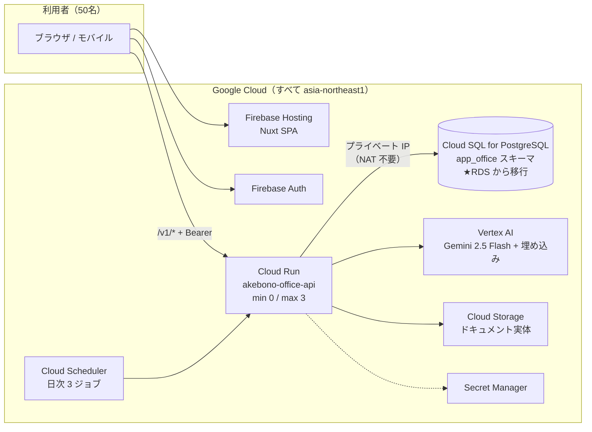

# Firebase / GCP 全面移行時の運用コスト試算（50名規模）

- **作成日:** 2026-07-21
- **作成ロール:** ナビゲーター（招集: コーディングエージェント = インフラ棚卸し / リサーチャー = 公式料金裏取り / システム監査官 = 試算レビュー）
- **目的:** 現機能を保持したままインフラをすべて Firebase / GCP に寄せた場合の、50名規模の会社での月間運用コストを試算する
- **位置づけ:** 意思決定のための試算資料。本番構成の SoT は `production-architecture.md`（本書はそれを変更しない）
- **単価の出典:** 2026-07-21 時点の各公式料金ページ（東京リージョン asia-northeast1。巻末の出典一覧参照）
- **為替前提:** 1 USD = 162.5 円（2026-07-20 時点）

---

## 1. 結論サマリ

| シナリオ | 月額 (USD) | 月額 (JPY) | 1人あたり/月 |
|---|---:|---:|---:|
| **A. 節約構成**（共有コア DB・AI 控えめ） | 約 $58 | **約 9,500 円** | 約 190 円 |
| **B. 標準構成（推奨）**（専有 1vCPU DB・AI 標準利用） | 約 $105 | **約 17,000 円** | 約 340 円 |
| **C. 高可用構成**（DB を HA 化・AI 多用） | 約 $206 | **約 33,500 円** | 約 670 円 |

- 現行構成は既にフロント（Firebase Hosting）・認証（Firebase Auth）・API（Cloud Run）・AI（Vertex AI）・ファイル（Cloud Storage）が GCP / Firebase 上にあり、**GCP 外に残っているのは AWS RDS PostgreSQL とクロスクラウド接続（Cloud NAT + 固定エグレス IP）のみ**。
- したがって「全部寄せ」の実体は **RDS → Cloud SQL for PostgreSQL への移行 + NAT 撤去**であり、アプリケーションの変更は接続文字列の差し替えでほぼ完結する（RDS 固有機能に依存しない設計 = production-architecture.md §5 の留意どおり）。
- コスト差分は **DB まわりのみ**: 現行の DB 関連費 約 $27/月（RDS t4g.micro $21 + NAT 関連 約$5.5 + クロスクラウド egress）に対し、移行後は案1で $37/月（+約 1,600 円）、推奨の案2で $71/月（**+約 7,100 円**）。この差額で、クロスクラウド運用（NAT・SG・CA 管理・二重の請求/IAM）の撤廃とレイテンシ改善（RTT 数 ms → 同リージョン内）が得られる。

---

## 2. 移行スコープ（何が変わり、何が変わらないか）

### 2.1 移行後の全体構成

### 2.2 変更点は DB と接続のみ

| コンポーネント | 現行 | 移行後 | 変更 |
|---|---|---|---|
| フロント配信 | Firebase Hosting | 同左 | なし |
| 認証 | Firebase Auth | 同左 | なし |
| API | Cloud Run（min 0 / max 3・`--no-cpu-throttling`） | 同左 | なし |
| **DB** | **AWS RDS PostgreSQL（ap-northeast-1）** | **Cloud SQL for PostgreSQL（asia-northeast1）** | **★移行** |
| DB 接続 | Direct VPC egress + Cloud NAT 固定 IP + TLS（パブリック経路） | プライベート IP（Private Services Access）。**NAT・固定 IP・RDS SG は撤去** | **★簡素化** |
| AI（LLM・埋め込み） | Vertex AI（ADC 認証） | 同左 | なし |
| ファイル実体 | Cloud Storage（`STORAGE_BUCKET`） | 同左 | なし |
| シークレット / イメージ / ジョブ | Secret Manager / Artifact Registry / Cloud Scheduler | 同左 | なし |
| CI/CD | GitHub Actions | 同左（非ランタイム。Cloud Build 化は任意で本試算対象外） | なし |
| 外部依存 | 内閣府祝日 CSV（無料・稀）・Google Calendar / Drive API（無料枠内） | 同左 | なし |

- メール・SMS・Slack 等の外部有料サービスへの依存はコード上ゼロ（通知は DB `notifications` + 60 秒ポーリングで完結）。**現機能の保持に GCP 外のサービスは不要**。
- アプリ側の移行作業は「`pg_dump` / リストア → Secret Manager の `DATABASE_URL` 差し替え → プライベート IP 接続設定 → NAT / SG 撤去」で、スキーマ・API は無変更（production-architecture.md §5 の設計前提どおり）。

---

## 3. 使用量モデル（50名規模の前提）

| 前提 | 値 | 根拠 |
|---|---|---|
| 在籍・MAU | 50名 | 題意 |
| 営業日 | 21日/月 | 一般値 |
| アプリを開いている時間 | 平均 9h/日 | 就業時間中タブ常開を仮定（上振れ側） |
| 打刻 | 4回/人/日（出退勤+休憩2） | 打刻状態機械の仕様 |
| 通知ポーリング | 60秒間隔（ログイン中のみ） | `useNotifications.ts`（POLL_INTERVAL_MS = 60,000） |
| チャットボット | 2問/人/日 | 想定 |
| 日報 AI ドラフト | 1回/人/営業日 | 全員毎日利用の上振れ想定 |
| タスク計画 AI コメント | 2回/人/日 | 想定 |
| 週次インサイト | （全体2 + 個人50）回/週 | 実装仕様 |
| AI カンパニー | 40タスク/月・平均5ステップ | 想定（感度分析 §6 参照） |

**導出される月間使用量:**

| 指標 | 算出 | 月間値 |
|---|---|---:|
| API リクエスト | ポーリング 50×9h×60回×21日 = 567k + 操作系 約150 req/人/日 = 158k | **約 73 万件** |
| Cloud Run インスタンス時間 | ポーリングにより営業時間中は常時 1 台ウォーム（60 秒間隔ではゼロスケールしない）: 10h×21日 = 210h + ピーク/ジョブ/AI 実行 40h | **約 250 h（90 万 vCPU 秒）** |
| LLM 呼び出し | チャット 2,100 + ドラフト 1,050 + AI コメント 2,100 + インサイト 224 + AI カンパニー 480 | **約 6,000 回** |
| LLM トークン | 呼び出し別の文脈サイズ（下表）から積算 | **入力 約 14M tok / 出力 約 3M tok（思考トークン除く）** |
| 検索グラウンディング | AI カンパニー 40タスク × 5ステップ | 約 200 プロンプト |
| クエリ埋め込み | チャット・ドラフト・ドキュメント検索 | 約 3,400 回（約 1M 文字） |
| DB データ増加 | 記録系テーブル（audit_logs・punch_records・daily_reports・chat_messages 等）+ bytea 添付 | 年 +10〜20 GB 想定 |
| GCS 保管 | ドキュメント管理（10MB/件 上限） | 20 GB 想定 |
| インターネット egress | API JSON 応答 | 約 5 GB |

**LLM 呼び出しの内訳（標準シナリオ B）:**

| 機能 | 回数/月 | 入力 tok/回 | 出力 tok/回 | 入力 Mtok | 出力 Mtok |
|---|---:|---:|---:|---:|---:|
| チャットボット（文脈4,000字+履歴12件、max 1024） | 2,100 | 3,000 | 400 | 6.3 | 0.84 |
| 日報ドラフト（材料+社内文脈4,000字） | 1,050 | 4,000 | 600 | 4.2 | 0.63 |
| タスク計画 AI コメント | 2,100 | 500 | 300 | 1.05 | 0.63 |
| 週次インサイト（全体 max 3000 / 個人 max 1536） | 224 | 2,000 | 800 | 0.45 | 0.18 |
| AI カンパニー: 分解・割当・遂行（max 4096） | 280 | 6,000 | 2,000 | 1.68 | 0.56 |
| AI カンパニー: Web 調査（グラウンディング） | 200 | 2,000 | 1,000 | 0.40 | 0.20 |
| **合計** | **約 5,950** | | | **14.1** | **3.0** |

> Gemini 2.5 Flash は思考（thinking）トークンも**出力として課金**されるため、出力は実効 2 倍（約 6M tok）で見積もる（§6 感度分析参照）。

---

## 4. サービス別試算（東京 asia-northeast1・USD/月）

### 4.1 Cloud SQL for PostgreSQL（移行の主コスト）

| 案 | 構成 | 計算 | 月額 |
|---|---|---|---:|
| 案1 節約 | db-g1-small（共有コア 1.7GB）+ SSD 10GB + バックアップ | $33.58 + 10×$0.221 + 10×$0.104 | **$36.8** |
| **案2 標準（推奨）** | db-custom-1-3840（1vCPU / 3.75GB）ゾーン + SSD 20GB + バックアップ | $39.20 + 3.75×$6.643 + 20×$0.221 + 20×$0.104 | **$70.6** |
| 案3 高可用 | 案2 の HA 化（単価は正確に 2.0 倍）+ HA SSD | $64.11×2 + 20×$0.442 + $2.08 | **$139.1** |

- 接続は**プライベート IP を推奨**（IP 自体の課金なし）。パブリック IP は $0.015/h ≈ $11/月 が加算されるため使わない。
- 案1（共有コア）は **SLA 対象外**。50名の業務システム（勤怠・給与に関わる打刻記録）としては案2 を推奨。HA（案3）は「日中数十分の停止も許容できない」場合のみ。ゾーン構成でも自動バックアップ + PITR で RPO は確保できる。
- DB 容量: 現行設計はアーカイブジョブがなく記録系 + bytea 添付（ナレッジ・ノート・AI タスク添付は常に DB 内）が単調増加する。年 +10〜20GB → **+$2.2〜4.4/月/年** の逓増を見込む。

### 4.2 Cloud Run（API）

- 課金モデル: `--no-cpu-throttling` のため**インスタンスベース課金**（Tier 1: CPU $0.000018/vCPU 秒・メモリ $0.000002/GiB 秒。リクエスト件数課金なし）
- 月 250 インスタンス時間（1 vCPU / 512MiB）= 90 万 vCPU 秒・45 万 GiB 秒
  - CPU: (900,000 − 無料枠 240,000) × $0.000018 = **$11.9**
  - メモリ: 450,000 GiB 秒 ≒ 無料枠 450,000 → **$0**
- → **約 $12/月**（AI カンパニー多用時は実行時間が伸び $15〜18）

### 4.3 Vertex AI（生成 + 埋め込み + グラウンディング）

| 項目 | 計算 | 月額 |
|---|---|---:|
| Gemini 2.5 Flash 入力 | 14.1M tok × $0.30/M | $4.2 |
| Gemini 2.5 Flash 出力（思考込み実効 2 倍） | 6.0M tok × $2.50/M | $15.0 |
| 埋め込み text-multilingual-embedding-002 | 約 1M 文字 × $0.000025/1k 文字 + 差分再インデックス | $0.1 未満 |
| Google 検索グラウンディング | 200 プロンプト/月 ≪ 無料枠 1,500/日（2.5 Flash） | $0 |
| **合計（標準）** | | **約 $19〜20** |

- 幅: 思考トークンが少なければ $12、AI 利用が想定の半分なら $8（シナリオ A）、AI カンパニー 100 タスク + 思考上振れで $45 程度（シナリオ C）。

### 4.4 その他（ほぼ無料枠内）

| サービス | 使用量 vs 無料枠 | 月額 |
|---|---|---:|
| Firebase Hosting | 転送 約8GB < 無料枠 10GB/月。ストレージはリリース履歴の保持数制限を設定して 10GB 内に | $0 |
| Firebase Auth | 50 MAU ≪ 無料枠 50,000 MAU（メール/Google ログインは課金対象外） | $0 |
| Cloud Storage（ドキュメント 20GB） | 東京は無料枠対象外: 20×$0.023 + オペレーション | $0.6 |
| Secret Manager | 4 バージョン < 無料枠 6。アクセスはインスタンス起動時のみ | $0 |
| Artifact Registry | クリーンアップポリシー設定で 0.5GB 無料枠内（未設定だと $1〜2/月へ逓増） | $0 |
| Cloud Scheduler | 3 ジョブ（有給付与・売上 ETL・uptime）= 無料枠ちょうど | $0 |
| Cloud Logging / Monitoring | < 50GiB / 標準メトリクスのみ | $0 |
| ネットワーク egress | 約 5GB × $0.12 | $0.6 |

---

## 5. シナリオ別合計と現行構成との比較

### 5.1 シナリオ別合計

| 項目 | A. 節約 | B. 標準（推奨） | C. 高可用・AI 多用 |
|---|---:|---:|---:|
| Cloud SQL | $36.8 | $70.6 | $139.1 |
| Cloud Run | $12 | $12 | $18 |
| Vertex AI | $8 | $20 | $45 |
| Cloud Storage + egress + その他 | $1.2 | $2 | $4 |
| **合計 (USD)** | **約 $58** | **約 $105** | **約 $206** |
| **合計 (JPY @162.5)** | **約 9,500 円** | **約 17,000 円** | **約 33,500 円** |

### 5.2 現行（クロスクラウド）との差分

現行と移行後で変わるのは DB まわりのみ（Cloud Run・Vertex AI・Hosting 等は現行も同額発生している）。

| 項目 | 現行 | 移行後（案2） |
|---|---:|---:|
| DB 本体 | RDS db.t4g.micro + gp3 20GB = $21.0 | Cloud SQL 1vCPU/3.75GB + SSD 20GB = $70.6 |
| Cloud NAT（ゲートウェイ + 固定 IP + 処理） | 約 $5.5 | $0（撤去） |
| クロスクラウド egress（GCP→AWS DB トラフィック） | 約 $0.6 | $0 |
| **DB 関連計** | **約 $27** | **約 $71** |

- **差分: +約 $44/月（約 +7,100 円）**。案1（db-g1-small）なら +約 $10/月（約 +1,600 円）でほぼ同等コスト。
- 金額以外の効果: 請求・IAM・監査ログの一元化、NAT / SG / RDS CA バンドルの管理消滅、DB レイテンシ改善（クロスクラウド RTT 数 ms → 同リージョン内サブ ms）、DB のパブリック露出ゼロ化（現行案 A はパブリック + IP 制限）。
- 参考: RDS が安いのは共有コア（t4g.micro = 2vCPU バースト・1GB RAM）のため。Cloud SQL 側も共有コア（案1）を選べば価格は近づくが、いずれも SLA 対象外である点は同じ。

---

## 6. 感度分析・リスク（試算が動く要因）

| 要因 | 影響 | 備考 |
|---|---|---|
| **AI カンパニーの利用量** | 1 タスク（5 ステップ・グラウンディング込み）≈ $0.06〜0.10。100 タスク/月で +$6〜10 | 将来拡張の「AI 社員の実実行」（LLM 自律実行）が入ると呼び出し数が跳ねるため**再試算必須** |
| **思考トークン** | 2.5 Flash は思考も出力課金。§4.3 は実効 2 倍で計上済み。複雑な JSON 生成で 3 倍なら +$7 | thinking budget の明示制御は未実装 |
| **通知ポーリングの在席時間** | 9h/日 → 12h/日 なら Cloud Run +約 $4 | タブ常開の割合次第。逆に非在席が多ければ下振れ |
| **DB ストレージの逓増** | 記録系 + bytea 添付で年 +10〜20GB → +$2.2〜4.4/月ずつ増加 | アーカイブ/削除ジョブなし（implementation-status.md の残課題に該当）。10MB 添付の多用で加速 |
| **Gemini 3 系への移行** | グラウンディングが「月 5,000 クエリ無料 + $14/1,000 クエリ（クエリ単位）」に変化 | 多用時はコスト特性が変わる |
| **為替** | 本試算は 162.5 円/USD。±10 円で総額 ±約 6% | |
| **Firebase Hosting のリリース履歴** | デプロイ頻度が高いとストレージ 10GB 超過 | 履歴保持数の制限設定を推奨（コンソールで設定可能） |
| **Artifact Registry のイメージ蓄積** | SHA タグごとに蓄積 | クリーンアップポリシー（最新 N 世代保持）の設定を推奨 |

---

## 7. 推奨事項（ナビゲーター所見）

1. **移行する場合は案2（db-custom-1-3840 ゾーン + プライベート IP）を推奨。** 月額 約 17,000 円・現行比 +約 7,100 円で、クロスクラウド運用の複雑さ（NAT・SG・CA・二重 IAM）を撤廃できる。勤怠打刻という記録系 SoT を扱う以上、共有コア（SLA 外）は本番非推奨。
2. **HA は初期導入不要。** 50名の社内アプリはゾーン構成 + 自動バックアップ + PITR で十分。稼働要件が上がった時点で HA へ引き上げ（設定変更のみで可能）。
3. **コスト最適化はサーバーレス側でなく DB 側で効く。** Cloud Run・Auth・Hosting・Scheduler・Secret Manager はほぼ無料枠内であり、チューニングの費用対効果はない。効くのは (a) DB のサイジング、(b) 記録系・bytea のアーカイブ方針、(c) Artifact Registry / Hosting のクリーンアップ設定。
4. **AI コストの監視を推奨。** 変動費の主役は Vertex AI（特に AI カンパニー）。予算アラート（例: Vertex AI に月 $50）を設定し、AI 社員の実実行を導入する際は本試算を更新する。
5. **移行時の一時コスト**は小さい（`pg_dump`/リストアの作業 + 移行期間中の並行稼働数日分 ≈ 数百円〜数千円）。ダウンタイムは数十分（夜間切替）で計画可能。

---

## 8. 出典（2026-07-21 時点・公式料金ページ）

- Cloud SQL: https://cloud.google.com/sql/pricing
- Cloud Run: https://cloud.google.com/run/pricing
- Vertex AI（Gemini・埋め込み・グラウンディング）: https://cloud.google.com/vertex-ai/generative-ai/pricing
- Firebase Pricing / Hosting quotas: https://firebase.google.com/pricing / https://firebase.google.com/docs/hosting/usage-quotas-pricing
- Identity Platform（参考）: https://cloud.google.com/identity-platform/pricing
- Cloud Storage: https://cloud.google.com/storage/pricing
- Secret Manager: https://cloud.google.com/secret-manager/pricing
- Artifact Registry: https://cloud.google.com/artifact-registry/pricing
- Cloud Scheduler: https://cloud.google.com/scheduler/pricing
- Cloud NAT: https://cloud.google.com/nat/pricing
- Cloud Logging / Monitoring: https://cloud.google.com/stackdriver/pricing
- VPC ネットワーク（egress）: https://cloud.google.com/vpc/network-pricing
- AWS RDS（現行比較用）: https://aws.amazon.com/rds/pricing/
- USD/JPY: https://tradingeconomics.com/japan/currency

> 使用量パラメータ（ポーリング間隔・LLM 呼び出し箇所・maxOutputTokens・ジョブ数・Cloud Run フラグ等）はすべて本リポジトリのコード・設定・ドキュメントの実記述に基づく（`mockup/app/composables/useNotifications.ts`・`api/src/lib/llm.ts`・`api/src/routes/*`・`.github/workflows/deploy.yml`・`.ai-native/outputs/phase7/deploy-guide.md` ほか）。
