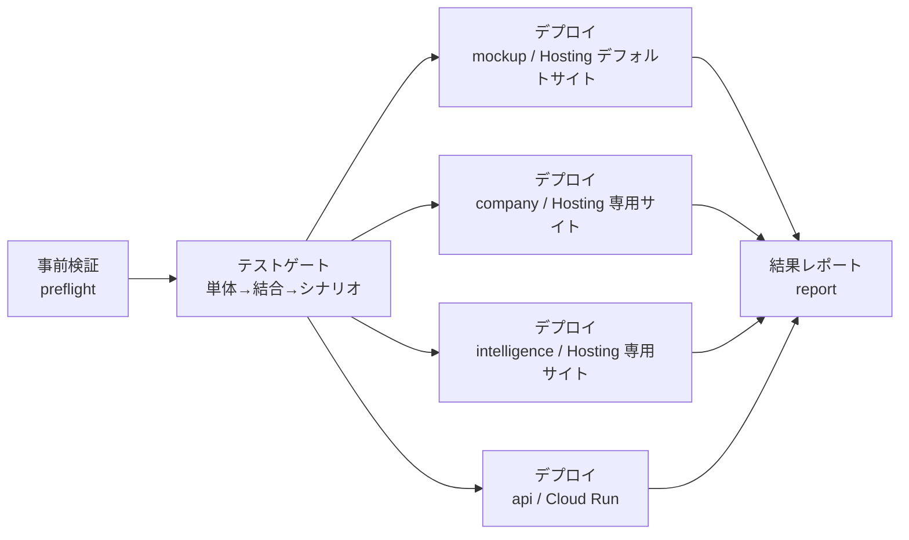

# Phase 7: デプロイ手順（フロント 3 アプリ: Firebase Hosting / api: Cloud Run + RDS PostgreSQL）

- **作成日:** 2026-07-17（2026-08-20 マルチサイト対応 = company / intelligence 追加）
- **対象読者:** オペレーター（初回セットアップ）・開発者（日常デプロイ）
- **原則:** 手動手順は初回セットアップとフォールバックのみ。日常デプロイは main への push で全自動（開発原則1）

## 0. 全体像

| コンポーネント | デプロイ先 | トリガー |
|---|---|---|
| `mockup/`（AKEBONO Office / Nuxt SPA） | Firebase Hosting（**デフォルトサイト**） | main へ push（対象パス変更時）or 手動 |
| `company/`（AKEBONO Company / Nuxt SPA） | Firebase Hosting（**専用サイト** = マルチサイト） | 〃（`FIREBASE_HOSTING_SITE_COMPANY` 登録時のみ。§1-11） |
| `intelligence/`（AKEBONO Intelligence / Nuxt SPA） | Firebase Hosting（**専用サイト** = マルチサイト） | 〃（`FIREBASE_HOSTING_SITE_INTELLIGENCE` 登録時のみ。§1-11） |
| `api/`（Hono API） | Cloud Run | main へ push（`api/` `shared/` 変更時）or 手動 |
| DB マイグレーション | RDS PostgreSQL | API コンテナ起動時に自動適用（冪等） |

トリガーの対象パス: `mockup/` `company/` `intelligence/` `api/` `shared/`（+ ワークフロー自身）。
日常運用で必要な操作は **main へのマージのみ**。以下は初回セットアップ手順。

### 0-1. デプロイパイプラインの構造（AI ネイティブ方法論テンプレート適用）

デプロイは `ai-native-dev-operation-template` の deploy パイプラインを適用した **テストゲート方式**で動く（`.github/workflows/deploy.yml`）。テストゲートを通過した場合のみデプロイし、いずれかが失敗したらデプロイを中断する。「何がどのように失敗したか」は Step Summary と CI アーティファクト `deploy-logs`（`.deploy-logs/*.log`）に残る。



| ジョブ | 内容 |
|---|---|
| **preflight（事前検証）** | デプロイ先環境を確定し、必須 secrets（mockup 用 Firebase）の有無を確認。欠ければ即中断。company / intelligence はサイト用 secret（`FIREBASE_HOSTING_SITE_*`）が無ければスキップ、api 用 secrets が欠ければ api デプロイをスキップ（非ブロッキング = 原則4） |
| **test（テストゲート）** | 各ステージを `scripts/run-test-stage.sh` で実行しログをアーティファクト化。**単体** = mockup/company/intelligence/api の `typecheck` + `vitest`、**結合** = api の実 PostgreSQL 統合テスト（`test:integration`）、**シナリオ** = デプロイ成果物のビルド検証（各フロント `generate` + api `build`）。前段が失敗した時点で以降は実行されずデプロイは中断 |
| **deploy-mockup** | Firebase Hosting のデフォルトサイトへ配信。環境で配信チャネルを切替（production=`live` / staging=プレビューチャネル `staging`） |
| **deploy-company** / **deploy-intelligence** | Firebase Hosting の**専用サイト**へ配信（マルチサイト）。サイト ID は secrets（`FIREBASE_HOSTING_SITE_COMPANY` / `FIREBASE_HOSTING_SITE_INTELLIGENCE`）から受け取り、デプロイ時に `.firebaserc` を生成して `firebase.json` の hosting.target へ紐付ける。**secret 未登録ならスキップ**（他のデプロイは継続）。チャネル切替は mockup と同じ |
| **deploy-api** | Cloud Run へ配信。**production かつ api secrets が揃うときのみ**実行。staging は別途プロビジョニングが必要なため対象外（preflight で通知） |
| **report** | 成否にかかわらずパイプライン全体の結果を Step Summary へ記録 |

**トリガーと環境:**
- **main への push**（`mockup/` `company/` `intelligence/` `api/` `shared/` 変更時）= 従来どおり **production へ自動デプロイ**（開発原則1「手動ステップを残さない」）。
- **手動実行（workflow_dispatch）** = `staging` / `production` を選択可能。`staging` を選ぶと mockup は Firebase プレビューチャネル（本番と別 URL）へデプロイされ、api はスキップされる。

> **テストゲートが失敗したら:** Actions の該当 run の Step Summary で失敗ステージを確認し、アーティファクト `deploy-logs` 内の該当ログ（`unit-test.log` / `integration-test.log` / `scenario-test.log`）で詳細を見る。修正後に再度 push または手動再実行する。

## 1. 初回セットアップ（オペレーター作業）

### 1-1. RDS PostgreSQL の作成（AWS 側・初回のみ）

1. RDS で PostgreSQL 16 インスタンスを作成（例: `db.t4g.micro`、東京 `ap-northeast-1`）
   - DB 名: `akebono_office` / マスターユーザーではなく**アプリ専用ユーザー**を推奨（下記）
   - パラメータグループで `rds.force_ssl = 1`（TLS 必須化）
2. アプリ用ロールと DB を作成:
   ```sql
   CREATE ROLE app LOGIN PASSWORD '<強いパスワード>';
   CREATE DATABASE akebono_office OWNER app;
   ```
   スキーマ（app_office）とテーブルは**API の起動時マイグレーションが自動作成**するため手動作成は不要。
3. ネットワーク（v1 = パブリック + TLS + IP 制限。production-architecture.md §5）:
   - パブリックアクセス: あり
   - セキュリティグループ: インバウンド 5432 を **Cloud Run の固定エグレス IP のみ**許可
     （固定 IP は 1-2 の後、Cloud Run に Direct VPC egress + Cloud NAT 静的 IP を設定して取得。
      それまでの動作確認は作業者のグローバル IP を一時許可でも可）
4. 接続文字列を控える:
   ```
   postgresql://app:<パスワード>@<エンドポイント>:5432/akebono_office
   ```

### 1-2. GCP プロジェクトの準備（初回のみ）

1. Firebase プロジェクト（mockup で使用中のもの）で以下の API を有効化:
   ```bash
   gcloud services enable run.googleapis.com artifactregistry.googleapis.com secretmanager.googleapis.com
   ```
2. デプロイ用サービスアカウントを作成しロールを付与（mockup 用と共用する場合）:
   ```bash
   PROJECT_ID=<your-project>
   gcloud iam service-accounts create github-actions-deploy --project $PROJECT_ID
   for ROLE in roles/firebasehosting.admin roles/run.admin roles/artifactregistry.admin \
               roles/iam.serviceAccountUser roles/secretmanager.admin \
               roles/serviceusage.serviceUsageAdmin roles/resourcemanager.projectIamAdmin; do
     gcloud projects add-iam-policy-binding $PROJECT_ID \
       --member "serviceAccount:github-actions-deploy@$PROJECT_ID.iam.gserviceaccount.com" \
       --role $ROLE
   done
   gcloud iam service-accounts keys create deploy-sa.json \
     --iam-account "github-actions-deploy@$PROJECT_ID.iam.gserviceaccount.com"
   ```
3. Firebase Authentication を有効化（バッチ2 のログイン UI で使用。Google ログイン等のプロバイダを設定し、
   利用者の email を `members.email` に登録しておく — API は email で業務ユーザーを突合する）

### 1-3. Repository secrets の設定（PowerShell 1 コマンド）

```powershell
./scripts/setup-deploy-secrets.ps1 `
  -ProjectId <your-project> `
  -ServiceAccountJsonPath ./deploy-sa.json `
  -DatabaseUrl 'postgresql://app:<パスワード>@<エンドポイント>:5432/akebono_office' `
  -TriggerDeploy
```

設定される secrets（再実行で上書き = 冪等）:

| Secret | 用途 | 既定値 |
|---|---|---|
| `FIREBASE_SERVICE_ACCOUNT` / `FIREBASE_PROJECT_ID` | mockup（従来どおり） | — |
| `GCP_SERVICE_ACCOUNT` | Cloud Run デプロイ | `-GcpServiceAccountJsonPath` 省略時は Firebase と共用 |
| `GCP_PROJECT_ID` | 〃 | `-ProjectId` と同一 |
| `GCP_REGION` | 〃 | `asia-northeast1` |
| `CLOUD_RUN_SERVICE` | 〃 | `akebono-office-api` |
| `DATABASE_URL` | RDS 接続文字列（Secret Manager へ中継） | — |
| `DB_SSL` | TLS モード | `require` |
| `API_CORS_ORIGINS` | CORS 許可オリジン | `https://<project>.web.app`（`-CompanyHostingSite` / `-IntelligenceHostingSite` 指定時は各サイトのオリジンも自動で含む） |
| `STORAGE_BUCKET` | ドキュメント保管（`-StorageBucket` 指定時のみ。§1-10） | 未設定 = DB 保管フォールバック |
| `FIREBASE_HOSTING_SITE_COMPANY` | AKEBONO Company のサイト ID（`-CompanyHostingSite` 指定時のみ。§1-11） | 未設定 = company デプロイをスキップ |
| `FIREBASE_HOSTING_SITE_INTELLIGENCE` | AKEBONO Intelligence のサイト ID（`-IntelligenceHostingSite` 指定時のみ。§1-11） | 未設定 = intelligence デプロイをスキップ |

> `-DatabaseUrl` を省略すると mockup 用 secrets のみ設定される（従来の使い方と完全互換）。
> その場合 deploy-api ジョブは警告を出してスキップされ、mockup のデプロイは通常どおり動く。

### 1-4. 動作確認

1. Actions の `deploy` ワークフローが green になったら、ログ末尾の Cloud Run URL を確認
2. ヘルスチェック: `curl https://<cloud-run-url>/healthz` → `{"status":"ok","db":"ok"}`
   - `db: "error"` の場合は RDS の SG / 接続文字列 / SSL 設定を確認（下記トラブルシュート）
3. API 認証の確認（メンバー登録後）:
   ```bash
   curl -H "Authorization: Bearer <FirebaseのIDトークン>" https://<cloud-run-url>/v1/me
   ```

### 1-4b. 応答性能（コールドスタート対策）

Cloud Run は既定で **`--min-instances 1`**（常時 1 台を暖機）でデプロイする。アイドル後の初回リクエストで
コンテナ起動 + DB プール確立に数秒〜十数秒かかる**コールドスタート遅延**を解消するため（オペレーター報告
2026-07-30「取込元の登録が異常に遅い / 無効化がタイムアウトで失敗」への対処）。あわせて `--cpu-boost`
（スパイク時の 2〜3 台目の起動を高速化。CLI フラグは `--cpu-boost`）と DB プールの `keepAlive`／idle 延長（暖機インスタンス上の接続再確立を抑制）を適用する。

- **コスト最優先でゼロスケールへ戻す:** repository **variable**（secret ではない）`CLOUD_RUN_MIN_INSTANCES` を `0` に設定して再デプロイ
  （GitHub → Settings → Secrets and variables → Actions → Variables）。未設定時の既定は `1`。
- **コスト注記:** 既存の `--no-cpu-throttling` と併用のため、暖機インスタンスは**アイドル時も CPU 常時割当**となり、
  素の暖機インスタンスより月額の下限が高い。応答性能とコストのトレードオフで、コスト最優先なら上記 `0` を選ぶ。
- 冪等な取込操作（無効化・復元・方式別設定更新）は、残るコールドスタートのタイムアウトに対しフロント側で 1 回だけ自動再試行する
  （非冪等な新規登録は二重作成防止のため再試行しない）。

| Repository variable | 用途 | 既定 |
|---|---|---|
| `CLOUD_RUN_MIN_INSTANCES` | Cloud Run 常時稼働インスタンス数（`0` = ゼロスケール＝コールドスタート復活／`1` = 暖機） | `1` |

### 1-5. TLS の強化（推奨・任意）

`DB_SSL=require` は暗号化のみで CA 検証を行わない。RDS の CA バンドルを配布して `verify` へ引き上げる:

1. [RDS グローバルバンドル](https://truststore.pki.rds.amazonaws.com/global/global-bundle.pem) を取得
2. Cloud Run の環境変数 `DB_SSL=verify`・`DB_SSL_CA=<PEM の内容>` を設定
   （量が多い場合は Secret Manager に格納し `--set-secrets DB_SSL_CA=...` で注入）

## 1-6. フロントエンドを API 接続版で配信する（バッチ2a 以降・任意）

既定の配信は**モックモード**（デモ）。実データ（RDS）に接続した画面を配信するには 2 段階で行う:

1. まず api をデプロイして Cloud Run URL を確認（1-3〜1-4）
2. Firebase Console > プロジェクトの設定 > マイアプリ（Web アプリ）から firebaseConfig JSON を取得し、
   Authentication でプロバイダ（メール/パスワード・Google 等）を有効化
3. secrets を追加して再デプロイ:
   ```powershell
   ./scripts/setup-deploy-secrets.ps1 -ProjectId <project> -ServiceAccountJsonPath ./deploy-sa.json `
     -ApiBaseUrl 'https://akebono-office-api-xxxx.a.run.app' `
     -FirebaseWebConfigJsonPath ./firebase-web-config.json -TriggerDeploy
   ```
   → 以後の `deploy-mockup` は `NUXT_PUBLIC_API_BASE` / `NUXT_PUBLIC_FIREBASE_CONFIG` 付きでビルドされ、
   ログイン必須の API 接続版が配信される（`API_BASE_URL` secret を削除すればモックモードへ戻る）。
   **company / intelligence（§1-11）も同じ 2 つの secrets を共用して API 接続版でビルドされる**
   （同一 Firebase プロジェクト・同一 API のため。別途 `API_CORS_ORIGINS` へ各サイトのオリジン追加が必要）
4. 利用者の email を メンバーマスタに登録する（API はログイン email と `members.email` を突合する）。
   最初の管理者だけは SQL で投入する:
   ```sql
   INSERT INTO app_office.members (id, name, email, role) VALUES ('m-admin', '管理者名', 'admin@your.co.jp', 'admin');
   ```
   以後のメンバーは画面（マスタメンテナンス > メンバー）から登録できる

> **更新時の配信順序:** スキーマ・I/F を拡張する更新は必ず **API（migration 込み）→ フロント** の順で反映する。
> 例: 2026-07-22 改修（migration 0029）の稟議は、新フロントが `purpose`/`content` を送り `body` を送らないため、
> 旧 API が先に受けると本文が保存されない。
> **注意:** deploy パイプラインは テストゲート通過後に mockup（Firebase）と api（Cloud Run）を**並行**デプロイするため、
> どちらが先に反映されるかは保証されない。破壊的なスキーマ・I/F 変更は **後方互換を保つ**（旧フロントからのリクエストも旧フィールドで受理する等）か、
> **API 変更を先行してリリースしてからフロント変更をマージする**運用で回避する。

## 1-7. 有給の周期自動付与（Cloud Scheduler・任意）

管理者/人事が画面外から `POST /v1/leave/periodic-grants/run` を叩けば手動実行できる（冪等）。
毎日自動実行する場合:

1. Cloud Run サービスに環境変数 `CRON_SECRET`（長いランダム文字列）を追加
2. Cloud Scheduler ジョブを作成:
   ```bash
   gcloud scheduler jobs create http periodic-leave-grants \
     --schedule "0 6 * * *" --time-zone "Asia/Tokyo" \
     --uri "https://<cloud-run-url>/jobs/periodic-leave-grants" \
     --http-method POST --headers "x-cron-key=<CRON_SECRET と同じ値>"
   ```
   付与は UNIQUE 制約（メンバー × 種別 × 付与日）で冪等のため、多重実行しても二重付与されない

## 1-7b. 売上 mart ETL の日次実行（Cloud Scheduler・任意。バッチ6b）

管理者が画面外から `POST /v1/sales/etl/run` を叩けば手動実行できる（冪等。実行履歴は
`GET /v1/sales/etl/runs`）。毎日自動実行する場合は 1-7 と同じ `CRON_SECRET` を使い:

```bash
gcloud scheduler jobs create http sales-mart-etl \
  --schedule "30 6 * * *" --time-zone "Asia/Tokyo" \
  --uri "https://<cloud-run-url>/jobs/sales-mart-etl" \
  --http-method POST --headers "x-cron-key=<CRON_SECRET と同じ値>"
```

ETL は `UNIQUE(tenant_key, source_txn_id)` の upsert で冪等のため、多重実行しても fact 行は増えない。

## 1-7c. 稼働状況 uptime の日次ロールアップ（Cloud Scheduler・任意。バッチ6c）

uptime_daily はインシデント（SoT）からの導出データで、インシデント登録/更新時に自動再計算される。
未解決インシデントの停止時間を日々進める場合は 1-7 と同じ `CRON_SECRET` を使い:

```bash
gcloud scheduler jobs create http uptime-rollup \
  --schedule "5 0 * * *" --time-zone "Asia/Tokyo" \
  --uri "https://<cloud-run-url>/jobs/uptime-rollup" \
  --http-method POST --headers "x-cron-key=<CRON_SECRET と同じ値>"
```

再計算は窓内 DELETE→INSERT のトランザクションで冪等。手動回復は管理者 API
`POST /v1/status/uptime/recompute`（直近 90 日・serviceId 指定可）でいつでも実行できる。

## 1-8. AI 機能（Vertex AI）

AI 機能（日報 AI アシスト・タスク計画の AI コメント等）は **Vertex AI**（オペレーター決定 2026-07-17）を
サーバーサイド（Cloud Run API）から呼び出す。**API キーの secret は不要** — Cloud Run 実行サービス
アカウントの ADC（Application Default Credentials）で認証する。

- **自動セットアップ:** deploy ワークフローが毎回冪等に実行する
  1. `aiplatform.googleapis.com` の有効化
  2. Cloud Run 実行 SA（Compute Engine 既定 SA）への `roles/aiplatform.user` 付与
  3. Cloud Run へ環境変数 `VERTEX_PROJECT_ID`（= GCP_PROJECT_ID）・`VERTEX_LOCATION`（既定 global）・
     `VERTEX_MODEL`（既定 gemini-2.5-flash）を設定
- **手動フォールバック:** デプロイ SA に権限がなく警告が出た場合、オーナー権限で 1 回だけ実行:
  ```bash
  PROJECT_ID=<your-project>
  gcloud services enable aiplatform.googleapis.com --project $PROJECT_ID
  PROJECT_NUMBER=$(gcloud projects describe $PROJECT_ID --format='value(projectNumber)')
  gcloud projects add-iam-policy-binding $PROJECT_ID \
    --member "serviceAccount:${PROJECT_NUMBER}-compute@developer.gserviceaccount.com" \
    --role roles/aiplatform.user
  ```
- **モデル・ロケーションの変更:** `setup-deploy-secrets.ps1 -VertexLocation asia-northeast1 -VertexModel gemini-2.5-pro`
  のように secrets（VERTEX_LOCATION / VERTEX_MODEL）を設定して再デプロイ
- **フォールバック動作:** `VERTEX_PROJECT_ID` 未設定・権限不足・API エラー時、AI 機能は決定的
  ヒューリスティック（モックと同じ生成ロジック）へ自動フォールバックし、主要フローは止まらない（原則4）
- **検索インデックスの埋め込み（バッチ7a）:** チャットボットの AI 検索（search_docs）は同じ Vertex AI の
  埋め込みモデル（既定 `text-multilingual-embedding-002`・環境変数 `VERTEX_EMBEDDING_MODEL` で変更可）を
  使う。**追加セットアップは不要**（同じ API・同じ `roles/aiplatform.user`）。無効環境は字句検索のみへ縮退。
  インデックスは起動時 + マスタ更新時に自動再生成され、手動再生成は `POST /v1/search/reindex`（管理者）

## 1-9. カレンダー連携（Google OAuth・F-06-8）

日報 AI アシストのカレンダー材料取得と予定同期に使用する。トークンはサーバー側で AES-256-GCM
暗号化のうえ DB 保管（クライアントへ出さない。喪失時は再連携で回復）。

1. Cloud Console で OAuth クライアント（**ウェブアプリケーション**種別）を発行し、
   「承認済みのリダイレクト URI」に Cloud Run の URL + コールバックパスを登録:
   ```
   https://<cloud-run-url>/v1/calendar/oauth/callback
   ```
   **Google Calendar API の有効化も必要**（デプロイが `calendar-json.googleapis.com` を自動有効化する。
   権限不足で警告が出た場合はオーナー権限で `gcloud services enable calendar-json.googleapis.com` を実行）。
   OAuth のトークン交換は Calendar API 無効でも成功するため、「連携はできるが同期が失敗する」場合は
   まずこの有効化を確認する（§4 トラブルシュート参照）
2. secrets を設定（シークレットはファイル渡し = チャット・シェル履歴に残さない）:
   ```powershell
   ./scripts/setup-deploy-secrets.ps1 -ProjectId <project> -ServiceAccountJsonPath ./deploy-sa.json `
     -DatabaseUrl 'postgresql://...' `
     -GoogleOauthClientId '<client-id>.apps.googleusercontent.com' `
     -GoogleOauthClientSecretPath ./oauth-secret.txt -TriggerDeploy
   ```
   `TOKEN_ENCRYPTION_KEY` は初回のみ自動生成される（既存キーは変更しない = 保管済みトークンの保護）
3. デプロイが Secret Manager（`<service>-google-oauth-secret` / `<service>-token-encryption-key`）への
   登録と Cloud Run への注入まで冪等に行う。secrets 未設定の間、カレンダー連携機能は自動的に無効
   （画面に連携 UI が出ない）でその他の機能に影響しない
4. **ドライブ取込（バッチ7l）:** ドキュメント管理の「ドライブから取込」は同じ OAuth クライアントを共用し、
   スコープに `drive.readonly` が追加されている。デプロイが `drive.googleapis.com` を自動有効化する。
   **バッチ7l 以前に連携済みのユーザーは、AI アシスタントのカレンダー連携から Google に再接続すると
   ドライブ取込が使えるようになる**（旧トークンのままでもカレンダーは従来どおり動作）
5. **議事録の Google Meet 連携（③b・2026-08-03）:** 議事録（/minutes）で Google Meet の AI メモ/録画を
   Drive から選んでリンクする機能も、上記 4 と**同じカレンダー連携トークン（`drive.readonly`）・同じ Drive API を
   共用**するため追加の設定は不要（新スコープ・新 API・新コールバックなし）。AI メモの本文取込は Google ドキュメントを
   `drive.googleapis.com` の export（text/plain）で取得する。**API モード限定**（実 Drive 連携が必要）で、
   未接続時は本機能から AI アシスタントのカレンダー連携へ誘導する

## 1-9b. メディア分析の Google Analytics 連携（F-40）

メディア分析（/media）のアクセス指標取得に使用する。カレンダー連携（§1-9）と**同じ OAuth クライアント・
同じ TOKEN_ENCRYPTION_KEY を共用**するため、§1-9 のセットアップ済み環境で追加の secrets は不要。
連携は**業態（セグメント）単位**で、管理者がメディア設定画面（/media/settings）から画面操作のみで行う
（同意 → GA4 プロパティ選択。スコープは `analytics.readonly` のみ = カレンダーとは別の同意・別トークン）。

1. OAuth クライアントの「承認済みのリダイレクト URI」に**メディア用のコールバックパスを追加**する
   （§1-9 のカレンダー用 URI とは別に 1 行必要）:
   ```
   https://<cloud-run-url>/v1/media/oauth/callback
   ```
2. GCP プロジェクトで **Google Analytics Data API / Google Analytics Admin API を有効化**する
   （デプロイが `analyticsdata.googleapis.com` / `analyticsadmin.googleapis.com` を自動有効化する。
   権限不足で警告が出た場合はオーナー権限で実行）:
   ```bash
   gcloud services enable analyticsdata.googleapis.com analyticsadmin.googleapis.com --project <project-id>
   ```
   OAuth のトークン交換は両 API 無効でも成功するため、「連携はできるがプロパティ一覧・集計が失敗する」
   場合はまずこの有効化を確認する（カレンダーの §4 トラブルシュートと同じ構図）
3. 連携する Google アカウントは AKEBONO Office に登録済みの会社アカウント（members.email と突合）で、
   対象の GA4 プロパティに閲覧権限があること。GA 集計は 30 分の短期キャッシュ（クォータ対策）で配信され、
   画面の再試行で強制再取得できる。secrets 未設定の間、GA 連携 UI は自動的に非表示（他機能に影響しない）
4. **（任意）記事インベントリの手動登録:** 分析対象の記事一覧（セクション対応・記事数）は生成記事の
   「採用」で自動登録される。既存サイトの記事を分析対象へ加えたい場合は管理者 API で登録できる
   （専用 UI は未提供 = 運用回復パス。同一パスの再送は 409 で重複しない = 冪等）:
   ```bash
   curl -X POST "https://<cloud-run-url>/v1/media/articles" \
     -H "Authorization: Bearer <管理者の Firebase ID トークン>" -H "Content-Type: application/json" \
     -d '{"segmentId":"seg-01","path":"/blog/example","title":"記事タイトル","section":"ブログ","publishedAt":"2026-01-10","wordCount":2000}'
   ```
   誤登録は `POST /v1/media/articles/<id>/deactivate`（取消・論理削除）→ `/restore`（復元）で戻せる（原則9.5）

## 1-9c. データ取込の Google スプレッドシート連携（F-32 `sheets_pull`・2026-08-03）

データ取込・連携（/akebono/imports）で Google スプレッドシートを取込元にする機能。カレンダー連携（§1-9）と
**同じ OAuth クライアント・同じ TOKEN_ENCRYPTION_KEY を共用**するため、§1-9 のセットアップ済み環境で追加の
secrets は不要。連携は**テナント（全社）単位の単一接続**で、管理者がマッピング設定画面から画面操作のみで行う
（同意 → 対象ブック検索・選択 → シート選択 → 開始行/列指定 → 列取得）。

1. OAuth クライアントの「承認済みのリダイレクト URI」に**スプレッドシート用のコールバックパスを追加**する
   （§1-9 のカレンダー用・§1-9b のメディア用 URI とは別に 1 行必要）:
   ```
   https://<cloud-run-url>/v1/akebono/sheets/oauth/callback
   ```
2. GCP プロジェクトで **Google Sheets API を有効化**する（値の読取に必要。ブック一覧は §1-9 の Drive API を使う。
   デプロイが `sheets.googleapis.com` を自動有効化する。権限不足で警告が出た場合はオーナー権限で実行）:
   ```bash
   gcloud services enable sheets.googleapis.com --project <project-id>
   ```
   OAuth のトークン交換は Sheets API 無効でも成功するため、「連携はできるがシート一覧・列取得・取込が失敗する」
   場合はまずこの有効化を確認する（カレンダーの §4 トラブルシュートと同じ構図・エラーコード AKO-SHEETS-002）。
3. スコープは `spreadsheets.readonly`（値の読取）+ `drive.readonly`（ブック一覧。§1-9 の drive 取込と共用）で、
   **カレンダー・メディアとは別の同意・別トークン**（`sheets_tokens` に単一接続で保管）。`spreadsheets.readonly` は
   Google の**機微スコープ**に該当するため、公開アプリでは OAuth 同意画面の審査が必要になる場合がある（社内利用は
   テスト/内部公開で可）。連携する Google アカウントは AKEBONO Office 登録済みの会社アカウント（members.email と突合）。
4. secrets 未設定の間、スプレッドシート連携 UI は自動的に非表示（enabled=false。他機能に影響しない）。連携解除は
   マッピング設定画面の「連携を解除」から（トークン物理削除 + revoke。再連携でいつでも復帰 = 原則9.5）。

## 1-10. ドキュメント保管（Firebase の Cloud Storage・バッチ7l）

ドキュメント管理（/support/documents）の実ファイル保管先。**未設定でも DB 保管（bytea）フォールバックで
全機能が動作する**（署名 URL のみ GCS 専用 = 未設定時は base64 ダウンロードへ縮退）。

1. バケット名を決める（Firebase の既定バケット `<project>.firebasestorage.app` を推奨。
   未作成でもデプロイが `gcloud storage buckets create` で冪等に作成を試みる）
2. secrets を設定して再デプロイ:
   ```powershell
   ./scripts/setup-deploy-secrets.ps1 -ProjectId <project> -ServiceAccountJsonPath ./deploy-sa.json `
     -DatabaseUrl 'postgresql://...' -StorageBucket '<project>.firebasestorage.app' -TriggerDeploy
   ```
3. デプロイが冪等に行うこと: バケット作成（なければ）・実行 SA への `roles/storage.objectAdmin`（バケット単位）と
   `roles/iam.serviceAccountTokenCreator`（自己 = 署名 URL の signBlob 用）付与・`iamcredentials.googleapis.com` 有効化。
   権限不足時は警告を出して続行（オーナー権限で同じコマンドを手動実行すれば回復）
4. **既存データの移行:** STORAGE_BUCKET 設定前にアップロードされたファイルは DB 保管（storage='db'）のまま
   動作し続ける（新規アップロードから GCS へ保存）。強制移行は不要

## 1-11. 新アプリ（company / intelligence）の Hosting マルチサイト公開（2026-08-20 新設）

AKEBONO Company（`company/`）と AKEBONO Intelligence（`intelligence/`）は、mockup と**同一 Firebase
プロジェクト内の別 Hosting サイト**（マルチサイト）として別 URL で公開する。サイト ID はリポジトリに
持たず repository secrets で渡すため、初回のみ以下を実施する。

1. **Hosting サイトの作成**（プロジェクトごとに 1 回。サイト ID はグローバル一意）:
   ```bash
   firebase hosting:sites:create <company-site-id> --project <your-project>       # 例: akebono-company
   firebase hosting:sites:create <intelligence-site-id> --project <your-project>  # 例: akebono-intelligence
   ```
2. **secrets の登録**（既存パラメータに追記して再実行 = 冪等）:
   ```powershell
   ./scripts/setup-deploy-secrets.ps1 -ProjectId <your-project> -ServiceAccountJsonPath ./deploy-sa.json `
     -CompanyHostingSite <company-site-id> -IntelligenceHostingSite <intelligence-site-id> `
     -DatabaseUrl 'postgresql://...'   # API 接続する場合。-CorsOrigins 省略なら各サイトのオリジンを既定 CORS へ自動で含める
   ```
   → `FIREBASE_HOSTING_SITE_COMPANY` / `FIREBASE_HOSTING_SITE_INTELLIGENCE` が登録され、以後の
   deploy で company / intelligence も各サイトへ配信される（未登録の間は該当アプリのみスキップ）。
3. **CORS の反映（API 接続する場合・重要）:** `CORS_ORIGINS` は Cloud Run の環境変数のため、
   `API_CORS_ORIGINS` secret を更新したら **api の再デプロイが必要**（`gh workflow run deploy.yml -f environment=production`
   または `api/` 配下の変更を main へ push）。反映順序は **API_CORS_ORIGINS 更新 → api 再デプロイ → フロント配信** が安全
   （逆順だと新サイトからの API 呼び出しが CORS で失敗する。ログイン画面が「API に接続できません」を表示する）。
4. **動作確認:** `https://<company-site-id>.web.app` / `https://<intelligence-site-id>.web.app` を開き、
   モックモードなら画面が表示されること、API 接続版ならログイン → ダッシュボード表示まで確認する。

> **補足:**
> - 認証は 3 アプリ共通（同一 Firebase Auth・同一 `members` マスタ）。メンバー登録（§1-6 手順 4）は共用される。
> - 使用 API はすべて既存エンドポイント（今回の切り出しで API / DB の変更はない）。
> - `firebase.json` の `hosting.target`（`company` / `intelligence`）は静的な論理名で、サイト ID との
>   紐付け（`.firebaserc`）はデプロイ時に CI が secrets から生成する（リポジトリへ固有値を持たない方針）。

## 2. 日常デプロイ（開発者）

- **自動:** main へマージ → 変更パスに応じて production へ自動デプロイ（環境 = production）
  - **テストゲート**（単体 → 結合 → シナリオ。§0-1）が **全て green の場合のみ** フロント 3 アプリ / api がデプロイされる。
    いずれか失敗すればデプロイは中断され、`deploy-logs` アーティファクトに失敗内容が残る
  - mockup / company / intelligence / api はテストゲート通過後に並行デプロイされる
    （company / intelligence はサイト用 secret、api は api 用 secrets が揃う場合のみ）
- **手動:** `gh workflow run deploy.yml -f environment=staging`（または Actions 画面の `Run workflow` で環境を選択）
  - `staging` = フロント各アプリを Firebase プレビューチャネル（本番と別 URL）へ配信。api はスキップ
  - `production` = 本番へ配信（自動デプロイと同じ）
- **ロールバック:** Firebase Hosting は各サイト独立にコンソールの「リリース履歴」から直前リリースへ
  ロールバックできる（静的 SPA のため git revert → main へ push でも復旧可能）。Cloud Run はリビジョン単位で保持される
  ```bash
  gcloud run services update-traffic akebono-office-api --region asia-northeast1 \
    --to-revisions <前リビジョン>=100
  ```
  DB マイグレーションは前方互換（追加のみ）を原則とし、破壊的変更は別バッチで段階適用する（開発原則7）

## 3. ローカル開発（api）

```bash
cd api
npm install
# 使い捨て PostgreSQL で統合テスト（postgresql 16 が必要。root の場合 postgres ユーザーへ自動降格）
npm run test:integration
# 開発サーバー（DATABASE_URL を用意して）
DATABASE_URL=postgresql://... AUTH_MODE=dev npm run dev
# 認証は dev モード: curl -H 'x-dev-member-id: m-01' localhost:8080/v1/me
```

## 4. トラブルシュート

- **ドライブ取込で「ドライブの検索に失敗しました（HTTP 403 / accessNotConfigured …）」:**
  OAuth クライアントが属する GCP プロジェクトで Google Drive API が無効。
  `gcloud services enable drive.googleapis.com --project <project>` を実行（デプロイの自動有効化は
  権限不足時に警告のみで続行するため、手動での有効化が必要になることがある）。
  403 で reason が `insufficientPermissions` の場合はスコープ不足 = AI アシスタントのカレンダー連携から
  Google に再接続する（drive.readonly の許可が追加される）

| 症状 | 原因と対処 |
|---|---|
| deploy-api が「secrets 未設定のためスキップ」 | `setup-deploy-secrets.ps1 -DatabaseUrl ...` を実行して API 用 secrets を設定 |
| `/healthz` が `db: "error"` | RDS の SG に Cloud Run のエグレス IP が許可されているか・`DATABASE_URL` のホスト/パスワード・`rds.force_ssl` と `DB_SSL` の整合を確認 |
| ログイン後「メンバー未登録です」（`AKO-AUTH-002`） | ログインした email が `members.email`（在籍・`active = true`）に存在しない。突合は大文字小文字を無視した完全一致（前後の空白・全角文字は不一致になる）。`SELECT id, email, active FROM app_office.members WHERE lower(email) = lower('<ログイン email>');` で行の存在・`active` を確認する。行があるのに出る場合は、`DATABASE_URL` が指す**データベース名**と同じ DB へ INSERT したかを確認（別 DB・別スキーマへの投入が典型原因）。登録後は画面の「登録後に再確認」で再突合できる |
| ログイン後「API に接続できません」 | `/v1/me` が未登録以外の理由で失敗している。画面に表示されるコードで切り分ける: `AKO-GEN-NET` = API 未達（`API_BASE_URL` の URL が正しいか `curl <API_BASE_URL>/healthz` で確認。存在しない `*.run.app` ホストは Google の 404 ページになる）または CORS 拒否（`CORS_ORIGINS` secret に `https://<project>.web.app` が含まれるか。変更後は deploy を再実行）/ `AKO-AUTH-001` = トークン検証失敗（API の `FIREBASE_PROJECT_ID` と Web 側 firebaseConfig の `projectId` の一致を確認）/ `AKO-GEN-500` = Cloud Run ログを確認 |
| マイグレーション失敗でコンテナが起動しない | Cloud Run のログで `migrate: applying ...` のエラーを確認。修正 SQL を追加して再デプロイ（適用済みファイルはスキップされる） |
| `permission denied to create extension` 等 | 本マイグレーションは拡張不要（gen_random_uuid 不使用）。カスタム SQL を足す際は RDS の権限制約に注意 |
| Cloud Run から RDS への接続が遅い | 東京リージョン同士か確認（asia-northeast1 ⇄ ap-northeast-1）。恒常的に問題になる場合は production-architecture.md §5 の案 B / Cloud SQL 移行を検討 |

### カレンダー連携: エラー 400 redirect_uri_mismatch

OAuth クライアントの「承認済みのリダイレクト URI」とアプリが送る URI の不一致。Google のエラー画面の
「エラーの詳細」に表示される `redirect_uri` の値を**一字一句そのまま**登録する（Cloud Run の URL には
旧形式 `*-an.a.run.app` と新形式 `*-<番号>.<region>.run.app` があり、フロントの API_BASE_URL と同じ形式で
登録すること。末尾スラッシュ・http/https の違いも不一致になる）。登録後の反映に数分かかる場合がある。

### メディア分析: 「内訳の取得に失敗」「一部の内訳（…）の取得に失敗」/ 月次トレンドの取得失敗

内訳（日別・チャネル・デバイス・記事別）は 5 レポートの batchRunReports で取得し、バッチが失敗した場合は
**レポート単位の個別リトライが自動で走る**（取れた内訳だけ表示され、失敗した内訳名のみが warning に出る）。
warning・エラーメッセージの末尾に **「GA 応答: …」として Google Analytics の実エラー理由**が表示されるので、
まずそれを読む（本番障害 2026-07-29 対策）。さらに詳しい生エラーは Cloud Run ログの
`ga batchRunReports failed:` / `ga runReport failed:` 行（HTTP ステータス + エラーボディ先頭 300 字）で確認する。

| GA 応答の典型 | 原因と対処 |
|---|---|
| `Quota exceeded` / HTTP 429 | Data API のクォータ超過。**この場合は個別リトライも自動でスキップされ**（枯渇プロパティへ追い打ちしない）、warning に「クォータ上限」と表示される。時間をおいて再試行（集計は 30 分キャッシュされるため通常運用でクォータには達しにくい） |
| `... to make the request compatible` / HTTP 400 | 次元 × 指標の互換性違反。失敗した内訳名から該当レポートを特定し、`api/src/routes/media.ts` の detailDefs を見直す |
| タイムアウト（timeout / aborted） | 内訳・月次は 25 秒でタイムアウトする。大規模プロパティで常態化する場合は期間（days）を狭めて確認 |

### カレンダー連携: 連携は成功するが「Google から同期」が失敗する

典型原因は GCP プロジェクトで **Google Calendar API が未有効化**（OAuth のトークン交換は Calendar API
無効でも成功するため、連携済み表示と同期失敗が併存する）。オーナー権限で以下を実行して数分待つ:

```bash
gcloud services enable calendar-json.googleapis.com --project <project-id>
```

デプロイワークフローも自動で有効化を試みる（権限不足時は Actions に警告が出る）。有効化済みでも失敗する
場合は Cloud Run ログの `calendar sync failed:` 行で Google 側のステータスコードと本文を確認する。

## 5. セキュリティ上の申し送り

- API は公開 URL（`--allow-unauthenticated`）だが、`/v1/*` は Firebase ID トークン必須（アプリ層認証）。`/healthz` のみ匿名
- `DATABASE_URL` は Secret Manager 経由（Cloud Run の env に平文で置かない）。GitHub 側は Repository secrets
- RDS は TLS 必須（`rds.force_ssl=1`）+ SG 最小許可。パスワードは十分に長く（URL エンコード注意）
- フロント接続（バッチ2）完了までは、実データを投入する場合でも利用者はモック画面（localStorage）を見る点に注意（API と画面のデータは別物）
