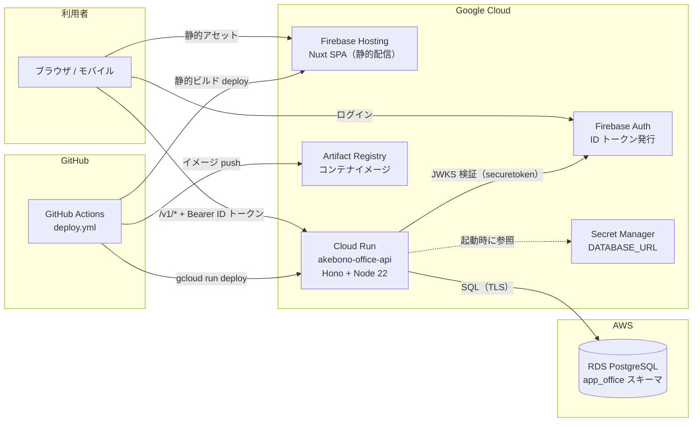
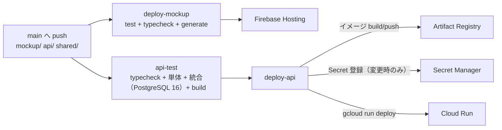

# Phase 7: 本番アーキテクチャ（Cloud Run + RDS PostgreSQL）

- **作成日:** 2026-07-17
- **決定:** API を **Cloud Run** で運用し、**重い処理はすべてサーバーサイド**で実行する。データベースは **AWS RDS の PostgreSQL** を使用する（オペレーター指示 2026-07-17）
- **SoT:** 本書は本番構成（インフラ・API・認証・データフロー）の SoT。phase4/tech-stack-decision.md の「インフラ・将来構成（宣言のみ）」を本書で確定に更新した

## 1. 全体構成

- **フロントエンド:** Nuxt 4 SPA（`mockup/` → 将来 `app/` へ改名予定）。Firebase Hosting で静的配信（現行どおり）
- **API:** `api/`（Hono + node-postgres）。Cloud Run（min 0 / max 3、8080）。コンテナは distroless 相当の node:22-slim・非 root 実行
- **DB:** RDS PostgreSQL。業務データは `app_office` スキーマ（分析は akebono-scm-platform `mart` へ将来 ETL。逆流禁止）
- **共有ドメイン層:** `shared/domain/`（型定義・勤怠計算・JST ユーティリティ）をフロント/API で共有し、業務ロジックの二重実装を防ぐ

## 2. 「重い処理はサーバーサイド」方針（オペレーター指示）

| 処理 | 実装場所 | 対応 API |
|---|---|---|
| 勤怠の日次/月次集計（6 バケット・60h 超繰越） | サーバー | `GET /v1/attendance/day` `/month` |
| タイムカード（全メンバー × 期間の横断集計） | サーバー | `GET /v1/attendance/timecard` |
| 36 協定判定（6 ヶ月・全平均組合せ） | サーバー | `GET /v1/attendance/alerts` |
| 休暇残数（FIFO 引当・失効・上限） | サーバー | `GET /v1/leave/balance` |
| 打刻の状態機械・修正打刻の置換解決 | サーバー | `POST /v1/attendance/punches` ほか |
| 日報の正規化・提出保護・工数乖離チェック | サーバー | `PUT /v1/reports/daily` |
| LLM 呼び出し（AI コメント・日報ドラフト・チャットボット） | サーバー（**Vertex AI**・オペレーター決定 2026-07-17。Cloud Run 実行 SA の ADC 認証 = API キー不要。失敗時は決定的ヒューリスティックへフォールバック） | `api/src/lib/llm.ts`（generateContent + responseSchema）。エンドポイントはバッチ3 続きで実装: `POST /v1/assist/*` |
| mart ETL・周期有給付与などのバッチ | サーバー（Cloud Scheduler + Cloud Run jobs。バッチ2 以降） | — |
| 表示射影（フィルタ済みデータの整形・グラフ描画・組織図ツリー化） | フロント | —（API のデータを純粋関数で射影） |

クライアントは「表示と入力」に限定する。モックで composables に実装した計算ロジックは、フロント接続（バッチ2）の完了をもって API 呼び出しへ置き換え、クライアント側の計算実装は削除する（暫定期間の二重実装は implementation-status.md で追跡）。

## 2.5 フロント接続方式（バッチ2a で確立）

- **デュアルモード:** `NUXT_PUBLIC_API_BASE` 未設定 = 完全モック動作（localStorage。デモ配信の下位互換）。
  設定時 = API モード。移行済みコレクション（マスタ 15 種 + 監査ログ + 設定）は `useMockDb.tbl()` が
  **API ハイドレーションキャッシュ**を返すため、全画面の参照が一貫して API データになる（読み取りは中央で切替）
- **書込:** `useMasterCrudAsync`（マスタ）/ `useAppSettings`（設定）/ `useReports`（日報。バッチ2b-1）が API を呼び、
  レスポンスでキャッシュを更新（SoT 書込 → キャッシュ反映の順序 = 原則6）。バリデーション・ガードはサーバーが担い、
  エラーはモック互換の Result 形式（`AKO-*` コード）で画面へ返る
- **ドメイン別キャッシュ（バッチ2b-1/2b-2 で確立）:** 通知・日報・休暇のように期間・キー単位で遅延ロードするドメインは、
  モジュールスコープの API キャッシュを `useMockDb.tbl()` の代わりに射影ロジックへ差し込む（画面・射影は共通のまま）。
  勤怠はサーバー集計（月サマリ・36 協定・タイムカード）をキー単位でキャッシュし、日次・週次はそこから射影する。
  ログイン確立・切替時は `onApiReset` フックで取り直す。通知は 60 秒ポーリングで新着を反映
- **未移行ドメイン**（AI カンパニー・売上・意思決定等のフロント）は API モードでもモックデータで動く
  （バッチ3 以降で順次接続。対象ページには「モックアップ」バッジを表示。移行状況の SoT は implementation-status.md）

## 3. 認証・認可

- **認証:** Firebase Authentication。SPA がログインで取得した **ID トークン**を `Authorization: Bearer` で送付し、API が Google の JWKS（`securetoken@system.gserviceaccount.com`）で署名・`iss`/`aud` を検証する。検証後、トークンの email と `members.email`（在籍者・一意）を突合して業務ユーザーを解決する
- **認可:** `members.role`（`admin` / `hr` / `member`）による API 側ガード。他人の勤怠・休暇参照は管理者/人事のみ（C3 データ保護）。マスタ変更は管理者のみ（休暇種別・勤怠ルールは人事も可）
- **開発・テスト:** `AUTH_MODE=dev` では `x-dev-member-id` ヘッダで成りすまし（ローカル・CI 専用。本番は必ず `firebase`）
- **フロントのログイン（バッチ2a）:** `/login` ページ（メール/パスワード・Google。Firebase Web SDK は動的 import で
  モックモードのバンドルに含めない）。認証ゲートはグローバルミドルウェア（API モードのみ有効）。members 未登録の
  アカウントは案内を表示（AKO-AUTH-002）。フロントの dev 認証は `NUXT_PUBLIC_DEV_MEMBER_ID`（E2E 用）
- **バッチジョブ:** `/jobs/periodic-leave-grants`（周期有給付与）は Cloud Scheduler からの共有鍵認証
  （`x-cron-key` = 環境変数 `CRON_SECRET`。未設定時はエンドポイント無効 = 管理者/人事の手動実行のみ）
- **エラーコード:** AKO-AUTH-001（未認証/トークン不正）/ 002（メンバー未登録）/ 003（権限不足）
- Cloud Run は `--allow-unauthenticated`（IAM ではなくアプリ層で認証）。CORS は Hosting のオリジンのみ許可（`CORS_ORIGINS`）

## 4. データベース設計（実装済み分）

- スキーマ: `app_office`（`api/db/migrations/0001_init.sql`）。マイグレーションはファイル名昇順 + `schema_migrations` 管理。**起動時自動適用**（pg_advisory_lock で多重起動でも二重適用しない = 冪等）
- 設計判断:
  - **id は text**（プレフィックス + UUID）。モックの決定的 id とも互換で、シードデータの移送が可能
  - **業務日付は `date` 型**（アプリ層では 'YYYY-MM-DD' 文字列。pg の型パーサで文字列固定）
  - **業務時刻（打刻・提出時刻）は JST ウォールクロックの ISO 文字列（text）**。shared/domain の壁時計計算（実行環境 TZ 非依存）と同一解釈を保つための判断。DB 内でのタイムゾーン変換を排除する
  - マスタ系は**論理削除**（active）。記録系（打刻・付与・日報等）は**追記のみ**（開発原則2）
  - **休暇付与の冪等性は DB 制約**（`UNIQUE (member_id, leave_type_id, grant_date)` + `ON CONFLICT DO NOTHING`）。アプリ層チェックより強い保証
  - 参照データ（法定有給 `lt-paid`・既定勤怠ルール・設定既定値）はマイグレーションで投入（`ON CONFLICT DO NOTHING` = 冪等）。**デモデータは本番 DB に投入しない**
- モックからの移行: モック（localStorage）は個人ブラウザ内のデモデータであり**本番へ移送しない**（下位互換への影響なし = 開発原則7 の評価結果）。運用開始時のマスタ初期投入はマスタ API（または SQL）で行う

## 5. ネットワーク（GCP ⇄ AWS のクロスクラウド接続）

Cloud Run（GCP）から RDS（AWS）への接続は次の 2 案。**v1 は案 A で開始し、負荷・セキュリティ要件に応じて案 B へ移行**する。

| 案 | 構成 | 特徴 |
|---|---|---|
| **A. パブリック + TLS + IP 制限（v1 採用）** | RDS を publicly accessible にし、SG で Cloud Run の**固定エグレス IP のみ許可**（Direct VPC egress + Cloud NAT の静的 IP）。`rds.force_ssl=1` + `DB_SSL=verify`（RDS CA バンドル） | 構築が速い。TLS 必須・SG 最小許可・強パスワードが前提 |
| B. Site-to-Site VPN / 専用線 | GCP HA VPN ⇄ AWS VPN Gateway でプライベート接続 | 露出ゼロだが構築・運用コスト増。利用者増加時に検討 |

> **留意（クロスクラウドのレイテンシ）:** 東京リージョン同士（asia-northeast1 ⇄ ap-northeast-1）で RTT 数 ms 程度。API は 1 リクエスト内のクエリ数を絞る設計（横断集計は一括取得 → サーバー内計算）でこの前提に耐える。将来、レイテンシまたは転送コストが問題になる場合は Cloud SQL for PostgreSQL への移行も選択肢（スキーマ・API は接続文字列以外無変更で移行可能なよう、RDS 固有機能に依存しない）

- 接続文字列は **Secret Manager** 経由で注入（`DATABASE_URL`。CI が値の変更時のみ新バージョン追加）。Cloud Run の環境変数に平文で置かない
- `DB_SSL`: `require`（暗号化のみ）で開始し、RDS CA バンドルを配布して `verify` へ引き上げる（deploy-guide.md 参照）

## 6. API 規約（api/ 配下の実装ルール）

- **レスポンス:** 成功 `{ data: … }` / 失敗 `{ error: { code: 'AKO-XXX-nnn', message } }`（モックの Result 型と同型。台帳は phase5/api-design.md §4）
- **バリデーション:** マスタは zod スキーマ（`api/src/masters/registry.ts`）。公開 I/F になるためバリデーションは API の責務（モックでは画面側の責務だった）
- **トランザクション:** 状態遷移（打刻・承認・提出）は `BEGIN` + 行ロック（`FOR UPDATE` / advisory lock）で直列化。二重操作は AKO コード付き 409
- **監査ログ:** 変更系はすべて `audit_logs` へ記録（失敗しても主フローを止めない = 開発原則4）
- **命名:** DB は snake_case、API 入出力は camelCase（`rowToCamel` / `camelToSnake` で機械変換）
- **id:** サーバー生成 `prefix-UUID`（`api/src/lib/ids.ts`）

## 7. CI/CD

- API 用 secrets 未設定時は `deploy-api` を**警告付きスキップ**（mockup のみの運用を止めない = 開発原則4）
- secrets の設定は `scripts/setup-deploy-secrets.ps1`（手順: deploy-guide.md）
- DB マイグレーションは**コンテナ起動時に自動適用**（CI から DB へ直接接続しない = RDS を GitHub Actions へ開放しない）

## 8. 環境変数（api）

| 変数 | 必須 | 説明 |
|---|---|---|
| `DATABASE_URL` | ✅ | PostgreSQL 接続文字列（Secret Manager 経由） |
| `AUTH_MODE` | ✅ | `firebase`（本番）/ `dev`（ローカル・CI） |
| `FIREBASE_PROJECT_ID` | firebase 時 | ID トークンの iss/aud 検証対象 |
| `DB_SSL` | — | `disable` / `require`（既定推奨）/ `verify`（CA 検証） |
| `DB_SSL_CA` | verify 時 | RDS CA バンドル PEM の内容 |
| `CORS_ORIGINS` | — | 許可オリジン（カンマ区切り） |
| `PORT` | — | 既定 8080（Cloud Run が注入） |
| `MIGRATE_ON_START` | — | `0` で起動時マイグレーションを無効化（既定は有効） |
| `DB_POOL_MAX` | — | プール上限（既定 5。Cloud Run 並行数と掛け算になるため控えめ） |
| `CRON_SECRET` | — | `/jobs/*` の共有鍵（Cloud Scheduler 用。未設定ならジョブエンドポイント無効） |
| `VERTEX_PROJECT_ID` | — | AI 機能（Vertex AI）の対象プロジェクト。未設定 = LLM 無効（ヒューリスティックへフォールバック）。デプロイでは GCP_PROJECT_ID を自動設定 |
| `VERTEX_LOCATION` | — | Vertex AI ロケーション（既定 `global`） |
| `VERTEX_MODEL` | — | 生成モデル ID（既定 `gemini-2.5-flash`） |
| `GOOGLE_OAUTH_CLIENT_ID` | — | カレンダー連携の OAuth クライアント ID。未設定 = 連携無効 |
| `GOOGLE_OAUTH_CLIENT_SECRET` | — | 同シークレット（Secret Manager 経由） |
| `TOKEN_ENCRYPTION_KEY` | — | OAuth トークンの AES-256-GCM 暗号化鍵（Secret Manager 経由。変更すると保管済みトークンは復号不能 = 全員再連携） |

## 9. 段階移行計画（モック → 本番）

1. **バッチ1（PR #12・マージ済み）:** API+DB・認証基盤・CI/CD — 完了
2. **バッチ2a（PR #14・マージ済み）:** フロント接続基盤（デュアルモード・ログイン UI・dev 認証）+ マスタ/設定のフロント接続 + 通知 API + 周期有給付与 — 完了
3. **バッチ2b-1（PR #17・マージ済み）:** 通知 + 業務日報のフロント接続 — 完了
4. **バッチ2b-2（PR #18・マージ済み）:** 勤怠・休暇のフロント接続（タイムカード・日次/週次/月次・36 協定・打刻修正・休暇管理）— 完了
5. **バッチ3a（PR #21・マージ済み）:** エスカレーション API + フロント接続（起票・対応・ナレッジ還流）— 完了
6. **バッチ3b（PR #22・マージ済み）:** ワークフロー・稟議 API + フロント接続（申請・経路凍結・承認・代理・証跡・承認経路マスタ）— 完了
7. **バッチ3c（PR #23・マージ済み）:** シフト表 API + フロント接続 — 完了
8. **バッチ3d 基盤（PR #24・マージ済み）:** Vertex AI クライアント・IAM/デプロイ反映 — 完了
9. **バッチ3d（本 PR）:** AI業務アシスタント（F-14）+ 日報 AI アシスト（F-06-7）の API + フロント接続 — 完了
10. **バッチ3 続き:** カレンダー連携（OAuth クライアント要・サーバーサイド）
11. **バッチ4:** 意思決定支援・AI カンパニー・売上・稼働状況・チャットボット・mart ETL

進捗の SoT: `implementation-status.md`（実装 PR ごとに更新）
